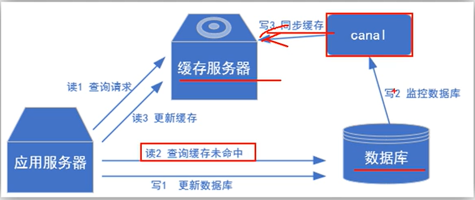

# Canal

> Alibaba2010年开发 用于 监听解析MySQL 的 Binlog日志， 基于数据库增量日志解析， 提供增量数据订阅&消费的中间件。
> 2017年 正式开源

## Binlog的分类

MySQL Binlog 的格式有三种：
- statement
- mixed
- row
> binlog_format=statement|mixed|row

### statement, 语句级别， binlog会记录每次执行的写操作的语句。
优点: 节省空间
缺点：有可能数据不一致 --- update tt set create_date = now(), now(), random() 这类函数

### row, 行级别， binlog会记录每次操作后每行记录的变化。
优点：保持数据的绝对一致性，他记录了sql执行后的效果。
缺点：占用空间大

### mixed, statemen的升级版， 一定程度上解决了数据不一致的问题。
优点：节省空间 同时兼顾了一定的一致性
缺点： 某些极端情况会造成数据不一致

***综合以上， 使用row级别***

## Canal 的工作原理
把 自己伪装成 Slave 从属节点， 从 主节点Master复制数据， 类似MySQL主从复制

> canal的工作原理就是把自己伪装成MySQL slave， 
> 模拟MySQL slave的交互协议向MySQL Mater发送 dump协议， 
> MySQL mater收到canal发送过来的dump请求， 
> 开始推送binary log给canal，然后canal解析binary log， 
> 再发送到存储目的地，比如MySQL，Kafka，Elastic Search等等。 

## 使用场景
- 原始
- 更新缓存

- 抓取业务表的新增变化数据 用于制作实时统计

### 配置MySQL
> mysql -uroot -p  
> 执行 SHOW VARIABLES LIKE 'log_bin';  --- ON  
> 执行 SHOW VARIABLES LIKE 'binlog_format'; --- ROW  
> SHOW VARIABLES LIKE 'server_id';        -- 应返回 '1'

### 赋权限
> set global validate_password_length=4;
> set global validate_password_policy=0;
> GRANT SELECT, REPLICATION SALVE, REPLICATION CLIENT ON *.* TO 'CANAL'@'%' IDENTIFIED BY 'CANAL';
> 

### 建表语句
create database test;
create table if not exists teacher(id serial primary key, username varchar(256), age int, school_id int, grade int, created_at timestamp, is_deleted int not null default 0, status int not null default 1);
insert into teacher(username, age) values('tom', 19), ('edward', 32), ('zhangsan', 90);

授予权限
GRANT CREATE ON *.* TO 'canal'@'%';
GRANT SELECT, INSERT, UPDATE, DELETE ON test.* TO 'canal'@'%';
FLUSH PRIVILEGES;
SHOW GRANTS FOR 'canal'@'%';

## 常见面试题

### 定义 ， 特性
Canal 是Alibaba开源的 基于Netty实现的分布式，高性能，可靠的消息队列。 实时数据同步和数据分发场景下有着广泛应用。

### 工作原理
主要通过解析数据库binlog日志来获取数据库 写操作。然后将这些事件发送给下游消费者。
核心组件包括 server/client。

### 优缺点
优点：高性能，分布式，可靠性，支持数据过滤和转换
缺点：使用难度大

### 应用场景
- 实时数据同步 和 数据分发场景
- 数据备份 和 灾备
- 增量数据抽取和同步
- 数据实时分析
- 在线数据迁移
