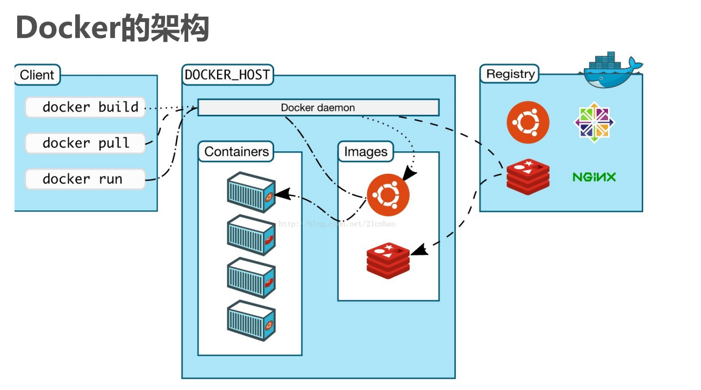

# Docker
> Docker是一个开源的容器引擎，它有助于更快地交付应用。

Iaas: Infrastructure as a Service, 基础设施即服务
- 阿里云/腾讯云/亚马逊云
  PaaS: Platform as a Service, 平台即服务
- mysql,nginx,rocketmq,mongodb,redis
  SaaS: Software as a Service, 软件即服务
  oa
  Docker 就是基于PaaS产生的一个容器技术

## 定义
> Docker 是一种虚拟化容器技术<br>
> 通过虚拟化技术，可以对物理机的资源进行有效的利用。<br>
> 软件虚拟化/硬件虚拟化/内存虚拟化/网络虚拟化/桌面虚拟化/服务虚拟化。。。


### 核心概念
- Image
- Container
- Registry(仓库注册中心)
- Repository(仓库)
  

> 一个Registry中会有多个Repository
> 一个Repository中会哟多个tag的Image

### Installation(CentOS)
- yum -y remove docker // uninstall the old version
- yum install -y docker // install new version
- systemctl start docker // start docker
- systemctl start docker.service // start docker

## Docker的优点
- 简化程序 --- 的应用以及依赖包到一个可移植的容器中，然后发布到任何流
  行的 Linux 机器上，便可以实现虚拟化。
- 避免选择恐惧症 --- 
- 节省开支


## Docker 架构


1. Docker daemon是一个运行在宿主机（ DOCKER-HOST）的后台进程。可通过 Docker
   客户端与之通信。
2. Client（ Docker客户端） --- 接受用户命令和配置标识，并与 Docker
   daemon通信
3. Images（ Docker镜像）--- Docker镜像是一个只读模板，它包含创建 Docker容器的说明
4. Container（容器） --- 容器是镜像的可运行实例
5. Registry --- 是一个集中存储与分发镜像的服务


## Docker 常用命令

- docker search [image_name] --- 搜索镜像
> docker search java
修改镜像仓库 registry地址：
> /etc/docker/daemon.json
```json
{
"registry-mirrors": ["https://m9r2r2uj.mirror.aliyuncs.com"]
}
```
重启docker服务 service docker restart

- docker pull [image_name]:[version]  --- 下载镜像
> docker pull java:8
- docker pull <image name>:<tag> // 拉取远端镜像 eg: docker pull centos:7

- docker images --- 列出镜像(downloaded)

### 删除镜像
- docker rmi <image name>:<tag> // 删除镜像, 不加tag默认latest version eg: docker rmi redis
- docker rmi <imageID> // 删除镜像 by ID 该镜像的所有版本
- docker rmi $(docker images -q) // 删除所有镜像
- docker rmi [image_name] --- 删除本地镜像
> docker rmi java


### 容器操作命令
- docker run -i -t --name [container name] repository:tag /bin/bash
- docker run -it --name [container name] imageID /bin/bash

以守护进程 运行容器
- docker run -d --name [container name] repository:tag
- docker run -d --name [container name] imageID

### 启动容器
- docker run <container Name/ID> // 创建并启动容器
- docker start <container Name/ID> //启动容器
> eg
> sudo docker run -di --name my_redis -p 6379:6379 redis

- docker run --- 新建启动容器
> - -d --- 后台运行
> - -P --- 随机端口映射
> - -p --- 指定端口映射
> - -net --- 指定网咯模式， bridge(default)/host(使用宿主机网络)/container(使用已有容器的网络配置)/none(不配置)

eg:
> docker run -d -p 91:80 nginx

### 容器查看
- docker ps // 查看正在运行的容器
- docker ps -a // 查看历史 运行过的容器
- docker ps -l // 查看最近 运行过的容器

- docker ps --- 列出容器(运行)
- docker ps -a --- 列出终止状态的容器
- docker start [container_id] --- 启动终止状态的容器
- docker restart [container_id] --- 终止一个运行状态的容器， 再启动。
- docker stop [container_id] --- 停止容器

- docker kill [container_id] --- 强制停止容器

- docker start [container_id] --- 启动已停止的容器

- docker inspect [container_id] --- 查看容器所有信息

- docker container logs [container_id] --- 查看容器日志

- docker top [container_id] --- 查看容器里的进程

### 进入容器(运行状态的容器)
- docker exec -it <container name/id> /bin/bash // 推荐方式
- docker attach <container name/id> // 退出 容器则停止
- docker exec -it [container_id] /bin/bash 进入容器
  命令解释
- -i // 表示运行容器
- -t // 表示 容器启动后会进入其命令行
- --name // 为创建的容器 命名
- -v // 目录映射关系 (前者是 宿主机目录 后者是 映射到宿主机上的目录)， 可以做多映射
- -d // 创建一个守护式容器 在后台运行
- -p // 端口映射 前者是 宿主机端口， 后者是 容器内映射端口， 可以做多端口映射


### 删除容器
- docker rm
- docker rm [container_id] --- 删除容器(针对已停止)
- docker rm -f [container_id] --- 强制删除容器(包括在运行的)
- docker rmi [iamge_name] --- 删除镜像

- docker export [container_id] > [filename] --- 导出本地某个容器
> docker export 70fe8ba > couponserver.tar
- docker import - [file absolutely path] --- 导入容器快照 与 docker load 功能相似， import会丢失历史信息和元数据
> docker import - test/couponserver.tar:v1.0.0
> docker import http://xxxx.com/xxx.tgz xxx/xxx

- docker build -t [image_name]:[image_tag] . --- 构建镜像 dockerfile所在目录执行该语句
> - -t 指定镜像名称
> - (.) 表示dockerfile 文件所在的路径

- docker push [repository]
> eg: docker push ouruser/sinatra

### 保存 导出
- docker save repository:tag/imageID > /root/xx.tar.gz // 导出镜像
- docker load < /root/xx.tar.gz //导入镜像
- docker load --input [image_file] --- 将下载的镜像文件 导入到本地镜像仓库
- docker load < [image_file] --- 同上

- netstat -ano --- 列出所有监听端口的 进程信息
- netstat -ano | findstr ":8083" --- windows系统 查看指定端口的进程信息
- taskkill /F /PID [PID] --- windows系统 用来终止进程


- 启动创建的容器
- docker run -d -p 8083:8083 --net=host microservice-coupon:1.0.0


### 文件复制
- docker cp /root/xxx.txt [continer name]:/user/local/
> eg: docker ps /usr/local/test.txt my_centos:/user/local/<br>
> docker cp 宿主机文件 容器名称:容器内路径<br>

### 查看容器配置
- docker inspect <container name>


### 从其他注册中心拉取镜像
- 第一步修改配置文件
> vi /etc/docker/daemon.json // 默认没有这个文件，创建即可
```shell
{
  "registry-mirrors":["https://docker.mirrors.ustc.edu.cn"]
}
```
- 第二步 重启服务
> systemctl restart docker/docker.service
>


### 镜像 常用命令
- docker search [image_name] --- 搜索镜像， -s N 参数可以指定仅显示评价为 N 星以上的镜像。
- docker pull [image name] --- 下载镜像到本地仓库
- docker tag IMAGE[:TAG] [REGISTRYHOST/][USERNAME/]NAME[:TAG] --- docker tag 来标记一个镜像
> docker tag ba58 192.168.7.26:5000/test
- docker push 192.168.7.26:5000/test --- docker push 上传标记的镜像

## Repository 仓库
config_sample.yml 文件中，可以看到一些现成的模板段：
- common ：基础配置
- local ：存储数据到本地文件系统
- s3 ：存储数据到 AWS S3 中
- dev ：使用 local 模板的基本配置
- test ：单元测试使用
- prod ：生产环境配置（基本上跟s3配置类似）
- gcs ：存储数据到 Google 的云存储
- swift ：存储数据到 OpenStack Swift 服务
- glance ：存储数据到 OpenStack Glance 服务，本地文件系统为后备
- glance-swift ：存储数据到 OpenStack Glance 服务，Swift 为后备
- elliptics ：存储数据到 Elliptics key/value 存储
> export SETTINGS_FLAVOR=dev


## Docker 中的网络功能介绍
> Docker 允许通过外部访问容器或容器互联的方式来提供网络服务。<br>


- 外网访问时 通过 -P 或 -p 参数来指定端口映射
> - -P 标记时，Docker 会随机映射一个 49000~49900 的端口到内部容器开放的网络端口
> - -p（小写的）则可以指定要映射的端口，并且，在一个指定端口上只可以绑定一个容器

eg:
> docker run -d -P training/webapp python app.py <br>
> docker run -d -p 5000:5000 training/webapp python app.py --- 映射所有接口地址 <br>
> docker run -d -p 127.0.0.1:5000:5000 training/webapp python app.py --- 映射到指定地址的指定端口<br>
> docker run -d -p 127.0.0.1:5000:5000/udp training/webapp python app.py --- 用 udp 标记来指定 udp 端口<br>

> docker run -d -p 8083:8083  microservice-coupon:1.0.0 --name couponservice --ip-forward=true

### 容器互联
> 容器的连接（linking）系统是除了端口映射外，另一种跟容器中应用交互的方式。<br>
> 连接系统依据容器的名称来执行。<br>
> 使用 --name 标记可以为容器自定义命名。<br>
> eg: docker run -d -P --name web training/webapp python app.py

- 创建一个新的 web 容器，并将它连接到 db 容器
> docker run -d -P --name web --link db:db training/webapp python app.py
> 此时，db 容器和 web 容器建立互联关系

--link 参数的格式为 --link name:alias ，其中 name 是要链接的容器的名称， alias 是这个连接的
别名。


### 高级网络配置

-b BRIDGE or --bridge=BRIDGE --指定容器挂载的网桥
--bip=CIDR --定制 docker0 的掩码
-H SOCKET... or --host=SOCKET... --Docker 服务端接收命令的通道
--icc=true|false --是否支持容器之间进行通信
--ip-forward=true|false --请看下文容器之间的通信  --- 访问外部网络，
--iptables=true|false --禁止 Docker 添加 iptables 规则
--mtu=BYTES --容器网络中的 MTU

--dns=IP_ADDRESS... --使用指定的DNS服务器
--dns-search=DOMAIN... --指定DNS搜索域

-h HOSTNAME or --hostname=HOSTNAME --配置容器主机名
--link=CONTAINER_NAME:ALIAS --添加到另一个容器的连接
--net=bridge|none|container:NAME_or_ID|host --配置容器的桥接模式
-p SPEC or --publish=SPEC --映射容器端口到宿主主机
-P or --publish-all=true|false --映射容器所有端口到宿主主机


## Dockerfile
> 使用 Dockerfile 可以允许用户创建自定义的镜像。

Dockerfile 分为四部分：
1. 基础镜像信息
2. 维护者信息
3. 镜像操作指令
4. 容器启动时执行指令

eg:
```dockerfile
# This dockerfile uses the ubuntu image
# VERSION 2 - EDITION 1
# Author: docker_user
# Command format: Instruction [arguments / command] ..
# Base image to use, this must be set as the first line
FROM ubuntu
# Maintainer: docker_user <docker_user at email.com> (@docker_user)
MAINTAINER docker_user docker_user@email.com
# Commands to update the image
RUN echo "deb http://archive.ubuntu.com/ubuntu/ raring main universe" >> /etc/apt/sources.list
RUN apt-get update && apt-get install -y nginx
RUN echo "\ndaemon off;" >> /etc/nginx/nginx.conf
# Commands when creating a new container
CMD /usr/sbin/nginx
```

### 指令介绍
#### FROM
> 格式为 FROM \<image> 或 FROM \<image>:\<tag><br>
> 第一条指令必须为 FROM 指令。<br>
> 可以使用多个 FROM 指令（每个镜像一次）<br>


#### MAINTAINER
> 格式为 MAINTAINER \<name> ，指定维护者信息。


#### RUN
> 格式为 RUN \<command> 或 RUN ["executable", "param1", "param2"] 。


#### CMD
支持三种格式
1. CMD ["executable","param1","param2"] 使用 exec 执行，推荐方式；
2. CMD command param1 param2 在 /bin/sh 中执行，提供给需要交互的应用；
3. CMD ["param1","param2"] 提供给 ENTRYPOINT 的默认参数

Attention!!!： 
- 启动容器的命令只能有一条， <font color=orange>***多条的情况下只有最后一条被执行***</font>。
- 如果用户<font color=yellow>***启动容器时候指定了运行的命令，则会覆盖掉 CMD 指定的命令***</font>


#### EXPOSE
格式为 EXPOSE <port> [<port>...] 。
> 告诉 Docker 服务端容器暴露的端口号，供互联系统使用。在启动容器时需要通过 -P，Docker 主机会自动
分配一个端口转发到指定的端口。


#### ENV
格式为 ENV <key> <value> 。 
> 指定一个环境变量，会被后续 RUN 指令使用，并在容器运行时保持。

eg:
```dockerfile
ENV PG_MAJOR 9.3
ENV PG_VERSION 9.3.4
RUN curl -SL http://example.com/postgres-$PG_VERSION.tar.xz | tar -xJC /usr/src/postgress && …
ENV PATH /usr/local/postgres-$PG_MAJOR/bin:$PATH
```


#### ADD
格式为 ADD <src> <dest>

> 将复制指定的 \<src> 到容器中的 \<dest> 。 其中 \<src> 可以是Dockerfile所在目录的一个相对路
径；也可以是一个 URL；还可以是一个 tar 文件（自动解压为目录）。


#### COPY
格式为 COPY <src> <dest>

> 复制本地主机的 \<src> （为 Dockerfile 所在目录的相对路径）到容器中的 <dest> 。
当使用本地目录为源目录时，推荐使用 COPY


#### ENTRYPOINT

两种格式：
ENTRYPOINT ["executable", "param1", "param2"]
ENTRYPOINT command param1 param2 （shell中执行）。
配置容器启动后执行的命令，并且不可被 docker run 提供的参数覆盖。
每个 Dockerfile 中只能有一个 ENTRYPOINT ，当指定多个时，只有最后一个起效

#### VOLUME
格式为 VOLUME ["/data"] 。
创建一个可以从本地主机或其他容器挂载的挂载点，一般用来存放数据库和需要保持的数据等


#### USER
格式为 USER daemon 。
指定运行容器时的用户名或 UID，后续的 RUN 也会使用指定用户。
当服务不需要管理员权限时，可以通过该命令指定运行用户。并且可以在之前创建所需要的用户，例
如： RUN groupadd -r postgres && useradd -r -g postgres postgres 。要临时获取管理员权限可以
使用 gosu ，而不推荐 sudo


#### WORKDIR
格式为 WORKDIR /path/to/workdir 。
为后续的 RUN 、 CMD 、 ENTRYPOINT 指令配置工作目录。
可以使用多个 WORKDIR 指令，后续命令如果参数是相对路径，则会基于之前命令指定的路径。例如
WORKDIR /a
WORKDIR b
WORKDIR c
RUN pwd
则最终路径为 /a/b/c 。


#### ONBUILD
格式为 ONBUILD [INSTRUCTION] 。
配置当所创建的镜像作为其它新创建镜像的基础镜像时，所执行的操作指令。
例如，Dockerfile 使用如下的内容创建了镜像 image-A
```dockerfile
[...]
ONBUILD ADD . /app/src
ONBUILD RUN /usr/local/bin/python-build --dir /app/src
[...]
```

如果基于 image-A 创建新的镜像时，新的Dockerfile中使用 FROM image-A 指定基础镜像时，会自动执行
ONBUILD 指令内容，等价于在后面添加了两条指令
```dockerfile
FROM image-A
#Automatically run the following
ADD . /app/src
RUN /usr/local/bin/python-build --dir /app/src
```


## 创建镜像
docker build 命令

> 基本的格式为 docker build [选项] 路径 ，该命令将读取指定路径下（包括子目录）的 Dockerfile，并将
该路径下所有内容发送给 Docker 服务端，由服务端来创建镜像。因此一般建议放置 Dockerfile 的目录为空
目录。也可以通过 .dockerignore 文件（每一行添加一条匹配模式）来让 Docker 忽略路径下的目录和文
件。

要指定镜像的标签信息，可以通过 -t 选项，例如
```shell
docker build -t myrepo/myapp /tmp/test1/
```


## Docker Compose
> Docker Compose 是 Docker 官方编排（Orchestration）项目之一，负责快速在集群中部署分布式应用。


### 安装
> sudo pip install -U docker-compose

查看信息：
> docker-compose -h


### 启动服务
docker-compose up -d ---- -d表示 run in background


