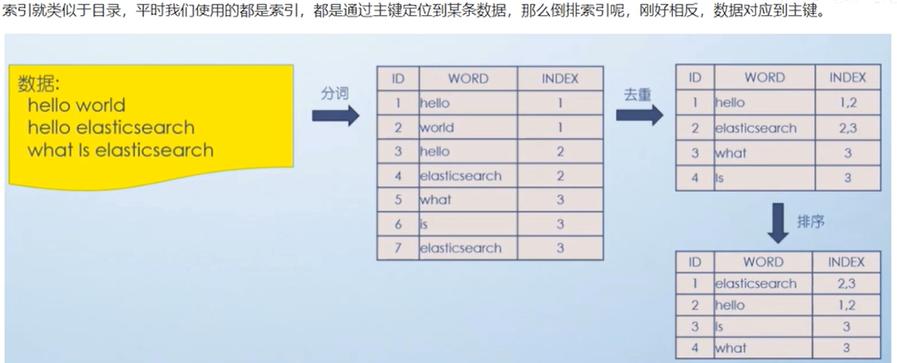
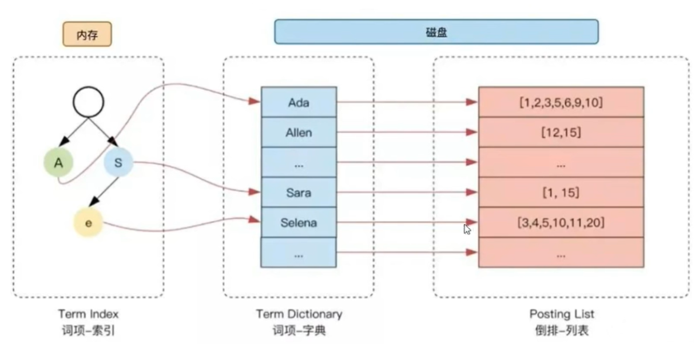

# ElasticSearch

> ES，一个分布式,Resuful风格的搜搜和数据分析引擎，<br>
> Java语言开发，当前最流行的开源的企业级搜索引擎，能够到达进实时搜索/稳定/可靠/快速

## 全文检索

数据分类

- 结构化数据： 存储在数据库中的数据
- 非结构化数据： 不定长，无固定格式， eg: email, word, log
- 半结构化数据：eg: xml, html
  搜索分类
- 结构化数据 --- 使用关系型数据库
- 非结构化数据 --- 顺序扫描/全文检索

### 全文检索定义

> 通过一个程序扫描问嗯中的每个单词，<font color=red><b>针对单词建立索引</b></font>，并保存该单词在文本中的<b>位置</b>，
> 以及出现的<b>次数</b>
> 用户查询时，通过之前建立起来的索引 来查询，

搜索原理分为以下几步

- 内容爬取，<font color=grass><b>停顿词过滤</b></font>，比如‘的’，‘了’之类的语气词/连接词
- <b>内容分词</b>，提取关键词
- 根据关键词建立<font color=orange><b>倒叙索引</b></font>
- 用户输入关键词进行搜索

### 倒排索引(反向索引)

根据关键词 反向查询出 记录位置(id)


### 应用场景

- 站内搜索
- 日志管理与分析
- 大数据分析
- 应用性能监控
- 机器学习

### Install

- name: elastic
- password: your_password

## ES 操作

### 创建索引

- PUT /index_name --- 创建索引
- GET /index_name
- HEAD /index_nmae --- 索引是否存在
- DELETE /index_name
- POST /index/_close -- 关闭索引
- POST /index/_open --- 打开索引

创建成功

```json
{
  "acknowledged": true,
  "shards_acknowledged": true,
  "index": "es_wsf_04"
}
```

### 查看索引的配置setting

GET index/_settings

### ES-关系型数据对比

| TYPE          |        type         |      type      |        type        |      type       |
|---------------|:-------------------:|:--------------:|:------------------:|:---------------:|
| 关系型数据库        |  Database<br>(数据库)  |  Table<br>(表)  |     Row<br>(行)     |  Column<br>(列)  |
| Elasticsearch |     Index(索引库)      |  Type<br>(类型)  |  Document<br>(文档)  |  Field<br>(字段)  |

### 索引 Index

形似特征的文档的集合

### 文档 Document

- 可搜索数据的最先单位
- 文档会被序列化成json格式
- 每个文档都有一个unique id
- 格式灵活，不需要预定义格式(字段类型可以指定 也可以自行推断)

### 添加数据

- [PUT|POST]/index_name/_doc/id

> {} -- json数据
> PUT /index/_doc/1
> {"name":"Tom","age":18}

PUT /index/_doc/1?if_seq_no=1
{"name":"Tom","age":18}

- [PUT|POST] /index/_create/id

### 更新数据

- PUT --- 必须指定id 先删除 再插入 ---- 全文更新
  PUT es_wsf_01/_doc/2 {}
- POST --- 指定id ----- 全文更新

### 更新文档 --- 局部更新

POST /index/_update/id ---- 局部更新

eg:
POST es_wsf_01/_update/1

```json
{
  "doc": {
    "age": 100
  }
}
```

### 查询更新 --- 根据查询条件更新结果 - 部分更新

POST /index/_update_by_query

```json
{
  "query": {
    "match": {
      "_id": 1
    }
  },
  "script": {
    "source": "ctx._source.age = 99"
  }
}
```

### 查询文档

GET /index/_doc/id
POST /index_search
{"query":{"match":{"name":"Tom"}}}

### 分词 查询

GET|POST index/_analyze --- index 可选

analyzer

- standard
- ik_smart
- ik_max_word
- icu_analyzer

```json
{
  "analyzer": "standard",
  "text": "北京天安门"
}
```

### 批量写入

- 请求方式 POST
- 请求地址 _bulk
- 请求参数：通过_bulk操作文档，一般至少两行参数或偶数行参数
  eg:

> {"actionName":{"_index":"indexName","_type":"typeName","_id":"id"}}
> {"field1":"value1","field2":"value2"}
> {"actionName":{"_index":"indexName","_type":"typeName","_id":"id"}}
> {"field1":"value1","field2":"value2"}
> 最后一定要有个换行

- actionName: 表示操作类型， create,index,delete,update
- create 会出现id重复失败
- index id重复 则会覆盖旧文档

POST _bulk
{"create":{"_index":"es_wsf_01","_type":"_doc","_id":5}}
{"field1":"value1","field2":"value2"}
{"create":{"_index":"es_wsf_01","_type":"_doc","_id":6}}
{"field1":"value1","field2":"value2"}

### 批量删除

POST _bulk
{"delete":{"_index":"indexName","_type":"_doc","_id":1}}
{"delete":{"_index":"indexName","_type":"_doc","_id":2}}

### 批量修改

POST _bulk
{"update":{"_index":"es_wsf_01","_type":"_doc","_id":5}}
{"doc":{"field1":"value111","field2":"value222"}}
{"update":{"_index":"es_wsf_01","_type":"_doc","_id":6}}
{"doc":{"field1":"value122","field2":"value233"}}

### 组合应用

同上

### 批量读取

GET|POST _mget
{"doc":[{"_index":"indexName","_id":"id"},{"_index":"indexName","_id":"id"}]}

GET|POST indexName/_mget
{"docs":[{"_id":1},{"_id":2},{"_id":3}]}
or
{"ids":["1","2"]}

GET|POST _msearch

## ES检索原理

### 索引的原理

> 索引是加速数据查询的重要手段
>

### 磁盘IO与预读

系统读取磁盘数据是，于其相邻的数据也会很快被访问， 因此相邻的数据也会被读取到内存中
4k or 8k

### 倒排索引

通过分词 被切分位不同的term, es将term与其对应的document建立一种映射关系， 这种结构就是倒排索引

- 单词词典
- 倒排列表
- 倒排索引项

> - 文档id
> - 词频TF --- 该词在文档种出现的次数
> - 位置Position --- 该词在文档汇总的位置
> - 偏移Offset --- 记录单词的开始结束位置，实现高亮显示

```json
{
  "tokens": [
    {
      "token": "中",
      "start_offset": 0,
      "end_offset": 1,
      "type": "<IDEOGRAPHIC>",
      "position": 0
    },
    {
      "token": "国",
      "start_offset": 1,
      "end_offset": 2,
      "type": "<IDEOGRAPHIC>",
      "position": 1
    }
  ]
}
```

### ES 搜索路径



## ES 高级查询 Query DSL

指定ik分词器
PUT /indexName
{
"setting": {
"index": {
"analysis.analyzer.default.type":"ik_max_word:
}
}
}

### Match All(match_all)

GET indexName/_search

```json
{
  "query": {
    "match_all": {}
  },
  "size": 5,
  "from": 0
}
```

- size 指定页容量， 小于10000 ()
- from 指定起始位置 默认0
- index.max_result_window --- setting种设置该参数 可以修改页容量的限制
-

### 分页查询 Scroll

- Step 1
  POST es_wsf_01/_search?scroll=1m -- 采用游标查询，保持游标查询窗口一分钟

```json
{
  "query": {
    "match_all": {}
  },
  "size": 2
}
```

Response

```json
{
  "_scroll_id": "FGluY2x1ZGVfY29udGV4dF91dWlkDXF1ZXJ5QW5kRmV0Y2gBFnN4R2hYV3NjUVB1TWlKSEJaWEgtSUEAAAAAAAAAEhY4NE9uVWNJblQzLTA1aW9ldFFQTThR"
}
```

- Step 2 --- 多次执行 则会自动分页查询
  POST _search/scroll

```json
{
  "scroll": "1m",
  "scroll_id": "FGluY2x1ZGVfY29udGV4dF91dWlkDXF1ZXJ5QW5kRmV0Y2gBFnN4R2hYV3NjUVB1TWlKSEJaWEgtSUEAAAAAAAAAExY4NE9uVWNJblQzLTA1aW9ldFFQTThR"
}
```

### 指定字段排序

```json
{
  "query": {
    "match_all": {}
  },
  "size": 2,
  "sort": [
    {
      "age": "desc"
    }
  ]
}
```

### 指定返回字段 _source

```json
{
  "query": {
    "match_all": {}
  },
  "size": 2,
  "_source": [
    "name",
    "age"
  ]
}
```

### match

> 匹配时 会对 所查询的关键词<b>进行分词</b>， 然后<b>按照分词匹配查找</b>
> <font color=red><b>先分词 后匹配</b></font>

```json
{
  "query": {
    "match": {
      "address": "centre park"
    }
  }
}
```

#### 指定分词匹配类型(operator)， 默认or

```json
{
  "query": {
    "match": {
      "address": {
        "query": "centre park",
        "operator": "and"
      }
    }
  }
}
```

#### 指定满足分词的个数(minimum_should_match) 默认一个

```json
{
  "query": {
    "match": {
      "address": {
        "query": "centre park",
        "minimum_should_match": 2
      }
    }
  }
}
```

### 短语匹配 match_phrase

类似 match， 但是会对分词顺序有要求

- 默认情况下 分词必须连续
- slop 指定分词之间的间隔分次数

POST indexName/_search

```json
{
  "query": {
    "match_phrase": {
      "address": "centre park"
    }
  }
}
```

指定分词之间的间隔数

```json
{
  "query": {
    "match_phrase": {
      "address": {
        "query": "centre park",
        "slop": 2
      }
    }
  }
}
```

### 多字段 查询 multi_match

POST indexName/_search

```json
{
  "query": {
    "multi_match": {
      "query": "centre park",
      "fields": [
        "username",
        "description"
      ]
    }
  }
}
```

### query_string

查询字符串中可以使用 AND OR

POST indexName/_search

```json
{
  "query": {
    "query_string": {
      "query": "广东 OR 北京"
    }
  }
}
```

#### 指定单个字段

```json
{
  "query": {
    "query_string": {
      "default_field": "name",
      "query": "广东 OR 北京"
    }
  }
}
```

#### 指定多个字段

```json
{
  "query": {
    "query_string": {
      "fields": [
        "name",
        "address",
        "description"
      ],
      "query": "广东 AND (北京 OR 上海)"
    }
  }
}
```

### simple_query_string

类似 query_string, 不支持 AND OR

-
    + 代替 AND
- | 代替 OR
- \- 代替 NOT

```json
{
  "query": {
    "simple_query_string": {
      "query": "广东公园",
      "default_operator": "AND"
    }
  }
}
```

### 关键词查询 Term

精确查询， 不进行分词

- keyword 很关键

```json
{
  "query": {
    "term": {
      "address.keyword": {
        "value": "广东公园"
      }
    }
  }
}
```

#### 避免算分 constant_score

```json
{
  "query": {
    "constant_score": {
      "filter": {
        "term": {
          "address.keyword": {
            "value": "广东公园"
          }
        }
      }
    }
  }
}
```

### 前缀搜索 prefix

> 分词的前准， 而不是文本的 前缀， 所以 value 应该是一个分词， 而不是 文本

```json
{
  "query": {
    "prefix": {
      "address": {
        "value": "广东公园"
      }
    }
  }
}
```

### 通配符查询 wildcard

```json
{
  "query": {
    "wildcard": {
      "address": {
        "value": "*公园"
      }
    }
  }
}
```

### 范围查询 range

- range --- 范围关键字
- gte --- >=
- lte --- <=
- gt --- >
- lt --- <
- now 当前时间

```json
{
  "query": {
    "range": {
      "age": {
        "gte": 18,
        "lt": 25
      }
    }
  }
}
```

```json
{
  "query": {
    "range": {
      "date": {
        "gte": "now-2y"
      }
    }
  }
}
```

### 多id查询 ids

```json
{
  "query": {
    "ids": {
      "values": [
        1,
        2,
        3
      ]
    }
  }
}
```

### 模糊查询fuzzy

> 可以接受 错别字的情形

fuzzy查询的两个重要参数

- fuzziness --- 输入的关键字 通过几次操作可以转换成为 es 对应的字段
- prefix_length ---

!!! Attention fuzzy模糊查询最大的模糊错误必须在 0-2之间。!!!

### 高亮查询 highlight

highlight

- pre_tags 前缀标签
- post_tags 后缀标签
- tag_schema 设置为style可以使用的内置高亮样式
- require_field_match 多字段高亮 需要设置为 false
-

POST indexName/_search

```json
{
  "query": {
    "match": {
      "description": {
        "query": "北京"
      }
    }
  },
  "highlight": {
    "post_tags": [
      "</span>"
    ],
    "pre_tags": [
      "<span style='color:red'>"
    ],
    "fields": {
      "*": {}
    }
  }
}
```

### 多字段高亮

POST indexName/_search

```json
{
  "query": {
    "term": {
      "description": {
        "value": "北京"
      }
    }
  },
  "highlight": {
    "post_tags": [
      "</span>"
    ],
    "pre_tags": [
      "<span style='color:red'>"
    ],
    "require_field_match": "false",
    "fields": {
      "*": {}
    }
  }
}
```

### 相关性和相关性算分

- TF (Term Frequency) 词频
  检索词 在文档中 出现的频率越高， 相关性越高
- IDF(Inverse Document Frequency) 逆向文本频率
  每个检索词 在索引中 出现的频率， 频率越高 相关性越低
- 字段长度 归一直(Field-Length norm)
  字段越短 权重越高

### 布尔查询 bool query

- must --- 相当于&& 必须匹配  分词算分
- should --- ||， 选择性匹配  分词算分
- must_not --- 相当于！ 必须不能匹配  不进行分词算分
- filter --- 必须匹配   不进行分词算分

POST indexName/_search

```json
{
  "query": {
    "bool": {
      "must": {
        "match": {
          "description": "北京"
        }
      }
    }
  }
}
```

POST indexName/_search
// should minimum_should_match 指定最小匹配 条件的  数量
```json
{
  "query": {
    "bool": {
      "should": [
        {
          "match": {
            "description": "北京"
          }
        },
        {
          "term": {
            "gender": {
              "value": 1
            }
          }
        }
      ],
      "minimum_should_match": 1
    }
  }
}
```


### negative_boost 降低相关性
POST indexName/_search
```json
{
  "query": {
    "boosting": {
      "positive": {
          "match": {
            "description": "北京"
          }
        },
      "negative": {
        "match": {
          "description": "鼓楼区"
        }
      },
      "negative_boost": 0.8
    }
  }
}
```


### 文档映射Mapping
- 动态映射 --- 不需要提前 创建文档结构
- 静态映射 --- 可以事先定义好映射，包含文档个字段的类型，分词器等

#### 获取文档映射
GET indexName/_mapping


// 设置字段不被索引
index=false
// 指定null_value
"null_value":"NULL"

{"query":{
"match":{
  "name":"NULL"
}
}}

### Dynamic Template 动态设置字段类型


## ElasticSearch 聚合函数，聚合操作

### 


## 相关面试题

### 如何优化写入性能
文档写入流程： 1. document--> memory --> segment --> flush to Disk (Translog)
因此 扩大segment线程的flush 间隔， 减少 I/O压力
> index_refresh_interval=120s

### scroll 分页查询， 如果保证数据实时性
答案： 无法保证
原因：scroll 分页是通过生成一个快照来保持查询时的索引状态，新数据写入时，快照是不会更新，因为快照是在初始查询时建立的。
解决方案：使用search_after结合PIT可以在一定程度上平衡实时性和一致性。