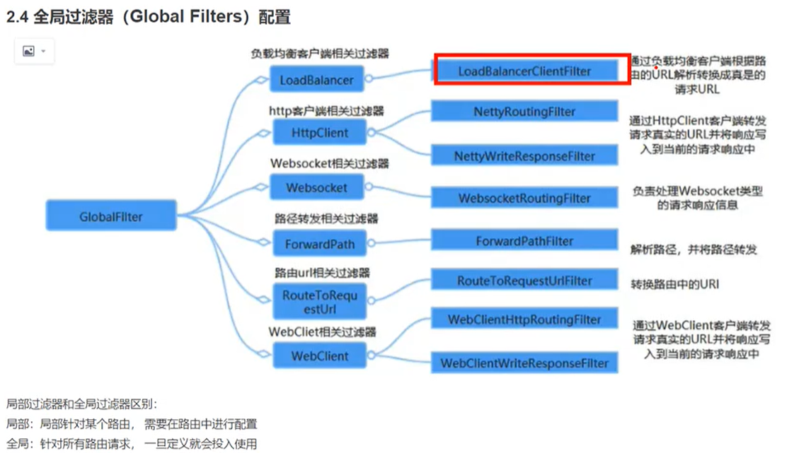

# Gateway


## GateWay
API网关， 就是指系统的统一入口，它封装了应用程序的内容结构，为客户端提供统一的服务，一些与业务本身功能无关的逻辑可以在这里实现，
诸如：认证/鉴权/监控/路由转发等等

#### Spring Cloud GateWay
> WebFlux + Netty + Reactor 实现的响应式API网关。<br>
> 不能在传统的servlet容器中工作， 也不能构建为war包 <br>

#### 功能特性
- 动态路由 能够匹配任何请求的属性
- 支持路径重写
- 集成Spring Cloud 服务发现功能(Nacos, Eruka)
- 可以集成 限流/降级 功能(Sentinel, Hystrix)
- 可以对路由指定易于编写的Predicate(断言)和Filter(过滤器)

#### 核心概念
- 路由 route --- 
- 断言 predicates
- 过滤器 filter 

#### 基于时间的断言工厂
```yaml
          predicates:
            - After=2020-01-01T17:10:00.777-09:00[Asia/Dubai] # 基于时间的断言工厂
            - Before=***
            - Between=2020-01-01T17:10:00.777-09:00[Asia/Dubai],2020-02-01T17:10:00.777-09:00[Asia/Dubai]
```
#### 基于Cookie的断言工厂
```yaml
          predicates:
            - Cookie=chocolate, ch.p # 基于Cookie 
```

#### 基于Header的断言工厂

```yaml
          predicates:
            - Header=X-Request, \d+ # 基于Header 支持正则表达式
```
#### 基于Host的断言工厂

```yaml
          predicates:
            - Host=**.somehost.org, **.host.com
```
#### 基于Method的断言工厂

```yaml
          predicates:
            - Method=GET,POST
```
#### 基于Query参数的断言工厂

```yaml
          predicates:
            - Query=green # 查询参数， 必须携带的参数 green,aaa|bbb 表示参数green的值再aaa,bbb之间
```

#### 基于IP地址的断言工厂

```yaml
          predicates:
            - RemoteAddr=192.168.3.2 # 根据ip匹配
```

#### 基于Weight的断言工厂

```yaml
          predicates:
            - Weight=group1,2 # 根据权重匹配
```
#### 自定义 路由断言工厂
> 必须是一个bean, 
> 类名必须以 ‘RouterPredicateFactory’作为结尾
> 必须继承AbstractRoutePredicate 抽象路由断言工厂
> 必须实现一个静态内部类 声明属性来接受配置文件中对应的断言信息
> 结合shortcutFieldOrder

#### 过滤器工厂

```yaml
          filters:
            - StripPrefix=1
            - AddRequestHeader=X-Request-Color, red # 添加请求头
            - AddRequestParameter=color, blue # 添加请求参数
            - RediectTo=3.2, http://aaa.com # 重定向
            - SetStatus=404 # 统一设置状态码
```

#### 全局过滤器
> 创建好即可 不需要配置/声明
> 针对所有路由
> 自定义 实现 GlobalFilter 接口

内置的全局过滤器


#### Gateway 跨域配置 CORS Configuration
```yaml
spring:
  cloud:
    gateway:
      globalcors: # 配置全局跨域
        cors-configurations:
          '[/**]': # 允许跨域访问的资源
            allowed-origins: "*" # 跨域允许的来源
            allowed-methods:
              - GET
              - POST
              - PUT
              - DELETE
              - OPTION
```


### Gateway 整合 Sentinel -流量控制，服务降级，服务熔断
> [Sentinel Document](https://sentinelguard.io/zh-cn/docs/basic-api-resource-rule.html)


#### 流量控制 
下载jar包，打开dashboard手动设置
- 添加依赖
<groupId>com.alibaba.cloud</groupId>
<artifactId>spring-cloud-starter-alibaba-sentinel</artifactId>

#### 服务降级
> 本质是在原方法 上加一个try catch, 超过重试次数后依旧调用失败， 则回调该方法
> OpenFeign + Sentinel 结合实现

- feign 添加支持sentinel的配置
```yaml
feign:
  sentinel:
    enabled: true
```

#### 服务熔断
Sentinel dashboard配置


### Resilience4j + OpenFeign 熔断/降级/重试
```java
@FeignClient(name = "third-party-service", fallback = ThirdPartyServiceFallback.class)
public interface ThirdPartyService {
    
    @GetMapping("/api/resource")
    Resource getResource();
}

@Component
public class ThirdPartyServiceFallback implements ThirdPartyService {
    
    @Override
    public Resource getResource() {
        // 返回降级数据
        return new Resource("default data");
    }
}
```
```yaml
feign:
  hystrix:
    enabled: true

# Resilience4j 配置重试和熔断
resilience4j:
  retry:
    instances:
      thirdPartyService:
        maxAttempts: 3
        waitDuration: 1000
  circuitbreaker:
    instances:
      thirdPartyService:
        slidingWindowSize: 10
        minimumNumberOfCalls: 5
        failureRateThreshold: 50
```

## 常见面试题

### 怎么实现服务平滑迁移
> 使用Weight路由的断言工厂 进行服务权重的配置， 配置放到Nacos 配置中心 进行动态迁移


### 鉴权
```java
package com.coocpu.gateway.config;

import org.springframework.cloud.gateway.filter.GatewayFilterChain;
import org.springframework.cloud.gateway.filter.GlobalFilter;
import org.springframework.core.Ordered;
import org.springframework.http.HttpStatus;
import org.springframework.http.MediaType;
import org.springframework.http.server.reactive.ServerHttpRequest;
import org.springframework.http.server.reactive.ServerHttpResponse;
import org.springframework.stereotype.Component;
import org.springframework.util.StringUtils;
import org.springframework.web.server.ServerWebExchange;
import reactor.core.publisher.Mono;

/**
 * @auth Felix
 * @since 2025/3/23 21:36
 */
@Component
public class GlobalFilterConfig implements GlobalFilter, Ordered {

    private final String HEADER_NAME = "Access-Token";

    @Override
    public Mono<Void> filter(ServerWebExchange exchange, GatewayFilterChain chain) {
        System.out.println("=====global filter =====");
        ServerHttpRequest request = exchange.getRequest();
        ServerHttpResponse response = exchange.getResponse();

        String url = request.getURI().getPath();
        String token = request.getHeaders().getFirst(HEADER_NAME);

        // 判断是否是白名单请求， 以及一些内置不需要验证的请求
        // 如果请求当中token不为空， 也会验证token合法性 这样能保证
        // Token 中的用户信息被业务接口正常访问到了， 而如果当token为空的时候 白名单接口
        // 也可以被王光直接转发， 无登录验证。 当然被转发的接口， 也无法获得身份验证
        if (this.shouldDoFilter(url)) {
            return chain.filter(exchange);
        }
        // 为空 或者 缓存中没有 该token
        if (!StringUtils.hasLength(token)) {
//            return chain.filter(exchange);
            return unAuthorize(exchange);
        }
        // 把新的exchange 放回到过滤器
        ServerHttpRequest newRequest = request.mutate().header(HEADER_NAME, token).build();
        ServerWebExchange newExchange = exchange.mutate().request(newRequest).build();
        return chain.filter(newExchange);
    }

    private boolean shouldDoFilter(String url) {
        if (url.startsWith("/user/login")) {
            return true;
        }
        return false;
    }

    private Mono<Void> unAuthorize(ServerWebExchange exchange) {
        exchange.getResponse().setStatusCode(HttpStatus.UNAUTHORIZED);
        exchange.getResponse().getHeaders().setContentType(MediaType.APPLICATION_JSON);
        String errorMessage = "{\"msg\":\"authorize failed, login pls\"}";
        return exchange.getResponse().writeWith(Mono.just(exchange.getResponse().bufferFactory().wrap(errorMessage.getBytes())));
    }

    // 值越小优先级越高
    @Override
    public int getOrder() {
        return Ordered.HIGHEST_PRECEDENCE;
    }
}
```