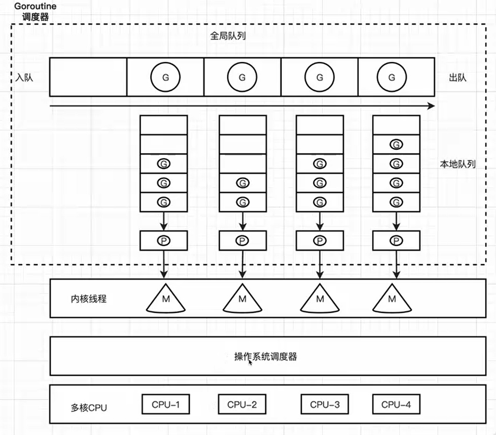

# Golang

并发与并行的区别
- 并发 --- 一段时间内，多个任务可以交替执行， 单核cpu 通过时间片轮转的方式多任务并发执行
- 并行 --- 同一时刻，多个任务同时执行，只有在多核cpu上才能实现

## Goroutine 协程
> Golang中每个goroutine(协程)默认占用内存远比Java/C的线程少。<br>
> <b><font color=red>Java开启一个线程，一般有固定的栈内存(<font color=orange>通常2MB</font>左右)</font></b><br>
> 而一个<b><font color=yellow>goroutine协程只有2KB</font></b>, 多协程调度开销方面远比线程要少。<br>

### 特点
- 轻量级  --- 2kb
- 高效调度
- 并发编程

### 关键字 go 开启协程
```go
package main

import (
	"fmt"
	"runtime"
	"sync"
	"time"
)
var gw = sync.WaitGroup{}
func test1() {
	for i := 0; i < 10; i++ {
		fmt.Println(" test1 ----- ", i, runtime.NumGoroutine())
		time.Sleep(time.Millisecond * 100)
	}
	gw.Done()
}

func test2() {
	var a = make([]byte, 1024)
	for i := 0; i < 10; i++ {
		runtime.Stack(a, true)
		fmt.Println(" test2 ----- ", i, runtime.NumGoroutine(), string(a))
		time.Sleep(time.Millisecond * 50)
	}
	gw.Done()
}

func main() {

	go test1()
	gw.Add(1)

	go test2()
	gw.Add(1)

	gw.Wait()
	fmt.Println("-----finish-----")
}

```


## Channel 管道通信
> Channel 管道提供goroutine之间的消息通讯<br>
> channel可以让一个goroutine发送特定值到另一个goroutine的通信机制。<br>
> FIFO 先进先出的规则<br>
> Channel 是一种引用数据类型<br>
> 定义方式 var ch chan int<br>
> 主线程必须等待操作完成后才可以推出<br>
> 定义的管道默认时<b><font color=red>双向管道</font></b>，即可读可写<br>

### channel 发送
> ch <- 10 // 数据10放入管道

### channel 取值
> var a = <- ch // 从ch中接受值

### channel 关闭管道
> close(ch) // 通过内置函数关闭通道


### 单向管道
- chan<- 只写
- <-chan 只读

```go
package main

import "fmt"

func main() {
	ch1 := make(chan int, 100)
	fmt.Printf("ch1 is %T\n", ch1) // ch1 is chan int
	var ch2 chan<- int
	ch2 = ch1
	fmt.Printf("ch2 is %T\n", ch2) // ch2 is chan<- int
	var ch3 <-chan int
	ch3 = ch1
	fmt.Printf("ch3 is %T\n", ch3) // ch3 is <-chan int
}
```


### select 多路复用
> 使用多路复用是， 不需要关闭chan, 否则会出问题
```go
for {
		select {
		case v := <-ch1:
			fmt.Println(v)
		case vv := <-ch2:
			fmt.Println(vv)
		default:
			fmt.Println("-----read finish-----")
			return
		}
	}
```

### 互斥锁
> var mutex = sync.Mutex{}
> mutex.Lock() // 开启锁
> mutex.Unlock() // 关闭锁

### 读写互斥锁
> 当<b>写开始</b>时， 读写都不能并发操作, 即都要等待写操作完成后执行<br>
> 并行读操作， 但是当有写操作是， 读写互斥，即读操作暂停<br>
> 写操作互斥，当有写操作上， 任何读写都互斥<br>
> var mutex = sync.RWMutex{}<br>
> mutex.Lock() // 写操作-开启锁<br>
> mutex.Unlock() // 写操作-关闭锁<br>
> mutex.RLock() // 读操作-开启锁<br>
> mutex.RUnlock() // 读操作-关闭锁<br>

```go
package main

import (
	"fmt"
	"sync"
	"time"
)

var myWG4 = sync.WaitGroup{}
var mutex = sync.RWMutex{}

// 并行读操作， 但是当有写操作是， 读写互斥，即读操作暂停
func read3() {
	mutex.RLock()
	fmt.Println("Read ---")
	time.Sleep(time.Second * 1)
	myWG4.Done()
	mutex.RUnlock()
}

// 写操作互斥，当有写操作上， 任何读写都互斥
func write3() {
	mutex.Lock()
	fmt.Println("--- Write ")
	time.Sleep(time.Second * 5)
	myWG4.Done()
	mutex.Unlock()
}

func main() {
	for i := 0; i < 10; i++ {
		myWG4.Add(1)
		go read3()
		if i%3 == 0 {
			myWG4.Add(1)
			go write3()
		}
	}
	myWG4.Wait()
}

```


## GMP模型
GMP(Goroutine, Machine, Processor) 是Go语言运行时(runtime)的调度模型， 它是Go语言实现高效并发编程的核心机制。
- G(Goroutine) ***轻量级的并发执行单元***，由go运行时管理，每个goroutine都有自己的栈空间/程序计数器/寄存器，它可以被暂停和恢复执行。
- M(Machine) 代表操作系统线程，<font color=yellow>***每个M都对应一个内核线程***</font>
- P(Processor) 处理器，它是一个抽象的概念，主要<font color=orange>***负责将Goroutine调度到M上执行***</font>

### 工作原理
- 本地队列调度 --- <font color=yellow>***M优先从本地队列获取Goroutine执行***</font>，本地队列不超过256个，<font color=yellow>***当本地队列为空则从全局队列获取Goroutine***</font>
- 全局队列调度 --- 如果全局队列为空，M则会从其他P的本地队列“偷取”一半的Goroutine到自己关联的P的本地队列中，这种机制称为“工作窃取”
- 阻塞和唤醒 --- 当一个Goroutine发生阻塞(如进行系统调用)时，M会将该Goroutine挂起



### 设置Processor的数量
> runtime.GOMAXPROCS(2) // 设置P的数量为2

## 调度器的设计策略
### 服用线程
#### work stealing 机制
> 当本线程 没有 可运行的Goroutine时， 尝试从其他线程绑定的P偷取G, 而不是销毁线程

#### hand off 机制
> 当本线程因为G进行系统调用阻塞时， 线程释放绑定的P, 把P转移给其他空闲的线程执行。


### 利用并行
GOMAXPROCS 设置P的数量， 最多有GOMAXPROCS个线程分布在多个CPU上同时运行

### 抢占
> 在coroutine中要等待一个协程主动让出CPU才执行下一个协程，
> 在Go中，一个goroutine最多占用CPU 10ms, 防止其他goroutine被饿死。

### 全局G队列
> 当M执行work stealing从其他P偷不到G时，它可以从全局G队列获取G。

## go func() 执行， 经历了什么过程
1. 创建 G
2. 将G放入本地队列， 如果本地队列满了 则放入 全局队列
3. M获取G 优先从本地队列中获取， 本地队列为空则从全局队列获取， 如果全局队列也为空， 则从其他P本地队列中 "偷取"
4. 调度
5. 执行 func(), 若 发生阻塞， 则新建M 接管当前正在阻塞G的P
6. 时间片超时 返回到M, G则被放回P的本地队列尾部


### 调度器的生命周期
- M0
> M0 是启动程序后编号为0的主线程， 这个M对应的实例会在全局变量runtime.m0中<br>
> 不需要在heap上分配，M0负责执行初始化操作和启动第一个G,<br>
> 在之后M0就和其他的M一样了<br>

- G0
> G0时每次启动一个M都会第一个创建的goroutine, <font color=orange>***G0仅用于负责调度G***</font>,<br>
> G0不指向任何可执行的函数<br>
> 每个M都会有一个自己的G0.<br>
> 在调度或者系统调用时会使用G0的栈空间， 全局变量的G0是M0和G0.<br>


M上的G1 执行完后 调用goexit() 结束， M上运行的goroutine切换为G0, G0负责调度协程的切换(函数schedule())。
从本地队列中获取到G2, 从G0切换到G2, 并开始运行G2(函数execute)， 实现了线程M的复用。

每次创建G时， 运行的G会尝试唤醒其他空闲的P和M组合去执行
假定G2唤醒了M2， M2绑定了P2， 并且运行G0， 但P2本地队列为空， M2此时为自旋线程。
自旋线程的作用是，从全局队列拉取G到本地队列， 如果全局队列为空则进行“偷取”操作

自旋线程 从全局队列获取的个数 
n = min(len(GQ)/GOMAXPROCS + 1, len(GQ/2)) // 该公式就是一种负载均衡 策略
一旦本地队列中有G， 则自旋线程消失 变为普通线程执行G

work stealing
偷取的比例是： 其他P的本地队列中的 批量一半

自旋线程的最大限制
自旋线程 + 执行线程 <= GOMAXPROCS
 

G发生系统调用/阻塞

