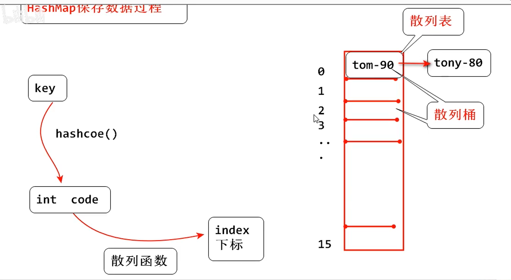

# Java 17 

## New Feature

### Lombok
> Setting->Build->Compiler->AnnotationProcessors->Enable // 让注解可以使用
> Setting->Build->Compiler->Build project automatically // 自动编译
> 非常强大且受欢迎的Java库<br>
> 用于简化Java代码的编写，特别是通过减少样板代码（boilerplate code）<br>
> 减少样板代码<br>
> 注解功能<br>
- @Getter 和 @Setter：自动为字段生成 getter 和 setter 方法。
- @ToString：自动生成 toString() 方法。
- @EqualsAndHashCode：自动生成 equals() 和 hashCode() 方法。
- @NoArgsConstructor、@AllArgsConstructor、@RequiredArgsConstructor：自动生成无参构造函数、全参构造函数和带有必需参数的构造函数。
- @Data：一个组合注解，包含了 @ToString、@EqualsAndHashCode、@Getter、@Setter 和 @RequiredArgsConstructor，使类成为数据承载类。
- @Value：使类成为不可变（final）数据类，所有字段都自动成为 final，并只有 getter 方法。
- @Builder注解通过构建者模式，实现更加直观的对象构造。
```java
import lombok.Data;
// 通过该注解 将自动生成 getter,setter, toString(), equal(), hashcode()方法
@Data
public class User {
    private String name;
    private int age;
}
```

### Lambda表达式
> <b>面向对象思想</b>————Java核心编程思想<br>
> <b>函数式编程思想</b>————jdk8之后的新思想<br>
> Lambda 强调结果 不强调过程


### 函数式接口定义 @FunctionalInterface
```java
@FunctionalInterface
public interface USB {
    void close();
}
```

### 函数式接口
> 有且<b>只有一个抽象方法</b>的接口interface<br>
> @FunctionalInterface 注解来检测，不报错这可以是函数式接口<br>
>
```java
@FunctionalInterface
public interface USB {
    void close();
}
```

#### Supplier 接口
```java
public class SupplierDemo {

    public static void main(String[] args) {
        method(new Supplier<Integer>() {
            @Override
            public Integer get() {
                int[] arr = {4,2,3,7,5,9,1};
                Arrays.sort(arr);
                return arr[arr.length - 1];
            }
        });
    }

    public static void method(Supplier<Integer> supplier){
        Integer max = supplier.get();
        System.out.println("max = " + max);
    }
}
```
#### Consumer 消费型接口


#### Function 方法行接口
> 根据一个类型的数据 得到 另一个类型的数据
```java
public class FunctionDemo {
    public static void main(String[] args) {
        method(integer -> String.valueOf(integer), 10);

    }
    public static void method(Function<Integer, String> function, Integer number) {
        String s = function.apply(number * 2);
        System.out.println(s);
    }
}
```

#### Predicate 判断型接口
```java
public class PredicateDemo {
    public static void main(String[] args) {
        method(s->  s.length() == 7, "abcdefg");
    }

    public static void method(Predicate<String> predicate, String s) {
        boolean test = predicate.test(s);
        System.out.printf("result="+test);
    }
}
```
#### 

### 类型转换 instanceof
```java
public class Main {
    public static void main(String[] args) {
        var dog = new Dog();
        speak(dog);
    }

    public static void speak(Animal animal) {
        // 类型自动强转
        if (animal instanceof Dog dog) {
            dog.spark();
        }
    }
}
```


### record
> record 是一种更轻便、功能专一的类，主要用于承载数据<br>
> 避免冗长的代码<br>
```java
public record Person(String name, int age) {}
```
> 自动生成 public getter 方法<br>
```java
    Person p=new Person("Alice",30);
    System.out.println(p.name()); // 输出 "Alice"
    System.out.println(p.age());  // 输出 30
```
> 自动生成 toString() 方法<br>
> 自动生成 equals() 和 hashCode() 方法<br>
> <b>不可变数据</b>：record 的字段默认是 final<br>
> <b><font color=yellow>属性一旦赋值，不能修改， 相当于整个对象是final类型</font></b><br>


### 密封类
> 密封思想同final修饰的类相同<br>
> sealed 修饰类<br>
> permits 修饰继承的子类<br>
> sealed修饰的类必须有子类继承<br>
```java
//定义密封类
public sealed class SealedStudent permits FreshStudent, JuniorStudent, SeniorStudent{
    protected String StudentID;
    protected float enScore;
    protected float scScore;
    protected float peScore;
}
// 实现密封类的子类
public non-sealed class FreshStudent extends SealedStudent {
}
```

### Stream 流， 一种流式编程方式
> 流水线式的 一步一步。

#### 针对集合的 Collection中的方法
> ArrayList<String> list = new ArrayList<>();
> list.stream()
> 

#### 针对数组 的 Stream 接口中的静态方法
> Stream.of(T...values)

#### Stream.count() 统计个数

#### Stream.filter() 返回一个新的stream对象

#### Stream<T>.limit(long maxSize) 获取Stream流对象的前几个元素 并返回一个新的stream流对象

#### Stream<T>.skip(long n) 跳过部分元素

#### Stream<T>.concat() 合并两个stream流集合， 流合并
```java
  public static void concatFun() {
        Stream<String> stream1 = Stream.of("Tom", "Aba", "Muhail");
        Stream<String> stream2 = Stream.of("Edward", "Felix", "Jesica");

        Stream.concat(stream1, stream2).forEach(System.out::println);
    }
```

#### stream流 转 集合
- stream1.collect(Collectors.toList())
- stream1.toList();

#### stream.distinct() 去重
> 对象元素的去重， 需要重写hashCode() 和 equals() 
> 或者 Lombok 注解， @Data(会自动 重写 toString, hashCode(), equals())
> 
```java
   public static void distinctFun() {
        Stream<String> stream1 = Stream.of("Tom", "Aba", "Tom", "Libai");

        stream1.distinct().forEach(System.out::println);
    }
```

#### stream.map() 转换流中的类型
```java
    public static void mapFun() {
        Stream<Person2> stream1 = Stream.of(
                new Person2("Tom", 19),
                new Person2("Jicc", 30),
                new Person2("Tom", 19));

        stream1.map(p-> p.getName())
                .forEach(System.out::println);
    }
```


### 方法引用
使用条件：
a. 被引用的方法要写在重写方法里面
b. 被引用的方法从参数上，返回值上要和所在的重写方法一致， 而且引用的方法最好式操作重写方法的参数值
c. 干掉重写方法的参数；干掉->; 干掉被引用方法的参数->将被引用的方法'.'改写成'::'
```java
stream1.map(p-> p.getName())
                .forEach(System.out::println);
```


```java
System.out.printf("000"+ " abc "+"000\n"); //000 abc 000
System.out.printf("000"+supplierFun(" abc "::trim)+"000\n"); //000abc000

 public static String supplierFun(Supplier<String> supplier) {
        return supplier.get();
    }
```


#### 类名--引用静态方法
> 类名--引用静态方法
>   格式: 类名::静态成员方法
```java
 double d = supplierFun2(Math::random);// className::静态成员方法 引用方式
 System.out.println(d); // 打印一个随机值

 public static Double supplierFun2(Supplier<Double> supplier) {
        return supplier.get();
 }
```

#### 类--构造引用
```java
    Person2 p = functionFun(Person2::new, "abc");
    System.out.println(p); // Person2(name=abc, age=null)
    public static Person2 functionFun(Function<String, Person2> function, String name) {
        return function.apply(name);
    }
```


### HashMap 数据结构
- 根据key --> hashCode --> 根据散列函数 获取下标 index --> 放入Hash桶
- 扩容 --> rehash操作


hashcode 方法
1. 不同的对象调用该方法 可能得到相同的整数
2. 两个对象equals=true, hashcode 一定相同
3. 同一个对象 多次调用hashcode 得到的值一定相同

散列函数
1. 稳定性： 相同的对象多次调用散列函数 得到的整数 一定相同
2. 不同的 hashcode 调用散列函数 可能 得到相同的结果， 这就导致了链表

Java 1.8之后 链表修改为了 红黑树 数据结构
JDK1.8之前 数组 + 链表
JDK1.8开始 数组 + 链表 + 红黑树

<font color=orange>***红黑树 --- 自平衡的二叉树 数据结构， 查找的时间复杂度是O(log N)***</font>

<font color=yellow>***链表长度达到8之后 链表会转换成红黑树， 从而提高查询效率***</font>

HashMap 中key,value 都可以为null
HashTable key,value 都不可以为null
ConcurrentHashMap key,value 都不可以为null --- 提高了并发执行效率

即， 线程安全的散列表 key,value都不可以为null


## Java 经典面试题

### ThreadLocal
多个线程共享一份数据， 同时做到线程隔离，各个线程对数据的操作互不影响。

> Java 所提供的线程本地 存储机制， 可以利用该机制将数据 <font color=yellow>缓存在某个线程内部</font><br>
> 每个线程位于一个ThreadLocalMap<br>
> 每个线程可以 使用多个ThreadLocal<br>
> Map的key 就是ThreadLocal, value是 ThreadLocal的值 --- 也叫副本<br>
> ThreadLocal是弱引用<br>
> 但是ThreadLocal的值是强引用， 而且副本释放到ThreadLocalMap中的， 因此线程使用完需要手动remove<br>
> 线程池的情况， 线程存在复用， 所以手动remove是必须操作<br>
>

### 不建议使用Executors来创建线程池
内置的线程池 eg: FixedThreadExecutor coreThreadCount, maxThreadCOunt, alive 等参数都是固定的
并且 多余的线程会放到阻塞队列中， 
- 建议： 自定义线程池管


### 分布式事务
 
Saga协调器

- 命令协调
> - 存在 单点故障的风险
- 事件编排


