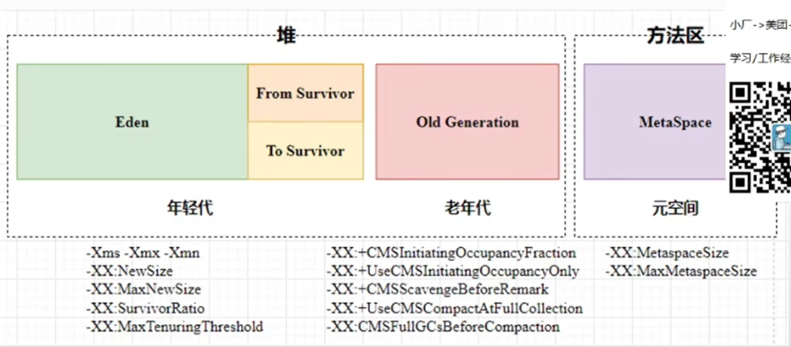

# JDK 


## JVM

## 运行时数据区(Run-Time Data Area)
- 堆  栈(线程)  本地方法栈
- 方法区
- 程序计数器(行号---下一个要执行的代码的位置)

> 程序计数器 之所以记住的是下一行代码的行号， 是因为再多线程操作中,
> CPU一定会等待上一个行号的代码执行完 才会允许其他线程将 抢走cpu时间片。
> 因此 上一个线程挂起， 当线程恢复执行后 直接执行当前程序计数器的行号

字节码执行引擎 负责 程序计数器的操作

eg: 一个方法开始执行
- 方法入栈
- 局部变量 存储在栈中
- 操作数栈
- 动态链接
方法执行完毕后， 该栈内存被清除， 包括站内的方法和局部变量

栈 FILO (First In Late Out)


// 反汇编 class文件
> javap -c classFilePath > newJavaFileLocationPath


### 堆 内存
- 年轻代 占比 1/3
- 老年代 占比 2/3

垃圾收集线程 进行 minor gc  主要回收整个年轻代， 使用可达性算法， 没有被引用的直接回收
可达性分析算法


full gc 负责对整个堆内存进行回收
Full GC 会触发 STW(Stop The World) 是比较耗时的一个动作


## JVM 调优
> 通过合理配置内存、垃圾回收（GC）策略等参数，优化应用的性能、稳定性和资源利用率.




需要调优的场景
- 卡顿
- 内存溢出OOM
- 频繁FGC(Full GC) 引起STW(Stop The World)

JVM调优参数说明
- 堆内存参数：

| 参数                   | 作用                       | 示例                        | 
|:---------------------|:-------------------------|:--------------------------|
| -Xms                 | 初始堆大小                    | -Xms4G                    |
| -Xmx                 | 最大堆大小                    | -Xmx8G                    |
| -Xmn                 | Eden 大小(建议占堆的 1/3-1/2)   | -Xmn3G                    |
| -XX:MetaspaceSize    | 元空间初始大小                  | -XX:MetaspaceSize=256M    |
| -XX:MaxMetaspaceSize | 元空间最大大小                  | -XX:MaxMetaspaceSize=512M |
| -XX:SurvivorRatio    | Eden区与Survivor区的比例（默认8）  | -XX:SurvivorRatio=6       |

- 垃圾回收器参数

| GC 类型                                             | 参数                      | 适用场景          |
|:--------------------------------------------------|:------------------------|:--------------|
| Parallel（吞吐优先）                                    | -XX:+UseParallelGC      | 大数据计算、离线任务    |
| CMS（低延迟）                                          | -XX:+UseConcMarkSweepGC | Web服务、响应敏感型应用 |
| G1（平衡型）                                           | -XX:+UseG1GC            | 大堆内存、混合负载     |
| <font color=yellow>***ZGC（超低延迟）--- 美团在用***</font> | -XX:+UseZGC             | 延迟敏感型（如金融交易）  |

ZGC
> - ZGC FGC 卡顿率99.9% <= 20ms
> - 官方自称 是 亚毫秒级别
> - ***JDK 17 没有分代收集***
> - ***JDK 21 实现了分代收集***

ZGC 优点
- 多核并行收集 效率极高 亚毫秒级别
- 不受内存限制 无论多大的对象堆垃圾 回收速度是一样的(最大到TB级别)

ZGC 缺点
- 相对吃CPU


- GC日志与监控参数

| 参数                         | 作用                  ||
|:---------------------------|:--------------------|:---|
| -XX:+PrintGCDetails        | 打印GC详细日志            ||
| -Xloggc:/path/to/gc.log    | 输出GC日志到文件           ||
| -XX:+PrintGCDateStamps     | 记录GC发生时间            ||
| -XX:+UseGCLogFileRotation  | 启用GC日志轮转（配合文件大小参数）  ||

- 其他优化参数

| 参数                              | 作用                 |
|---------------------------------|--------------------|
| -XX:+HeapDumpOnOutOfMemoryError | OOM时生成堆转储文件（用于分析）  |
 | -XX:MaxTenuringThreshold        | 对象晋升老年代的年龄阈值（默认15） |
| -XX:PretenureSizeThreshold      | 大对象直接进入老年代的阈值（字节）  |


经典调优场景
- 1. 高并发Web服务(低延迟需求)
> 频繁短生命周期对象，要求低GC停顿。

```shell
# 使用G1回收器，限制最大停顿时间
-XX:+UseG1GC 
-XX:MaxGCPauseMillis=200 
-Xms8G -Xmx8G 
-XX:MetaspaceSize=256M
-XX:InitiatingHeapOccupancyPercent=35  # 触发并发GC的堆使用率阈值
```

- 2. 大数据批处理（高吞吐需求）
> 大量数据内存处理，关注整体吞吐量。
```shell
# 使用Parallel回收器，增大年轻代
-XX:+UseParallelGC 
-Xms16G -Xmx16G 
-Xmn12G 
-XX:SurvivorRatio=6  # 增大Eden区比例
-XX:+UseAdaptiveSizePolicy  # 开启自适应策略
```

- 3. 微服务容器化部署（资源受限）
> 特点：运行在K8s/Docker中，需限制内存。

```shell
# 限制堆内存，启用容器感知（JDK8u191+）
-XX:+UseContainerSupport 
-Xms2G -Xmx2G 
-XX:MaxRAMPercentage=75.0  # 使用容器内存的75%
-XX:+UseG1GC 
-XX:MaxGCPauseMillis=150
```

- 4. 高频交易系统（亚毫秒级延迟）
> 特点：对停顿时间极度敏感（如股票交易）。
```shell
# 使用ZGC或Shenandoah
-XX:+UseZGC 
-Xmx32G 
-XX:+UnlockExperimentalVMOptions 
-XX:+UseTransparentHugePages  # 启用大页内存
```


案例 metaspace导致频繁FGC问题
> 反射会创建大量的类加载器DelegatingClassLoader <br>
> 这会消耗较大的元空间metaspace(内存中的一块区域)<br>
> 同时 存在内存碎片化，元空间利用率不高， 触发FGC

策略
- 适当调整metaspace的空间大小
- 优化不合理的反射调用（mybatis中的reflector模块 缓存反射信息）


-XX:+DisableExplicitGC 参数的作用就是禁用通过
`System.gc()`或`Runtime.getRuntime().gc()`
触发的显式垃圾回收。

堆外内存管理
- 解决方案：
> 使用 -XX:+ExplicitGCInvokesConcurrent（仅限某些 GC 如 CMS、G1），让显式 GC 触发并发回收而非 Full GC。