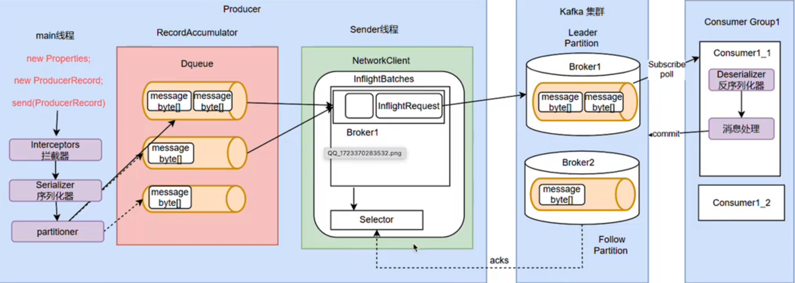

# Kafka
> 目前最具影响力的开源MQ产品<br>
> [Kafka Website](https://kafka.apache.org/)<br>
> [Study Video](https://www.bilibili.com/video/BV12upMeEEuo/?p=14&share_source=copy_web&vd_source=acce2980b66bdbe7232dd0ab353300ea)<br>

## Kafka 与 Netty 的关系
> <font color=red size=3><b>Kafka 在其网络层实现中充分利用了 Netty 的特性</b></font><br>
> - <font color=orange size=3><b>网络通信</b></font>：Kafka 使用 Netty 来处理客户端和服务器之间的**网络通信**。Netty 的 <b>异步非阻塞</b> 特性适合 Kafka 的高吞吐量需求，使其能够在处理大量并发连接时保持性能。<br>
> - <font color=orange size=3><b>RPC通信</b></font>：Kafka 的各个组件之间的通信（如 broker 和 producer 之间的消息发送、消费者和 broker 之间的消息消费等）都是通过 Netty 提供的通道实现的。这为 Kafka 提供了灵活的连接管理和高效的数据传输。<br>
> - <font color=orange size=3><b>性能优化</b></font>：通过 Netty，Kafka 可以利用**事件驱动**的机制，优化线程使用，减少上下文切换，从而提高整体性能。<br>


## 快速了解

### 1. MQ作用
> MessageQueue, 消息队列, 队列 是一种FIFO先进先出的数据结构。
> MQ 三个方面的作用
> - 异步
> - 解耦
> - - 服务之间解耦，
> - - 数据分发。一个消息可以一个或者多个消费者进行消费。
> - 削峰


### Kafka features 特点
- 消息持久化 --- 写入磁盘
- 数据吞吐量大(100w并发)， 能够快速收集 各个渠道的海量日志
- 扩展性强(动态扩展) 集群
- 多客户端支持 --- Java/C/C++/Go/Python 各类客户端都可以支持
- 集群容错性 高， 允许集群中 少量 节点崩溃
- 功能不需要太复杂， 设计目标是高吞吐， 低延迟和可扩展， 主要关注消息传递， 而不是消息处理
- 允许少量数据丢失
- Kafka Stream流处理
- 安全机制
- 数据备份
- 轻量级
- 消息压缩 机制， 提高吞吐量


> 服务 稳定性 比  数据安全性更高

## 快速上手Kafka

### 发送消息的三种方式
- producer.send(message) // 直接发送，速度快
- producer.send(message).get() // 阻塞等待发送结果
- producer.send(message, Callback) // 非阻塞 回调

### 生产者拦截器机制
>  public static final String INTERCEPTOR_CLASSES_CONFIG = "interceptor.classes";<br>
> By default, there are no interceptors.<br>
> 生产者发送消息阶段都可以拦截消息并修改消息<br>

- onSend()
> // 发送消息时触发
  // 该阶段 可以对消息进行修改 操作
  @Override
  public ProducerRecord onSend(ProducerRecord producerRecord)<br>
- onAcknowledgement()
> // 收到服务端响应时触发
// 对于失败 可以处理重发机制
@Override
public void onAcknowledgement(RecordMetadata recordMetadata, Exception e)
- onClose()
>  // 连接关闭时触发
// 可以处理 关闭一些资源
@Override
public void close()
- configure
> // 整理配置项
@Override
public void configure(Map<String, ?> map)

### 数据传输的序列化
> Kafka本身只存储二进制数据， 数据的获取与发送都需要 指定序列化方式


### 消息分区路由机制

#### 消费者分区分配策略
> Kafka 默认提供了三汇总消费者分区策略
> - range策略， eg: 一个topic有10个Partition(0-9),一个消费者组有三个消费者Consumer(1-3), range策略会将0-3分给第一个Consumer, 4-6分给第二个Consumer，7-9分给第三个Consumer
> - round-robin策略： 轮询分配策略， 轮流分配 0/3/6/9 分配给第一个Consumer, 1/4/7分配给第二个Consumer, 2/5/8分配给第三个Consumer
> - sticky策略，粘性策略。a.尽量保持分区的分配均匀；b.分区的分配尽可能的与上一次分配保持一致


### 生产者消息缓存机制
> 生产者为了避免高并发 对服务器造成过大压力， 每次发送消息并不是一条一条的发送， 而是增加一个高速缓存，集中将消息发送到缓存后，批量进行发送。
> 


### 发送应答机制
> ACKS_CONFIG 客户端的配置<br>
> - acks=0 只负责发送， 不论是否发送成功， 吞吐量高，安全性低<br>
> - acks=1 等待响应成功结果，只保证leader partition写入成功即返回结果<br>
> - acks=all/-1 等待所有partition写入成功后返回结果， 吞吐量低， 但安全性最高<br>
>
> min.insync.replicas 服务端配置<br>
> 多少个partition写入成功后 返回结果， 该值通常设置为集群的多半数<br>
>

### 生产者消息幂等性
> ENABLE_IDEMPOTENCE_CONFIG 是否启动幂等性机制 default=true
> <font color=yellow><b>但是 ACKS_CONFIG=all是必须条件</b></font> !!!ATTENTION!!!

> 生产者有一个PID, 对消息维护一个seq, 服务端Broker记录每个PID在每个分区的序列号SN，收到的seq 只有大于SN才会被持久化， 否则被认为是重复消息
> properties.put("enable.idempotence", "true"); // 自动开启 acks=all 和重试机制


### 生产者数据压缩机制
> 生产者 往Broker发送消息时， 会对消息进行压缩， 以降低网络传输压力
> COMPRESSION_TYPE_CONFIG 客户端设置压缩算法， 同样服务端也要设置相同的算法
> - NONE // default
> - GZIP
> - SNAPPY
> - LZ4 // 吞吐量方面优势明显
> - ZSTD // 最高的数据压缩比 但吞吐量不高


### 生产者消息事务
> <font color=orange>解决消息的原子性、避免重复消息、实现精确一次交付、保证数据一致性</font><br>
>- void initTransactions() // 初始化事务
>- void beginTransaction() // 开始事务
>- void commitTransaction() // 提交事务
>- void abortTransaction() // 放弃事务（回滚）


## SpringBoot 集成 Kafka
```xml
 <dependency>
    <groupId>org.springframework.kafka</groupId>
    <artifactId>spring-kafka</artifactId>
    <version>3.3.3</version>
 </dependency>
```
- Producer
```java
package kafka.spring;

import org.springframework.beans.factory.annotation.Autowired;
import org.springframework.kafka.core.KafkaTemplate;

/**
 * @auth Felix
 * @since 2025/3/5 1:20
 */

public class KafkaProducer {
    
    @Autowired
    private KafkaTemplate<String, Object> kafkaTemplate;

    public void sendMessage(String topic, Integer partition, String key, Object value) {
        kafkaTemplate.send(topic, partition, key, value);
    }
}

```
- Consumer
```java
package kafka.spring;

import multipyThread.CommonUtil;
import org.apache.kafka.clients.consumer.ConsumerRecord;
import org.springframework.kafka.annotation.KafkaListener;
import org.springframework.stereotype.Component;

/**
 * @auth Felix
 * @since 2025/3/5 1:20
 */
@Component
public class KafkaConsumer {

    @KafkaListener(topics = {"topic1", "topic2"})
    public void onReceived(ConsumerRecord<?, ?> record) {
        CommonUtil.printMessage("收到消息：topic=" + record.topic() + ";Partition=" + record.partition() + ";key=" + record.key() + ";value=" + record.value());
    }
}

```

### Kafka数据流程图



### 积压几百万的消息 如何解决
- 问题一般出在 消费者， 所以第一步 定位问题
- 第二部 修复消费者问题
- 第三步 临时扩容 消费者， 计算消息情况 倍数扩容。 


### 如何解决重复消费？
消费时 <font color=yellow>***幂等性处理***</font>
1. MVCC 多版本 并发控制(生产的时候带上数据的版本号) 
> enable.idempotence=true 开启自动提交， Broker 会去重 props.put("enable.idempotence", "true");
2. 去重表 的方案


### 如何保证 消息顺序的？
整个主题Topic保证一个 分区Partition


### RabbitMQ 交换器(Exchange)的四种类型
- Direct --- 直接交换器
- Fanout --- 广播
- Topic --- 主题
- Headers --- 类似Direct 不常用


### Kafka 适合的场景
- 日志收集
- 消息系统
- 流式处理 Stream流式处理 可以做 订单流量统计 类似业务


### Kafka 熟悉的参数？
- Broker
> - broker.id 集群下broker唯一表示
> - listeners 监听列表 0.0.0.0 表示绑定所有网卡地址
> - zookeeper.connect 集群的地址， 多个之间用逗号隔开
> - log.dirs 日志目录
> - auto.create.topics.enable 是否自动创建主题topic, default=true
> - delete.topic.enable=true 删除主题配置 default=true 开启

- Topic
> - num.partitions 每个主题的分区数， 只增不减
> - log.retention.hours 日志保存时间 default 7days
> - log.retention.bytes topic 每个分区的最大文件大小
> - message.max.bytes 一个服务器接受处理的消息的最大字节数
