# TXAI - 网约车项目

## 项目介绍

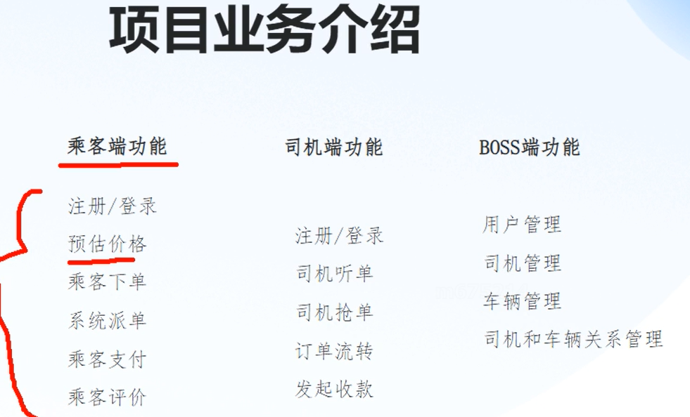

项目技术介绍
- 前端 uni-app
- 数据库 MySQL
- 缓存Redis
- 注册中心Nacos
- 配置中心Nacos
- 网关 Spring Cloud Gateway
- 熔断限流 Spring Cloud Alibaba Sentinel
- 服务监控 Spring Cloud Sleuth 、Spring Cloud zipkin
- 分布式锁 Redisson
- 分布式事务 Alibaba Seata
- 服务通信 SSE


### Rest ful规范/风格
协议/域名/路径/版本/动作
[post]https://api.msb.com/order/v1 --- add order
[put]https://api.msb.com/order/v1 --- update order

!!!Attention!!!
RUI中不要携带敏感信息


www.xxx.com/api/course --- 
www.api.xxx.com/course --- 迁移更方便


### 接口设计工具 - APIFOX

APIFox 与竞品对比表

| 功能/产品	  | APIFox                   | 	Postman         | 	Swagger (OpenAPI)	 | YAPI             | 	Eolink          | 	Insomnia      |
|---------|--------------------------|------------------|---------------------|------------------|------------------|----------------|
| API 设计  | 	✅ 可视化编辑，支持 OpenAPI	     | ❌ 需手动填写	         | ✅ 原生支持 OpenAPI	     | ✅ 支持 Swagger 导入	 | ✅ 可视化编辑	         | ✅ 支持 OpenAPI   |
| Mock 服务 | 	✅ 智能 Mock，零配置	          | ✅ 需手动配置（付费版更强）	  | ❌ 依赖第三方工具	          | ✅ 支持 Mock	       | ✅ 动态 Mock	       | ❌ 无            |
| 自动化测试   | ✅ 脚本+断言，CI/CD 集成         | ✅ 强大（付费版支持协作）	   | ❌ 无	                | ❌ 较弱	            | ✅ 支持自动化测试	       | ✅ 支持脚本测试       |
| 团队协作	   | ✅ 完整权限管理，实时同步            | 	✅ 企业版支持（付费）	    | ❌ 较弱	               | ✅ 支持团队协作	        | ✅ 企业级权限管理	       | ❌ 无            |
| 数据库支持	  | ✅ 直接操作 MySQL/PostgreSQL	 | ❌ 无	             | ❌ 无	                | ❌ 无	             | ✅ 支持数据库连接	       | ❌ 无            |
| 价格	     | 🆓 免费版 + 付费高级功能          | 	🆓 免费版 + 高价企业版	 | 🆓 开源免费	            | 🆓 开源免费	         | 🆓 免费版 + 付费企业版	  | 🆓 免费版 + 付费专业版 |
| 适用场景    | 全栈团队协作（前后端+测试）	          | 开发者调试 API	       | API 文档生成	           | 中小团队 API 管理	     | 企业级 API 全生命周期管理	 | 开发者轻量调试        |


### 创建项目

!!!Attention!!!
每做一步 建议package一下，保证每一步走正确，防止大量操作后出现错误 修复成本大。


### 集成 Nacos Discovery
1. 第一步
Spring Boot Version
```xml
<parent>
    <artifactId>spring-boot-starter-parent</artifactId>
    <groupId>org.springframework.boot</groupId>
    <version>3.2.4</version>
</parent>
```
2. 第二步
Spring Cloud Alibaba Version
```xml
<dependency>
    <groupId>com.alibaba.cloud</groupId>
    <artifactId>spring-cloud-starter-alibaba-nacos-discovery</artifactId>
    <version>${spring-cloud-alibaba.version}</version>
</dependency>
```

3. 第三步
服务发现全局配置
```java
@EnableDiscoveryClient
@SpringBootApplication
public class PassengerApplication {
    public static void main(String[] args) {
        SpringApplication.run(PassengerApplication.class, args);
    }
}
```

4. 第四步
application.yml配置
```yaml
spring:
  cloud:
    nacos:
      discovery:
        server-addr: 127.0.0.1:8848
        username: nacos
        password: nacos
```


### 公共接类库
- 给其他服务提供内容的返回DTO，应该定义在公共库中， 这样防止了 重复定义。
- Attention!!! 响应体DTO定义 不要忘记添加无参构造 否则会出现missing JsonCreator错误

### Alibaba 版本号统一管理
在Root项目中pom.xml 添加以下配置
```xml
<project>
    <dependencyManagement>
        <dependencies>
            <dependency>
                <groupId>com.alibaba.cloud</groupId>
                <artifactId>spring-cloud-alibaba-dependencies</artifactId>
                <version>2023.0.3.2</version>
                <type>pom</type>
                <scope>import</scope>
            </dependency>
        </dependencies>
    </dependencyManagement>
</project>
```


### Github 提交代码
注意添加Deploy Key
1. 第一步 生成 SSH pair key
```git bash
 ssh-keygen -t ed25519 -C "bull.king.smile@gmail.com" -f ~/.ssh/github_deploy_key 
```
2. 第二步 添加 key 到SSH-Agent
```git bash
eval $(ssh-agent -s)
ssh-add ~/.ssh/github_deploy_key
```
3. 第三步 添加public key到github -> setting -> SSH(or repo->setting->DeployKey)
4. 第四步 检查key是否关联生效
```git bash
ssh -T git@github.com
```
> Hi BullKing-Smile/TXAI-public! You've successfully authenticated, but GitHub does not provide shell access. 

5. 第五步 (非必须，如果出现 git@github.com: Permission denied (publickey))
```git bash
git config core.sshCommand "ssh -i ~/.ssh/github_deploy_key"
```

### 端口被占用 Java-PID
1. 查询被占用端口的PID
> netstat -ano | findstr [port]
2. 根据PID终止进程PID
> taskkill /PID <PID> /F


### MyBatis-Plus 集成
1. SpringBoot version 
```xml
<parent>
    <artifactId>spring-boot-starter-parent</artifactId>
    <groupId>org.springframework.boot</groupId>
    <version>3.2.4</version>
</parent>
```
2. SpringCloud version
```xml
<dependency>
    <groupId>org.springframework.cloud</groupId>
    <artifactId>spring-cloud-dependencies</artifactId>
    <version>2023.0.3</version>
    <type>pom</type>
    <scope>import</scope>
</dependency>
```
3. MyBatis-Plus version  !!!Attention!!! 适配SpringBoot3
```xml
<dependency>
    <groupId>com.baomidou</groupId>
    <artifactId>mybatis-plus-spring-boot3-starter</artifactId>
    <version>3.5.5</version>
</dependency>
```

4. 指定Mapper.xml文件地址
```yml
mybatis-plus:
  configuration:
    log-impl: org.apache.ibatis.logging.stdout.StdOutImpl
    map-underscore-to-camel-case: true
  mapper-locations: classpath:mapper/*.xml # 指定mapper.xml文件存放地址
```


### JWT
token的存储 注意标识 相同手机号/登录名 的不同身份


双token 时序图
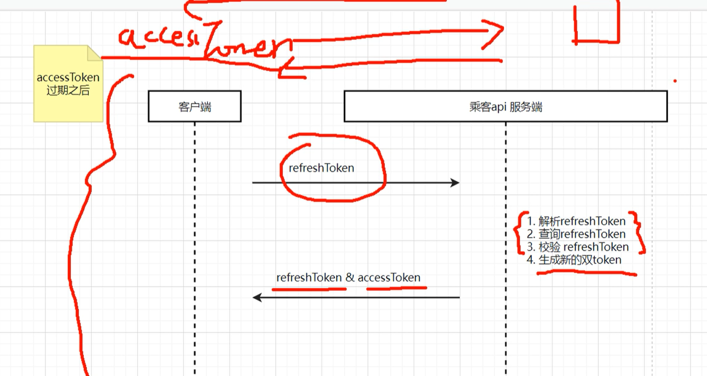


### Open Feign Bug
**如果定义的接口是RequestBody, 则默认是POST请求**
eg:
```codes
// 虽然指定了GET请求， 但是由于定义的RequestBody, 则默认找目标服务post请求的uri, 找不到 则找get对应的api
@RequestMapping(method = RequestMethod.GET, value = "/loginOrRegister")
ResponseResult loginOrRegister(@RequestBody VerificationCodeCheckDTO verificationCodeCheckDTO);

```


### 高德 价格预估-路径规划 文档地址
https://lbs.amap.com/api/webservice/guide/api/newroute

key
> 97d21327f48287242f4cf2c991fed2f0


### 国标
民族 GB/T/-3304
行政区划 GB/T-2260


### JSONObject.getLong(key) 数据转换丢失经度问题
key对应的value是字符穿类型时，如果直接用getLong(key) 则会丢失精度
先getString, 再 Long.parse()
```codes 
String desc = jsonObject.getString("desc");
Long carId = Long.parseLong(desc);
```

### 实时单，派单逻辑


### 下单测试流程
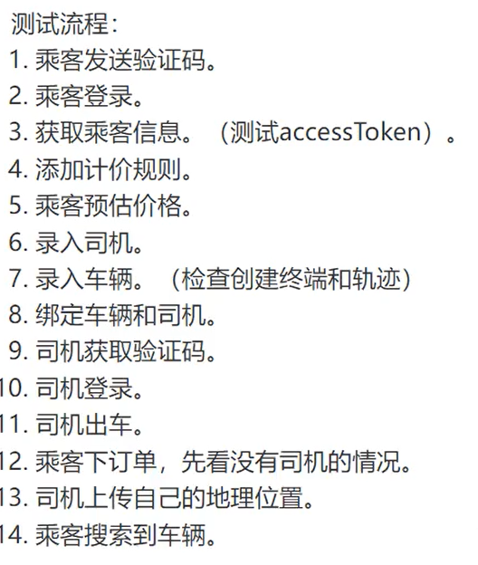


### synchronized 使用小技巧
synchronized(string.intern()){ } // 所处常量池的字符串对象


### 多实例配置方式
Run->Edit Configuration->指定
```yaml
---
spring:
  config:
    activate:
      on-profile: 8029
server:
  port: 8029
---
spring:
  config:
    activate:
      on-profile: 8031
server:
  port: 8031
---
spring:
  config:
    activate:
      on-profile: 8032
server:
  port: 8032
```

### Redisson 实现分布式锁
```codes --- Redisson 配置
@Bean
public RedissonClient redissonClient() {
    Config config = new Config();
    config.useSingleServer()
            .setAddress(potocol + redisHost + ":" + redisPort)
            .setPassword(password)
            .setDatabase(0);

    return Redisson.create(config);
}

// 获取锁资源
RLock lock = redissonClient.getLock(lockKey);
// 加锁
lock.lock();
// 释放锁
lock.unlock();
```


### Payment process
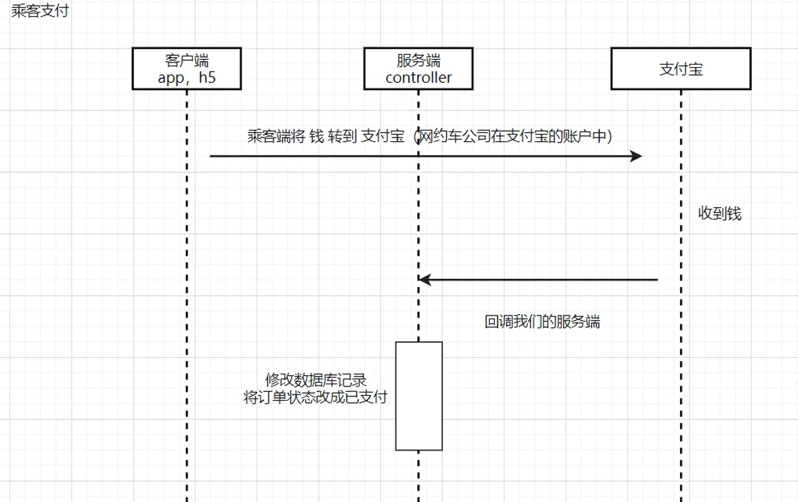


## 进阶版 学习


### Validation
1. 添加依赖
```xml
<dependency>
    <groupId>org.springframework.boot</groupId>
    <artifactId>spring-boot-starter-validation</artifactId>
</dependency>
```

2. 注解使用
```codes 
// entity
public class XXObject {
    @NotBlank
    @Pattern(regexp = "^1[1-9][0-9]{9}", message = "手机号码格式不正确")
    private String phone;
    @Min(4)
    @Max(8)
    @NotNull
    private Integer size;
}
// controller --- @Validated 
@GetMapping("/verification-code")
public Result verificationCode(@Validated @RequestBody XXObject obj) {
}
```

3. 全局检查异常类
```java
/**
 * 校验异常处理类
 */
@RestControllerAdvice
@Order(1)
public class GlobalValidationExceptionHandler {

    @ExceptionHandler(MethodArgumentNotValidException.class)
    public ResponseResult validationExceptionHandler(MethodArgumentNotValidException e) {
        e.printStackTrace();
        return ResponseResult.fail(CommonStatusEnum.VALIDATION_EXCEPTION.getCode(), e.getBindingResult().getAllErrors().get(0).getDefaultMessage());
    }

    @ExceptionHandler(ConstraintViolationException.class)
    public ResponseResult ConstraintValidationExceptionHandler(ConstraintViolationException e) {
        e.printStackTrace();
        Set<ConstraintViolation<?>> constraintViolations = e.getConstraintViolations();
        String message = "";
        for (ConstraintViolation c : constraintViolations) {
            message = c.getMessage();
        }
        return ResponseResult.fail(CommonStatusEnum.VALIDATION_EXCEPTION.getCode(), message);
    }

}
```


#### Validation 自定义
1. 定义注解类
```java
@Target(ElementType.FIELD)
@Retention(RetentionPolicy.RUNTIME)
@Constraint(validatedBy = VehicleTypeCheckValidator.class)
public @interface VehicleTypeCheck {

    String message() default "The vehicle type is invalid";

    String[] vehicleTypeValue() default {};

    // 下面两个方法必不可少
    Class<?>[] groups() default {};
    Class<? extends Payload>[] payload() default {};
}
```

2. 定义校验器
```java
@Slf4j
public class VehicleTypeCheckValidator implements ConstraintValidator<VehicleTypeCheck, String> {

    private List<String> vehicleTypeList = null;

    @Override
    public void initialize(VehicleTypeCheck constraintAnnotation) {
        vehicleTypeList = Arrays.asList(constraintAnnotation.vehicleTypeValue());
        ConstraintValidator.super.initialize(constraintAnnotation);
    }

    @Override
    public boolean isValid(String s, ConstraintValidatorContext constraintValidatorContext) {
        log.info(s);
        return vehicleTypeList.contains(s);
    }
}
```

3. 使用
```java
@Data
public class Obj {
    @VehicleTypeCheck(vehicleTypeValue = {"1","2"})
    private String vehicleType;
}
```


#### validation分组使用 group
1. 指定组
```java
@Data
public class Obj {
    @VehicleTypeCheck(vehicleTypeValue = {"1","2"}, groups = {AApi.class, BApi.class})
    private String vehicleType;
}
```
2. 接口使用
```codes
@GetMapping("/xxx")
public sss forecastPrice(@Validated({AApi.class, BApi.class}) @RequestBody ForecastPriceDTO forecastPriceDTO) {
    return ....;
}
```


### 分布式的一致性解决方案


#### synchronized 锁对象的情况
- synchronized(Long/Integer) 注意享元模式 [-128~127] 缓存池，使用同一个对象， 超过这个方位 这是新对象
- synchronized(String.intern()) , 使用该方法 指定常量池中的对象。


#### Lua脚本 实现多条redis命令的原子性操作
- 经典应用场景: key续期
```lua
--- 获取 方法中的参数: key，value ,时间
local key = KEYS[1]
local value = KEYS[2]

local expire = ARGV[1]

if redis.call("get", key) == false then
    if redis.call("set",key,value) then
        if tonumber(expire) > 0 then
            redis.call("expire",key,expire);
        end
        return true;
    end
    return false;

else
    return false;
end
```


#### Redisson 实现分布式锁
1. lock = redissonClient.getLock(key) // 获取锁， 会自动续期
2. lock.lock() // 加锁
3. lock.unlock() // 释放锁

Redisson 提供了主从配置模式，支持在主节点(Master)上执行写操作，在从节点(Slave)上执行读操作，从而提高系统的读取性能和可用性。
- 连接管理
  - 维护与主节点和所有从节点的连接池
  - 写操作自动路由到主节点
  - 读操作默认路由到从节点
- 配置方式
    ```codes java 
    Config config = new Config();
    config.useMasterSlaveServers()
        .setMasterAddress("redis://127.0.0.1:6379")  // 主节点
        .addSlaveAddress("redis://127.0.0.1:6380", "redis://127.0.0.1:6381")  // 从节点
        .setReadMode(ReadMode.SLAVE);  // 设置读模式
    ```
- ReadMode
  - SLAVE - 只在从节点读取(默认)
  - MASTER - 只在主节点读取
  - MASTER_SLAVE - 在主节点和从节点之间轮询读取

#### Redisson - Sentinel 
```codes
    @Bean("redissonSentinelClient")
    public RedissonClient redissonSentinelClient(){
        Config config = null;
        try {
            config = Config.fromYAML(new ClassPathResource("/redisson-config/sentinel.yaml").getInputStream());
        } catch (IOException e) {
            e.printStackTrace();
        }
        return Redisson.create(config);
    }
```
配置
```codes
sentinelServersConfig:
  sentinelAddresses:
    - "redis://localhost:26379"
    - "redis://localhost:26380"
    - "redis://localhost:26381"
  masterName: mymaster
```


#### Redisson - Cluster

命令的方式启动
> redis-cli create ip:port1 ip:port2 ip:port3 ... ip:port6 --cluster-replicas 1

该命令执行完 会自动分布主从节点，一般一个主节点对一个从节点，然后会给主节点自动分配槽点范围
eg:
Master[0] -> Slots 0 - 5460
Master[1] -> Slots 5461 - 10922
Master[2] -> Slots 10923 - 16383

Redisson 配置文件
```yaml
clusterServersConfig:
  nodeAddresses:
    - "redis://192.168.1.2:30001"
    - "redis://192.168.1.2:30002"
    - "redis://192.168.1.2:30003"
    - "redis://192.168.1.2:30004"
    - "redis://192.168.1.2:30005"
    - "redis://192.168.1.2:30006"
```


#### RedLock

防止单点故障 多台Redis(主从+哨兵 或者 集群)
多台Redis 数据同步导致的数据不一致问题 导致加锁失败的情况  采用RedLock 


ReadLock 是为了解决主从切换后，锁失效的问题。

启动5个Redis实例， 项目之间没有依赖关系， 完全独立。


#### Seata - 分布式事务

Seata 的 @GlobalTransactional 注解通过 TC（Transaction Coordinator，事务协调者）、TM（Transaction Manager，事务管理器） 
和 RM（Resource Manager，资源管理器） 的协作，实现分布式事务的注册和控制.

| 组件	        | 职责                                          |
|------------|---------------------------------------------|
| TM（事务管理器）  | 	负责开启/提交/回滚全局事务（@GlobalTransactional 的入口）   |
| TC（事务协调者）  | 全局事务的核心调度者，记录事务状态，协调分支事务提交或回滚               |
| RM（资源管理器）	 | 管理分支事务，向 TC 注册分支事务状态，执行本地事务的提交/回滚           |

事务注册与控制流程
1. 阶段一: 全局事务开启(TM 主导)
- @GlobalTransactional 方法调用
> TM（如 Spring 服务方法）在方法入口处向 TC 发起 全局事务注册
```codes
// 伪代码：TM 逻辑
GlobalTransaction tx = GlobalTransactionContext.begin(xid); // 生成全局事务ID（XID）
```
> TC 记录全局事务状态为 Begin，并返回唯一的 XID（全局事务ID）
- XID 传递
  - XID 通过线程上下文（如 RootContext）传递到后续调用的服务。
  - 在 RPC 调用时，XID 会通过请求头（如 Seata-XID）传递到下游服务。
2. 阶段二: 分支事务注册（RM 主导）
- 业务SQL 执行拦截
  - Seata **通过 DataSourceProxy 代理数据源，拦截所有业务 SQL**。
  - 在 SQL 执行前，RM 会记录 前置镜像（before image）（查询修改前的数据）。
- 向 TC 注册分支事务
  - RM 向 TC 注册分支事务，并关联到全局事务 XID：
  ```codes
   // 伪代码：RM 逻辑
  BranchRegisterRequest request = new BranchRegisterRequest();
  request.setXid(xid);
  request.setResourceId("jdbc:mysql://db1"); // 数据源标识
  BranchRegisterResponse response = defaultRM.registerBranch(request); // 注册分支事务
  ```
- 生成 undo_log
  - RM 将 before image 和 after image（修改后的数据）写入业务数据库的 undo_log 表，用于回滚。
3. 阶段三: 全局事务提交/回滚（TC 协调）
- TM 通知 TC 提交/回滚
```codes
// 伪代码：TM 逻辑
GlobalTransactionContext.commit(xid);
or
// 伪代码：TM 逻辑
GlobalTransactionContext.rollback(xid);
```
- TC 异步删除/触发回滚 undo_log
  - TC 向所有 RM 发送 分支提交请求，RM 删除对应的 undo_log 记录（无需回滚/回滚）。

Seata 事务控制流程图
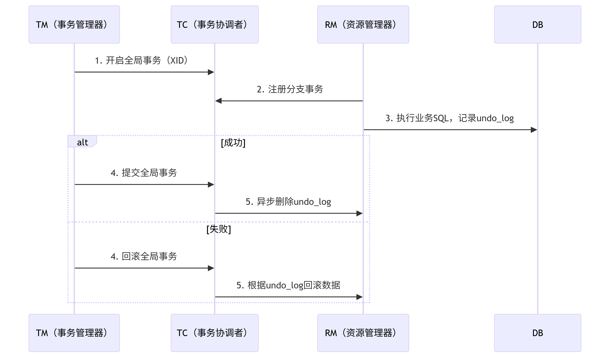


项目集成
- 添加依赖
```xml
<dependency>
    <groupId>com.alibaba.cloud</groupId>
    <artifactId>spring-cloud-starter-alibaba-seata</artifactId>
</dependency>
```

- 添加配置
```yaml
seata:
  service:
    vgroup-mapping.my_tx: seata-tc
    grouplist.seata-tc: 127.0.0.1:8091
  #    grouplist.seata-tc: 127.0.0.1:8091;127.0.0.1:8092;127.0.0.1:8093 # 集群模式的配置方式
  tx-service-group: my_tx
```

- 使用
Controller方法上添加@GlobalTransactional即可

### 服务管理方案

- Maven 打包(package)配置 pom.xml
```xml
 <build>
    <plugins>
      <plugin>
          <groupId>org.springframework.boot</groupId>
          <artifactId>spring-boot-maven-plugin</artifactId>
          <version>3.2.4</version>
          <configuration>
              <mainClass>com.txai.apidriver.ApiDriverApplication</mainClass>
          </configuration>
<!--                将依赖的module/library 也打进包-->
          <executions>
              <execution>
                  <goals>
                      <goal>repackage</goal>
                  </goals>
              </execution>
          </executions>
      </plugin>
    </plugins>
  </build>
```

- linux 命令行 文件上传
> rz

- mvn package

- linux服务器上启动jar - 后台运行 Java 应用
  - nohup java -jar xxx.jar &
  - tail -f nohup.out --- 查看启动日志
解释：

| 部分                 | 	作用                                |
|--------------------|------------------------------------|
| nohup	             | 忽略挂断信号（SIGHUP），防止终端关闭时进程被终止。       |
| java -jar xxx.jar  | 	启动 Java 应用，xxx.jar 是你的可执行 JAR 文件。 |
| &                  | 	将进程放入后台运行，释放当前终端。                 |


- 配置文件(application.yml)放到与jar相同目录下， 便优先加载该文件


### Nginx 反向代理设置
> vi xxx.txt --- 进入编辑模式
> :23,144d --- linux文件编辑器中删除多行(23-144行)


#### Nginx 集群实现高可用
Nginx + Keepalived 使用虚拟ip, 监控脚本 选择主nginx服务
主从/多主


#### nginx 自动监控
- 编写监控nginx的脚本
- keepalived定时执行监控脚本


#### Nacos 服务端配合防火墙 做限制规则

- 打开防护墙
> systemctl start firewalld
> systemctl status firewalld

- 查看防火墙策略
> firewall-cmd --list-all

- 添加白名单功能
> firewall-cmd --zone=public --- 也可以不指定 空间区域
> firewall-cmd [--zone=public] --add-rich-rule 'rule family="ipv4" source address="宿主机IP" accept' --permanent
> firewall-cmd --reload --- 真正持久化上面的白名单命令


#### Nacos 内网隔离(IP设置) --- 生产环境需要注意
- 服务端
- 客户端

Nacos客户端 即微服务提供者，配置如下(application.yml)
```yaml
spring:
  cloud:
    nacos:
      discovery:
        server-addr: 127.0.0.1:8848
        username: nacos
        password: nacos
        ip: [宿主机外网IP] --- 开发过程中一般 放在同一台设备上，无论哪个网卡的ip都能通讯， 但是生产环境就不一定了 所以
```
!!!Attention!!! 
ip配置，默认时循环查找宿主机网卡， 找到index最小的网卡的ip作为 注册到nacos注册中心的ip, **<font color=yellow>如果遍历到内网网卡作为ip使用，当服务调用者与服务提供者不在一个网段 则无法网络互通
此时需要手动设置ip为本机外网网卡ip</font>**
同时需要注意的时， 尽量时局域网ip互通，一般不放置外网ip, 主要出于完全考虑。 


#### Nacos 客户端获取服务实例信息
> DiscoveryClient.getServices() --- 可以获取所有服务的实例信息
> DiscoveryClient.getInstances(serviceName) --- 获取服务的实例对象 集合
> instance.getServiceId() --- 获取服务ID
> instance.getMetaData.get("name");  --- 获取Meta信息
> instance.getHost() --- 获取服务注册的IP
> instance.getPort() --- 服务监听的端口


#### Nacos数据库配置
单机 如果使用内置数据库(derby) 则不支持高并发/大规模， 只能单机部署， 只适合开发/测试

因此 生产环境 应使用mysql 存放数据


#### Nacos 集群部署
- 启动配置


- 客户端配置  即微服务提供者，配置如下(application.yml)
```yaml
spring:
  cloud:
    nacos:
      discovery:
        server-addr: 127.0.0.1:8858;127.0.0.1:8859;127.0.0.1:8860 #集群的三个服务端 也可以只写其中的一台
        username: nacos
        password: nacos
        ip: [宿主机外网IP] --- 开发过程中一般 放在同一台设备上，无论哪个网卡的ip都能通讯， 但是生产环境就不一定了 所以
```

- 结合Nginx 则配置如下
```yaml
spring:
  cloud:
    nacos:
      discovery:
        server-addr: 127.0.0.1:8088 #Nginx 地址
        username: nacos
        password: nacos
```


#### Nacos 多数据中心分发策略


### Nacos 配置中心


#### Nacos + SpringBoot3.2.4(3.x)
1. 添加依赖
```xml
<dependency>
    <groupId>com.alibaba.cloud</groupId>
    <artifactId>spring-cloud-starter-alibaba-nacos-config</artifactId>
    <version>2022.0.0.0</version>
</dependency>
<dependency>
    <groupId>org.springframework.cloud</groupId>
    <artifactId>spring-cloud-starter-bootstrap</artifactId>
</dependency>
<!-- 核心模块之一，主要用于 应用监控和管理 -->
<dependency>
    <groupId>org.springframework.boot</groupId>
    <artifactId>spring-boot-starter-actuator</artifactId>
</dependency>
```
解释说明：
- Nacos Config 配合 actuator 主要是为了实现 配置动态刷新（@RefreshScope 机制）
- **支持 @RefreshScope 注解，动态说新机制，底层依赖的是 actuator 的刷新机制**
- 如果没有 actuator，@RefreshScope 不会生效，配置变更后无法更新

2. 开放 refresh 端点（application.yml）
```yaml
management:
  endpoints:
    web:
      exposure:
        include: refresh,health,info  # 开放 refresh 端点
```

3. nacos-config 配置（bootstrap.yml）
```yaml
spring:
  cloud:
    nacos:
      config:
        server-addr: 127.0.0.1:8848
        username: nacos
        password: nacos
        group: DEFAULT_GROUP
        namespace: edb19551-4867-4896-b68e-bb2cffad85fc
        file-extension: yaml
        refresh-enabled: true
        shared-configs:
          - data-id: api-boss-dev.yaml
            group: DEFAULT_GROUP
            refresh: true
          - data-id: common-config.yaml
            group: DEFAULT_GROUP
            refresh: true
  config:
    import: optional:nacos
  profiles:
    active: dev
  application:
    name: api-boss
```
!!!Attention!!!
- **<font color=orange>需要注意的是，bootstrap.yml文件加载要比application.yml早，因此application.name一定要有，否则配置加载失败，其他必要属性类似</font>**

4. 使用示例
```java
@RestController
@RefreshScope
public class TestController {

    @Value("${testConfig}")
    private String testConfig;
    
    @GetMapping("/test")
    public String save() {
        return "test-" + testConfig + "-" + System.currentTimeMillis();
    }
}
```


#### Nacos 配置中心 加/解密

1. 添加配置
```xml
<dependency>
    <groupId>com.github.ulisesbocchio</groupId>
    <artifactId>jasypt-spring-boot-starter</artifactId>
    <version>3.0.5</version>
</dependency>
```

2. 加密/解密方法
```java
@Slf4j
public class EncryptDecryptUtil {

    public static SimpleStringPBEConfig getPBEConfig(String password) {
        SimpleStringPBEConfig config = new SimpleStringPBEConfig();
        config.setPassword(password);
        config.setAlgorithm(StandardPBEByteEncryptor.DEFAULT_ALGORITHM);
        config.setPoolSize(1);
        config.setSaltGeneratorClassName("org.jasypt.salt.RandomSaltGenerator");
        config.setStringOutputType("base64");
        return config;
    }

    public static String encrypt(String password, String value) {
        PooledPBEStringEncryptor encryptor = new PooledPBEStringEncryptor();
        encryptor.setConfig(getPBEConfig(password));
        String encrypt = encryptor.encrypt(value);
        return encrypt;
    }

    public static String decrypt(String password, String encrypt) {
        PooledPBEStringEncryptor encryptor = new PooledPBEStringEncryptor();
        encryptor.setConfig(getPBEConfig(password));
        String decrypt = encryptor.decrypt(encrypt);
        return decrypt;
    }

    public static void main(String[] args) {
        String name = "加密的明文";
        String sale = "mysalt1";
        String encrypt = encrypt(sale, name);
        log.info("Encrypted password: " + encrypt);
        String decrypt = decrypt(sale, encrypt);
        log.info("Decrypted password: " + decrypt);
    }
}
```

3. yaml 配置 （bootstrap.yml）
```yaml
jasypt:
  encryptor:
    password: mysalt1
    algorithm: PBEWithMD5AndDES
    iv-generator-classname: org.jasypt.iv.NoIvGenerator
```

4. application.yml 中密码使用配置
```yaml
spring:
  data:
    redis:
      host: ${db.redis.host}
      port: ${db.redis.port}
      password: ${db.redis.password}
```

5. 配置中心 密文配置
```yaml
db:
  redis:
    host: 127.0.0.1
    port: 5001
    username: redis
    password: ENC(QFpYGuA7PPX6iIEntP5qw7njp02RvS9Q)
```


### 限流生产实战

#### 限流中雪崩现象和超时配置实现方案
openfeign 超时配置
```yaml
spring:
  cloud:
    openfeign:
      client:
        config:
          default:
            connect-timeout: 1000
            read-timeout: 500
```

#### 舱壁模式&熔断降级&流量控制

- 舱壁模式的实现本质 是线程池的隔离， 固定 请求子服务 的线程数大小
- 熔断降级：固定时间内失败多少次 即判定服务不可用， 断路器
- 流量控制：超过一定流量的请求 则服务不可用

根据上面三个问题 解决方案： Sentinel [官网](https://sentinelguard.io/zh-cn/)

Sentinel 
- 控制台
- 核心库


#### Sentinel 集成

控制台启动方式
- jar包启动 下载jar包  启动jar
  > java  -Dserver.port=8091 -jar ./sentinel-dashboard-1.8.6.jar
  > java -Dserver.port=9091 -Dsentinel.dashboard.auth.username=root1 -Dsentinel.dashboard.auth.password=root1 -jar ./sentinel-dashboard-1.8.6.jar

  - 参数说明
    - server.port: 控制台端口
    - csp.sentinel.dashboard.server: 控制台地址
    - project.name: 应用名称
    - -Dsentinel.dashboard.auth.username 和 -Dsentinel.dashboard.auth.password: 设置登录用户名密码

- Docker 容器化启动

项目集成
1. 添加依赖 pom.xml
```xml
<!-- 第一种 建议 -->
<dependency>
  <groupId>com.alibaba.cloud</groupId>
  <artifactId>spring-cloud-starter-alibaba-sentinel</artifactId>
</dependency>
        <!-- 第2种  -->
<dependency>
    <groupId>com.alibaba.cloud</groupId>
    <artifactId>spring-cloud-alibaba-sentinel</artifactId>
    <version>2.2.0.RELEASE</version>
</dependency>

<!-- Actuator（用于查看Sentinel监控端点） -->
<dependency>
  <groupId>org.springframework.boot</groupId>
  <artifactId>spring-boot-starter-actuator</artifactId>
</dependency>
```

2. 添加配置 application.yml
```yaml
spring:
  cloud:
    sentinel:
      transport:
        dashboard: localhost:8070
      #        port: 8719
      eager: true
      web-context-unify: false 关闭URL收敛

# 暴露Actuator端点
management:
  endpoints:
    web:
      exposure:
        include: '*'
```
!!!Attention!!!
**<font color=yellow>web-context-unify: false # 关闭URL收敛 解决 地址多层级无法被监控的问题</font>**
关闭 URL 聚合，保持原始请求路径作为资源名


3. 测试
- Sentinel dashboard -> 簇点链路-> 添加流控规则
JMeter 压测 


4. Sentinel 级联配置
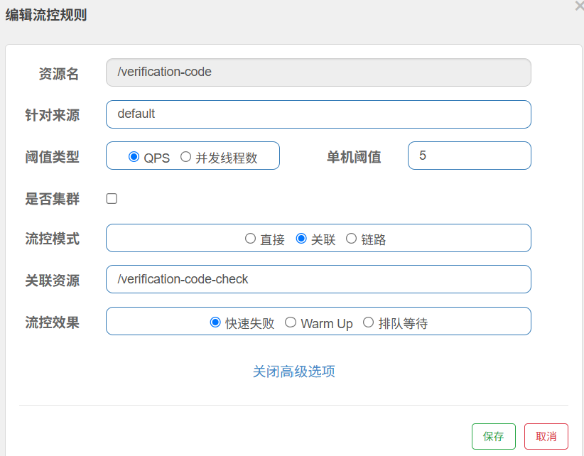
说明：当/verification-code-check接口QPS >= 5时，/verification-code接口快速失败


#### Sentinel 链路流控

Service层定义资源 @SentinelResource("资源名称（一般是方法名称）")


**<font color=yellow>如图，当资源getDriverCarBindingRelations QPS >= 2时， 最入口资源 失败处理</font>**


#### 流控效果
- 快速失败 --- http status = 429 
- Warm Up --- 解决系统冷启动时的流量冲击问题
- 排队等待 --- 超过QPS的请求 进入等待队列， 超过等待时间，则失败


#### 热点数据限流
参数值相等的 热点数据 的请求

1. 定义资源 @SentinelResource("自定义资源名称")
2. 设置 热点 流控规则
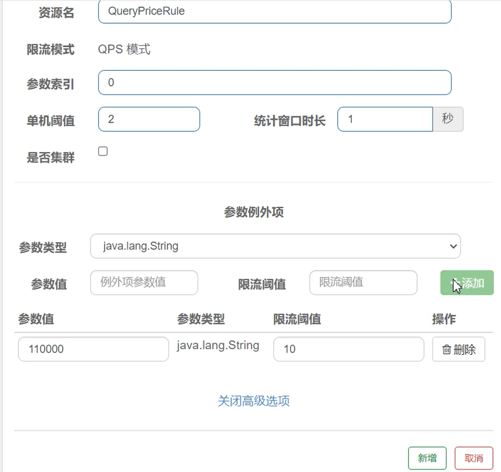
参数说明：
- 单机阈值 是这个接口的正常流控规则， 如图1s内2次请求
- 热点阈值 参数值110000 QPS阈值为10


#### 隔离&降级
目的：服务真实发生故障后的处理方式

隔离： A调用B, 当B故障， A分给B的线程数 耗尽后，即不在分配线程资源请求B服务
降级： A调用B, 当B故障率到一定时，A不在请求B资源

Sentinel dashboard 线程隔离配置
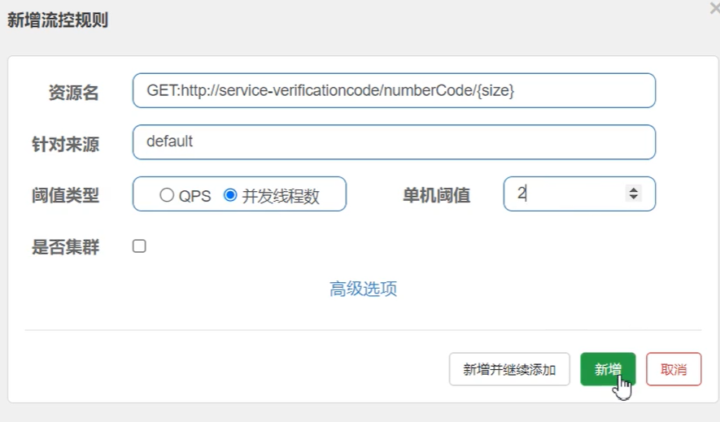
调用服务的线程数超过， 并发数阈值，则走服务降级逻辑


线程隔离
- 好处
  - 支持主动超时
  - 支持异步（独立的线程池）
- 坏处
  - 线程额外开销比较大

适合的场景： 低扇出， 即需要的线程池越少越好

服务降级
- 好处
  - 轻量级（单纯信号量 做处理，很方便）
- 坏处
  - 不支持主动超时，
  - 不支持异步执行

适合的场景：高扇出 （如网关）


#### 熔断&降级
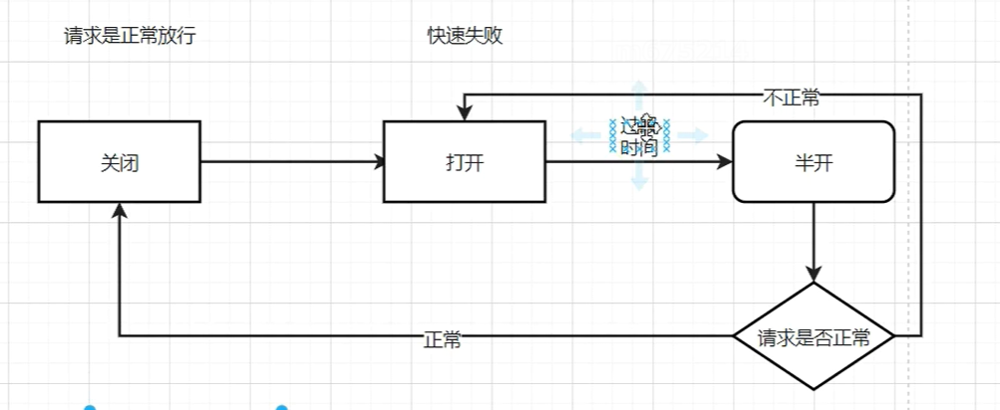


实例：
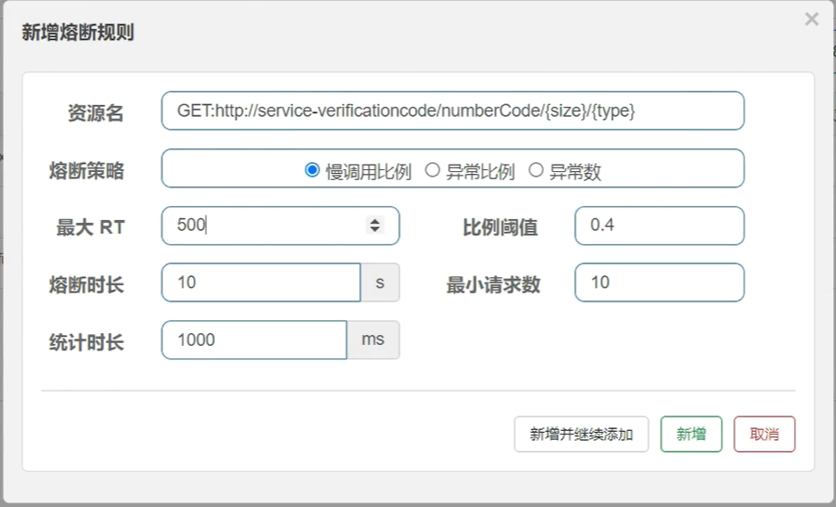
解释：
- 统计时长 1000ms内
- 最小请求数10个
- 其中慢调用比例为0.4，也就是10个请求中的4个 的响应时间 超过最大RT 500ms
- 则熔断10s


#### 规则持久化

1. 第一步 添加依赖
```xml
<!-- Sentinel + Nacos 持久化 -->
<dependency>
    <groupId>com.alibaba.csp</groupId>
    <artifactId>sentinel-datasource-nacos</artifactId>
</dependency>
```

2. 第二部 添加配置（application.yml）
```yaml
spring:
  cloud:
    sentinel:
      datasource:
        api-passenger-sentinel-flow-rule:
          nacos:
            server-addr: 127.0.0.1:8848
            username: nacos
            password: nacos
            data-id: api-passenger-sentinel-flow-rule
            group-id: sentinel_group
            data-type: json
            rule-type: flow
```
rule-type 取值范围

| rule-type 值	     | 对应规则类型   | 	说明              |
|:-----------------|:---------|:-----------------|
| flow	            | 流量控制规则   | FlowRule         |
| degrade	         | 熔断降级规则   | 	DegradeRule     |
| param-flow       | 	热点参数规则  | 	ParamFlowRule   |
| system	          | 系统保护规则	  | SystemRule       |
| authority	       | 授权规则	    | AuthorityRule    |
| gateway-flow	    | 网关流控规则   | 	GatewayFlowRule |
| api-definition	  | API定义分组  | 	ApiDefinition   |

3. Nacos 上添加配置文件
```json
[
    {
        "resource":"/verification-code-check",
        "limitApp":"default",
        "grade":1,
        "count":2,
        "strategy":0,
        "controlBehavior":0
    }
]
```
配置示例如图：
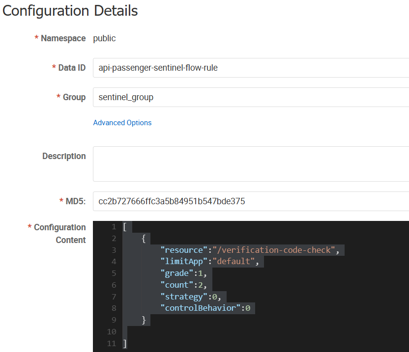


#### 流控规则持久化 核心参数说明

| 参数名	               |    类型	     | 说明                               |       	示例值	       | 必填 |
|--------------------|:----------:|:---------------------------------|:-----------------:|:--:|
| resource	          |   String   | 	受保护的资源名称                        |  	GET:/api/user	  | 是  |
| limitApp	          |  String	   | 调用来源（default表示不区分来源）	            |     default	      | 否  |
| grade	             |    int	    | 限流阈值类型（0-线程数，1-QPS）	             |         1         | 是  |
| count	             |  double	   | 限流阈值                             |       	100        | 	是 |
| strategy           |    	int    | 	调用关系限流策略（0-直接，1-关联，2-链路）	       |         0         | 否  |
| controlBehavior    |   	int	    | 流量控制效果（0-快速失败，1-Warm Up，2-排队等待）  |        	0         | 否  |
| warmUpPeriodSec    |   	int	    | 预热时间（秒，仅controlBehavior=1有效）	    |        10	        | 否  |
| maxQueueingTimeMs	 |    int	    | 最大排队时间（毫秒，仅controlBehavior=2有效）  |       	500        | 否  |
| clusterMode	       |  boolean	  | 是否集群限流	                          |      false	       | 否  |
| clusterConfig	     |   Object   | 	集群限流配置	                         |         -         | 	否 |


#### 熔断规则持久化 核心参数说明

| 参数名                 | 	类型      | 	说明                          |     	示例值      |
|:--------------------|:---------|:-----------------------------|:-------------:|
| resource	           | String	  | 受保护的资源名称	                    | GET:/api/user |
| grade	              | int      | 	熔断策略（0-慢调用比例，1-异常比例，2-异常数）	 |       1       |
| count	              | double   | 	触发熔断的阈值 	                   |   0.5（50%）    |
| timeWindow	         | int      | 	熔断时长（秒）	                    |      10       |
| minRequestAmount	   | int      | 最小请求数（触发熔断的统计最小请求数）          |      	5       |
| statIntervalMs	     | int      | 	统计时长（毫秒）	                   |     10000     |
| slowRatioThreshold  | 	double  | 	慢调用比例阈值（仅grade=0时有效）        |     	0.3      |


#### Sentinel 集群限流

集群流控架构
```text
[Client] -> [Token Server] <- [Sentinel Dashboard]
  |               ^
  |               |
  v               |
[Client]      [Client]
```

集群流控模式
1. 单机均摊模式
   每个节点独立计算自己的阈值（总QPS/节点数）
优点：无中心节点依赖
缺点：节点数变化时需动态调整

2. 全局阈值模式（推荐）
   所有节点共享同一个全局配额
优点：精确控制总流量
缺点：依赖Token Server


#### Sentinel集群限流 持久化
rule-type: cluster-flow

| 参数	                     | 说明               |
|-------------------------|------------------|
| flowId	                 | 集群规则唯一ID         |
| thresholdType           | 	0-全局阈值 / 1-单机均摊 |
| fallbackToLocalWhenFail | 	是否降级到本地流控       |
| sampleCount	            | 统计窗口数（默认1）       |
| windowIntervalMs	       | 统计窗口时间（默认1000ms） |


application.yml
```yaml
spring:
  cloud:
    sentinel:
      datasource:
        cluster-flow:
          nacos:
            server-addr: localhost:8848
            dataId: sentinel-cluster-flow-rules
            groupId: SENTINEL_GROUP
            rule-type: cluster-flow
```


### Gateway 网关

1. 添加依赖
```xml
<dependency>
    <groupId>com.alibaba.cloud</groupId>
    <artifactId>spring-cloud-starter-alibaba-nacos-discovery</artifactId>
</dependency>
<dependency>
    <groupId>org.springframework.cloud</groupId>
    <artifactId>spring-cloud-starter-gateway</artifactId>
</dependency>
<dependency>
    <groupId>org.springframework.cloud</groupId>
    <artifactId>spring-cloud-starter-loadbalancer</artifactId>
</dependency>
```

2. 添加映射配置
- 映射到单个服务
```yaml
spring:
  cloud:
    gateway:
      routes:
        - id: order
          uri: http://localhost:8029
          predicates:
            - Path= /order/**
```

- 利用loadbanlance
```yaml
spring:
  cloud:
    gateway:
      routes:
        - id: order
          uri: lb://service-order
          predicates:
            - Path= /service-order/**
          filters:
            - StripPrefix=1
            - AddRequestHeader=day, today
            - AddResponseHeader=who, me
```

#### Gateway 断言工厂

```yaml
spring:
  cloud:
    gateway:
      routes:
        - id: order
          uri: lb://service-order
          predicates:
            - Path=/xxx/**
            - After=
            - Before=
            - Between=time1,time2
            - Cookie=cname,cvalue
            - Header=hname,hvalue
            - Host=**.xxx.com
            - Method=GET,POST
            - Query=qname,qvalue
            - RemoteAddr=182.xx.xx.12/23
```

#### Gateway 自定义断言
predicates


#### Gateway - 过滤器


#### Gateway + Sentinel 实现统一流控规则入口
Gateway 本身也是一个服务，他是所有服务的入口，因此可以拦截都所有的请求
结合Sentinel 可以做统一流控熔断规则

#### Gateway + 断路器
断路器(Circuit Breaker)
- 自动熔断：当失败率达到阈值时自动打开电路，停止请求
- 半开状态：定期尝试放行部分请求检测服务是否恢复
- 自动恢复：服务恢复后自动关闭断路器
- 状态监控：提供 OPEN/HALF_OPEN/CLOSED 状态转换

1. 添加依赖
```xml
<dependency>
    <groupId>org.springframework.cloud</groupId>
    <artifactId>spring-cloud-starter-circuitbreaker-reactor-resilience4j</artifactId>
</dependency>
```

2. 编写断路器规则
```codes 
@Bean
public ReactiveResilience4JCircuitBreakerFactory reactiveResilience4JCircuitBreakerFactory(){

    CircuitBreakerConfig circuitBreakerConfig = CircuitBreakerConfig.custom()
            .slidingWindowType(CircuitBreakerConfig.SlidingWindowType.TIME_BASED)// 设置窗口类型为时间窗口
            .slidingWindowSize(2) // 窗口大小2s
            .minimumNumberOfCalls(5) // 最少的请求数 5次
            .failureRateThreshold(80) // 失败阈值 40%
            .enableAutomaticTransitionFromOpenToHalfOpen() // 运行开关自动从打开状态切换到半开状态
            .waitDurationInOpenState(Duration.ofSeconds(1)) // 断路器从打开状态到半开状态的时长是10s
            .permittedNumberOfCallsInHalfOpenState(5) // 在半开状态下，允许进行正常调用的次数
            .recordExceptions(Throwable.class)
            .build();

    ReactiveResilience4JCircuitBreakerFactory factory = new ReactiveResilience4JCircuitBreakerFactory(
            CircuitBreakerRegistry.of(circuitBreakerConfig),
            TimeLimiterRegistry.of(TimeLimiterConfig.custom().timeoutDuration(Duration.ofMillis(600)).build())
            );
    return factory;
} 
```

3. yaml文件指定断路器
```yaml
spring:
  cloud:
    gateway:
      routes:
        - id: api-boss
          uri: lb://api-boss
          predicates:
            - Path=/api-boss/**
          filters:
#            - StripPrefix=1
            # 使用断路器
            - name: CircuitBreaker
              args:
                name: myCircuitBreaker
```


#### 网关灰度发布
灰度发布(Gray Release),也称为渐进式发布或金丝雀发布（Canary Release）,是一种软件部署策略，旨在通过逐步将新版本软件引入生产环境来降低风险.
从老系统过渡到新系统的这个过程叫灰度发布.

- 核心思想是：
  - 不是一次性将所有用户流量切换到新版本
  - 而是先让小部分用户使用新版本
  - 逐步扩大范围，同时监控系统表现
  - 确认无问题后再全量发布

灰度发布的核心 是 通过网关 的断言工厂 使满足不同条件的用户 获取到不同的服务列表

区分方式
- 用户标签 （推荐/常用）
- 地域
- 流量


A/B测试


#### Https证书的生成和使用

1. 第一步: 生成证书：
> keytool -genkey -alias gateway -storetype PKCS12 -keyalg RSA -keysize 2048 -keystore gateway.p12 -validity 3650 -keypass 123123 -storepass 123123

keytool -genkey -alias localhost -storetype PKCS12 -keyalg RSA -keysize 2048 -sigalg SHA256withRSA -keystore gateway.p12 -validity 3650 -keypass 123123 -storepass 123123 -dname "CN=example.com, OU=IT, O=MyCompany, L=City, ST=State, C=US" -ext "SAN=DNS:example.com,DNS:localhost,IP:127.0.0.1"

2. 第二步: 配置
```yaml 
server:
  port: 10000
  ssl:
    enabled: true
    key-store: classpath:gateway.p12
    key-alias: gateway
    key-password: 123123
    key-store-type: PKCS12
```


#### 生产环境代码优化
- openfeign 的接口 迁移到 公共module中(common)

需要注意的是:
由于迁移导致的 NotFound, 因此需要添加feign接口的配置
@EnableFeignClients(basePackages={"current.application.package", "common.module.remote.package"})
public class ServiceXXXApplication{}


