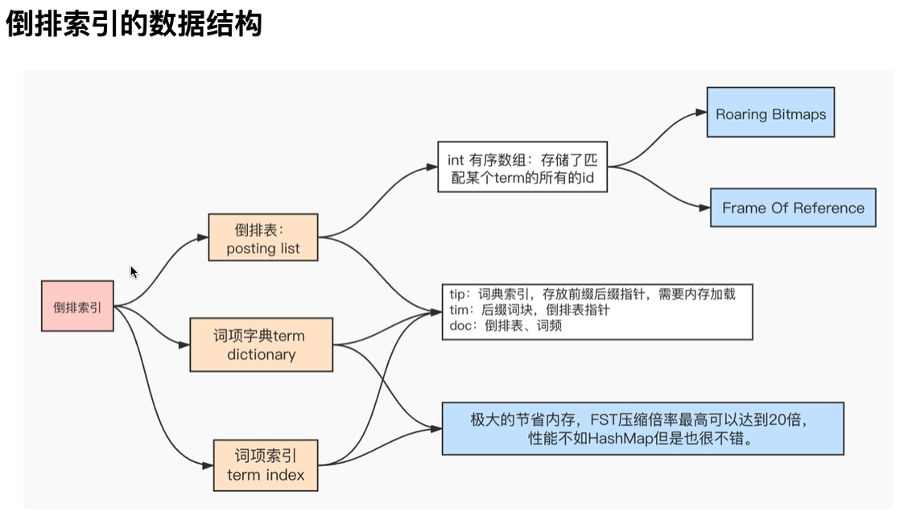
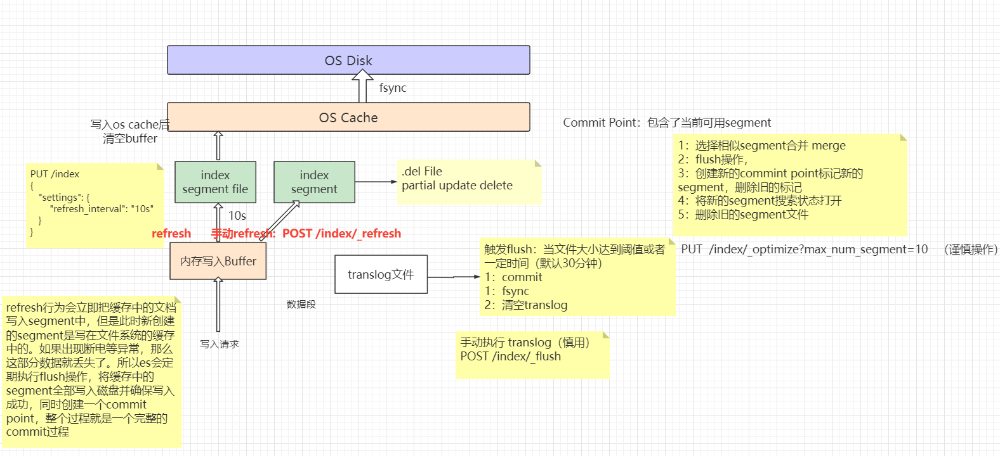

# Elastic Stack - 高手进阶

## 1. Elasticsearch分布式原理

#### 1.1 分布式的好处
- 高可用性：集群可容忍部分节点宕机而保持服务的可用性和数据的完整性
- 易扩展：当集群的性能不满足业务要求时，可以方便快速的扩容集群，而无需停止服务。
- 高性能：集群通过负载均衡器分摊并发请求压力，可以大大提高集群的吞吐能力和并发能力。


#### 1.2 核心配置

- cluster.name: 集群名称，**唯一确定一个集群**。
- node.name：节点名称，一个集群中的节点名称是**唯一固定**的，不同节点不能同名。
- node.master: 主节点属性值
- node.data: 数据节点属性值
- network.host： 本节点的绑定ip，及提供服务的ip地址， 对外提供服务的地址，以及集群内通信的ip地址
- http.port: 本节点的http端口 9200-9299， 
- transport.port：9300——集群之间通信的端口，若不指定默认：9300
- discovery.seed_hosts: 节点发现需要配置一些种子节点，与7.X之前老版本：disvoery.zen.ping.unicast.hosts类似，一般配置集群中的全部节点
- cluster.initial_master_nodes：指定集群初次选举中用到的**具有主节点资格的节点**，称为集群引导，只在第一次形成集群时需要。
- discovery.type: single-node 避免引导检查， 可以用于本地部署集群但各个节点 配置避免引导检查，用于学习阶段


**Notes: 单节点启动默认是 学习模式/开发模式, 会跳过引导检查**，

**集群启动时 默认都是生产模式， 生产模式则会触发启动检查(Bootstrap checks)**


#### 1.3 主从模式

Elasticsearch为什么使用主从模式（Leader/Follower）？Elasticsearch使用的主从架构模式，其实除此之外，还可以使用分布式哈希表（DHT），其区别在于：

-  主从模式适合节点数量不多，并且节点的状态改变（加入集群或者离开集群）不频繁的情况。
- 分布式哈希表支持每小时数千个节点的加入或离开，响应约为4-10跳。

ES的应用场景一般来说单个集群中一般不会有太多节点（一般来说不超过一千个），节点的数量远远小于单个节点（只的是主节点）所能维护的连接数。并且通常主节点不必经常处理节点的加入和离开，处于相对稳定的对等网络中，因此使用主从模式。


查看集群状态

localhost:9200/_cluster/state


#### 1.4 ES常见模块：Modules

- Cluster --- Master节点执行集群管理的封装实现
- Allocation --- 此模块由主节点调用
- Bootstrap --- 引导检查模块
- Ingest --- 预处理模块负责数据索引之前的一些预操作，比如数据类型处理、数据的结构转换等
- Monitor --- 监控, 集群的运行状态和性能
- Discovery --- 新加入/退出之后将状态信息修改
- Gateway --- 负责说对收到Master广播下来的集群状态数据的持久化存储，并在集群完全重启时恢复他们
- Indices --- 管理全局级索引配置
- HTTP --- 本质上是完全异步的
- Transport --- 传输模块用于集群内部节点通信。传输模块使用TCP协议


### 2. 分片 Shard

Shard 即数据分片，是ES的数据载体。在ES中数据分为primary shard（主分片）和replica shard（副本分片），每一个primary承载单个索引的一部分数据，分布于各个节点，replica为某个primary的副本，即备份。分片分配的原则是尽量均匀的分配在集群中的各个节点，以最大程度降低部分shard在出现意外时对整个集群乃至服务造成的影响。

#### 2.1 分片策略

分片产生的目的是为了实现分布式，而分布式的好处之一就是实现“高可用性”（还包括高性能如提高吞吐量等会再后面内容展开讲），分片的分配策略极大程度上都是围绕如何提高可用性而来的，如**分片分配感知**、**强制感知**等。

互联网开发没有“银弹”，分片的数量分配也没有适用于所有场景的最佳值，创建分片策略的最佳方法是使用您在生产中看到的相同查询和索引负载在生产硬件上对生产数据进行 基准测试。分片的分配策略主要从两个指标来衡量：即数量和单个分片的大小。

##### 2.1.1 分片分配策略

- ES使用数据分片（shard）来提高服务的可用性，将数据分散保存在不同的节点上以降低当单个节点发生故障时对数据完整性的影响，同时使用副本（repiica）来保证数据的完整性。关于分片的默认分配策略，在7.x之前，默认5个primary shard，每个primary shard默认分配一个replica，即5主1副，而7.x之后，默认1主1副
- ES在分配单个索引的分片时会将**每个分片尽可能分配到更多的节点上**。但是，实际情况取决于集群拥有的分片和索引的数量以及它们的大小，不一定总是能均匀地分布。
- Paimary只能在索引创建时配置数量，而replica可以在任何时间分配，并且primary支持读和写操作，而replica只支持客户端的读取操作，数据由es自动管理，从primary同步。
- **ES不允许Primary和它的Replica放在同一个节点中**，并且**同一个节点不接受完全相同的两个Replica**
- 同一个节点允许多个索引的分片同时存在。


##### 2.1.2 分片的数量

- **避免分片过多**：大多数搜索会命中多个分片。每个分片在单个 CPU 线程上运行搜索。虽然分片可以运行多个并发搜索，但跨大量分片的[搜索](https://www.elastic.co/guide/en/elasticsearch/reference/7.13/modules-threadpool.html)会耗尽节点的[搜索线程池](https://www.elastic.co/guide/en/elasticsearch/reference/7.13/modules-threadpool.html)。这会导致低吞吐量和缓慢的搜索速度。
- **分片越少越好**：每个分片都使用内存和 CPU 资源。在大多数情况下，一小组大分片比许多小分片使用更少的资源。

##### 2.1.3 分片的大小决策

- **分片的合理容量**：<font color=red>10GB-50GB</font>。虽然不是硬性限制，但 10GB 到 50GB 之间的分片往往效果很好。根据网络和用例，也许可以使用更大的分片。在索引的生命周期管理中，一般设置50GB为单个索引的最大阈值。
- **堆内存容量和分片数量的关联**：<font color=red>小于20分片/每GB堆内存</font>，一个节点可以容纳的分片数量与节点的堆内存成正比。例如，一个拥有 30GB 堆内存的节点最多应该有 600 个分片。如果节点超过每 GB 20 个分片，考虑添加另一个节点。

查询当前节点堆内存大小：

```json
GET _cat/nodes?v=true&h=heap.current
```

- 避免重负载节点：如果分配给特定节点的分片过多，会造成当前节点为**重负载节点**


#### 2.2 重要的配置


##### 2.2.1 自定义属性

```
node.attr.{attribute}
```

如何查看节点属性？

```json
GET _cat/nodeattrs?v
```


##### 2.2.2 索引级配置

- index.routing.allocation.include.{attribute}：表示索引可以分配在包含多个值中其中一个的节点上。
- index.routing.allocation.require.{attribute}：表示索引要分配在包含索引指定值的节点上（通常一般设置一个值）。
- index.routing.allocation.exclude.{attribute}：表示索引只能分配在不包含所有指定值的节点上。

```json
//索引创建之前执行
PUT <index_name>
{
  "settings": {
    "number_of_shards": 3,
    "number_of_replicas": 1,
    "index.routing.allocation.include._name": "node1"
  }
}
```


##### 2.2.3 集群级配置

elasticsearch修改集群范围设置提供两种方式，

- persistent：永久性修改，<font color=red>正式环境使用</font>persistent相关的修改保存在了 `/path.data/cluster.name/nodes/0/_state/global-n.st`，如果想删除设置，删除此文件即可。
- transient：集群重启后失效。<font color=red>开发/学习环境使用</font>

```
PUT _cluster/settings
{
  "persistent": {
    "cluster.routing.allocation.awareness.attributes": "rack_id"
  }
}
```


#### 2.3 索引分片分配：Index Shard Allocation


##### 2.3.1 分片均衡策略：shard rebalance

当集群在每个节点上具有相同数量的分片而没有集中在任何节点上时，集群是平衡的。Elasticsearch 运行一个称为**rebalancing** 的自动过程，它在集群中的节点之间移动分片以改善其平衡。重新平衡遵循所有其他分片分配规则，例如[分配过滤](https://www.elastic.co/guide/en/elasticsearch/reference/7.13/modules-cluster.html#cluster-shard-allocation-filtering)和[强制意识](https://www.elastic.co/guide/en/elasticsearch/reference/7.13/modules-cluster.html#forced-awareness)，这可能会阻止它完全平衡集群。在这种情况下，重新平衡会努力在您配置的规则内实现最平衡的集群。如果您使用[数据层](https://www.elastic.co/guide/en/elasticsearch/reference/7.13/data-tiers.html)然后 Elasticsearch 会自动应用分配过滤规则将每个分片放置在适当的层中。这些规则意味着平衡器在每一层内独立工作。

**cluster.routing.rebalance.enable**

([动态](https://www.elastic.co/guide/en/elasticsearch/reference/7.13/settings.html#dynamic-cluster-setting)) 为特定类型的分片启用或禁用重新平衡：

- **`all` -（默认）**允许对所有类型的分片进行分片平衡。
- `primaries` - 只允许主分片的分片平衡。
- `replicas` - 仅允许对副本分片进行分片平衡。
- `none` - 任何索引都不允许进行任何类型的分片平衡。

**cluster.routing.allocation.allow_rebalance**

([动态](https://www.elastic.co/guide/en/elasticsearch/reference/7.13/settings.html#dynamic-cluster-setting)) 指定何时允许分片重新平衡：

- `always` - 始终允许重新平衡。
- `indices_primaries_active` - 仅当集群中的所有主节点都已分配时。
- **`indices_all_active` -（默认）**仅当集群中的所有分片（主分片和副本）都被分配时。


**<font color=red>新节点加入 或者 节点离开（1min）集群，都会触发 shard rebalance 策略</font>**

GET _cluster/allocation/explain --- 查看分片重新分配情况


##### 2.3.2 延迟分配策略（默认1m）：

当节点出于任何原因（有意或无意）离开集群时，主节点会做出以下反应

- 将副本分片提升为主分片以替换节点上的任何主分片。
- 分配副本分片以替换丢失的副本（假设有足够的节点）。
- 在其余节点之间均匀地重新平衡分片。

这些操作旨在通过确保尽快完全复制每个分片来保护集群免受数据丢失。即使我们在[节点级别](https://www.elastic.co/guide/en/elasticsearch/reference/7.2/recovery.html)和[集群级别](https://www.elastic.co/guide/en/elasticsearch/reference/7.2/shards-allocation.html)限制并发恢复 ，这种“分片洗牌”仍然会给集群带来很多额外的负载，如果丢失的节点可能很快就会返回，这可能是不必要的


```json
# 索引船舰之前 执行，设置分片数
PUT test_filter
{
    "settings": {
        "number_of_shards": 1,
        "number_of_replicas": 0
    }
}

# 索引船舰之后 的修改
PUT test_filter/_settings
{
    "number_of_shards": 3, # 主分片3个
    "number_of_replicas": 2 # 每个分片有2个副本
}

```


##### 2.3.3 分片过滤：即（[Shard allocation filtering](https://www.elastic.co/guide/en/elasticsearch/reference/7.13/shard-allocation-filtering.html)），控制那个分片分配给哪个节点。

- index.routing.allocation.include.{attribute}：表示索引可以分配在包含多个值中其中一个的至少节点上。
- index.routing.allocation.require.{attribute}：表示索引要分配在包含索引指定值的节点上（通常一般设置一个值）。
- index.routing.allocation.exclude.{attribute}：表示索引只能分配在不包含所有指定值的节点上。


#### 2.4 分片分配感知：Shard Allocation Awareness

Shard Allocation Awareness的设计初衷是为了提高服务的可用性，通过自定义节点属性作为感知属性，让 Elasticsearch 在分配分片时将物理硬件配置考虑在内。如果 Elasticsearch 知道哪些节点位于同一物理服务器上、同一机架中或同一区域中，则它可以分离主副本分片，以最大程度地降低在发生故障时丢失数据的风险。


#### 2.4.1 启用分片感知策略

配置节点属性

```
node.attr.rack_id: rack1
```

通过以下设置告诉主节点在分配分片的时候需要考虑哪些属性。这些信息会保存在每个候选节点的集群状态信息中

```json
PUT _cluster/settings
{
  "persistent": {
    "cluster.routing.allocation.awareness.attributes": "rack_id"
  }
}
```


#### 2.5 强制感知策略：Forced awareness

默认情况下，如果一个区域发生故障，Elasticsearch 会将所有故障的副本分片分配给其他区域。但是剩余区域可能没有足够的性能冗余来承载这些分片。

为了防止在发生故障时单个位置过载，您可以设置为 `cluster.routing.allocation.awareness.force`不分配副本，直到另一个位置的节点可用。

##### 2.5.1 部署强制感知策略

设置强制感知策略，告诉主节点当前通过某个属性来划分区域，并且告知区域有哪些值

```
cluster.routing.allocation.awareness.attributes: zone
cluster.routing.allocation.awareness.force.zone.values: zone1,zone2
```


### 3. 高可用★★★

高可用性即：High Availability（HA），高可用性是分布式系统架构设计的重要因素之一，简单来说，可用性越高的集群在发生意外情况（如断电、节点宕机）的时候，服务发生故障而不可用的可能性越低，也就是降低了意外情况而对整体服务产生的影响的可能性。


#### 3.1 高可用性原理

- 通过“**分布式**”的概念实现多个节点的负载均衡，并且使服务具备可扩展能力。
- 通过针对**分片、节点的一列策略**降低单个故障点对整体服务产生的影响。
- 通过**容灾机制**，尽可能把故障点还原，以恢复服务的最大可用性。


#### 3.2. ES的容灾机制

**容错性**可以理解系统容忍的局部发生异常情况的比率和当异常发生时自行恢复的能力。在 `ES`中表现为对节点宕机的处理机制。

步骤：

1. **Master选举**：选出集群中的Leader。
2. Replica容错：新的 `Active Master`会将丢失的Primary的某个Replica提升为Primary。
3. 尝试恢复故障节点：Master尝试恢复故障节点。
4. 数据同步：Master将宕机期间丢失的数据同步到重启节点对应的分片上去，从而使服务恢复正常。


#### 3.3 Master节点和投票节点

##### 3.3.1 主节点职责

**<font color=red>负责轻量级集群范围的操作</font>**，比如：

- 创建或删除索引
- 规划和执行分片策略
- 发布、修改集群状态

选择的主节点拥有履行其职责所需的资源，这对于集群的健康非常重要。如果选择的主节点被其他任务重载，那么集群将无法正常运行。<font color=red>因此一般将active_master 配置为master角色，而不是master+data</font>，避免主机因其他任务而过载的最可靠方法是将所有符合主机条件的节点配置为 `dedicated master`(**<font color=red>专用主节点</font>**)

##### 3.3.2 如何设置 `dedicated master`

```yaml
node.roles: [ master ]
```


##### 3.3.3 投票节点

<font color=red>每个候选节点默认有**选举权**和**被选举权**，称之为投票节点</font>。投票节点可以参加Master竞选，同时也可以参加投票。

但是有一种投票节点比较特殊，其只具备选举权而不具备被选举权，也就是“仅投票”节点，仅投票节点只能在Master选举过程中参与投票，而不能参加竞选。仅投票在某些场景下发挥着极其重要的作用：

- 当现有票数不足以选出Master的时候，充当决胜票。
- 在小型集群中仅投票节点可同时作为数据节点避免资源浪费

##### 3.3.4 如何<font color=red>配置仅投票节点</font>

```yaml
node.roles: [ master, voting_only ]
```

eg: **示例如下， node3 是只具有投票权没有被选举权，因此当node1宕机后， node3 一定会被选择为主节点**

master_node_1 (active)	  master		

master_node_2			master

master_node_3			master + data + voting_only


#### 3.4 高可用性集群

高可用性的中心思想就是采取一切可能的策略，降低集群中任意一部分节点出现问题后导致服务整体不可用的概率。其包含数据的完整性，集群的存活概率以及选主等。


##### 3.4.1 小规模集群

- 单节点集群：

  一般用于**<font color=red>学习或者开发、测试环境</font>**，不推荐在生产环境中使用单节点集群。由于集群只有单个节点，为了适应这一点，ES默认会给集群分配所有角色。单节点角色不具备高可用性，并且无法分配副本分片。为了使集群保持健康，单节点模式下创建索引，需要使用[`index.number_of_replicas`](https://www.elastic.co/guide/en/elasticsearch/reference/7.13/index-modules.html#dynamic-index-settings)设置副本数量为0。

- 两节点集群：

  - 如果出于硬件成本考虑，集群中只允许有两个节点，那么一般来说最好把两个节点都设置成数据节点。您还应该通过设置索引确保每个分片都在两个节点上冗余存储。每个非可搜索快照索引上的 `Number_of_replicas`为1。这是默认行为，但可能会被[索引模板](https://www.elastic.co/guide/en/elasticsearch/reference/7.13/index-templates.html)覆盖。[Auto-expand replicas](https://www.elastic.co/guide/en/elasticsearch/reference/7.13/index-modules.html#dynamic-index-settings)也可以达到同样的效果，但是在这么小的集群中没有必要使用这个功能。
  - 推荐在两个节点之一设置 `node.master: false`明确告知其不具备候选节点资格。目的是为了确定哪个节点是主节点。集群可以容忍另一个不具备候选资格的节点的丢失。如果不做此设置，这时两个节点都会具有候选资格，但是其中一个节点如果宕机，由于选主需要票数过半（票数>N/2+1），也就是票数必须是两票才能选出active master，所以会导致无法选主。此时集群无法容忍任何一个节点宕机
  - 默认情况下，ES会为每个节点分配所有角色，如果手动分配角色，一般建议为每个节点分配所有角色，如果其中一个节点宕机，另一个节点可以取而代之。
  - 两个节点的集群，只允许其中一个固定的节点宕机，而不是任意一个节点。因为如果允许两个节点可以独立选举，那么如果集群由于网络或者其他原因导致节点连接断开，那么两个节点没办法确定另一个节点是否是宕机了，也就是会产生所谓的”脑裂“问题，而产生多主的情况。Elasticsearch 避免了这种情况并通过不选择任何一个节点作为主节点来保护数据，直到该节点可以确保它具有最新的集群状态并且集群中没有其他主节点。这可能导致集群在连接恢复之前没有主节点。

- **三节点集群 <HA的最低配置>**：

  - 三节点部署：如果整个集群中所有节点一共只有三个，建议把三个节点全部部署为数据节点和候选节点。虽然active master节点一般只负责轻量级任务不做数据节点。但是通常来说三节点集群一般不会承载很大的业务量，也就不必考虑那么多了。这也是处于成本考虑不得已而为之。三节点集群的容错能力是1，即允许一台节点故障。
  - **<font color=red>二加一部署：即两个候选节点，一个仅投票节点，若干数据节点</font>**。这种配置的最大好处就是在保证高可用的前提下性价比更高，适用于小规模集群。由于在避免脑裂的前提下，要选举出主节点的最小节点数量是3，也就是选主的必要条件是票数过半也就是2票。而候选节点一般是不负责其他的任务的，也就不会为其分配data角色，那么集群通常会出现三个节点不存放数据的局面。此时会产生造成资源浪费。因为 `active master`只存在一个，另外两个master作为候选节点，在及群众仅仅是充当了负载均衡器。为了避免这种资源浪费，通常的做法是把其中一个候选节点设置为仅投票节点，即 `node.roles: [ data, master, voting_only ]`，此时，当前节点在选举过程中，仅有选举权而没有被选举权，这样就可以同时给他分配数据节点的角色，因为其不会被选举为 `active master`。三节点集群中，三个节点必须都具有 `master`角色，并且仅投票节点最多只能有一个。仅投票节点由叫 `仲裁节点`起着 `决胜票`的作用。

- 多节点集群

  - 一旦集群增长到三个以上的节点，可以开始根据它们的职责对这些节点做**职责专一化**。主要根据需要配置尽可能多的[数据节点](https://www.elastic.co/guide/en/elasticsearch/reference/7.13/modules-node.html#data-node)、[预处理节点](https://www.elastic.co/guide/en/elasticsearch/reference/7.13/ingest.html)、[机器学习节点](https://www.elastic.co/guide/en/elasticsearch/reference/7.13/modules-node.html#ml-node)等来均衡工作负载。随着集群变大，一般建议给每个角色使用专用节点，以便为每个任务独立扩展资源。

    但是，**<font color=red>最好将集群中候选节点数量限制为三个</font>**。主节点不像其他节点类型那样扩展，因为集群总是只选择其中之一作为集群的主节点。如果有太多候选节点，那么主选举可能需要更长的时间才能完成。在较大的集群中，一般建议把候选节点设置为专用候选节点，即不分配其他角色，并避免向这些专用节点发送任何客户端请求。以免候选节点被不必要的额外工作所拖累导致集群服务不稳定。

    但是可以把候选节点之一配置为[仅投票节点](https://www.elastic.co/guide/en/elasticsearch/reference/7.13/modules-node.html#voting-only-node)以便它永远不会被选为主节点。例如，集群可能有两个专用的候选节点和一个既是数据节点又是仅投票的候选节点的第三个节点。这第三个仅投票节点将在Master选举中投出决胜票，但是自己永远不会被选举为active master。


##### 3.4.2 大规模集群

- 单集群
  - 避免跨数据中心：ES对网络和宽带要求较高，并且一般来说要尽量避免服务跨多个数据中心。因为一旦遇到分区恢复问题，它必须重新同步任何丢失的数据并重新平衡集群。如果一定要跨多个数据中心，建议在每个数据中心部署独立集群，然后配置[跨集群搜索](https://www.elastic.co/guide/en/elasticsearch/reference/7.13/modules-cross-cluster-search.html)或[跨集群复制](https://www.elastic.co/guide/en/elasticsearch/reference/7.13/xpack-ccr.html)。
  - 部署分片分配感知：为了降低当集群出现单个或区域节点（比如一个机架）宕机对整个服务造成的影响，一般策略是通过[分配感知来实现](https://www.elastic.co/guide/en/elasticsearch/reference/7.13/allocation-awareness.html)。
- 双区集群：
  - 如果集群部署在**两个区域**比如**两个机房**内，应该在每个区域中拥有不同数量的候选节点，这样在其中一个区域出现问题的时候，会增加另一个区域的存活概率。比如两个机房部署同一个集群，那么两个机房的候选节点避免相等，因为此时如果一个机房意外断电，两个机房的服务都会停止。配置单数投票节点可避免此问题。此时其中一个机房断电，服务可用的概率为50%。
  - 双区集群理论上能容忍一个区域的数据丢失，但不是任意一个区域，打个比方：服务部署在两个机房，机房A和机房B，要么是仅允许A机房出现故障而不允许B机房出现故障，也就是A机房断电服务可用，但是B机房断电服务中断；要么是仅允许B机房出现故障而不允许A机房出现故障，也就是B机房断电服务可用，但是A机房断电服务中断。从高可用的角度想，我们更希望任意一个机房断电，另一个机房的服务都不受影响，但是这是不可能的。因为没有断电的机房不知道出现故障的机房是断网了还是断电了，也就不知道应该是发起独立选举还是等待下去。如果两个机房都可以独立选主，那么就无法避免脑裂，可能会产生两个机房选出active master。解决办法是在两个区域中都配置一个仅投票节点并在独立的第三个区域添加一个额外的候选节点。这样两个区域其中之一断电，额外的投票节点就可以投出关键票。这个额外的节点也叫 `专用tiebreaker`节点，此节点可以用低配服务器。
- 多区集群
  - 如果集群中有三个区域，那么每个区域中应该有一个候选节点。如果集群包含三个以上的区域，那么应该选择其中的三个区域，并在这三个区域中的每一个区域中放置一个候选节点。这意味着即使其中一个区域发生故障，集群仍然可以选举主节点。
- 多集群
  - Elasticsearch是主从结构，主节点能管理的节点上线一般不超过一千个，如果继续增加节点，可能会导致active master不稳定，如果集群想突破集群规模带来的性能瓶颈，一般可配置多集群，利用跨集群搜索单个超大集群拆分成多个小集群（相对小，千节点级别）来完成对集群的性能扩展。


##### 3.4.3 总结

- 集群应该至少有两个区域包含数据节点。
- 除了主分片之外，每个 不是[可搜索快照索引的索引](https://www.elastic.co/guide/en/elasticsearch/reference/7.13/searchable-snapshots.html)都应该有每个主分片的至少一个副本。
- 分片分配感知配置为避免将分片的所有副本集中在单个区域内。
- 集群至少有三个候选节点。这些节点中至少有两个不是仅投票节点，均衡分配在至少三个区域中。
- 客户端被配置为将其请求发送到多个区域中的节点，或者被配置为使用负载平衡器来平衡一组适当的节点之间的请求。


### 4 Master选举 ★★★★

#### 4.1 设计思路

所有分布式系统都需要解决数据的一致性问题，处理这类问题一般采取两种策略：

- 避免数据不一致情况的发生
- 定义数据不一致后的处理策略

分布式一致性解读：

我们可以通过一个简单的例子解释：
假设我们有一个单节点系统，对于此示例，你可以认为我们的节点是一个只存储一个值的数据库服务器。我们还有一个客户端去向服务器发送存储的值，在单节点的时候，存的这个值很容易达成一致或者共识。但是，如果我们有多个节点，那么怎么达成共识呢？这就是分布式一致性的问题。


#### 4.2 选举算法

- Bully --- 基本选举算法
- Paxos --- 非常强大， 实现复杂， 但灵活性高
- Raft --- 


#### 4.3 几个重要概念

##### 4.3.1 候选节点与投票节点

- **候选节点：**具备 `master`角色的节点默认都有“被选举权”，即是一个候选节点。候选节点可以参与Master选举过程
- **投票节点：**每个候选节点默认都有投票权，即每个候选节点默认都是一个投票节点，但如果配置了“voting_only ”的候选节点将只有选举权而没有被选举权，即仅投票节点。


##### 4.3.2 有效选票与法定票数

- **有效选票**：包括非候选节点的所有节点都会参与选举并参与投票，但是只有投票节点的投票才是有效投票。
- **法定票数**：即当选Master所需的最小票数，可通过：discovery.zen.minimum_master_nodes配置，通常情况下法定票数为**<font color=red>投票数过半</font>**（不包含一半）。**<font color=red>为了避免平票而导致脑裂</font>**，一般候选节点数量一般设置为奇数，**即便是偶数，系统默认也会阉割掉其中一个节点的投票权**，以保证不出选平票或多主。


#### 4.4 选举过程


#### 4.5 脑裂问题：

- 何为脑裂：双主或多主
- 解决办法：discovery.zen.minimum_master_nodes=N/2+1，N为有效投票节点数。(7.x已被移除)
- 替代方案: 内置的 Raft 协议管理选举，此为自动管理, 初始master节点(仅仅首次启动需要)

```yml
cluster.initial_master_nodes: ["node-1", "node-2", "node-3"]
```


- 因此： **<font color=red>用户无需再关心 `minimum_master_nodes`，集群会自动管理选举！</font>**


## 5 深度分页


数据被分散保存在每个分片中的，如果要查询排序的第1000名， 则取要出去每个分片的前1000名 汇总排序后 再选择第1000名。

因此，如果查询的数据排序越靠后，就越容易导致OOM（Out Of Memory）情况的发生，频繁的深分页查询会导致频繁的FGC。


#### 5.2 滚动查询：Scroll Search

官方已不推荐，因为无法保存索引状态

```json
#清除单个 DELETE /_search/scroll { "scroll_id" : "DXF1ZXJ5QW5kRmV0Y2gBAAAAAAAAAD4WYm9laVYtZndUQlNsdDcwakFMNjU1QQ==" } #清除多个 DELETE /_search/scroll { "scroll_id" : [ "scroll_id1", "scroll_id2" ] } #清除所有 DELETE /_search/scroll/_all
```


#### 5.3 Search After

不支持向前搜索

每次只能向后搜索1页数据

适用于C端业务

使用方法，将上一次的sort返回结果， 放在下一次的请求中


##  6. 倒排索引


索引： 以数据结构为载体， 以文件的形式落地


Lucene 是一个成熟的全文检索库， 由java语言开发，具有高性能，可伸缩的特点。

每个运行的分片实际上 即使一个Lucene 实例。


#### 6.1 倒排索引压缩算法


##### 6.1.1 FOR - Frame Of Reference


##### 6.1.2 RBM - Roaring Bitmap

适合稀疏的数组， 数组个元素差值比较大， 分布稀疏。


##### 6.2 倒排索引数据结构




##### 6.2.1 Trie 前缀树


前缀个词组共享， 绿色节点表示一个词组的终止节点 。


##### 6.2.2 FST 模型的构建原理


### 7 高级检索

#### 7.1 多字段检索（multi_match）

多字段检索，是组合查询的另一种形态，考试的时候如果考察多字段检索，并不一定必须使用multi_match，使用bool query，只要结果正确亦可，除非题目中明确要求（目前没有强制要求过）

**语法：**

```json
GET <index>/_search
{
  "query": {
    "multi_match": {
      "query": "<query keyword>",
      "type": "<multi_match_type>",
      "fields": [
        "<field_a>",
        "<field_b>"
      ]
    }
  }
}
```


#### 7.2 Best_fields

侧重于“字段”维度，单个字段的得分权重大，对于同一个query，单个field匹配更多的term，则优先排序。

**注意，best_fields是multi_match中type的默认值**

```json
GET product/_search
{
  "query": {
    "multi_match" : {
      "query":      "super charge",
      "type":       "best_fields", // 默认
      "fields":     [ "name^2", "desc" ],
      "tie_breaker": 0.3
    }
  }
}
```


案例

针对于以下查询，包含两个查询条件：分别是条件1和条件2

```json
GET product/_search
{
  "query": {
    "dis_max": {
      "queries": [
        { "match": { "name": "chiji shouji" }},   #条件1
        { "match": { "desc": "chiji shouji" }}		#条件2
      ]
    }
  }
}
```


### tie_breaker参数

在best_fields策略中给其他剩余字段设置的权重值，取值范围 [0,1]，其中 0 代表使用 dis_max 最佳匹配语句的普通逻辑，1表示所有匹配语句同等重要

**用法：**

```json
GET product/_search
{
  "query": {
    "dis_max": {
      "queries": [
        { "match": { "name": "super charge" }},
        { "match": { "desc": "super charge" }}
      ],
      "tie_breaker": 0.3 # 代表次要评分字段的权重是 0.3
    }
  }
}
```


**以下两个查询等价**

查询1

```
GET product/_search
{
  "query": {
    "dis_max": {
      "queries": [
        {
          "match": {
            "name": {
              "query": "chiji shouji",
              "boost": 2	# name字段评分两倍权重
            }
          }
        },
        {
          "match": {
            "desc": "chiji shouji"
          }
        }
      ],
      "tie_breaker": 0.3
    }
  }
}
```

查询2

```json
GET product/_search
{
  "query": {
    "multi_match" : {
      "query":      "super charge",
      "type":       "best_fields", // 默认
      "fields":     [ "name^2", "desc" ], # name字段评分两倍权重
      "tie_breaker": 0.3
    }
  }
}
```


#### 7.3 most_fields

侧重于“查询”维度，单个查询条件的得分权重大，如果一次请求中，对于同一个doc，匹配到某个term的field越多，则越优先排序


**以下两个查询脚本等价**

查询1：

```
# 下面查询中包含两个查询条件
GET product/_search
{
  "query": {
    "bool": {
      "should": [
        {
          "match": {
            "name": "chiji shouji"
          }
        },
        {
          "match": {
            "desc": "chiji shouji"
          }
        }
      ]
    }
  }
}
```

查询2

```json
GET product/_search
{
  "query": {
    "multi_match": {
      "query": "chiji shouji",
      "type": "most_fields",
      "fields": [
        "name",
        "desc"
      ]
    }
  }
}
```


#### 7.4 cross_fields

**<font color=red>评分：反词频规则中， 词频越高，评分越低</font>**

因此 如果将最佳匹配的评分作为查询的评分结果返回，则使用 cross_fields查询

以下查询语义：

- 吴 必须包含在 name.姓 或者 name.名 里
- 磊 必须包含在 name.姓 或者 name.名 里

```json
GET teacher/_search
{
  "query": {
    "multi_match" : {
      "query":      "吴磊",
      "type":       "cross_fields",
      "fields":     [ "name.姓", "name.名" ],
      "operator":   "or" # 匹配任意一个字段，
    }
  }
}
```


**评分基本规则：**

- **词频**（TF term frequency ）：关键词在每个doc中出现的次数，**词频越高，评分越高**
- **反词频**（ IDF inverse doc frequency）：关键词在整个索引中出现的次数，**反词频越高，评分越低**, **<font color =red>频率越低（越稀有），得分越高</font>**
- 每个doc的长度，**越长相关度评分越低**


##### 7.5 通过 `explain` API 查看详细的评分计算过程

```json
GET /your_index/_search
{
  "explain": true,
  "query": {
    "match": {
      "content": "your search terms"
    }
  }
}
```


 ## 8. 搜索模板


```json

# 创建搜索模板 
PUT _scripts/my-search-template 
{
    "script": {
        "lang": "mustache",
        "source": {
            "query": {
                "match": {
                    "message": "{{query_string}}"
                }
            },
            "from": "{{from}}",
            "size": "{{size}}"
        },
        "params": {
            "query_string": "nfc phone"
        }
    }
}

# 查看 模板
GET _script/my-search-template 
# 查看所有模板
GET _cluster/state?pretty # templates or stored_scripts 标签内都是 模板信息
# 删除模板
DELETE _scripts/my-search-template 
# 验证使用模板 
POST _render/template
{
    "id": "my-search-template",
    "params": {
        "query_string": "nfc phone",
        "from": 20,
        "size": 10
    }
}

# 使用搜索模板 
GET product/_search/template
{
    "id": "my-search-template",
    "params": {
        "query_string": "nfc phone",
        "from": 0,
        "size": 10
    }
}


#设置默认值 PUT _scripts/default-template
{
    "script": {
        "lang": "mustache",
        "source": {
            "query": {
                "range": {
                    "createtime": {
                        "gte": "{{startdate}}",
                        "lte": "{{enddate}}{{^enddate}}now/d{{/enddate}}"
                    }
                }
            }
        }
    }
}

GET product/_search/template
{
    "id": "default-template",
    "params": {
        "startdate": "2020-05-01"
    }
}
```


### 9. Term Vector

Term Vector（词项向量）是Elasticsearch和Lucene中的一项重要功能，它提供了关于文档中词项的详细信息。

Term Vector 存储了文档中每个词项的元数据信息，包括：

- 词项本身
- 词频（term frequency）
- 位置信息（position）
- 偏移量（character offsets）
- 词项权重（payloads）


```json
# 查看词项向量信息， 指定document, 指定字段field
GET term_vector_index/_termvectors/1 
{
    "fields": [
        "text"
    ],
    "offsets": true,
    "payloads": true,
    "positions": true,
    "term_statistics": true,
    "field_statistics": true
}
```


**向量信息解释**

- doc_freq --- 该分词 再该文档document中出现的次数（包含了被标记删除的数据）

- ttf --- 该分词在该index中出现的次数

- term_freq --- 该分词 在该字段field中出现的 次数

- tokens --- 该分词 具体出现的信息，位置信息
  - position --- 索引位置(分词为单位)
  - start_offset --- 起始字符下标位置
  - end_offset --- 结束字符下标位置


### 10. 高亮查询

```json
#基础用法
GET hightlight_index/_search 
{
    "query": {
        "match": {
            "title": "宝强"
        }
    },
    "highlight": {
        "fragment_size": 100, # 指定分段的字符长度 也可以不指定
        "number_of_fragments": 6, # 指定fragment分段最大数 也可以不指定 默认5
        "fields": {
            "title": {
				"type": "fvh" # 指定荧光笔， 也可以不指定
                "pre_tags":["<b>"], # 指定高亮的开始标签 也可以不指定
            	"post_tags":["</b>"] # 指定高亮的结束标签 也可以不指定
            },
            "content": {

            }
        }
    }
}

# 多字段高亮 即 多字段查询
GET hightlight_index/_search 
{
    "query": {
        "bool": {
            "should": [
                {
                    "match": {
                        "title": "宝强"
                    }
                },
                {
                    "match": {
                        "content": "宝强"
                    }
                }
            ]
        }
    }
}
# 多字段高亮 即 多字段查询  (搜索的推荐写法)
GET hightlight_index/_search
{
    "query": {
        "multi_match": {
            "query": "宝强",
            "type": "most_fields",
            "fields": [
                "title",
                "content"
            ]
        }
    }
}
```


三种高亮选择器(荧光笔)

- unified highlighter --- 默认选择器

- Plain highlighter --- 性能高，消耗少量内存

- Fast vector highlighter  --- 适合大字段，复杂的查询情况


### 10.地理位置搜索

#### 10.1 两种数据类型

- geo_point
- geo_shape


**geo_point**

**概念**：经纬度坐标，**<font color=red>只支持WGS84坐标系</font>**，坐标范围Lat值为[-90,90]，Lon为[-180,180]

- latitude：维度 缩写：lat
- longitude：经度 缩写：lon
- ignore_malformed：则忽略格式错误的地理位置。如果 `false`（默认）


**geo_shape**

**概念**：ES的特殊类型之一，用来描述复杂的几何图形的类型，比如点、线、面，多边形等二维几何模型。

- GeoJSON：GeoJSON是一种用于编码各种地理数据结构的格式，支持以下几种几何类型：
  - Point：点
  - LineString：线段
  - Polygon：多边形
  - MultiPoint：多点
  - MultiLineString：多线段
  - MultiPolygon：多边形集合
  - Feature：具有其他属性的对象
- WKT（Well-Known Text）：POINT(125.6 10.1)


```json
# 显式声明 geo_point类型映射
PUT geo_point 
{
    "mappings": {
        "properties": {
            "location": {
                "type": "geo_point"
            }
        }
    }
}


## 位置信息的五种存储方式 
## 第一种 
PUT geo_point/_doc/1 
{
    "name": "天安门",
    "location": {
        "lat": 40.12,
        "lon": -71.34
    }
}


## 第二种 lat lon 
PUT geo_point/_doc/2 
{
    "name": "前门",
    "location": "40.12,-71.34"
}

## 第三种 lon lat 
PUT geo_point/_doc/3 
{
    "name": "后门",
    "location": [
        -71.34,
        40.12
    ]
}

## 第四种 WKT PUT geo_point/_doc/4 
{
    "name": "西直门",
    "location": "POINT (-70 40.12)"
}


GET geo_point/_mapping 
GET geo_point/_search

## 第五种 
#Geo哈希 https://www.cnblogs.com/LBSer/p/3310455.html


## 矩形检索
GET geo_point/_search
{
    "query": {
        "geo_bounding_box": {
            "location": {
                "top_left": {
                    "lat": 50.73,
                    "lon": -74.1
                },
                "bottom_right": {
                    "lat": 30.01,
                    "lon": -61.12
                }
            }
        }
    }
}


```


#### 10.2 半径查询（geo_distance）

**概念**：以某个点为圆心查找指定半径的圆内的坐标。

distance：距离单位，默认是米，支持以下选项

- Mile（英里）：mi 或者 miles
- Yard（码）：yd 或者 yards
- Feet（英尺）：ft 或者 feet
- Inch（英寸）：`in` 或者 inch
- Kilometer（公里）：`km` 或者 kilometers
- Meter（米）：m 或者 meters
- Centimeter（厘米）：`cm` 或者 centimeters
- Millimeter（毫米）： mm 或者 millimeters
- Nautical mile（海里）： NM , nmi , 或者 nauticalmiles

distance_type：计算距离的方式

arc（默认值）：更准确，但是速度慢

plane：（更快，但在长距离和极点附近不准确）

```json
## 半径查找（圆形查找） 
GET geo_point/_search
{
    "query": {
        "geo_distance": {
            "distance": "50km",
            "location": {
                "lat": 40,
                "lon": -71
            }
        }
    }
}

```


#### 10.3 多边形查找

```json
## 多边形查找 
GET geo_point/_search
{
    "query": {
        "geo_polygon": {
            "location": {
                "points": [
                    {
                        "lat": 40,
                        "lon": -70
                    },
                    {
                        "lat": 40,
                        "lon": -80
                    },
                    {
                        "lat": 50,
                        "lon": -90
                    }
                ]
            }
        }
    }
}

#评分和排序 
GET geo_point/_search
{
    "query": {
        "geo_distance": {
            "distance": "87km",
            "location": {
                "lat": 40,
                "lon": -71
            }
        }
    },
    "sort": [
        {
            "_geo_distance": {
                "location": {
                    "lat": 40,
                    "lon": -71
                },
                "order": "asc"
            }
        }
    ]
}
```


#### 10.3 特殊几何图形 geo_shape

```json
## 显式声明映射关系
PUT geo_shape
{
    "mappings": {
        "properties": {
            "location": {
                "type": "geo_shape"
            }
        }
    }
}


## 存储“点” 
POST /geo_shape/_doc/1
{
    "name": "中国 香海",
    "location": {
        "type": "point",
        "coordinates": [
            13.400544,
            52.530286
        ]
    }
}

## 存储线段 
POST /geo_shape/_doc/2
{
    "name": "湘江路",
    "location": {
        "type": "linestring",
        "coordinates": [
            [
                13.400544,
                52.530286
            ],
            [
                -77.400544,
                38.530286
            ]
        ]
    }
}


## 存储多边形 多个多边形
POST /geo_shape/_doc/3

{
    "name": "湘江路",
    "location": {
        "type": "multipolygon",
        "coordinates": [
            [
                [
                    [
                        100,
                        0
                    ],
                    。。。
                ],
                [ 第其他的u都变形 必须在第一个多边形的范围内]
            ],
            [
                ...
            ]
        ]
    }
}
    
# 圆形  
PUT _ingest/pipeline/polygonize_circles    
{
    "description": "圆形转换成多边形",
    "processors": [
        {
            "circle": {
                "field": "location",
                "error_distance": 0,
                "shape_type": "geo_shape"
            }
        }
    ]
}

POST /geo_shape/_doc/4?pipeline=polygonize_circles
{
    "name": "安全区",
    "location": {
        "type": "circle",
        "coordinates": [
            30,
            10
        ],
        "radius": "100m"
    }
}


```


#### 10.4 地理几何检索

- Inline Shape Definition：内联形状
- Pre-Indexed Shape：预定义形状
  - `id`- 包含预索引形状的文档ID。
  - `index`- 索引的名称，其中预索引形状为：默认形状。
  - routing- 非必须。
  - `path`- 包含预索引形状的指定路径，默认形状。
- Spatial Relations：空间关系
  - INTERSECTS- (default) Return all documents whose `shape` field intersects the query geometry。相交即可，
  - DISJOINT - Return all documents whose `shape` field has nothing in common with the query geometry
  - WITHIN - Return all documents whose `shape` field is within the query geometry。包含关系 - 搜child，重叠也不可以。
  - CONTAINS- Return all documents whose `shape` field contains the query geometry。包含关系 - 搜parent


**<font color=red>相比多边形(polygon)，envelope 计算更简单，性能更好</font>**

```json
# 显示定义映射关系
PUT geo_shape_relation_test
{
    "mappings": {
        "properties": {
            "location": {
                "type": "geo_shape"
            }
        }
    }
}

#存矩形 
POST /geo_shape_relation_test/_doc/A
{
    "location": {
        "type": "envelope",
        "coordinates": [
            [
                1,
                9
            ],
            [
                10,
                1
            ]
        ]
    }
}

# geo_shape的检索方式 内联查询 补充geo_shape envelope 矩形 
GET geo_shape/_search
{
    "query": {
        "geo_shape": {
            "location": {
                "shape": {
                    "type": "envelope",
                    "coordinates": [
                        [
                            13,
                            53
                        ],
                        [
                            14,
                            52
                        ]
                    ]
                },
                "relation": "within"
            }
        }
    }
}

# geo_shape的查询去检索geo_point存储的坐标 
GET geo_shape/_search
{
    "query": {
        "geo_shape": {
            "location": {
                "shape": {
                    "type": "envelope",
                    "coordinates": [
                        [
                            -100,
                            50
                        ],
                        [
                            0,
                            0
                        ]
                    ]
                },
                "relation": "within"
            }
        }
    }
}


```


## 11. 高级聚合


### 11.1 正排索引

**正排索引（doc values ）和倒排索引**

**概念**：从广义来说，doc values 本质上是一个序列化的 列式存储 。列式存储 适用于聚合、排序、脚本等操作，所有的数字、地理坐标、日期、IP 和不分词（ not_analyzed ）字符类型都会默认开启，**不支持 `text`和 `annotated_text`类型**

**区别：**

- 倒排：倒排索引的优势是可以快速查找包含某个词项的文档有哪些。如果用倒排来确定哪些文档中是否包含某个词项就很鸡肋。
- 正排：正排索引的优势在于可以快速的查找某个文档里包含哪些词项。同理，正排不适用于查找包含某个词项的文档有哪些。

倒排索引和正排索引均是在index-time时创建，保存在 Lucene文件中（序列化到磁盘）。


### 11.2 正排索引的数据结构

- doc values --- 正排索引的基本数据结构之一，其存在是为了提升排序和聚合效率，默认true
- fielddata --- **查询时内存**数据结构，在首次用当前字段聚合、排序或者在脚本中使用时


**语法：**

```json
PUT /<index>/_mapping
{
  "properties": {
    "tags": {
      "type": "text",
      "fielddata": true  //true：开启fielddata;		false：关闭fielddata
    }
  }
}
```


深层解读（独家）：doc values是文档到词项的映射 inverted是词项到文档id的映射从原理上讲 先说倒排索引为什么不适合聚合，你无法通过倒排索引确定doc的总数量，并且因为倒排索引默认会执行analysis，即使聚合，结果也可能不准确，所以你还要创建not_analyzed字段，徒增磁盘占用，举个最简单的例子：假如有一张商品表，每个商品都有若干标签，我们执行了以下查询


### 11.3 Cardinality精度内存换算


#### 11.3.1 precision_threshold参数

ES在执行Cardinality聚合的时候，通过 `precision_threshold`参数以内存换精度，默认3000，最大值40000，设置再大的值，实际也最高只能是4W，当小于precision_threshold设置的时候，精度接近100%，当大于此设置的时候，即使数据量有几百万，误差也只是1-6％。

注意：`precision_threshold`设置较高阈值对 `低基数`聚合时有显著效果，而对高基数聚合是并无显著效果，反而会占用大量的资源，适得其反。


#### 11.3.2 内存精度换算单位

内存消耗 <=> precision_threshold * 8 个Byte，比如 precision_threshold = 1000，内存消耗约 8KB。


#### 11.4 HyperLogLog++介绍

HyperLogLog++（HLL）算法是依赖于field value计算hash，在做cardinality运算的时候，ES会动态为每一个field value计算hash用于提升聚合性能。


##### 11.4.1 低基聚合的优化方案：maper-murmur3

提升低基聚合的查询性能，副作用是消耗较大磁盘空间。

maper-murmur3提升低基聚合的原理就是通过**<font color=red>预先为字段值计算hash</font>，在做cardinality计算的时候，使用提前准备好的hash值参与计算，避免了动态运算从而节省性能**，建议在字段基数较大并且可能会有大量重复值得时候使用，这样可能会产生显著的性能提升，不然可能不但不会带来显著的性能提升，而且会徒增磁盘消耗，得不偿失。


- 高基数 --- 重复概率小， 如手机号码
- 低基数 --- 重复概率大， 如 性别


**安装**

bin/elasticsearch-plugin install mapper-murmur3

**使用**

```json
PUT <index>
{
  "mappings": {
    "properties": {
      "type": {
        "type": "keyword",
        "doc_values": true,
        "fields": {
          "hash": {
            "type": "murmur3"
          }
        }
      }
    }
  }
}
POST /index/_search?size=0
{
  "aggs": {
    "type_count": {
      "cardinality": {
        "field": "type.hash"
      }
    }
  }
}
```


## 12. 深度优先（DFS）和广度优先（BFS）


### 12.1 概念和基本原理

**背景**：Terms 桶基于我们的数据动态构建桶；它并不知道到底生成了多少桶。 大多数时候对单个字段的聚合查询还是非常快的， 但是当需要同时聚合多个字段时，就可能会产生大量的分组，最终结果就是占用 es 大量内存，从而导致 OOM 的情况发生。

在Elasticsearch中，对于具有许多唯一术语和少量所需结果的字段，延迟子聚合的计算直到顶部父级聚合被修剪会更有效。通常，聚合树的所有分支都在一次深度优先传递中展开，然后才会发生任何修剪。在某些情况下，这可能非常浪费，并且可能会遇到内存限制。

基本原理即：推迟子聚合的计算概念和基本原理

**背景**：Terms 桶基于我们的数据动态构建桶；它并不知道到底生成了多少桶。 大多数时候对单个字段的聚合查询还是非常快的， 但是当需要同时聚合多个字段时，就可能会产生大量的分组，最终结果就是占用 es 大量内存，从而导致 OOM 的情况发生。

在Elasticsearch中，对于具有许多唯一术语和少量所需结果的字段，延迟子聚合的计算直到顶部父级聚合被修剪会更有效。通常，聚合树的所有分支都在一次深度优先传递中展开，然后才会发生任何修剪。在某些情况下，这可能非常浪费，并且可能会遇到内存限制。

基本原理即：推迟子聚合的计算


**用法：Collect mode**

```
"collect_mode": "{collect_mode.value}"
```

**参数**

- breadth_first：广度优先模式属于最上层桶的一组文档被缓存以备后续重播，因此执行此操作时内存开销与匹配文档的数量成线性关系。即：先做第一层聚合，逐层修剪。
- depth_first：即：先构建完整的树，然后修剪无用节点。


## 13. 相关度评分算法

- **TF-IDF**(Term Frequency-Inverse Document Frequency) **5.x之前的默认算法**
  - 词频(TF)：词项在文档中出现的频率
  - 逆文档频率(IDF)：词项在整个索引中的稀有程度
  - 字段长度归一化：短字段权重更高
- **BM25** (Okapi Best Match 25) **<font color=red>5.0+的ES和Lucene默认算法</font>**
  - 更好的处理词频饱和问题（**高频词不会无限增加得分**）
  - 更精细的字段长度归一化控制
  - 对短字段的优化更好
- DFR(Divergence from Randomness) 基于概率模型 适合专业文献搜索场景
-  DFI(Divergence from Independence) 改进的统计概率模型 适合短文本搜索
- IB(Information Based) 基于信息量的模型 使用词项分布的信息量计算得分

### 13.1 相关度

**概念**

相关性指的是召回结果和用户搜索关键词的匹配程度，也就是和用户搜索的预期值的匹配程度

**搜索和检索**

搜索和检索的区别在于查询条件边界的界定上面。

- **搜索**：<font color=red>有明确的搜索边界条件</font>，结果数量是确定的。如 eq、lte、gte 均属于搜索行为

- **检索**：讲究相关度、**没有明确的查询条件边界**。比如搜索召回的结果有可能是因为拼音、谐音、热梗、别名、同义词等等而被匹配，但不同原因匹配到的结果权重不同。


### 13.2 相关度评分

相关度评分用于对搜索结果排序，评分越高则认为其结果和搜索的预期值相关度越高，即越符合搜索预期值。在7.x之前相关度评分默认使用**TF/IDF**算法计算而来，7.x之后默认为**BM25**。

默认情况下，Elasticsearch 按相关性分数对匹配的搜索结果进行排序，**相关性分数**衡量每个文档与查询的匹配程度。

相关性分数是一个正浮点数， 在响应上下文对象中 `_score`元数据字段中返回。分数越高 ，文档越相关。虽然每种查询类型可以不同地计算相关性分数，但分数计算还取决于查询子句是在**查询**还是**过滤**上下文中运行。


### 13.3 基本排序规则

如果没有指定排序字段，则<font color=red>默认按照评分高低排序</font>，相关度评分为搜索结果的排序依据，默认情况下评分越高，则结果越靠前。

如果指定排序字段， 则没有相关度评分， 即相关度评分都是null


### 13.4 基本评分规则

以下是 Lucene 中定义的 `TermFreq`（词频）和 `Inverse Doc Frequency`（文档频率）的源代码

```java
package org.apache.lucene.codecs;


import org.apache.lucene.index.TermsEnum; // javadocs

/**
 * Holder for per-term statistics.
 * 
 * @see TermsEnum#docFreq
 * @see TermsEnum#totalTermFreq
 */
public class TermStats {
  /** How many documents have at least one occurrence of
   *  this term. */
  // 包含当前Term的doc的数量
  public final int docFreq;
  
  /** Total number of times this term occurs across all
   *  documents in the field. */
  // 当前term在所有文档中的当前字段中出现的总次数
  public final long totalTermFreq;

  /** Sole constructor. */
  public TermStats(int docFreq, long totalTermFreq) {
    this.docFreq = docFreq;
    this.totalTermFreq = totalTermFreq;
  }
}
```


#### 13.4.1 词频（TF term frequency ）

也叫**检索词频率**，<font color=red>关键词在每个doc中当前字段(column)出现的次数</font>，词频越高，评分越高。比如字段中出现过 5 次要比只出现过 1 次的相关性高。

**计算公式：**

```
tf(t in d) = √frequency 		// 词 t 在文档 d 的词频（ tf ）是该词在文档中出现次数的平方根
```

#### 13.4.2 反词频或文档频率（ IDF inverse doc frequency）：

**<font color=red>关键词在整个索引中出现的次数，反词频越高，权重越低，评分越低</font>**

**计算公式：**

```
idf(t) = 1+ log((docCount+1)/(docFreq+1))  	// 词 t 的逆向文档频率（ idf ）是：索引中文档数量除以所有包含该词的文档数，然后求其对数。
```


#### 13.4.3 文档长度规约（field-length norm）

字段长度越短，字段搜索权重越高，相关度评分越高。比如：检索词出现在一个短的 title 要比同样的词出现在一个长的 content 字段权重更大。

**计算公式：**

```
norm(d) = 1 / √numTerms		// 字段长度归一值（ norm ）是字段中词数平方根的倒数。
```


### 13.5 TF-IDF算法

词频（term frequency）、逆向文档频率（inverse document frequency）和字段长度归一值（field-length norm）——是在索引时计算并存储的。最后将它们结合在一起计算单个词在特定文档中的 权重 。

当匹配到一组文档后，需要根据相关度排序这些文档，不是所有的文档都包含所有词，有些词比其他的词更重要。一个文档的相关度评分部分取决于每个查询词在文档中的 权重 。


- **使用版本**：Elasticsearch 0.x - 5.x 的默认算法

- **核心因素**：

  - **词频(TF)**：词项在文档中出现的频率
  - **逆文档频率(IDF)**：词项在整个索引中的稀有程度
  - **字段长度归一化**：短字段权重更高

- **计算公式**：

  ```
  score = tf(t in d) * idf(t)² * boost * norm(t,d)
  ```


```json
GET my_index_00001
GET my_index_00001/_mapping
DELETE my_index_00001
PUT my_index_00001
{
  "mappings": {
    "properties": {
      "default_field": {
        "type": "text"
      },
      "boolean_sim_field": {
        "type": "text",
        "similarity": "BM25" # 指定相关度评分算法
      }
    }
  }
}
```


#### 13.5.1 空间向量模型（vector space model）


**实际分数 = 总分数 \* 匹配的term数 / 总term数**

- ∑：doc 对 query 中每个trem的权重的总和
- tf(t in d)：
- tf(t in d) = √frequency
- 该trem在doc中出现的次数的平方根
- idf(t)：词项 `t` 的逆向文档频率（ `idf` ）是：索引中文档数量除以所有包含该词的文档数，然后求其对数
  - idf(t) = 1+ log ( numDocs / (docFreq + 1))
  - idf(t) = 1+ log ((docCount+1)/(docFreq+1))
- t.getBoost()：设置的权重值.
- norm(t,d)：字段长度越长，结果越小
  - norm(d) = 1 / √numTerms
  - 字段长度范数(范数)是字段中词项数的平方根的倒数
- ( t in q ) 查询 `q` 中每个词 `t` 对于文档 `d` 的权重和


Explain API

```json


GET my_index_00001/_search
{
  "explain": true,
  "query":{
    "match": {
      "default_field": "phone"
    }
  }
}

# explain 7.0.x 才开始支持
GET my_index_00001/_explain/3
{
  "query":{
    "match": {
      "default_field": "phone"
    }
  }
}


```


### 13.6 BM25算法 (Best Matching)

尽管 TF/IDF 是向量空间模型计算词权重的默认方式，但不是唯一方式。Elasticsearch 还有其他模型如 Okapi-BM25 。TF/IDF 是默认的因为它是个经检验过的简单又高效的算法，可以提供高质量的搜索结果


**BM25** (Okapi Best Match 25) **<font color=red>5.0+的ES和Lucene默认算法</font>**

- 更好的处理词频饱和问题（**高频词不会无限增加得分**）
- 更精细的字段长度归一化控制
- 对短字段的优化更好


`BM25`（全称：Okapi BM25） 其中 BM 指的 Best Matching 的缩写，是搜索引擎常用的一种相关度评分函数。和 `TF/IDF`一样，BM25 也是基于词频和文档频率和文档长度相关性来计算相关度，但是规则有所不同，文章中将会给出详细讲解。

`BM25` 也被认为是 目前最先进的 评分算法。

文档：[https://en.wikipedia.org/wiki/Okapi_BM25](https://cloud.fynote.com/share/)


#### 13.6.1 Okapi BM25 函数

给定一个查询*Q*，包含关键词 *q*1,*q*2,⋅⋅⋅,*q**n* ，对于文档 *D* 的 BM25 分数为计算公式：

*s**c**o**r**e*(*D*,*Q*)=*i*=1∑*n**I**D**F*(*q**i*)∙*S*(*q**i*,*D*)

- *s**c**o**r**e*(*D*,*Q*)：表示查询*Q*对文档*D*的最终评分
- *I**D**F*(*q**i*)：表示查询词的 *I**D**F* 权重，文档频率评分，其计算公式为
- *S*(*q**i*,*D*)：表示
- *q**i*：表示查询Q中第 i 个 term
- *D*：表示当前计算评分的文档


#### 13.6.2 逆文档频率：*I**D**F*(*q**i*)

**函数公式及参数**

*I**D**F*(*q**i*)=*l**n*(*n*(*q**i*)+0.5*N*−*n*(*q**i*)+0.5+1)

- *N*：指的是索引中的**文档总数** 即 分词的总数
- *n*(*q**i*)：表示包含的文档的 *q**i* 的文档个数。**包含搜索 词项的文档个数**

**函数曲线**

以下是 *I**D**F*(*q**i*) 随着文档频率 *n*(*q**i*)（反词频）的变化曲线：

BM25 的 IDF 看起来与经典的 Lucene IDF 差别不大。这里存在差异的原因是它采用了 `概率相关模型`，而 TF-IDF 所使用的的是 `向量空间模型` 。

**总结**

原本 *I**D**F*(*q**i*) 对文档频率（反词频）非常高的词项是有可能计算出负值得出负分的，所以 Lucene 对 BM25 的常规 IDF 进行了一项优化：通过在获取对数之前将值加 1，让结果无法得出负值。最终结果是一个看起来和 Lucene 当前的 IDF 曲线极为相似的 IDF曲线。
BM25 相对于 TF-IDF 在 IDF 计算分数的层面上增益并不明显。


#### 13.6.3 词频相关性函数：*S*(*q**i*,*D*)

**函数及参数**

*S*(*q**i*,*D*)=*f*(*q**i*,*D*)+*K**f*(*q**i*,*D*)∙(*k*1+1)

- *f*(*q**i*,*D*)：表示词项 *q**i* 在文档 *D* 中的词频。
- *K*：表示文档长度相关性（这里的文档长度指的是词项个数）。
- *k*1：控制非线性项频率归一化（饱和度），默认值为1.2。


#### 13.6.4 文档长度相关性：*K*

*K*=*k*1∙(1−*b*+*b*∙*a**v**g**d**l*∣*D*∣)

- *k*1：控制非线性项频率归一化（饱和度），默认值为1.2。
- *b*：控制文档长度标准化*t**f*值的程度，默认值为0.75。
- ∣*D*∣：表示文档D的词项长度，即 term 数量
- *a**v**g**d**l*：表示所有文档的平均长度，这里的长度指的是词项的数量。

假设 *L*=*a**v**g**d**l*∣*D*∣，即 平均文档长度当前文档长度

下图是不同 *L*下，*S*(*q**i*,*D*) 随着词频的变化曲线：

- 紫色曲线为：*L* = $1\over5$，即 `当前文档长度:平均文档长度 =  1:5`
- 红色曲线为：*L* = 1，即 `当前文档长度:平均文档长度 =  1:1`
- 橙色曲线为：*L* = 5，即 `当前文档长度:平均文档长度 =  5:1`
  
  从图中可以看出，*L*越小，越快的随着词频的增加而达到 *S*(*q**i*​,*D*) 即 `TF`评分阈值，也就是最佳分数。

总的来说：当词频越小的时候，提升词频对评分的帮助是越大的。反之，当词频足够的时候，再提升词频对*S*(*q**i*,*D*)的提升几乎无帮助。


#### 13.6.5 最终函数公式

*s**c**o**r**e*(*D*,*Q*)=*i*=1∑*n**l**n*(*n*(*q**i*)+0.5*N*−*n*(*q**i*)+0.5+1)∙*f*(*q**i*,*D*)+*k*1∙(1−*b*+*b*∙*a**v**g**d**l*∣*D*∣)*f*(*q**i*,*D*)∙(*k*1+1)


### 13.7 Shard Local IDF


### 13.8 控制评分的常见方法

- boost --- 指定权重  比如title权重要比desc权重要高
- boosting query
- 


#### 13.8.1 boost

```json
# 显式定义 指定权重boost
PUT test_index 
{
    "mappings": {
        "properties": {
            "title": {
                "type": "text",
                "boost": 2
            },
            "content": {
                "type": "text"
            }
        }
    }
}

GET test_index/_search
{
    "query": {
        "multi_match": {
            "query": "abc",
            "type": "most_fields",
            "fields": [
                "title",
                "content^2"
            ]
        }
    }
}

# 查询时定义
GET test_index/_search 
{
    "query": {
        "bool": {
            "should": [
                {
                    "match": {
                        "title": {
                            "query": "abc",
                            "boost": 2
                        }
                    }
                },
                {
                    "match": {
                        "content": "abc"
                    }
                }
            ]
        }
    }
}
```


#### 13.8.2 boosting query

有些时候，我们需要将某些搜索结果降级，但又不想完全从搜索结果中剔除它们。 在这种情况下，可以对其降低权重，可以使用 `boosting query`

例如：下面搜索表示从 `title` 匹配 `abc efg` 的搜索结果中，对 `content` 包含 `456` 的结果权重降低为原来的 0.1 倍。

``` json
GET test_index/_search
{
    "query": {
        "boosting": {
            "positive": {
                "match": {
                    "title": "abc efg"
                }
            },
            "negative": {
                "match": {
                    "content": "456"
                }
            },
            "negative_boost": 0.1 # 计算评分*0.1， 类似should
        }
    }
}
```

- **positive**（必需，查询对象）：必须满足的查询条件

- **negative**（必填，查询对象）：需要降低评分权重的过滤器

- **negative_boost**`（必填，float）：权重降低因子，值设置多少，`negative` 中匹配的文档权重就是原来的多少倍


#### 13.8.3 function_score

和 `boosting query` 相反，有些时候希望提升某些查询的权重，就需要用到 `function_score`

如：以下查询表示，`title` 中匹配

```
GET test_index/_search
{
  "query": {
    "function_score": {
      "query": {
        "match": {
          "title": "abc efg"
        }
      },
      "functions": [
        {
          "filter": {
            "match": {
              "content": "efg"
            }
          },
          "weight": 10
        }
      ]
    }
  }
}
```


#### 13.8.4 constant_score

如果需要直接指定某些查询结果的评分为具体数值而不是设置其权重，可通过 `constant_score` 来实现

如：以下代码表示 `title` 字段中匹配 `abc` 的结果，其评分值为 1.3

```json
GET test_index/_search
{
  "query": {
    "constant_score": {
      "filter": {
        "match": { "title": "abc" }
      },
      "boost": 1.3
    }
  }
}
```


#### 13.8.5 disjunction max query

这个在[多字段检索](https://www.mashibing.com/study?courseNo=933§ionNo=35266&systemId=77)课程中详细介绍过，此处不再赘述。

也可参阅老师的博客：[ES中的Multi_match深入解读](https://blog.csdn.net/wlei0618/article/details/120451249?spm=1001.2014.3001.5501) 一文中关于 best_fields 策略的详细讲解。

```json
GET test_index/_search
{
  "query": {
    "dis_max": {
      "queries": [
        { "term": { "title": "abc" } },
        { "term": { "content": "abc" } }
      ],
      "tie_breaker": 0.3
    }
  }
}
```


## 14. ES 并发控制


### 14.1 悲观锁

对于一个共享数据，某个线程访问到这个数据的时候，会认为这个数据随时有可能会被其他线程访问而造成数据不安全的情况，因此线程在每次访问的时候都会对数据加一把锁。这样其他线程如果在加锁期间想访问当前数据就只能等待，也就是阻塞线程了


### 14.2 乐观锁

乐观锁的并不是真的加了一把锁。乐观锁机制表示线程在每次操作数据的时候，都乐观的认为不会有其他线程来会来操作当前数据，因此不加锁。但是乐观锁在每次更新数据的时候都会通过比对版本号来检查当前数据是不是被其他线程修改过。如果没有，则正常修改数据并且更新数据版本号，否则，仅更新自身版本号。

### 14.3 如何选择

- 首先，悲观锁和乐观锁没有孰优孰劣，他们各自有各自的适用场景。
- 当并发写入数量较少的情况，乐观锁因为并没有真正的去上锁，从而避免频繁的上锁、释放锁而带来的性能开销，从而提升了吞吐性能
- 当并发写入量较大的时候，线程之间竞争激烈，就会导致线程频繁的尝试，每次尝试都要进行版本号比对，尝试失败还要更新自身携带的版本号，这样反复尝试积累的性能损耗可能已经超过了使用直接加锁然后将线程挂起而带来的损耗，此时使用悲观锁更加合适。


### 14.4 乐观锁并发控制

Elasticsearch 是分布式的。创建、更新或删除文档时，必须将文档的新版本复制到集群中的其他节点。ES 也是异步并行的，所以这些复制请求是并行发送的，并且可能不按顺序执行到每个节点。ES需要一种并发策略来保证数据的安全性，而这种策略就是 乐观锁并发控制策略。

为了保证旧文档不会被新文档覆盖，对文档执行的每个操作都由协调该更改的主分片分配一个序列号（`_seq_no`）。每个操作都会操作序列号递增，因此可以保证较新的操作具有更高的序列号。然后，ES 可以使用操作序列号来确保更新的文档版本永远不会被分配了较小序列号的版本覆盖。


#### 14.4.1 **版本号：_version**

**基本原理**

每个索引文档都有一个版本号。默认情况下，使用从 1 开始的内部版本控制，每次更新都会增加，包括删除。可选地，版本号可以设置为外部值（例如，如果在数据库中维护）。要启用此功能，`version_type` 应设置为 `external`。提供的值必须是大于或等于 0 且小于 9.2e+18 左右的数字长整型值。

使用外部版本类型时，系统会检查传递给索引请求的版本号是否大于当前存储文档的版本。如果为真，文档将被索引并使用新的版本号。如果提供的值小于或等于存储文档的版本号，则会发生版本冲突，索引操作将失败。

**作用范围**

_version 的有效范围为当前文档

**版本类型**

- `external`或者 `external_gt`：

  仅当给定版本严格高于存储文档的版本**或**不存在现有文档时才索引文档。给定版本将用作新版本，并将与新文档一起存储。提供的版本必须是非负长整数。

- `external_gte`

  仅当给定版本**等于**或高于存储文档的版本时才索引文档。如果没有现有文档，则操作也会成功。给定版本将用作新版本，并将与新文档一起存储。提供的版本必须是非负长整数。

  `external_gte` 需要谨慎使用，否则可能会丢失数据。


```json
# 指定版本号更新 CAS
PUT product/_doc/1?version_type=external&version=20
{
...
}
```


#### 14.4.2 使用 `if_seq_no` 和 `if_primary_term` 进行版本控制

if_seq_no 和 if_primary_term 是用来**<font color=red>并发控制</font>**，和 `_version`不同，`_version`属于当前文档，而 `_seq_no`属于整个index。

```json
# 外部版本号
PUT product/_doc/1?if_seq_no=40&if_primary_term=13
{
...
}
```

seq_no` 和 `primary_term 明说：

- **_seq_no**：索引级别的版本号，索引中所有文档共享一个 `_seq_no` 。
- **_primary_term**：\_primary_term是一个整数，<font color=red>每当Primary Shard发生重新分配时，比如节点重启，Primary选举或重新分配等，_primary_term会递增1</font>。主要作用是用来恢复数据时处理当多个文档的\_seq_no 一样时的冲突，避免 Primary Shard 上的数据写入被覆盖。


## 15 ES 写入原理及调优


高频低量 - 2C

低频高量 - 2B


### 15.1 ES支持四种对文档的数据写操作

- create：如果在PUT数据的时候当前数据已经存在，则数据会被覆盖，如果在PUT的时候加上操作类型create，此时如果数据已存在则会返回失败，因为已经强制指定了操作类型为create，ES就不会再去执行update操作。比如：PUT /pruduct/_create/1/ （ 老版本的语法为 PUT /pruduct/_doc/1/_create ）指的就是在索引product中强制创建id为1的数据，如果id为1的数据已存在，则返回失败。
- delete：删除文档，ES对文档的删除是懒删除机制，即标记删除。
- index：在ES中，写入操作被称为Index，这里Index为动词，即索引数据为将数据创建在ES中的索引，后面章节中均称之为“索引数据”。
- update：执行partial update（全量替换，部分替换）


### 15.2 写入流程

- **ES 集群中每一个节点node 都是一个协调者，<font color=red>都可以接收用户请求</font>**

- 数据**写入动作 只发生在 Primary Shard**, 然后同步到 Replica Shard

- 协调和node 收到写请求后， 通过文档id在路由表中的映射信息，确定哪个分片， 并转发到该分片

- 接收数据的分片写入成功后， 再告知其他分片

- 所有分片写入成功后， 再由接受请求的分片 将结果 返回给客户端

  

指定的文档具体在那个分片的

```json
shard_num = hash(_routing) % num_primary_shards
```


### 15.3 写一致性策略

ES 5.x 之后，一致性策略由 `wait_for_active_shards` 参数控制：

即确定客户端返回数据之前必须处于active 的分片分片数（包括主分片和副本），**<font color=red>默认为 wait_for_active_shards = 1，即只需要主分片写入成功</font>**，设置为 `all`或任何正整数，最大值为索引中的分片总数 ( `number_of_replicas + 1` )。如果当前 active 状态的副本没有达到设定阈值，写操作必须等待并且重试，**默认等待时间30秒**，直到 active 状态的副本数量超过设定的阈值或者超时返回失败为止。

执行索引操作时，分配给执行索引操作的主分片可能不可用。造成这种情况的原因可能是主分片当前正在从网关恢复或正在进行重定位。默认情况下，索引操作将在**主分片上等待最多 1 分钟**，然后才会失败并返回错误。


### 15.4 数据写入流程




1.  写入数据 Memory Buffer， 写入 Translog
2. Memory Buffer 大小/时间1s 到达阈值后， 写入segment， 这个过程叫Refresh
3. segment的个数到达， 先merge 再被刷到OS Cache中
4. OS Cache fsync 到磁盘
5. flash OS Cache的数据到磁盘
6. Translog 每隔5s 被fsync 写入磁盘

#### Translog

对索引的修改操作在会 Lucene 执行 commit 之后真正持久化到磁盘，这是过程是非常消耗资源的，因此不可能在每次索引操作或删除操作后执行。Lucene 提交的成本太高，无法对每个单独的更改执行，因此每个分片副本还将操作写入其 *事务日志*，也就是 *translog* 。所有索引和删除操作在被内部 Lucene 索引处理之后但在它们被确认之前写入到 translog。如果发生崩溃，当分片恢复时，已确认但尚未包含在最后一次 Lucene 提交中的最近操作将从 translog 中恢复。

Elasticsearch Flush 是Lucene 执行 commit 并开始写入新的 translog 的过程。刷新是在后台自动执行的，以确保 translog 不会变得太大，这将导致在恢复期间重放其操作需要相当长的时间。手动执行刷新的能力也通过 API 公开，但是一般并不需要。

translog 中的数据仅在 translog 被执行 `fsync` 和 commit 时才会持久化到磁盘。如果发生硬件故障或操作系统崩溃或 JVM 崩溃或分片故障，自上次 translog 提交以来写入的任何数据都将丢失。

默认情况下，`index.translog.durability`设置为意味着 Elasticsearch 仅在 translog在主分片和每个副本上 `request` 成功编辑并提交后，才会向客户端报告索引、删除、更新或批量请求的成功。`fsync` 如果 `index.translog.durability` 设置为 `async` then Elasticsearch `fsync`并仅提交 translog `index.translog.sync_interval`，这意味着当节点恢复时，在崩溃之前执行的任何操作都可能丢失。

以下[可动态更新](https://www.elastic.co/guide/en/elasticsearch/reference/7.13/indices-update-settings.html)的每个索引设置控制 translog 的行为：

- `index.translog.sync_interval`

  无论写入操作如何，translog 默认每隔 `5s` 被 `fsync` 写入磁盘并 commit 一次，不允许设置小于 100ms 的提交间隔。

- `index.translog.durability`

  是否 `fsync`在每次索引、删除、更新或批量请求后提交事务日志。此设置接受以下参数：

  - `request`（默认）：`fsync`并在每次请求后提交。如果发生硬件故障，所有确认的写入都已经提交到磁盘。
  - `async`：fsync `并在后台提交每个 `sync_interval`. 如果发生故障，自上次自动提交以来所有确认的写入都将被丢弃。

- `index.translog.flush_threshold_size`

  translog 存储所有尚未安全保存在 Lucene 中的操作（即，不是 Lucene 提交点的一部分）。尽管这些操作可用于读取，但如果分片停止并必须恢复，则需要重播它们。此设置控制这些操作的最大总大小，以防止恢复时间过长。一旦达到最大大小，就会发生刷新，生成一个新的 Lucene 提交点。默认为 `512mb`.

#### Refresh

#### 概念和原理

内存索引缓冲区（图 1）中的文档被写入新段（图 2）。新段首先写入文件系统缓存（这个过程性能消耗很低），然后才刷新到磁盘（这个过程则代价很低）。但是，在文件进入缓存后，它可以像任何其他文件一样打开和读取。

Lucene 允许写入和打开新的段，使它们包含的文档对搜索可见，而无需执行完整的提交。这是一个比提交到磁盘更轻松的过程，并且可以经常执行而不会降低性能。

#### 设置刷新间隔

`index.refresh_interval`：多久执行一次刷新操作，这使得对索引的最近更改对搜索可见。默认为 `1s`. 可以设置 `-1` 为禁用刷新。

并不是所有的情况都需要每秒刷新。比如 Elasticsearch 索引大量的日志文件，此时并不需要太高的写入实时性， 可以通过设置 `refresh_interval` ，增大刷新间隔来降低每个索引的刷新频率，从而降低因为实时性而带来的性能开销。进而提升检索效率。

```
POST <index_name>
{
  "settings": {
    "refresh_interval": "30s"
  }
}
```

#### Flush

刷新数据流或索引是确保当前仅存储在 Traslog 中的任何数据也永久存储在 Lucene 索引中的过程。重新启动时，Elasticsearch 会将所有未刷新的操作从事务日志重播到 Lucene 索引，以使其恢复到重新启动前的状态。Elasticsearch 会根据需要自动触发刷新，使用启发式算法来权衡未刷新事务日志的大小与执行每次刷新的成本。

一旦每个操作被刷新，它就会永久存储在 Lucene 索引中。这可能意味着不需要在事务日志中维护它的额外副本。事务日志由多个文件组成，称为 *generation* ，一旦不再需要，Elasticsearch 将删除任何生成文件，从而释放磁盘空间。

也可以使用刷新 API 触发一个或多个索引的刷新，尽管用户很少需要直接调用此 API。如果您在索引某些文档后调用刷新 API，则成功响应表明 Elasticsearch 已刷新在调用刷新 API 之前索引的所有文档。

#### Merge

由于自动刷新流程每秒会创建一个新的段 ，这样会导致短时间内的段数量暴增。而段数目太多会带来较大的麻烦。 每一个段都会消耗文件句柄、内存和cpu运行周期。更重要的是，每个搜索请求都必须轮流检查每个段；所以段越多，搜索也就越慢。

Elasticsearch通过在后台进行段合并来解决这个问题。小的段被合并到大的段，然后这些大的段再被合并到更大的段。


## 16. ES 写入性能调优


### 16.1 基本原则

写性能调优是建立在对 Elasticsearch 的写入原理之上。ES 数据写入具有一定的延时性，这是为了减少频繁的索引文件产生。默认情况下 ES 每秒生成一个 segment 文件，当达到一定阈值的时候 会执行merge，merge 过程发生在 JVM中，频繁的生成 Segmen 文件可能会导致频繁的触发 FGC，导致 OOM。为了避免避免这种情况，通常采取的手段是降低 segment 文件的生成频率，手段有两个，一个是 增加时间阈值，另一个是增大 Buffer的空间阈值，因为缓冲区写满也会生成 Segment 文件。

生产经常面临的写入可以分为两种情况：

**高频低量**：高频的创建或更新索引或文档一般发生在 处理 C 端业务的场景下。

**低频高量**：一般情况为定期重建索引或批量更新文档数据。

在搜索引擎的业务场景下，用户一般并不需要那么高的写入实时性。比如你在网站发布一条征婚信息，或者二手交易平台发布一个商品信息。其他人并不是马上能搜索到的，这其实也是正常的处理逻辑。这个延时的过程需要处理很多事情，业务层面比如：你的信息需要后台审核。你发布的内容在搜索服务中需要建立索引，而且你的数据可能并不会马上被写入索引，而是等待要写入的数据达到一定数量之后，批量写入。这种操作优点类似于我们快递物流的场景，只有当快递数量达到一定量级的时候，比如能装满整个车的时候，快递车才会发车。因为反正是要跑一趟，装的越多，平均成本越低。这和我们数据写入到磁盘的过程是非常相似的，我们可以把一条文档数据看做是一个快递，而快递车每次发车就是向磁盘写入数据的一个过程。这个过程不宜太多，太多只会降低性能，就是体现在运输成本上面。而对于我们数据写入而言就是体现在我们硬件性能损耗上面。


### 16.2 优化手段

以下为常见 数据写入的调优手段，写入调优均以提升写入吞吐量和并发能力为目标，而非提升写入实时性


#### 16.2.1 增加 flush 时间间隔

目的是减小数据写入磁盘的频率，**<font color=red>减小磁盘IO频率</font>**。

#### 16.2.2 增加refresh_interval的参数值

目的是<font color=red>减少segment文件的创建</font>，减少segment的merge次数，merge是发生在jvm中的，有可能导致full GC，增加refresh会降低搜索的实时性。

ES的 refresh 行为非常昂贵，并且在正在进行的索引活动时经常调用，会降低索引速度，这一点在索引写入原理中介绍过，了解索引的写入原理

默认情况下，Elasticsearch 每秒定期刷新索引，但仅在最近 30 秒内收到一个或多个搜索请求的索引上。

如果没有搜索流量或搜索流量很少（例如每 5 分钟不到一个搜索请求）并且想要优化索引速度，这是最佳配置。此行为旨在在不执行搜索的默认情况下自动优化批量索引。建议显式配置此配置项，如 30秒。


#### 16.2.3 增加Buffer大小

本质也是减小refresh的时间间隔，因为导致segment文件创建的原因不仅有时间阈值，还有buffer空间大小，写满了也会创建。 默认最小值 48MB< 默认值 JVM 空间的10% < 默认最大无限制


#### 16.2.4 关闭副本

当需要单次写入大量数据的时候，建议关闭副本，暂停搜索服务，或选择在检索请求量谷值区间时间段来完成。

第一，是减小读写之间的资源抢占，读写分离
第二，当检索请求数量很少的时候，可以减少甚至完全删除副本分片，关闭segment的自动创建以达到高效利用内存的目的，因为副本的存在会导致主从之间频繁的进行数据同步，大大增加服务器的资源占用。
具体可通过则设置index.number_of_replicas 为0以加快索引速度。没有副本意味着丢失单个节点可能会导致数据丢失，因此数据保存在其他地方很重要，以便在出现问题时可以重试初始加载。初始加载完成后，可以设置index.number_of_replicas改回其原始值。


#### 16.2.5 禁用swap

大多数操作系统尝试将尽可能多的内存用于文件系统缓存，并急切地换掉未使用的应用程序内存。这可能导致部分 JVM 堆甚至其可执行页面被换出到磁盘。

交换对性能和节点稳定性非常不利，应该不惜一切代价避免。它可能导致垃圾收集持续几分钟而不是几毫秒，并且可能导致节点响应缓慢甚至与集群断开连接。在Elastic分布式系统中，让操作系统杀死节点更有效。


#### 16.2.6 使用多个工作线程

发送批量请求的单个线程不太可能最大化 Elasticsearch 集群的索引容量。为了使用集群的所有资源，应该从多个线程或进程发送数据。除了更好地利用集群的资源外，还有助于降低每个 fsync 的成本。

确保注意 TOO_MANY_REQUESTS (429)响应代码（EsRejectedExecutionException使用 Java 客户端），这是 Elasticsearch 告诉我们它无法跟上当前索引速度的方式。发生这种情况时，应该在重试之前暂停索引，最好使用随机指数退避。

与调整批量请求的大小类似，只有测试才能确定最佳工作线程数量是多少。这可以通过逐渐增加线程数量来测试，直到集群上的 I/O 或 CPU 饱和。


#### 16.2.7 避免使用稀疏数据


#### 16.2.8 max_result_window参数

**max_result_window是分页返回的最大数值，默认值为10000**。max_result_window本身是对JVM的一种保护机制，通过设定一个合理的阈值，<font color=red>避免初学者分页查询时由于单页数据过大而导致OOM</font>。

在很多业务场景中经常需要查询10000条以后的数据，当遇到不能查询10000条以后的数据的问题之后，网上的很多答案会告诉你可以通过放开这个参数的限制，将其配置为100万，甚至1000万就行。但是如果仅仅放开这个参数就行，那么这个参数限制的意义有何在呢？如果你不知道这个参数的意义，很可能导致的后果就是频繁的发生OOM而且很难找到原因，设置一个合理的大小是需要通过你的各项指标参数来衡量确定的，比如你用户量、数据量、物理内存的大小、分片的数量等等。通过监控数据和分析各项指标从而确定一个最佳值，并非越大越好


## 17. ES 检索性能调优

首先要明确一点：鱼和熊掌不可兼得。读写性能调优在很多场景下是只能二选一的。牺牲 A 换 B 的行为非常常见。索引本质上也是通过空间换取时间。写生写入实时性就是为了提高检索的性能。

当你在二手平台或者某垂直信息网站发布信息之后，是允许有信息写入的延时性的。但是检索不行，甚至 1 秒的等待时间对用户来说都是无法接受的。满足用户的要求甚至必须做到10 ms以内。


### 17.1 优化手段

#### 17.1.1 避免单次召回大量数据

搜索引擎最擅长的事情是从海量数据中查询少量相关文档，而非单次检索大量文档。非常不建议动辄查询上万数据。如果有这样的需求，建议使用滚动查询

**<font color=red>单次召回少量高相关度的数据才是ES的功能核心， 数量不要超过1000</font>**


#### 17.1.2 避免单个文档过大

**<font color=red>鉴于默认http.max_content_length设置为 100MB</font>**，Elasticsearch 将拒绝索引任何大于该值的文档。您可能决定增加该特定设置，但 Lucene 仍然有大约 2GB 的限制。

即使不考虑硬性限制，大型文档通常也不实用。大型文档对网络、内存使用和磁盘造成了更大的压力，即使对于不请求的搜索请求也是如此，_source因为 Elasticsearch_id在所有情况下都需要获取文档的文件系统缓存有效。对该文档进行索引可能会占用文档原始大小的倍数的内存量。Proximity Search（例如短语查询）和高亮查询也变得更加昂贵，因为它们的成本直接取决于原始文档的大小。

有时重新考虑信息单元应该是什么是有用的。例如，您想让书籍可搜索的事实并不一定意味着文档应该包含整本书。使用章节甚至段落作为文档可能是一个更好的主意，然后在这些文档中拥有一个属性来标识它们属于哪本书。这不仅避免了大文档的问题，还使搜索体验更好。例如，如果用户搜索两个单词fooand bar，则不同章节之间的匹配可能很差，而同一段落中的匹配可能很好。


#### 17.1.3 单次查询10条文档 好于 10次查询每次一条

批量请求将产生比单文档索引请求更好的性能。但是每次查询多少文档最佳，不同的集群最佳值可能不同，为了获得批量请求的最佳阈值，建议在具有单个分片的单个节点上运行基准测试。首先尝试一次索引 100 个文档，然后是 200 个，然后是 400 个等。在每次基准测试运行中，批量请求中的文档数量翻倍。当索引速度开始趋于平稳时，就可以获得已达到数据批量请求的最佳大小。在相同性能的情况下，当大量请求同时发送时，太大的批量请求可能会使集群承受内存压力，因此建议避免每个请求超过几十兆字节。


#### 17.1.4 数据建模

很多人会忽略对 Elasticsearch 数据建模的重要性。

nested属于object类型的一种，是Elasticsearch中用于复杂类型对象数组的索引操作。Elasticsearch没有内部对象的概念，因此，ES在存储复杂类型的时候会把对象的复杂层次结果扁平化为一个键值对列表。

特别是，应避免连接。Nested 可以使查询慢几倍，Join 会使查询慢数百倍。两种类型的使用场景应该是：Nested针对字段值为非基本数据类型的时候，而Join则用于 当子文档数量级非常大的时候。

关于数据建模，在我的博客中有详细的讲解，此处不再赘述


#### 17.1.5 给系统留足够的内存

Lucene的数据的fsync是发生在OS cache的，要给OS cache预留足够的内从大小，详见JVM调优。 **<font color=red>一般ES JVM内存设置小于等于 物理机内存的1/2</font>**


#### 17.1.6 预索引

利用查询中的模式来优化数据的索引方式。例如，如果所有文档都有一个price字段，并且大多数查询 range 在固定的范围列表上运行聚合，可以通过将范围预先索引到索引中并使用聚合来加快聚合速度。


#### 17.1.7 使用 filter 代替 query

query和filter的主要区别在： filter是结果导向的而query是过程导向。query倾向于“当前文档和查询的语句的相关度”而filter倾向于“当前文档和查询的条件是不是相符”。即在查询过程中，query是要对查询的每个结果计算相关性得分的，而filter不会。另外filter有相应的缓存机制，可以提高查询效率。

**<font color=red> filter 不进行计算相关度评分，性能更高</font>**


#### 17.1.8 避免深度分页

避免单页数据过大，可以参考百度或者淘宝的做法。es提供两种解决方案 scroll search 和 search after。关于深度分页的详细原理，推荐阅读：详解Elasticsearch深度分页问题


#### 17.1.9 使用 Keyword 类型

并非所有数值数据都应映射为数值字段数据类型。Elasticsearch为 查询优化数字字段，例如integeror long。如果不需要范围查找，**<font color=red>对于 term查询而言，keyword 比 integer 性能更好</font>**。


#### 17.1.10 避免使用脚本

Scripting是Elasticsearch支持的一种专门用于复杂场景下支持自定义编程的强大的脚本功能。相对于 DSL 而言，脚本的性能更差，DSL能解决 80% 以上的查询需求，如非必须，尽量避免使用 Script


## 18 Elastic 运维调优


## 18.1.1 _cat api

- _cat/nodes：查询节点分配情况
- _cat/nodeattrs：查询节点属性
- _cat/shards：查询分片分配情况
- **<font color=red>_cat/allocation：查看节点的硬盘占用和剩余</font>**
- _cat/count/<index>：查看索引的文档数量，可以用 _count 替代
- _cat/health：查看集群健康状态
- _cat/indices：查看集群中索引的分片数、文档数等信息，常用于查看集群中包含哪些索引。
- _cat/plugins：查看集群中安装了哪些插件
- _cat/templates：查看集群中包含了哪些索引模板


## 18.1.2 _cluster api

- **<font color=red>_cluster/allocation/explain</font>**：查看索引的分配执行计划，常用语查看索引为什么没有分配或者为什么分配到当前节点
- _cluster/health：查看集群的健康状态
- _cluster/state：查看集群状态的元数据
- _cluster/stats：查看集群统计信息，相当于对 cat api 信息的一些汇总


### 18.2 索引压缩

**<font color=red>实际上是压缩的分片</font>**，并非在原有索引上压缩，而是生成了一个新的索引，由于使用了 hash 路由算法以及索引不可变的特性


#### 18.2.1 前提条件

- 要压缩的索引必须是**只读**
- **<font color=red>target index的所有p shard必须位于同一节点</font>**。
- 索引的健康状态必须为 green
- target index不能已存在
- **<font color=red>target index分片数量必须为source index的约数</font>**。比如source index p shard：12,那么target index p shard只能是6 4 3 2 1，如果比如source index p shard是质数，那target index p shard只能是1。
- 索引的 doc 数量不能超过 **2 147 483 519**个，因为单个分片最大支持这么多个**doc**。
- 目标节点所在服务器必须有足够大的磁盘空间。
- target index name必须满足一下条件
  - 仅小写
  - 不能包括****，**/**，****\*，\**?**，"，<，>，|，``（空格字符）， **,**，#**
  - 7.0之前的索引可能包含冒号（**:**），但已过时，并且在7.0+中不支持
  - 不能为**.**或**..**
  - 不能超过255个字节（请注意它是字节，因此多字节字符将更快地计入255个限制）
  - 不建议使用以**.**开头的名称，但[隐藏索引](https://cloud.fynote.com/share/#index-hidden)和由插件管理的内部索引 除外


#### 18.2.2 操作步骤

**备份数据：不做强制要求**

```
POST _reindex
{
  "source": {
    "index": "source_index"
  },
  "dest": {
    "index": "target_index"
  }
}
```

**删除副本**

```
"index.number_of_replicas": 0
```

**设置只读**

```
"index.blocks.write": true
```


