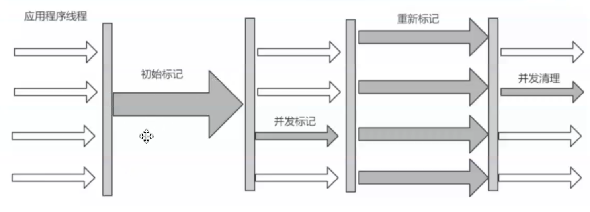
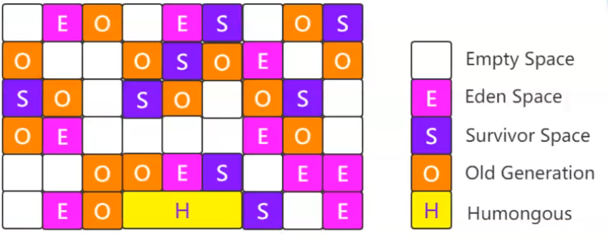
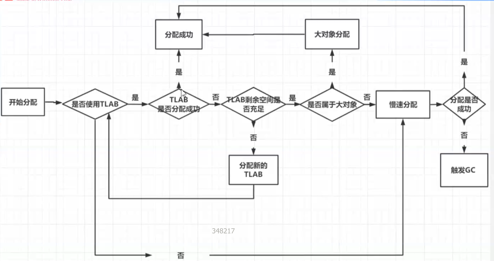
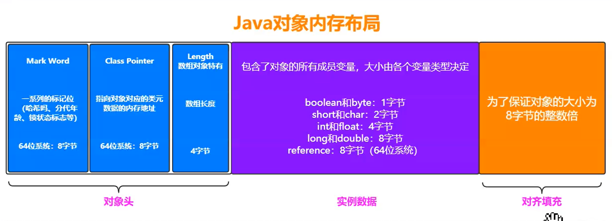

# JVM调优之底层原理


##  1 类加载


**class 常量池**

- 字面量
  - 文本
  - 字符串
  - final修饰的内容
- 符号引用
  - 类
  - 接口
  - 字段
  - 方法名
  - 明细信息相关描述 

**反编译Class文件**

```shell
javap -p -v .\xxx.class
```


- 装载
  - Class文件 --> 字节流 --> 类加载器(代码模块)
  - 将 字节流所代表的静态存储结构 转化为 方法区的运行时数据结构
  - 在Java堆中生成一个代表这个类的Java.lang.Class对象，作为方法区的数据访问入口
  - -Xverify:none 取消验证

- 链接

- 初始化

- 使用
  - 主动引用
    - 只有当对类的主动使用的时候 才会导致类的初始化，主动使用 有以下六种
    - new的方式
    - 访问某个类或者接口的静态变量， 或者对该静态变量赋值
    - 调用类的静态方法
    - 反射
    - 初始化某个类的子类，则其父类也会被初始化
    - Java虚拟机启动时被标明为启动类（spring boot项目中的Application启动类）
  - 被动引用
    - 引用父类的静态字段，只会引起父类的初始化， 而不会引起子类的初始化
    - 定义的数组，不会引起类的初始化
    - 引用类的static final常量，不会引起类的初始化（如果只有static修饰，还是会引起类初始化）

- 卸载
  - 该类所有的实例都已经被回收，也就是Java堆中不存在任何该类的实例
  - 加载类的class loader已经被回收
  - 该类对应的Java.lang.Class对象没有任何地方被引用，无法在任何地方通过反射访问该类的方法。


### 1.2 类加载器ClassLoader

在装载(Load)阶段，其中第(1)步:通过类的全限定名获取其定义的二进制字节流，需要借助类装载器完成，顾名思义，就是用来装载Class文件的。


**什么是类加载器**

- 负责读取 Java 字节代码，并转换成 java.lang.Class 类的一个实例的代码模块。

- 类加载器除了用于加载类外，还可用于确定类在Java虚拟机中的唯一性。


### 1.3 JVM类加载机制的三种特性

- 全盘负责，当一个类加载器负责加载某个Class时，该Class所依赖的和引用的其他Class也将由该类加载器负责载入，除非显示使用另外一个类加载器来载入

> 真正加载class字节码文件生成Class对象由“双亲委派”机制完成。

- **父类委托**，“双亲委派”是指**子类加载器如果没有加载过该目标类，就先委托父类加载器加载**该目标类

> 加载Class的具体过程是：
>
> 1. ClassLoader先判断该Class是否已加载，已加载，返回Class对象；没有则委托给父类加载器。
> 2. 父类加载器判断是否加载过该Class，如果已加载，则返回Class对象；如果没有则委托给祖父类加载器。
> 3. 依此类推，直到始祖类加载器（引用类加载器）。
> 4. 始祖类加载器判断是否加载过该Class，如果已加载，则返回Class对象；如果没有则尝试从其对应的类路径下寻找class字节码文件并载入。如果载入成功，则返回Class对象；如果载入失败，则委托给始祖类加载器的子类加载器。
> 5. 始祖类加载器的子类加载器尝试从其对应的类路径下寻找class字节码文件并载入。如果载入成功，则返回Class对象；如果载入失败，则委托给始祖类加载器的孙类加载器。
> 6. 依此类推，直到源ClassLoader。
> 7. 源ClassLoader尝试从其对应的类路径下寻找class字节码文件并载入。如果载入成功，则返回Class对象；如果载入失败，源ClassLoader不会再委托其子类加载器，而是抛出异常。

> “双亲委派”机制只是Java推荐的机制，并不是强制的机制。
>
> 继承java.lang.ClassLoader类，重写findClass(name)方法；如果想破坏双亲委派模型，可以重写loadClass(name)方法。
>
> 

- 缓存机制，缓存机制将会保证所有加载过的Class都将在内存中缓存。相同全名的类只加载一次，即 loadClass方法不会被重复调用。


### 1.4 JVM 内存模型 及常见面试题


栈帧出栈

**栈内存的回收是即时且自动的**，不涉及垃圾回收机制。


Java对象 内存布局

- 对象头   --- Mark Word, Class Pointer, Length
- 实例数据 --- 包含对象的所欲成员变量， 大小由各个变量类型决定
- 对其填充 --- 为了保证对象的大小为8字节的整数倍


Class Pointer, **类元数据的指针**


内存模型设计之-指针压缩

目的：

- 为了保证CPU普通对象指针（oop）缓存
- 为了减少GC的发生，因为指针不压缩是8字节，这样在64位操作系统的堆上其他资源空间就少了

**JDK1.6之后默认 开启指针压缩**


32位操作系统 的CPU 最大支持 2^32 = 4GB 内存

内存大于32GB, 指针压缩 失效。


#### 1.4.1 FieldAllocationStyle 策略

Field Allocation Style（字段分配风格）**是指Java虚拟机(JVM)在内存中布局对象字段的方式**，这是**<font color=red>JVM实现的一个重要优化点</font>**，直接影响对象的内存使用效率和访问性能


策略

- 0 (Declaration Order默认分配风格)  基本类型>填充字段>引用类型
- 1 (Compact Fields紧凑型风格)  引用类型>基本类型>填充字段
- 2 (Field Reordering字段重排序) 父类中的引用类型跟子类中的引用类型放在一起，父类采用策略0，子类采用策略1


**<font color=red>继承的情况比较多， 使用策略2 可以加快GC的回收速度</font>**


#### 1.4.2 **HotSpot JVM提供以下相关参数：**

- `-XX:FieldsAllocationStyle=0|1`：控制字段分配风格
  - 0：默认声明顺序
  - 1：优化顺序（紧凑分配）
- `-XX:+CompactFields`：启用/禁用紧凑字段分配（默认启用）


#### 1.4.3 分代回收策略

young区 Minor GC 15次依旧存在，则被放入elder 区

悲观策略下，大对象不需要达到分代年龄，直接进入老年代。(超过512KB则算大对象)

悲观策略: 任何一个年龄的所有对象 占其中一个区域的一半， 则大于这个年龄的所有对象直接进入 elder 带


**Eden与2个Survivor 存储大小比例默认是8:1:1**

Eden大小过小 会频繁触发Minor GC, 如果Survivor国小，则会触发Survivor区域活跃对象复制到Elder区


#### 1.4.4 **<font color=red>触发Full GC的时机</font>**：

- 之前每次晋升的对象的平均大小 > 老年代剩余空间   ---  **基于 历史平均水平**<font color=red>（悲观策略）</font>
- young GC之后，存活的对象超过了老年代的剩余空间 --- **基于下一次可能的剩余空间**<font color=red>(悲观策略)</font>
- MetaSpace区域空间不足
- System.gc();


#### 1.4.5 <font color=red>降低Full GC发生频率策略</font>

- 内存配置优化

  - <font color=red>合理设置堆大小 -Xms和-Xmx设置为相同值，避免自动扩展触发Full GC, eg: -Xms4g -Xmx4g</font>

  - <font color=red>新生代:老年代 = 1:2</font> (默认比例), 高吞吐可调增1:1 

  - <font color=red>适当增加Survivor区， 避免过早的晋升到老年代， -XX:SurvivorRatio=6 (Eden与Survivor比例)</font>

- 垃圾收集器选择与调优

  - G1 代替CMS  -XX:+UseG1GC  -XX:MaxGCPauseMillis=200

- 对象分配策略优化

  - 减少大对象分配
  - 使用对象池 。。。

- 监控与诊断

  - 开启GC日志 -Xlog:gc*:file=gc.log:time,uptime,level,tags:filecount=10,filesize=50M
  - 使用诊断工具
  - 关键指标监控

- 应用层优化

  - 缓存管理 Weak/SoftReference实现内存敏感缓存
  - 集合类优化， 及时清理无用集合， 为集合合理设置初始化大小
  - 避免内存泄漏

#### 1.4.6 **JVM Metaspace（元空间）**

Metaspace 是 Java 虚拟机（JVM）在 **Java 8 及以后版本** 引入的**元数据存储区域**，取代了早期的 **永久代（PermGen）**。它用于存储**类的元数据**（如类信息、方法信息、字段信息、常量池等），是 JVM 内存管理的重要组成部分。


**存储位置**： 本地内存（Native Memory）

**自动扩展**（受 `MaxMetaspaceSize` 限制）

**垃圾回收**：**由 Full GC 触发**

**默认大小**：无上限(受物理内存限制)


**Metaspace  主要存储 **JVM 加载的类元数据**，包括：

- **Class 结构**（类的描述信息）
- **方法元数据**（方法字节码、JIT 编译后的代码）
- **运行时常量池**
- **字段信息**
- **注解信息**
- **反射信息（如 `Method`、`Field` 对象）**


**相关 JVM 参数**

**-XX:MetaspaceSize** --- 初始 Metaspace 大小 平台相关 一般20MB

**-XX:MaxMetaspaceSize** --- Metaspace 最大限制  无限制 受物理内存限制


### 1.5 内存模型以及如何判断对象已死

jvisualvm


**Heap堆内存大小配置**

- -Xmx20M --- 堆内存最大值20MB
- -Xms20M  --- 堆内存最小值20MB 

 一般两个值设置一致， 不加单位则默认是 字节


栈帧大小设置， 默认是1MB

- -Xss512K


#### 1.5.1 对象的生命周期

- 创建阶段 --- 分配空间/构建对象/成员初始化/
- 应用阶段  ---  **至少维护一个强引用**
- 不可见阶段 --- 找不到直接或者间接的强引用，常见于 线程中或者函数中的临时变量 成员变量
- 不可达阶段 --- 没有任何 强引用
- 收集阶段
- 终结阶段 --- 
- 空间重分配阶段


#### 1.5.2 对象的引用类型

- 强引用 Strong Reference
- 软引用 Soft Reference  一些**有用但非必须**的对象，可用软引用关联，**发生OOM之前进行回收**
  - **问题**：可能会引起运行效率。如初始化耗时；或者该对象由第三方的某些操作
  - **优点**： 自动内存管理(<font color=red>内存不足自动释放</font>)
  - **经典应用场景**：<font color=red>图片/资源缓存，临时数据存储</font>
- 弱引用 Weak Reference   发生一次**<font color=red>Full GC后 直接被回收</font>**
- 虚引用 Photom   被回收时，会受到一个**系统通知**


### 1.6 JVM垃圾回收算法

**Full GC = yount GC + Old GC + MetaSpace GC**


#### 1.6.1 标记清除算法

**第一步** 标记  找出内存中需要回收的对象， 并且把它们标记出来  （<font color=red>比较耗时</font>）

​	**实际上标记的是  存活对象**。

**第二部** 清除 清除被标记需要回收的对象，释放出对应的内存空间


缺点：

- 会产生 不连续的内存碎片，当产生大对象时， 没有足够存放的连续内存空间， 则会触发另一次垃圾回收。
- **标记和清除 这两部 都比较耗时， 都是递归操作，效率不高**。


标记清除算法的衍生规则之 分配（**动态分区分配策略**）

- 首次适应算法(First fit) --- <font color=red>遍历空闲列表时，找到第一个大小 >= 所需大小的 块 ，并立即把该块分配个该对象</font>。
- 最佳适应算法(Best fit) ---  大小相等的块
- 最差适应算法(Worst fit) --- 找出最大的空闲块，分隔分配


#### 1.6.2 复制算法   --- 为了解决内存碎片问题

流程： 将内存划分为两块相等的区域， 每次只使用其中一块。

当其中一块内存使用完， 就将存活的对象复制到另一块， 然后将使用过的内存空间一次性清除掉

**缺点**：<font color=red>空间利用率低</font>。


#### 1.6.3 标记 - 整理算法  --- 也叫 标记压缩算法

标记清除压缩算法

先标记 再 清除不可达的对象  

再**顺序整理**： 根据Root 对象 整理成连续的内存空间 这其中多个root之间可能不是连续的

在**滑动整理**， 多个root 整理位连续的块


#### 1.6.4 常见整理算法


双指针整理算法

双指针 首尾各有个指针， 首指针找空闲， 尾指针找可达，而后移动复制可达对象到 首指针找到的 空闲块。

缺点：只能处理固定大小的对象， 一旦对象不固定， 则会 增加其他的逻辑。


Lisp2算法（滑动整理算法）:

是一个三指针算法， 可以处理不同大小的对象

第一次遍历：Free指针是为了留位置，而Scan对象是为了找存活对象。

第二次遍历： 移动对象位置。

第三次遍历：重新Root指向， 更新引用。


引线整理算法


单次遍历算法：滑动回收，实时计算出对象的转发地址，而不需要额外的开销。


#### 1.6.5 分代收集算法

当前主流商业JVM 的垃圾收集器， 大多遵循了**分代收集（Generational Collection）** 的理论进行设计


#### 1.6.6 分代收集三大假说

- **弱分代假说** --- <font color=red>绝大多数对象 朝生夕死</font>
- **强分代假说** --- 活得越久的对象， 也就是<font color=red>熬过很多次垃圾回收的对象是越来越难消亡的</font>
- **跨代引用假说** --- （少见）


#### 1.6.7 其他垃圾收集算法


### 1.7 JVM 垃圾收集器


#### 1.7.1 JVM参数及常用参数

 <font color=red>**标准参数**</font>：不随着版本变化而变化的参数

-version

-help

-server

-cp


**<font color=red>非标准参数</font>**： **-X参数**,   也就是再各个JDK版本中可能会改变

eg:

-Xint 解释执行

-Xcomp 第一次使用就编译成本地代码

-Xmixed 混合模式， JVM自己决定


**-XX参数**

eg:

a. Boolean 类型

格式：-XX:[+/-]


b. 非Boolean 类型， 即 Key-Value类型


打印所有 Boolean参数

>  java -XX:+PrintFlagsFinal -version 


#### 1.7.2 常用垃圾收集器

- **Serial** --- (jdk1.3之前 新生代收集的唯一选择) **单线程** 垃圾收集器 **针对young区**， 会使其他工作线程暂停， 收集完成后 工作线程恢复
  - 优点：简单高效
  - 缺点：收集过程需要暂停其他所有线程， STW
  - 算法：复制算法
  - 适用范围：新生代
  - 应用：Client模式下的默认新生代收集器


- **Serial Old** --- 也是单线程， 会发生STW

- **ParNew** 可以理解成**Serial的多线程版本**   **并行式**垃圾收集器

  - 优点： 多核CPU时，比Serial效率高

  - 缺点： STW
  - 算法：复制算法
  - 适用范围：新生代
  - **Server模式下， 首先新生代垃圾收集器**

- **CMS (Concurrent Mark Sweep)** 

  - 核心目的 关注更短的垃圾收集时间， 一定要大于2核
  - 并发 
  - 步骤：
    - 初始标记 --- 标记GC Roots直接关联对象 **不耗时 STW**
    - 并发标记 --- Roots开始 遍历标记 可达对象 耗时 并发执行
    - 重新标记 --- 上一步的基础上 标记变化的内容 **不耗时 STW**
    - 并发清理 --- 清理 不可达对象回收空间  耗时 并发执行

- **Parallel Scavenge** --- 新生代收集器， 复制算法， 并行多线程， 类似 ParNew ，但是更关注吞吐量


- **G1** ---  **堆区 <font color=red>不再物理隔离(Eden/Survivor/Old), 分成2048个大小相等的独立区域Region</font>**
  - 停顿时间更短
  - 一定程度上解决 空间碎片的问题
  - Region 角色
    - Empty Space
    - Eden Space
    - Survivor Space
    - Old Generation 
    - Humongous


- ZGC  --- 物理上/逻辑上  都不区分 新/老年代 区域了


**<font color=red>吞吐量 = 程序运行时间 / （程序运行时间 + 垃圾回收STW的时间）</font>**

程序的最低吞吐量 95% 一般在 96-98% 范围


**-XX:MaxGCPauseMillis --- 控制最大的垃圾收集停顿时间**

**-XX:GCRatio --- 直接设置吞吐量的大小** [0-100]


#### 1.7.3 如何选择合适的垃圾收集器


#### 


### 1.8 深入理解CMS垃圾收集器

 **Concurrent Mark Sweep**


#### 1.8.1CMS回收流程

步骤：

- 初始标记 --- 标记GC Roots直接关联对象 <font color=red>单线程</font> **不耗时 STW**
- 并发标记 --- Roots开始 遍历标记 可达对象 耗时 并发执行
- 重新标记 --- 上一步的基础上 标记变化的内容 **不耗时 STW**
- 并发清理 --- 清理 不可达对象回收空间  耗时 并发执行




#### 1.8.2 CMS的两种模式与一种特殊策略


- Background CMS

- Foreground CMS --- 并发失败才会走的 模式


如何让回收变快？

先进性年轻代的垃圾回收， 一次young GC, 新生代的对象少了， 那么在进行一次垃圾回收， 就变快了

 两个参数：

**CMSScheduleRemarkEdenSizeThreshold  默认2M**

**MCSScheduleRemarkEdenPenetration 默认50%**

这两个参数 组合起来就是， 预清理之后， Eden空间使用超过2M的时候启动可中断的并发预清理（CMS-concurrent-abortable-preclean）, 到Eden空间使用率达到50%的时候中断， 进入Remark(重新标记阶段)


#### 1.8.3 CMS常用参数


#### 1.8.4 CMS的线程计算公式


### 1.9 G1垃圾收集器

G1(**Garbage-First**)垃圾收集器是Java HotSpot虚拟机中的一种**服务器风格**的垃圾收集器，**<font color=red>主要针对多核处理器和大内存容量的机器设计</font>**。

**设计目的是**：**<font color=red> 避免完全回收</font>**


**G1相关JVM参数**

常用G1参数包括：

- `-XX:+UseG1GC`：启用G1收集器
- `-XX:MaxGCPauseMillis`：设置期望的最大GC停顿时间目标(默认200ms)
- `-XX:G1HeapRegionSize`：设置Region大小(1MB-32MB，应为2的幂)
- `-XX:InitiatingHeapOccupancyPercent`：触发并发GC周期的堆占用率阈值(默认45%)


#### 1.9.1 **JDK8为什么不使用CMS做为默认的垃圾收集器**


#### 1.9.2**G1垃圾收集器出现的意义**


#### 1.9.3**G1垃圾收集器的特点**

1. **并行与并发**：**充分利用多CPU**、多核环境下的硬件优势，使用多个CPU来**缩短STW停顿时间**。
2. **<font color=red>分代收集</font>**：虽然G1仍然属于分代收集器，但它不再像传统的收集器那样要求整个年轻代或老年代都是连续的，而是将堆划分为**多个大小相等的独立区域(Region)**。
3. **空间整合**：G1从整体来看是基于"标记-整理"算法实现的收集器，从局部(两个Region之间)上来看是基于"复制"算法实现的。
4. **可预测的停顿**：G1除了追求低停顿外，还能建立可预测的停顿时间模型，让使用者明确指定在一个长度为M毫秒的时间片段内，消耗在垃圾收集上的时间不得超过N毫秒。


#### 1.9.4**G1垃圾收集器的内存结构**



**region_size = 1-32MB**

**total_region = 2048**


**<font color=red>GC的三种方式</font>**

**Young GC** --- 针对新生代

**Mixed GC** --- 回收所有年轻代 和 部分 老年代

**Full GC** ---  回收所有年轻代 和 老年代 


#### 1.9.5 **TLAB（线程本地分配缓冲区）**

分配空间时， 为了提高JVM运行效率，应尽量减少临界区， 避免全局锁

G1的通常的应用场景中， 会存在大量的访问器 同时执行， 为了减少所冲突， JVM引入了TLAB机制。


**<font color=red>针对Eden区的对象分配</font>**

**实现方式**：**<font color=red>每个线程在Eden区预先分配一小块私有内存区域</font>**


**核心目的： <font color=red>加速内存分配</font>**

**-XX:+UseTLAB**   --- 默认打开

**-XX:TLABSize ** 参数指定（默认值为0，表示由JVM动态决定）

**-XX:ResizeTLAB** 是否允许动态调整TLAB大小  默认true

**-XX:MinTLABSize** 最小TLAB大小 默认2KB

不打开 则默认是 慢速 内存分配





#### 1.9.6 **Card Table升级———RSet（Remembered Set 记忆集）引用集**

G1垃圾收集器中用于**记录跨Region引用**的关键数据结构，它解决了分代GC中跨代引用和分区收集中跨区引用的问题


**核心作用**

- **记录跨Region引用**：跟踪哪些非收集Region中的对象引用了当前Region中的对象

- **减少扫描范围**：避免全堆扫描，只需检查RSet即可确定跨Region引用

  - **减少扫描范围**：只需扫描相关RSet而非整个堆

  - **提高并行度**：各Region可独立处理

  - **停顿可控**：支持增量回收


#### 1.9.7 **深入稀疏表，粗粒度位图，细粒度位图**

**细粒度位图：就是一个C位图，但是这个位图，可以详细的记录我们的内存变化，包括并发标记修改，对应元素标识等**

**当稀疏表指定region的card数量超过阈值时，则在细粒度位图中创建一个对应的PerRegionTable对象。一个Region地址链表，维护当前Region中所有card对应的一个BitMap集合**


粗粒度位图：当细粒度位图size超过阈值时， 所有region形成一个bitMap。 如果region对当前Region有指针指向，就设置其对应的bit为1， 也就是粗粒度位图。


#### 1.9.8 **写屏障导致的内存伪共享如何解决**


#### 1.9.9 **CMS的增量更新以及G1的TLAB**


#### 1.9.10 **引用集的同步异步问题**


#### 1.9.11 **G1常用参数配置**

**-XX: +UseG1GC 开启G1垃圾收集器**

**-XX: G1HeapReginSize 设置每个Region的大小，是2的幂次，1MB-32MB之间**

**-XX:MaxGCPauseMillis 最大停顿时间**

**-XX:ParallelGCThread 并行GC工作的线程数**

**-XX:ConcGCThreads 并发标记的线程数**

**-XX:InitiatingHeapOcccupancyPercent 默认45%，代表GC堆占用达到多少的时候开始垃圾收集**


#### 1.9.12 G1三大垃圾回收模式

- Young GC

  - **触发条件**： Eden区耗尽，无法分配新对象时触发
  - 只回收年轻代（Eden + Survivor区）

- Mixed GC

  - **触发条件**：老年代占用达到Initiating Heap Occupancy Percent（IHOP，默认45%）
  - 在并发标记周期完成后触发
  - 回收阶段：
    - **<font color=red>同时回收年轻代和老年代Region</font>**
    - 老年代Region按回收价值排序
    - 每次回收一部分老年代Region（不超过`-XX:G1OldCSetRegionThresholdPercent`）

- Full GC（**全堆收集**）

  - **工作流程**：
    - **单线程标记-整理**（JDK10前）：
      - 完全STW
      - 单线程执行全堆回收
      - 内存碎片整理
    - **并行标记-整理**（JDK10+）：
    - 仍完全STW
    - 多线程并行执行

  - 准备阶段
    - FUll GC 应当清理软引用SoftReference
    - MetaSpace中的方法可能被移动， 需要保存bcp字节码指针数据
    - 保存轻量级锁和重量级锁的对象头
    - 清理和处理对象的派生关系


**Full GC期间的锁升级是JVM为了保证内存一致性而采取的安全措施，虽然会影响性能，但这是系统安全性的必要代价。最佳实践是优化应用避免触发Full GC，而非试图绕过这个机制。**


**Young GC 触发条件**：

Eden区大小范围 = [-XX:G1NewSizePercent,-XX:G1MaxNewSizePercent] = [**整堆5%~整堆60%**]

G1会计算Eden回收需要的大概时间， 如果**<font color=red>远远小于[-XX:MaxGCPauseMills]（默认200ms）</font>**,则增加年轻代region， 继续给新对象存放，**不会马上做Young GC**

**<font color=red>如果接近阈值[-XX:MaxGCPauseMills]则进行Young GC</font>**


## 重要配置参数

| 参数                                  | 作用                                   | 默认值 |
| :------------------------------------ | :------------------------------------- | :----- |
| `-XX:InitiatingHeapOccupancyPercent`  | 触发并发标记的老年代占用比             | 45     |
| `-XX:G1MixedGCLiveThresholdPercent`   | Region存活对象阈值，低于此值才会被回收 | 85     |
| `-XX:G1HeapWastePercent`              | 允许的堆浪费比例，达到则停止Mixed GC   | 5      |
| `-XX:G1MixedGCCountTarget`            | 一次并发标记周期后的Mixed GC目标次数   | 8      |
| `-XX:G1OldCSetRegionThresholdPercent` | 每次Mixed GC回收的老年代Region比例上限 | 10     |


**<font color=red>写屏障 Write Barrier</font>**

在对象引用被修改时执行额外的操作，以维护内存一致性并支持高效的垃圾回收。


**<font color=red>内存伪共享（False Sharing）</font>**

内存伪共享是指**多个线程看似独立访问不同的变量，但这些变量位于同一个CPU缓存行（Cache Line）中**，导致缓存一致性协议引发不必要的性能损耗。


### 1.10 ZGC垃圾收集器

**ZGC（The Z Garbage Collector）是JDK 11中推出的一款追求极致低延迟的实验性质的垃圾收集器，不管是物理上还是逻辑上，在ZGC中已经不存在新老年代的概念了**

**<font color=red>目标是： Zero Stop, 零停顿</font>**


**（1）<font color=red>可以达到10ms以内的停顿时间要求</font>**  (**实际通常1ms以内**)

**（2）<font color=red>支持TB级别的内存</font>（支持8MB~4TB级别的堆，JDK15以后支持16TB）**

**（3）停顿时间不会随着堆的大小，或者活跃对象的大小而增加；堆内存变大后停顿时间还是在10ms以内**


#### 1.10.1 三大核心技术

- 多重映射
- 读屏障
- 指针染色


##### 1.10.1.1 多重映射

ZGC为了能高效、灵活地管理内存，实现了**两级内存管理**：虚拟内存和物理内存，并且实现了**物理内存和虚拟内存的映射关系**。

为什么这么设计呢？

这就是ZGC的高明之处，利用虚拟空间换时间，这三个空间的切换是由垃圾回收的不同阶段触发的，通过限定三个空间在同一时间点有且仅有一个空间有效高效的完成GC过程的并发操作，


##### 1.10.1.2 读屏障

在字节码层面或者编译代码层面给读操作增加一个额外的处理。一个类似与面向切面的处理。


**并发情况下， 对象1指向对象2， 而对象2有可能正在被其他线程操作， 此时<font color=red>读屏障会先探查</font>， 等待操作完成**

都屏障操作 跟 CAS 类似， 一个依赖version比较， 一个依赖地址比较


**设计哲学差异**

| 方面         | G1读屏障                   | CAS                         |
| :----------- | :------------------------- | :-------------------------- |
| **设计目标** | 空间安全性（Space Safety） | 线程安全性（Thread Safety） |
| **失败处理** | 必须成功                   | 允许失败                    |
| **抽象层级** | JVM内部机制                | 程序员可见原语              |


<font color=red>问题：如此复杂的探查操作会不会影响程序的性能呢？</font>

会，据测试，**最多百分之4的性能损耗**。但这是ZGC并发转移的基础，为了降低STW，设计者认为这点牺牲是可接受的。

 

##### 1.10.1.3 指针染色

ZGC将信息存储在指针中，这种技术有一个高大上的名字——染色指针（Colored Pointer）


原理：
Linux下64位指针的**高18位不能用来寻址**，但剩余的46位指针所能支持的64TB内存在今天仍然能够充分满足大型服务器的需要。鉴于此，ZGC的染色指针技术继续盯上了这剩下的46位指针宽度，将其**高4位提取出来存储四个标志信息**。通过这些标志位，虚拟机可以直接从指针中看到其引用对象的三色标记状态、是否进入了重分配集（即被移动过）、是否只能通过finalize()方法才能被访问到。当然，由于这些标志位进一步压缩了原本就只有46位的地址空间，也直接导致
ZGC能够管理的内存不可以超过4TB（2的42次幂)  当然，后续的版本可以了，因为开发了更多的位数。前面是觉得没必要，够大了。

而后续开发变成了这个样子：


在64位的机器中，对象指针是64位的。

* ZGC使用64位地址空间的第0~43位存储对象地址，2^44 = 16TB，所以ZGC最大支持16TB的堆。
* 而第44~47位作为颜色标志位，**Marked0、Marked1和Remapped**代表三个视图标志位，Finalizable表示这个对象只能通过finalizer才能访问。
* 第48~63位固定为0没有利用。


#### 1.10.2 并发处理算法


ZGC的并发处理算法三个阶段的全局视图切换如下：

**初始化阶段**：ZGC初始化之后，整个内存空间的地址视图被设置为Remapped
**标记阶段**：当进入标记阶段时的视图转变为Marked0（以下皆简称M0）或者Marked1（以下皆简称M1）
**转移阶段**：从标记阶段结束进入转移阶段时的视图再次设置为Remapped


**3个地址视图代表的含义是**：

* **M1**：本次垃圾回收中识别的**<font color=red>活跃对象</font>**。
* **M0**：**前一次**垃圾回收的标记阶段被标记过的**活跃对象**，对象在转移阶段未被转移，但是在**本次垃圾回收中**被识别为**<font color=red>不活跃对象</font>**。
* **Remapped**：**前一次**垃圾回收的转移阶段**发生转移的对象**或者是被应用程序线程访问的对象，但是在**本次垃圾回收中**被识别为**<font color=red>不活跃对象</font>**。


**<font color=orange>ZGC只有三个STW阶段：初始标记，再标记，初始转移。</font>**


再标记阶段STW时间很短，最多1ms，超过1ms则再次进入并发标记阶段。即，**<font color=green>ZGC几乎所有暂停都只依赖于GC Roots集合大小，停顿时间不会随着堆的大小或者活跃对象的大小而增加</font>**。与ZGC对比，G1的转移阶段完全STW的，且停顿时间随存活对象的大小增加而增加。


#### 1.10.3 <font color=red>!!! ZGC最佳调优参数 !!!</font>

* `-Xms -Xmx`：堆的最大内存和最小内存，这里都设置为16G，程序的堆内存将保持16G不变。
  * 利用率最高， 设备32GB情况下设置30GB ， 设备16GB 设置10GB

* `-XX:ReservedCodeCacheSize -XX:InitialCodeCacheSize`：设置CodeCache的大小， JIT编译的代码都放在CodeCache中，一般服务64m或128m就已经足够。我们的服务因为有一定特殊性，所以设置的较大，后面会详细介绍。
* `-XX:+UnlockExperimentalVMOptions -XX:+UseZGC`：**启用ZGC的配置**。
* `-XX:ConcGCThreads`：**并发回收垃圾的线程**。默认是总核数的12.5%，8核CPU默认是1。调大后GC变快，但会占用程序运行时的CPU资源，吞吐会受到影响。 **保吞吐，降停顿**
* `-XX:ParallelGCThreads`：STW阶段使用线程数，默认是总核数的60%。
* `-XX:ZCollectionInterval`：ZGC发生的最小时间间隔，单位秒。
* `-XX:ZAllocationSpikeTolerance`：ZGC触发自适应算法的修正系数，默认2，数值越大，越早的触发ZGC。
* `-XX:+UnlockDiagnosticVMOptions -XX:-ZProactive`：是否启用主动回收，默认开启，这里的配置表示关闭。
* `-Xlog`：设置GC日志中的内容、格式、位置以及每个日志的大小。

```xml
-Xms16G -Xmx16G 
-XX:ReservedCodeCacheSize=256m -XX:InitialCodeCacheSize=256m 
-XX:+UnlockExperimentalVMOptions -XX:+UseZGC 
-XX:ConcGCThreads=2 -XX:ParallelGCThreads=6 
-XX:ZCollectionInterval=120 -XX:ZAllocationSpikeTolerance=5 
-XX:+UnlockDiagnosticVMOptions -XX:-ZProactive 
-Xlog:safepoint,classhisto*=trace,age*,gc*=info:file=/opt/logs/logs/gc-%t.log:time,tid,tags:filecount=5,filesize=50m 
```

`美团测试数据，由美团发布`


#### 1.10.4 常用命令


### 1.11 JVM命令及执行引擎


#### 1.11.1 常用命令


- **jps**  ---  查看**<font color=orange>java进程</font>**

- **jinfo** --- 实时查看和调整JVM配置参数

  jinfo -flag name PID 查看某个java进程的name属性的值

  > jinfo -flag MaxHeapSize PID 
  > jinfo -flag UseG1GC PID


- **jstat** --- 查看**<font color=red>虚拟机性能</font>**统计信息

  > jstat -class PID 1000 10  查看某个java进程的类装载信息，每1000毫秒输出一次，共输出10次

查看垃圾收集信息

```
jstat -gc PID 1000 10
```


- **jstack** --- **<font color=green>查看线程堆栈信息</font>**

  > jstack PID

 	尤其 对查看 <font color=blue>死锁</font> 信息


- **jmap** --- 生成堆转储快照

  - **打印出堆内存相关信息**

    ```
    jmap -heap PID
    ```

    ```
    jinfo -flag UsePSAdaptiveSurvivorSizePolicy 35352
    -XX:SurvivorRatio=8
    ```


  - **dump出堆内存相关信息**

    ```
    jmap -dump:format=b,file=heap.hprof PID
    ```

    

  - **dump出堆内存相关信息**

    ```
    jmap -dump:format=b,file=heap.hprof PID
    
    
    设置堆内存大小: -Xms20M -Xmx20M
    启动，然后访问localhost:9090/heap，使得堆内存溢出
    ```

    


#### 1.11.2 JVM内部优化逻辑


- java -Xint -version    interpreted mode  --- 表示启用**纯解释模式**
  -  JVM 不会将字节码编译为本地机器码，而是逐条解释执行字节码


- java -Xcomp -version    compiled mode   --- 表示启用**纯编译模式**

  - JVM 会在方法第一次调用时就将其编译为本地机器码

  - 启动速度最慢
  - 内存占用最高(所有方法都会被编译)

- java -Xmixed -version   mixed mode  --- 表示启用**混合模式 (解释+编译)**

  - 这是JVM的**默认模式**

  - 结合了解释执行和即时编译(JIT)的优点


#### 即时编译器类型

（1）HotSpot虚拟机里面内置了两个JIT：C1和C2

> C1也称为Client Compiler，适用于执行时间短或者对启动性能有要求的程序
>
> C2也称为Server Compiler，适用于执行时间长或者对峰值性能有要求的程序

（2）Java7开始，HotSpot会使用分层编译的方式

> 分层编译也就是会结合C1的启动性能优势和C2的峰值性能优势，热点方法会先被C1编译，然后热点方法中的热点会被C2再次编译
>
> -XX:+TieredCompilation开启参数


#### JVM的分层编译5大级别：

**0.解释执行**

**1.简单的C1编译**：仅仅使用我们的C1做一些简单的优化，不会开启Profiling

**2.受限的C1编译代码：**只会执行我们的方法调用次数以及循环的回边次数（多次执行的循环体）Profiling的C1编译

**3.完全C1编译代码：**我们Profiling里面所有的代码。也会被C1执行

**4.C2编译代码：**<font color=red>这个才是优化的级别</font>。

> 级别越高，我们的应用启动越慢，优化下来开销会越高，同样的，我们的峰值性能也会越高

> 通常C2 代码的执行效率要比 C1 代码的高出 30% 以上


#### 热点代码：

* **被多次调用的方法**
* **被多次执行的循环体**


### java两大计数器：

**(1) 首先是方法调用计数器** Client 模式下默认阈值是 **1500** 次，在 Server 模式下是 **10000**次，这个阈值可以通过 **-XX：CompileThreadhold** 来人为设定

**(2) 第二个回边计数器** ，作用是统计一个方法中循环体代码执行的次数，在字节码中遇到控制流向后跳转的指令称为“回边”（ Back Edge ）。显然，建立回边计数器统计的目的就是为了触发 OSR 编译。


**JVM 大体物理结构图**


## 2 JVM运行时优化


### 2.1 方法内联

>  方法内联，是指 **<font color=red>JVM在运行时将调用次数达到一定阈值的方法调用替换为方法体本身</font>** ，从而消除调用成本，并为接下来进一步的代码性能优化提供基础，是JVM的一个重要优化手段之一。

> **注：**
>
> **C++的inline属于编译后内联，但是java是运行时内联**


**<font color=green>简单通俗的讲就是把方法内部调用的其它方法的逻辑，嵌入到自身的方法中去，变成自身的一部分，之后不再调用该方法，从而节省调用函数带来的额外开支。</font>**


**函数调用 会带来额外的开销， 主要来自方法<font color=red>栈帧的生成、参数字段的压入、栈帧的弹出、还有指令执行地址的跳转</font>**


**内联条件**

一个方法如果满足以下条件就很可能被jvm内联。

* **热点代码**。 **<font color=green>客户端编译模式则次数是1500，服务端编译模式是10000</font>**。次数的大小可以通过-XX:CompileThreshold来调整。
* **方法体不能太大**。方法体太大，则能缓存热点方法就少，反而会影响性能。**<font color=orange>热点方法小于325字节的时候，非热点代码35字节</font>**以下才会使用
* 如果希望方法被内联， **<font color=red>尽量用private、static、final修饰</font>** ，这样jvm可以直接内联。如果是public、protected修饰方法jvm则需要进行类型判断，因为这些方法可以被子类继承和覆盖，jvm需要判断内联究竟内联是父类还是其中某个子类的方法。

所以了解jvm方法内联机制之后，会有助于我们工作中写出能让jvm更容易优化的代码，有助于提升程序的性能。


**控制参数**

- `-XX:+Inline`：启用方法内联(**默认开启**)
- `-XX:-Inline`：禁用方法内联
- `-XX:MaxInlineSize=<n>`：设置可内联方法的最大字节码大小(默认35字节)
- `-XX:FreqInlineSize=<n>`：设置频繁执行方法可内联的最大字节码大小(默认325字节)
- `-XX:MinInliningThreshold=<n>`：设置方法被内联的最小调用次数阈值(默认250)


**<font color=orange>"客户端模式"和"服务端模式"</font>**是指JVM的两种不同的即时编译（JIT）策略

- **客户端模式（Client Compiler / C1）** ---  <font color=red>快速启动，减少初始编译时间</font>

- **服务端模式（Server Compiler / C2）**--- <font color=red>最大化峰值性能</font>


### 2.2. 逃逸分析


#### 2.2.1 对象逃逸

对象逃逸的本质是对象指针的逃逸。


<font color=red>对象的指针被多个方法或者线程引用时，那么我们就称这个对象的指针（或对象）的逃逸（Escape）</font>


#### 2.2.2 逃逸分析

**<font color=red>Java Hotspot编译器能够分析出一个新的对象的引用的使用范围从而决定是否要将这个对象分配到堆上</font>**。

 逃逸分析（Escape Analysis）算是目前Java虚拟机中比较前沿的优化技术了。


#### 2.2.3 基于逃逸分析的优化

- 栈上分配：将堆分配转化为**栈分配**

- 同步消除：如果发现某个对象只能从一个线程可访问，那么在这个对象上的操作可以不需要同步。
- 分离对象或标量替换。如果某个对象的访问方式不要求该对象是一个连续的内存结构，那么对象的部分（或全部）可以不存储在内存，而是**存储在CPU寄存器**中。


#### 2.2.4 标量替换

**标量**：**<font color=green>不可被进一步分解的量</font>**，  **JAVA的基本数据类型就是标量**

**聚合量：** 标量的对立就是**<font color=red>可以被进一步分解的量</font>**。

标量替换：对象不会被外部访问，且可以被进一步分解，则JVM不会创建该对象，而是**<font color=orange>将该对象成员变量分解若干个被这个方法使用的成员变量</font>**所代替，这些代替的成员变量在**栈帧**或**寄存器**上分配空间，这样就不会因为没有一大块连续空间导致对象内存不够分配。


#### 2.2.5 参数配置

-XX:+DoEscapeAnalysis 表示开启逃逸分析，JDK8是默认开启的

-XX:+PrintGC 表示打印GC信息

-Xms5M -Xmn5M 设置JVM内存大小是5M


#### 2.2.6 同步锁消除

如果发现某个对象只能从一个线程可访问，那么在这个对象上的操作可以不需要同步.

```codes
public static void main(String[] args){
        long start = System.currentTimeMillis();
        for(int i = 0; i < 5_000_000; i++){
            createObject();
        }
        System.out.println("cost = " + (System.currentTimeMillis() - start) + "ms");
    }
 
    public static void createObject(){
        synchronized (new Object()){ // 自动锁消除
 
        }
    }
```


#### 2.2.7 触发逃逸分析条件

Java的逃逸分析只发在JIT的即时编译中

一、**对象被赋值给堆中对象的字段和类的静态变量**。
二、**对象被传进了不确定的代码中去运行**。


#### 2.2.8 TLAB (Thread Local Allocation Buffer)  -  线程本地分配缓存区

这是一个线程专用的内存分配区域.


**JVM使用TLAB来避免多线程冲突，在给对象分配内存时，<font color=red>每个线程使用自己的TLAB</font>，这样可以避免线程同步，提高了对象分配的效率**


### 2.3 内存优化


对象内存布局， 及计算一个对象大小的组成部分



## 总结表

| 组成部分 | 32位JVM | 64位JVM(压缩) | 64位JVM(未压缩) |
| :------- | :------ | :------------ | :-------------- |
| 对象头   | 8       | 12            | 16              |
| int字段  | 4       | 4             | 4               |
| 引用字段 | 4       | 4             | 8               |
| 数组长度 | 4       | 4             | 4               |

eg:

- 示例一：int[5] arr;  则对象大小计算如下：

1. **对象头**：8(Mark) + 4(Klass) + 4(length) = 16
2. **实例数据**：5 × 4 = 20
3. **总计**：16 + 20 = 36
4. **对齐填充**：补4字节 → 40字节


- 示例二

```
class MyObject {
    int a;      // 4
    byte b;     // 1
    boolean c;  // 1
    Object d;   // 4（压缩指针）
}
```

计算：

1. 对象头：8(Mark) + 4(Klass) = 12
2. 实例数据：4 + 1 + 1 + 4 = 10
3. 总计：12 + 10 = 22
4. 对齐填充：补2字节 → 24字节


JVM调优时 最后手段

**限流/降级 --> tomcat  -->  mysql/sql  -->  微服务  -->  JVM**


## 3 JVM工具及总结


### 3.1 性能监控工具


### 3.2. 内存分析工具


### 3.3. 日志分析工具


