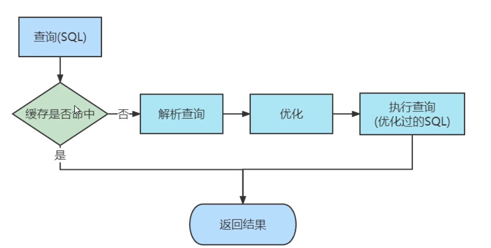
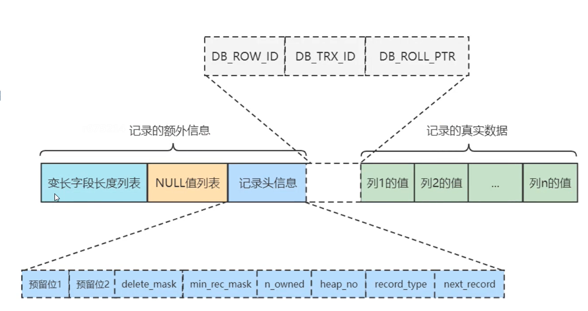

# MySQL 性能调优与架构设计

## 基础知识

### 六大范式（Normal Form）
- 1NF 属性不可再分
- 2NF 属性完全依赖于主键
- 3NF 表中不包含已在其他表中包含的非主关键字信息，即每个属性都跟主键有直接的关系，而不是间接关系。
- 


反范式化设计 -- 连表少
为了性能和读取效率而适当的违反对数据库设计范式化的要求。
为了**查询的性能**， 允许存在部分(少量)数据冗余。

数据库来设计 计数器功能 可以引入槽的概念, 最后结果使用sum(),提高写入效率。


字段设计原则
- 越小越好 
  - 整型 tinyint(8位,1个字节), smallint(16位,2个字节), mediumint(24位,3个字节), int(32位,4个字节), bigint(64位,8个字节)
  - 实数(浮点型) float(4个字节), double(4个字节), decimal(65个数字的字符串)
  - 字符串型 char(定长), varchar(可变长度，分配一个空间记录长度), blob, text, enum, set
  - 日期和时间 datetime(1001-9999年), timestamp(1970-2038年)， 这俩时间都可以精确到秒
- 简单就好
- 尽量避免NULL  可为null占用更多的空间， null 列索引，会记录一个额外的字节


### 命名规则
业务名称_表的作用

- 可读性
- 必须使用小写字母、数字和下划线(_)
- 不是用复数名词
- 禁用保留字
- 索引命名


### B+树 --- 多叉平衡查找树
非叶子节点 不保存实际数据， 只保存索引值


### 索引
- 主键索引 是 聚簇索引B+树， 叶子节点存放 **主键 + 所有的列**
- 二级索引/辅助索引 也是B+树， 叶子节点 只存储**索引列 + 主键**， 因此涉及到回表操作
- 联合索引/复合索引 多个列(左边列开始排序) + 主键
- 一个索引 就是一个B+树
- 一个select查询语句在执行过程中 一般最多能使用一个二级索引， 如果在where条件中使用了多个二级索引，那么会多次扫描数据。

### 回表的发生
使用二级索引查询数据时， 根据二级索引的树 查询得到主键索引(聚簇索引)，然后在查询对应的其他列的数据的过程叫回表。


### 自适应 哈希索引  默认开启(主要 用于 等值 判断时)
B+树是使用二分查找 查询数据
对于 热点数据， InnoDB 会使用**哈希索引** 对这部分数据进行存储，提高查询效率

> innodb_adaptive_hash_index 来考虑是禁止还是启用此特性， 默认AHI为开启状态。

### 索引创建策略
- 索引列数据类型 越小越好 效率越高  tinyint > smallint > ... > bigint

### 索引列的选择 --- （重复性低，则效率高）
索引的选择性/散列性： 不重复的索引值和数据表的记录总数(N)的比值
（范围1/N - 1） 值越高， 则查询效率越高。

### 前缀索引
针对blob/text/较长的varchar 字段， mysql不支持索引他们的全部长度， 因此需要建立**前缀索引**
语法： alter table table_name add key(column_name(14));
缺点： 无法应用于order by和group by, 也无法做覆盖索引。

mysql不支持 后缀索引。


### 多列索引
- 散列性高的列放在前面
- 根据那些运行效率高的列 调整顺序


### 三星索引
对于一个查询 三星索引 应该就是最好的索引
需满足以下条件：
- 索引将相关记录放到一起 获得一星 --- 权重27%
- 索引中的顺序和查找中的顺序一致(无论正序倒叙) 则获得二星 （排序星） --- 权重23%
- 索引中列包含了查询中需要的全部列 则获得三星（不需要回表）（宽度星） --- 权重50%


## MySQL调优

### MySQL调优-索引
SQL查询：
响应时间 = 服务时间 + 排队时间

1，使用覆盖索引
2，数据表架构。统计汇总，报表， 汇总信息(汇总表)

#### 慢查询
慢查询配置：
mysql 记录所有执行超过long_query_time参数设定的时间阈值的SQL语句的日志

show variables like 'slow_query_log'; -- default OFF
set GLOBAL slow_query_log = 1; -- 打开 1是ON  0是OFF

- 慢查询 阈值时间 查看与设置
show variables like 'long_query_time'; -- 查看阈值时间(会话级别) 单位s
SHOW GLOBAL VARIABLES LIKE 'long_query_time';-- 查看阈值时间(全局级别) 单位s

set GLOBAL long_query_time = 9; -- 设置全局级别 阈值
set long_query_time = 8; -- 设置会话级别 阈值
set SESSION long_query_time  = 7; -- 会话级别 同上

show variables like 'slow_query_log_file'; -- 查看耗时sql查询log的 存储位置

show variables like 'log_queries_not_using_indexes'; -- 没使用索引查询的sql统计

查看 超过超时阈值的mysql日志
命令格式：
> mysqldumpslow -s (r,c,l,t) slow.log

参数介绍
-s --- sort
r --- Rows
c --- Count
l --- Lock
t --- Time
-t top

命令示例
> mysqldumpslow -s r -t 10 /var/lib/mysql/centosvm-slow.log


#### 执行计划
explain select *****;
explain format = json [your sql];
执行结果参数介绍
- id 包含的 **子查询** 或 **union操作** 的 数量， 
  - id 代表一个独立的执行单元
  - 通常 id 值越大，执行优先级越高（越先执行）
  - id = NULL 表示 这是一个 临时表
- select_type 查询类型
  - SIMPLE --- 简单查询， 不包含子查询/UNION
  - PRIMARY --- 主查询，在union查询时 只会有一个主查询
  - UNION
  - UNION RESULT
  - SUBQUERY --- 子查询
  - DEPENDENT UNION
  - 
- type 表明这个访问方法/访问类型
  - system>const>eq_ref>ref>fulltext>ref_or_null>index_merge>unique_subquery>index_subquery>range>index>ALL
  - ALL 表示全表扫描
  - SYSTEM 表示查询的时系统表
  - eq_ref 表示 **驱动表**， 则另一个为被驱动表
  - const -- 主键索引 直接命中
  - ref -- 非主键索引(二级索引) 直接命中
  - ref_or_null -- 非主键索引(二级索引) 直接命中(包含null值) eg: select *** where name = 'zhagnsan' or name is null;
  - index_merge 索引合并， sql语句包含多个索引的情况 会进行索引合并
  - unique_subquery --子查询中会用到 被驱动表的索引字段
  - range --- 范围命中 主键索引/非主键索引 in/>/</between查询

- possible_key 可能用到的 索引
- key 实际 查询用到的 索引
- key_len 索引字节数 varchar 如果是utf-8，长度为50， 则key_len=50*3+2=152, 多2个字节用来存储字符串长度
- rows --- 扫描的行数， 越小 查询效率越高
- filtered --- % 预测有多少条数满足筛选条件， 预测值， 不准确

-- 关闭某些优化策略（MySQL 5.7+）
SET optimizer_switch = 'condition_fanout_filter=off';
SET GLOBAL optimizer_switch = 'materialization=off,derived_merge=off';

-- 查看当前优化器开关配置
SHOW VARIABLES LIKE 'optimizer_switch';





#### 高性能的 索引 的使用策略

- 不要再索引列上做任何操作 
  - 表达式
  - 内置函数
  - eg: select name, age, school where student_id + 1 = 100; 
- 尽量全职匹配
- 最佳左前缀原则 --- 针对联合索引
- 范围条件放最后
  - 左边的列时精确查找，则右边的列可进行范围查找
  - 中间有范围查询会导致后面的列全部失效，无法充分利用联合索引
- 尽量使用 覆盖索引 (不需要回表)
- 不等于<>要慎用 --- 会导致索引失效
- NULL/Not 有影响
- 字符类型加引号
- 模糊查询 尽量使用左侧匹配 eg: like '123%'
- 慎用OR --- 同一个二级索引使用OR 会走索引树， 如果时多个二级索引使用OR 则不会使用索引
  - select **** from table where index1 = 'a' or index1 = 'b'; -- 会使用index1 索引
  - select **** from table where index1 = 'a' or index2 = 'aaa'; -- 则不会使用 索引
- 排序要当心
  - ASC,DESC 别混用
  - 排序字段 最好跟联合索引中的列 顺序保持一致
- 尽可能按照主键顺序插入行
- 优化count查询 --- 只会统计非空数据
- 优化limit分页
  - select * from table limit 10000, 10; -- 全表扫描
  - select * from (select id from table limit 10000, 10) b, table a where a.id = b.id; --- 效果更优 会使用主键索引
  - select * from table where id > 10000 limit 10; -- 使用业务条件代替limit 偏移量
- 关于Null的特别说明 --- 尽量少用，字段 尽量设计 不为NULL


## 事务和事务隔离级别

事务特性ACID
- 原子性 A atomicity 
- 一致性 C consistency 
- 隔离性 I isolation 
- 持久性 D durability 


事务并发引起的问题：
- 脏读 --- t1事务未提交的数据 被 其他事务t2 读取到了， t1可能会被回滚， 所以对t2来说是脏读
- 不可重复读 --- 事务t1 两次读取的数据不一致 关注数据的修改
- 幻读 --- 事务t1 两次读取 第二次比第一次多 关注数据的新增

事务隔离界别


事务隔离界别的设置
- 设置：set [global|session] transaction isolation level [level];
- 查看：show variables like 'transaction_isolation';
- level: {
  repeatable read | read committed | read uncommitted | serializable
}


## MySQL 事务

- 查询正在执行的事务
select * from information_schema.INNODB_TRX;
- 查询当前锁的信息
select * from information_schema.INNODB_LOCKS; -- 8.0好像没有这张表
show engine innodb status; -- 查看最近一次死锁信息
- 查询锁等待的信息
select * from information_schema.INNODB_LOCK_WAITS; -- 8.0好像没有这张表

### SavePoint 保存点

保存点是MySQL**事务管理中的高级功能**，合理使用可以增加复杂业务处理的灵活性.
保存点(SAVEPOINT)是MySQL事务中的一个标记点，允许在事务内部创建"子事务"，可以在不结束整个事务的情况下回滚到特定的保存点.

SAVEPOINT savepoint_name;  -- 创建保存点
ROLLBACK TO [SAVEPOINT] savepoint_name;  -- 回滚到保存点
RELEASE SAVEPOINT savepoint_name;  -- 释放保存点(不执行回滚)

保存点和新特性
- 事务内控制：保存点只在当前事务内有效
- 层级结构：可以创建多个保存点，形成嵌套结构
- 自动释放：事务提交或回滚时，所有保存点自动释放
- 名称唯一性：同一事务内保存点名称必须唯一
- 存储引擎支持：主要InnoDB支持，MyISAM不支持

eg:
START TRANSACTION;
INSERT INTO orders VALUES(...);
SAVEPOINT after_order;
INSERT INTO order_details VALUES(...);
-- 如果此处失败
ROLLBACK TO after_order;  -- 只回滚订单明细，保留订单主表
COMMIT;


### 隐式提交
事务未提交之前， 有DDL语句来， 则事务会被自动提交。 这就是隐式提交。


### 事务控制或 关于锁定的语句


- READ-COMMITTED -- 读已提交， 解决脏读问题， 不可重复读 解决不了。
使用READ COMMITTED隔离级别的事务在每次查询开始的时候 都会生成一份Read View.

- REPEATABLE-READ 隔离级别-- 可重复读
如果之前执行的select已经生成过ReadView,此时直接服用之前的ReadView.


## 锁

行级锁
- 共享锁(S) --- select * from table lock in share mode;
- 排他锁(X)/独占锁 --- select * from table for update;


- 行锁
- 表锁
- 意向锁： 为了解决 效率问题。 只有表级锁。
  - 意向共享锁(IS锁) -- 表示事务打算在表中的某些行上设置共享锁(S), select ... lock in share mode, 会先获取IS锁。
  - 意向排他锁(IX锁) -- 表示事务打算在表中的某些行上设置排他锁(X), select ... for update, 会先获取IX锁。

表级共享锁：lock tables tableA read;
表级排他锁：lock tables tableB write;


innodb_autoinc_lock_mode
0是表级别锁 --- 不能确定插入的数量
1是轻量级锁 --- 能确定插入的数据  主从复制场景，但不安全
2是混合型锁 --- 事务不能确定插入的数量


行锁
**！！！Attention！！！ 索引上加的是行锁， 不是 则是 表锁。**
eg: select * from table where index = 1; --- where条件一定包含索引 才会加行锁。

间隙锁 Gap lock
行锁X 本质上是在锁定的行上下 添加两把**间隙锁**


死锁
是竞争资源 产生的相互阻塞的现象。 死锁不是锁 是一种基于锁的现象。
show variables like 'innodb_status_output_locks';
set [global/session] innodb_status_output_locks=ON; -- 设置锁绘画输出日志

- 查看死锁信息
show engine innodb status\G

MySQL InnoDB 中，当事务发生死锁时，系统会自动选择一个**修改较少行的事务**作为牺牲者(victim)进行回滚。
较新的事务比老事务更容易被回滚


禁用死锁检查 可以提高性能。
set global innodb_deadlock_detect=off;

show variables like 'innodb_lock_wait_timeout'; -- 单位s

## MySQL8 新特性


1. 用户创建与授权
- 8之前
  - grant all privileges on *.* to 'user_a'@'%' identified by 'your_password'; 
- 8之后
  - create user 'user_a'@'%' identified by 'your_password'; -- 创建用户
  - grant all privileges on *.* to 'user_a'@'%'; -- 授权
  - alter user 'user_a'@'%' identified by 'your_password'; -- 修改密码

2. 认证插件更新
查看用户密码插件信息
> select user,host,plugin from mysql.user;

查看密码插件
show variables like 'default_authentication_plugin';

密码登录方式修改
- 配置my.cnf文件修改 default-authentication-plugin=mysql_native_password
- 动态修改 alter user 'user'@'%' identified with mysql_native_password by 'your_password';

3. 密码管理
show variables like 'password%';
password_reuse_history
其中 password_history = 0 表示修改的新密码可以与最近修改多少次相同， 因此0表示可以新密码 与 旧密码相同；3表示不能与最近3次修改的密码相同


指定用户修改密码设置规则
alter user 'user_a'@'%' password history 3; -- 修密码不能与最近修改过的3次相同
select user,host,password_reuse_history from mysql.user; -- 查看修改情况


### 增强索引

#### 隐藏索引
create index index_student_id on table(student_id) invisible; --- 不可见的隐藏索引
show index from t1\G; -- 查看所有索引信息

查看优化器参数
select @@optimizer_switch\G;
修改参数
set [session|global] optimizer_switch='use_invisible_indexes=on';

修改表隐藏索引
alter table table_name alter index index_name [visible|invisible];

主要作用
- 可以临时"禁用"索引来测试查询性能变化
- 无需真正删除索引，避免重建索引的高成本
- 对比查询在有/无该索引时的执行计划差异

安全删除索引的过渡阶段
- 先隐藏索引观察系统运行情况，确认无负面影响后再真正删除，若发现问题可立即恢复，避免生产事故

特殊维护场景
- 临时规避某些索引导致的优化器问题，处理特定查询的性能回归问题

#### 降序索引
只有InnoDB支持


#### 函数索引
相当于 新增一个不可见的列 将函数的值 作为新列 创建索引树。

查看索引信息
show index from table;

create index idx_c2 on table((UPPER(column)));
create index index_name_3 on test_demo((UPPER(name)));


#### 通用表达式
```mysql
-- ---------------------------------
drop table if exists teacher;
create table if not exists teacher(
    id serial,
    name varchar(128),
    parent_id int
);

insert into teacher(id, name, parent_id)
values
(1, '王老师', 0),
(2, '油老师', 0),
(3, '张老师', 1),
(4, '李老师', 2),
(5, '未老师', 2),
(6, '码老师', 4),
(7, '题老师', 4),
(8, '巴老师', 6);
with recursive tab(id, name, p_id) as (
    select id, name, cast(id as char(200))
    from teacher where parent_id = 0
                 union all
    select t2.id, t2.name, concat(t1.p_id, '-', t2.id)
    from tab t1
     join teacher t2 on t1.id = t2.parent_id
) select * from tab;
```

#### 函数窗口

窗口函数
MySQL 8.0 引入的一组特殊函数，它们对一组与当前行相关的行（称为"窗口"）执行计算，**不改变结果集的行数**。
特点
- 使用 OVER() 子句定义窗口范围
- 计算结果会作为新列添加到每一行
- 不会像 GROUP BY 那样合并行

```sql
-- 排序类
ROW_NUMBER() OVER([PARTITION BY col] ORDER BY col)
RANK() OVER([PARTITION BY col] ORDER BY col)
DENSE_RANK() OVER([PARTITION BY col] ORDER BY col)

-- 分析类
LEAD(col, n) OVER([PARTITION BY col] ORDER BY col)  -- 访问后第n行
LAG(col, n) OVER([PARTITION BY col] ORDER BY col)   -- 访问前第n行

-- 聚合类
SUM(col) OVER([PARTITION BY col] [ORDER BY col] [frame_clause])
AVG(col) OVER([PARTITION BY col] [ORDER BY col])
```

函数窗口
定义：函数窗口是窗口函数中 OVER() 子句的一部分，**专门用于定义聚合窗口函数的计算范围**。


窗口函数和函数窗口 一般一起使用
```sql
-- 完整结构
窗口函数名() OVER(
    [PARTITION BY 分区字段]
    [ORDER BY 排序字段]
    [frame_clause]  -- 这就是函数窗口
)
```

示例：
```mysql

drop table  if exists sale;
create table if not exists sale(
    id serial,
    year smallint,
    country varchar(64),
    amount int
);
insert into sale (year, country, amount)
VALUES
    (2021, 'UK', 400),
    (2021, 'CHN', 1000),
    (2021, 'JPA', 650),
    (2022, 'UK', 580),
    (2022, 'CHN', 960),
    (2022, 'JPA', 320),
    (2023, 'UK', 660),
    (2023, 'CHN', 1200),
    (2023, 'JPA', 900);


select year, country, amount, sum(amount) over (partition by country order by amount rows unbounded preceding) as amount_2
from sale
order by country, amount

# 2022,CHN,960,960
# 2021,CHN,1000,1960
# 2023,CHN,1200,3160 --- 最后一列是分类后的 行累计汇总值
# 2022,JPA,320,320
# 2021,JPA,650,970
# 2023,JPA,900,1870
# 2021,UK,400,400
# 2022,UK,580,980
# 2023,UK,660,1640
```


#### DDL 原子操作

drop/create/alter 
eg drop table1,table2; -- 保持原子性， 任何一个删除失败， 则都删除失败， 8.0之前不保证原子性。

禁用死锁检查 可以提高性能。
set global innodb_deadlock_detect=off;

show variables like 'innodb_lock_wait_timeout'; -- 单位s

支持部分快速DDL, alter table algorithm=instant;


## MySQL 体系架构

MySQL的分支与变种

- Drizzle --- MySQL C-> C++; 语法：高可用 高性能。 大量的内存的多核服务器。云计算。
- MariaDB  --- MySQL拓展集， 
- Percona Server --- 

MySQL的替代
- Postgres SQL
- SQLite

查看最大连接数
show variables like 'max_connections';

缓存设计8.0已经被砍掉了。。。
查看缓存类型
show variables like 'query_cache_type'; -- 8.0 已经查不到了
查看缓存大小
show variables like 'query_cache_size'; -- 8.0 已经查不到了


### 存储引擎
**<font color=red>！！！存储引擎是针对表来说的 ， 而不是针对库的</font>**


#### 表引擎的转换
- Alter 修改命令
> alter table table_name engine = InnoDB; -- 耗时较长

- 导入导出
> create table table_name like origin_table;
> alter table table_name engine = InnoDB;
> insert into table_name select * from origin_table;

数据库引擎对比


查看MySQL支持的引擎
show engines;
查看存储引擎信息
show variables like '%storage_engine';


查看配置文件 全路径path
mysql --help|grep my.cnf

查看数据存储位置
show variables like 'datadir';

show variables like 'log_bin';
set [session|global] log_bin

mysql/ 目录下 ibtmp1 是系统表空间， 5.7及其之前所有的库都放到这个 系统表空间， 之后版本对数据库分别创建各自的 独立表空间。


#### MySQL 日志文件
- 错误日志

show variables like 'log_error';

- 慢查询日志
  - show variables like 'slow_query_log'
  - set [session|global] show_query_log=1; -- 开启慢查询log， 1 on, 0 off
  - show [session|global] variables like 'long_query_time'; -- 查看长时间查询阈值
  - set [session|global] long_query_time=8; -- 设置阈值
  - show [session|global] variables like '%slow_query_log_file';-- 查看慢日志文件地址
  - select * from mysql.slow_log; -- 从表中查询 慢sql记录

- 普通查询日志 --- 默认关闭的
  - show [session|global] variables like 'general_log';
  - set [session|global] general_log = 1; -- 开启和关闭
  - show [session|global] variables like 'general_log_file'; -- 查看日志存储位置
  - select * from mysql.general_log; -- 查看表中日志
  - set global log_output='TABLE'; -- 将日志输入到表中
  - set global log_output='FILE'; -- 将日志输入到文件中

- 二进制文件 (binlog)
存储select之外的语句。 DDL DML, 事件形式存储。
  - show variables like 'log_bin';
  - 作用：
    - 数据备份/恢复
    - 复制环境必须依赖二进制日志
    - 大事务分析
    
  - show binary logs; -- 服务层面查看
  - show variables like 'gtid_mode'; -- 开启的情况下 可以使用下面这条命令
    show master status;
  - 去操作系统查看
  - show binlog events in 'binlog.000031'; -- 查看binlog 日志事件


### MySQL中的系统库

#### performance_schema
运行在比较低级别的 用于监控MySQL运行过程中 资源消耗。
采集的信息比较底层： 磁盘文件/表 I/O 表锁等等。 
记录事件信息

show variables like 'performance_schema'; -- 查看是否开启

setup_instruments --- 核心配置表，用于控制 Performance Schema 监控的各种"仪器"（instruments）的启用状态。
  - 查看所有仪器
  - SELECT * FROM performance_schema.setup_instruments;


事务事件统计
select * from setup_consumers where name like '%transaction%'; -- 查看配置
update setup_consumers set enabled='yes' where name like '%transaction%'; -- 开启配置
select * from events_transactions_current; -- 查看当前的事务事件。


#### information_schema --- 元数据表
所有库/表的信息存储在这个库里， 元数据存储数据库


#### sys

启用所有名称包含指定模式(如'wait')的仪器(instruments)。
> call sys.ps_setup_enable_instrument('wait'); 

命令作用介绍：
  - 将 performance_schema.setup_instruments 表中所有 NAME 包含'wait'的记录的 ENABLED 和 TIMED 字段设为 'YES' 
  - 主要用于监控等待事件(wait events)

启用所有名称包含指定模式(如'wait')的消费者(consumers)
> call sys.ps_setup_enable_consumer('wait');

具体作用
  - 将 performance_schema.setup_consumers 表中所有 NAME 包含'wait'的记录的 ENABLED 字段设为 'YES' 
  - 允许收集和显示等待事件数据

#### mysql -- 主要用作 权限库

修改权限建议 grant revoke 等语句。  因为他同时会修改内存中的 相关对象。
不建议 DML--只修改表记录 需要结合flush刷到内存中


查询索引信息
select * from innodb_index_stats where table_name = 'your_table_name';


## MySQL 执行原理

### 单表统计之 索引合并/index merge
- Intersection合并  --- 取交集
  多个二级索引
  - 根据不同的搜索条件读取到不同的二级索引
  - 从2个二级索引中得到主键id的交集
  - 最后根据主键id, 进行回表操作。
  一个二级索引
  - 按照条件读到一个二级索引
  - 根据索引得到id集合， 在进行回表操作
  - 最后过滤其他的查询条件
  intersection 合并需要的条件：
  - 必须是等值匹配， 不能是其他类型的匹配。 eg select * from a where cl1 = 'a' and cl2 == b';'
  - **主键列可以进行范围匹配**
  - 如果想使用联合索引， 则必须吧联合索引中所有的字段都作为筛选条件 
- Union合并 --- 取并集
  - OR
  - 
- Sort-Union合并
  - eg: select * from table_name where index_col < 'a' or index_col2 > 'b'
  - 根据第一个 索引查询出 主键结果 再排序
  - 根据第二个 索引查询出 主键结果 再排序
  - 主键 取交集 后回表操作
- 联合索引替代Intersection索引合并
  - 多个二级索引的而情况下 具体会不会使用 合并操作 取决于 优化执行器， 
  - 因此最有做法是 把多个二级索引 修改为 一个联合索引， 这样只会遍历一次B+树，保证了效率


### 连接查询(原理)
表连接的结果 是笛卡尔积

被驱动表： 第一个要查询的表， 且只被访问一次；
**因此 数据量大的表 作为被驱动表  更合适， 因为被驱动表只被访问一次。**

因此保证 驱动表的索引设计 提高遍历速度。


内连接中, 一下四种 等价， 效果相同 查询过程没区别。
- select * from ta,tb;
- select * from ta join tb;
- select * from ta inner join
- select * from ta cross join


### MySQL对连接的执行

MySQL引入了join buffer的概念， join buffer 就是执行连接查询前申请一块固定大小的内存区域，把若干条驱动表结果集装在这个join buffer中，减少驱动表I/O的代价。
因此：
 - 不用 select * 来查询驱动表
 - 尽量少 的查询字段， 只筛选必要字段。
show variables like 'join_buffer_size';


### 执行成本

成本常数：
I/O成本 1.0
CPU成本 0.2

读取即使的是空数据， CPU成本也是0.2， IO 0

SQL优化 ->> min(sql1, sql2, sql3)  --- 


基于成本的优化步骤
- 根据搜索条件， 找出所有可能使用的索引
- **计算全表扫描的代价**
- **计算使用不同索引执行查询的代价**
- 对比各种执行方案的代价， 找出成本最低的那个

全表扫描成本 = I/O成本 + CPU成本
show table status like 'your_table_name';

说明：1.0叶子页是16KB， IO微调值=1.1 CPU微调值=1.0

因此：
- I/O成本 = 页面的数量(Data_length)/16/1026 + 微调值(1.1)
- CPU成本 = 0.2 * 数据量(Rows) + 微调值(1.0)

**<font color=orange>二级索引 成本计算</font>**
第一步：计算读取二级索引的IO成本 和 CPU 成本
第二部：计算回表的IO成本 和 CPU 成本

**1.1 二级索引的I/O成本： 范围确定的情况下 I/O成本就是 1**
**1.2 二级索引的CPU成本：count * 0.2 + 0.01(微调数)**
回表的成本：
  - 找到范围，最左侧一条， 定位数据， 开销 可以忽略 0
  - 周到最右侧的数据， 定位数据， 开销 可以忽略 0
  - 确定该范围内的数据 条数 count

因此二级索引下的CPU成本 =  count * 0.2 + 0.01(微调数)

每一次回表(IO成本) 相当于方位一个页面
**2.1 回表的IO成本 = count * 1.0**
**2.2 回表的CPU成本 = count * 0.2**

eg： count = 39
索引IO = 1
索引CPU = 39 * 0.2 + 0.01 = 7.81
回表IO = 39 * 1 = 39
回表CPU = 39 * 0.2 = 7.8

成本汇总 = 1 + 7.81 + 39 + 7.8 = 55.61


查看优化器执行过程
show variables like 'optimizer_trace'; -- 默认关闭， 应为比较消耗性能
set optimizer_trace='enabled=on';

select * from information_schema.OPTIMIZER_TRACE;

**提前结束**
MySQL 使用一个全局变量 存储 当前最小连接查询成本 来提前结束，以保证多表查询 组合较多的清康。
show variables like 'optimizer_search_depth'; --- 连接表的数量， 小于该值而就会分析
默认62， 一般不修改， 也可以修改小一点 以保证 估算的高效性。

**启发式规则**
show tables from mysql like '%cost';
select * from mysql.server_cost;
select * from sys.version;


### 查询重写规则
- 条件化简  化繁为简
- 外连接消除


## InnoDB引擎底层解析

三大特性
- 缓冲池(Buffer Pool) - 内存加速引擎
- 事务系统 - ACID实现机制
- 锁与MVCC - 并发控制双机制

页(16KB) --- 磁盘与内存交互的最小单位

行格式
show variables like 'innodb_default_row_format'; --- 查看磁盘行格式
默认是Dynamic
可以改变， eg: create table table_name(....) row_format = COMPACT;

行格式组成结构



数据溢出
在InnoDB存储引擎中，当某个字段的值太大，无法直接存储在数据页（page）中时，就会发生数据溢出。InnoDB通过一种机制来处理这种情况，即将部分数据存储在数据页中，而将超出部分存储在溢出段（overflow segment）中。这种机制确保了即使数据很大，也能被完整地存储和检索。

在MySQL 5.7及以后版本中，对于VARCHAR(5120)及以上的字段，通常只预留前768字节在数据页中，剩余部分存储在溢出段中


### InnoDB表空间


行 -> 页(16KB) -> 区(64个页) -> 组(256个区) -> 段

段 
一个B+树 分为2个段
- 所有叶子节点存放在一个段
- 其他非叶子节点存放在另一个段。


双写机制(double write buffer) 防止数据丢失, **<font color=yellow>用于保障数据页（data page）写入的完整性和一致性的一种机制</font>**。
doublewrite buffer 是InnoDB在系统表空间上的128个页（2个区 extend1,extend2）,大小是2MB
> 系统表空间有两个连续的缓冲区buffer, 
> 第一次,数据写入会先往这个缓冲区写入数据，
> 第二次，写真正的数据文件。
为什么这样设计， 因为缓冲区buffer 是系统表空间 是系统级别的， 且地址连续， 写入效率高，
而 写入真是的数据文件，效率低。

**因为写入操作是非原子性的。 所以设计双写机制，来保证数据写入的成功。**
断电/宕机或者其他意外情况造成页数据损坏， 启动后则可以从缓冲区上进行恢复。


insert into B
MySQL -> 1,写入缓冲磁盘：系统也 -> 2,写入实际磁盘空间 -> OK

show variables like 'innodb_buffer_pool_size';


LRU链表的管理 主要管理数据内存中的淘汰机制
Least Recently Used


show variables like 'innodb_read_ahead_threshold';


## MySQL事务的管理
事务分为
- 显式事务 begin;...rollback/commit;
- 隐式事务(default) - update/insert

show variables like 'autocommit'; -- default ON


MySQL 事物的实现机制： WAL (Write Ahead Logging) 预写日志
两个日志
- redo log 确保事务的持久性， 记录事务具体执行到哪个位置，重启服务后恢复执行。
- undo log 确保事务的原子性，


### redo log 作用介绍
ib_log.file0
ib_log.file1
...

redo 可以理解成 read and do, 对于transaction中断的 继续执行
使用数据页(16KB)的方式保存修改数据;
eg: 
某个事务A
update table set a = 2 where id = 1000;
系统表空间100号页面--偏移量为1000处(字节数据原始值1)修改为2;

show variables like 'datadir'; -- 查看数据存储的位置(包括redo logo) 

show variables like 'innodb_log_files_in_group'; -- redo log 文件按的数量， 默认2个， 最大修改为100


redo 日志格式：
type|space ID|page Number|offset|data


### redo 日志的写入过程
show variables like 'innodb_flush_log_at_trx_commit'; -- default 1, 事务提交后 redo log刷新到磁盘
- 0 flush任务交给后台线程来做
- 1 事务提交时就flush redo log到磁盘 -- default
- 2 事务提交时就需要将redo log写到操作系统缓冲区中，并不保证日志真正的刷到磁盘。

需要注意的时：InnoDB任务 如果当前写入log buffer的redo日志已经占满50%了，就会flush到磁盘
除此之外 后台有一个线程 大概每秒都会刷新一次log buffer中的日志到磁盘。

redo log 都是InnoDB 的线程（Write Thread写入到buffer, Flush Thread刷到磁盘）在工作， 而不是MySQL服务层面的来完成的。

### 崩溃后的恢复机制


### undo 日志


## MySQL8 新特性底层原理

### 降序索引
B+树默认是升序排列， 创建二级索引的时候可以指定排序方式， 降序则B+树使用降序排列


### 双写缓冲区
两个缓冲区 WriteBuffer/FlushBuffer
MySQL5.7 放到 系统表空间  -- ibdata
MySQL8.0 放到了磁盘上的两个文件 -- ib_logfile0/ib_logfile1

写入流程：
> 内存中的脏页 → 内存双写缓冲区 → 磁盘双写区（顺序IO）→ 实际数据文件位置（随机IO）

8.0
指定文件目录
innodb_doublewrite_dir
指定文件数量
innodb_doublewrite_files

指定一次批量写入 页数量的最大值(default 2, 最大可以设置512)
innodb_doublewrite_pages

一次批量写入页数量，默认0 range[0-256]
innodb_doublewrite_batch_size


### MySQL8.0 快速加列

快速加列语法
> alter table table_name add column c1 int, algorithm=instant;

核心做了两件事
1， 在数据行头信息 设置instant标志和列数
2， 数据字典记录新加的列和默认值

快速加列限制
- 只能在表的最后
- 不能添加主键列
- 不支持压缩的表格式


### MySQL8.0 窗口函数

- 累计值
```sql
select sum(amount) over(partition by country order by year ) as running, year, country 
from sale ;

-- A
select year, country, amount, sum(amount) over (partition by country order by amount) as running
from sale;
-- B
select year, country, amount, sum(amount) over (partition by country order by amount rows unbounded preceding) as running
from sale
order by country, amount
```


### MySQL 主从复制

主从复制线程数
5.7 同一个database 是串行执行来保障顺序， 单线程
8.0 之后 多线程同步binlog 并行复制
 - 不再限制数据级别
 - 逻辑时钟去确保数据的一致性（单数据库+利用多线程）
show variables like '%parallel%';

innodb_parallel_read_threads -- 4个线程


## 性能调优 实战案例

- 单列索引
- 联合索引
- 覆盖索引 - 不需要回表
- 前缀索引 - 针对内容比较长的列
- 索引优化-关联查询


### 索引下推

索引下推（Index Condition Pushdown, ICP）, MySQL5.6优化的一项技术， 用于提高查询性能。
核心思想是：将部分过滤条件 下推到 存储引擎层(如InnoDB) 从而减少不必要的数据传输和服务层的计算。

执行分析中 Extra: index_condition 就是代表使用了索引下推技术 MySQL服务层下推到InnoDB存储运算，


指定索引
select * from table force index(index_name) where condition;


### 死锁排查 与问题解决

- 查询正在执行的事务
  select * from information_schema.INNODB_TRX;
- 查询当前锁的信息
  select * from information_schema.INNODB_LOCKS; -- 8.0好像没有这张表
  show engine innodb status; -- 查看最近一次死锁信息
- 查询锁等待的信息
  select * from information_schema.INNODB_LOCK_WAITS; -- 8.0好像没有这张表


如何避免死锁
- 按照顺序访问资源
- 减小事务的粒度(锁的粒度) -- 大事务拆分为小事务
- 使用乐观锁
- MySQL锁的超时，死锁的检查机制(默认开启 show variables like 'innodb_deadlock_detect';show variables like 'innodb_lock_wait_timeout')
- 检查 应用程序日志， (show engine innodb status)追溯最近一次死锁的情况。


### 数据临界点最执行计划的影响
- 优化器成本计算  MySQL优化器会根据统计信息估算不同执行计划的成本。
- 索引选择性  当范围数据占比超过表内 总数居的20-30%， 优化器可能会认为全表扫描更有效。
- 索引覆盖度  选择的列 如果完全被索引覆盖， 更可能使用索引。
- 统计信息准确性 ANALYZE TABLE 更新统计信息会影响优化器决策。


### 最左匹配原则不是真理

联合索引中 如果查询条件并不是最左， 也未必不会使用联合索引
如果最左列 离散度比较低， 也可能会使用联合索引， 这种情况InnoDB 则会使用Skip Scan优化技术 使用索引

Skip Scan 使用条件
- 复合索引(联合索引) 的第一列基数比较低(散列性较差)
- 查询条件包含了索引中第一列之后的列
- 优化器认为Skip Scan比全表扫描更高效