# Redis

## 基础知识

- 高性能
- 高可靠
- 高拓展

启动方式
- 默认配置 直接到bin目录下 ./bin/redis-server 直接执行命令启动
- 配置端口 ./bin/redis-server --port 6380 指定端口号
- 指定配置文件启动  ./bin/redis-server  ../path/redis.conf -- redis.conf文件来自安装目录下面，copy后修改即可
ps -ef|grep redis

连接redis服务器
redis-cli -h [host] -p [port] -- host省略则表示连接本机， port省略则表示默认端口6379

关闭服务
redis-cli -h [host] -p [port] shutdown -- 关闭之前会生成一个持久化的文件方式数据丢失

// 密码登录连接
redis-cli -h [host] -p [port] --askpass

### Redis 基本数据类型
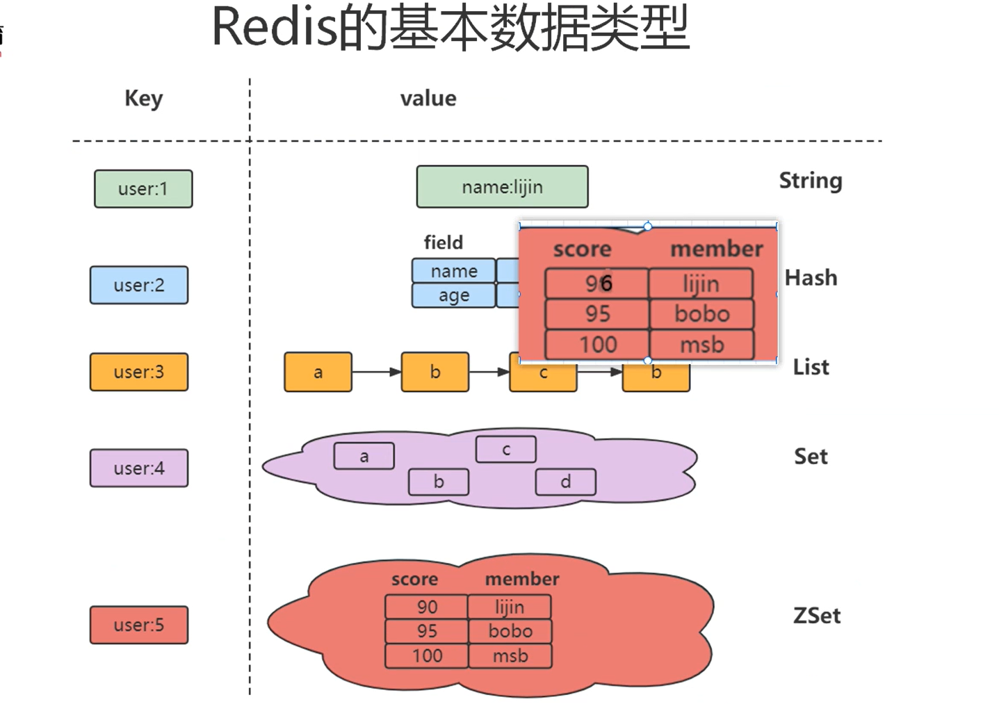

### Redis 全局命令

- keys * --- 查看所有键  生产环境 禁止使用
- keys abc* --- 指定前缀 列出所有key
- set key value -- 添加key-value
- setnx key value -- 添加key-value 只有key不存在时 才能添加成功
- set key value nx -- 同上
- set key value ex 10 nx  --- 高级命令 更优做法， 保证了原子性
- set key value xx -- key已经存在才能设置成功， 否则无法添加key-value, 刚好与nx相反
- dbsize -- 查看key的数量
- exists [key1,key2...] --- 查看key是否存在
- del [key1,key2...] --- 删除key
- expire key seconds --- 设置过期时间(s)
- pexpire key millis --- 设置过期时间(ms)
- expireat key timestamp --- 设置过期在哪个时间点
- ttl key --- (Time To Live)查看过期时间(s) -2表示已过期，已被删除； -1表示未设置过期时间
- type key -- 查看 value 的数据类型
- rename key newkey -- 修改key名称  如果新名字已经存在了， 则会被delete, 然后完成rename
- renamenx key newkey -- 修改key名称  如果新名字已经存在了, 则修改失败
- randomkey -- 随机返回一个key
- flushdb --- 清空数据

### key命名规则
key = 业务名:对象名:id

### 数据类型
String,Hash,List,Set,Zset

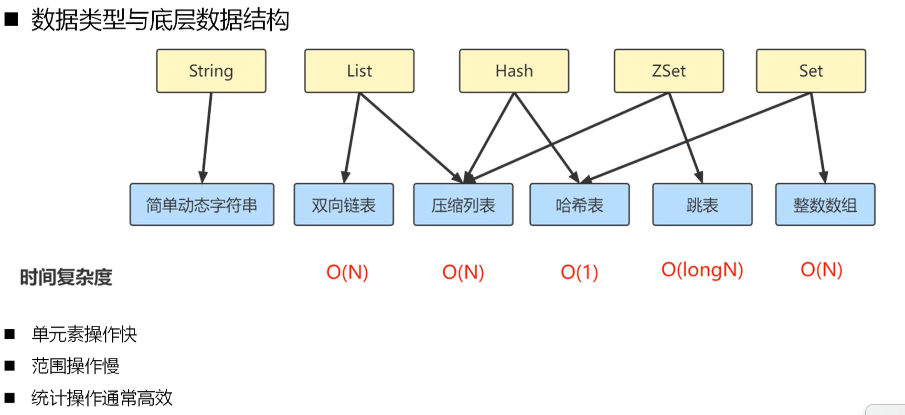

#### String
- set key value -- 添加key-value
- setnx key value -- 添加key-value 只有key不存在时 才能添加成功
- set lock 1 ex 10 nx  --- 高级命令 更优做法， 保证了原子性
- set key value nx -- 同上
- set key value xx -- key已经存在才能设置成功， 否则无法添加key-value, 刚好与nx相反
- append key value -- 在原有的数据上 追加内容
- strlen key --- 返回value长度(字节)
- getset key newValue -- 返回key对应的值， 然后将newValue覆盖原来的值
- setrange key offset value --- 原始值位移offset长度追加/替换 新值
- getrange key start len --- 部分返回内容 start下标开始截取长度len
#### 批量操作
- mset k1 v1 k2 v2 k3 v3...kn vn --- 批量插入
- mget k1 k2 k3 ...kn --- 批量获取

#### 计数器
incr key -- 保存该值 然后 自增
incrby key num -- 增加 num
incrbyfloat key floatNum -- 增加浮点数 floatNum
decr key -- 自减


### Hash类型

key-value

- hset key att1 v1 att2 v2 ...
- hmset key att1 v1 att2 v2 ... [同上 已弃用]
- hsetnx key att1 v1 att2 v2 ... 有值就不会覆盖原有的value
- hdel key att --- 删除属性
- hlen key --- 查看键值对数量
- hmget key att1 att2 ... --- 批量获取vlaue
- hexists key att -- 判断属性是否存在
- hgetall key --- 返回整个键值对， 成对出现。
- hincrby key att --- 对 属性自增1
- type key --- 结果时 hash 


### List
- 有序
- 可重复
- 首尾可插入 --- 可根据次特性实现 消息队列MQ的功能

命令
- rpush key [element...] -- 右侧顺序 开始 push, 也即 第一个插入的元素在最左边
- lpush key [element...] -- 左侧顺序 开始 push, 也即 第一个插入的元素在最右边

- lrange key 0, -1 -- 查询所有
- lpop key --- 弹出做左侧的一个元素
- blpop key [seconds] --- 堵塞式 左侧弹出， 不为空则直接弹出， 否则阻塞等待(最多seconds秒)
- brpop key [seconds] --- 同上
- rpop key --- 弹出最右侧的一个元素
- lrem key size element --- 从左侧开始删除元素element,删除size个
- ltrim key startIndex endIndex --- 裁剪保留 保留到包含endIndex下标的元素
- lset key  index newValue --- 替换下标index的值为newValue
- lindex key index --- 获取下标为index 的元素
- llen key --- 获取其长度
- blpop


### Set
- 无序
- 不可重复
- 可做 并集/交集 计算

命令
- sadd key [element.....] --- 添加元素
- smembers key --- 查看元素
- del key --- 删除所有
- srem key [elements...] --- 删除元素
- scard key --- 查看长度
- sismemeber key --- 查看是否存在 1 存在， 0 不存在
- srandmember key --- 随机返回一个元素
- spop key --- 随机弹出一个元素
- sinter set1 set2 --- 取交集
- sunion set1 set2 --- 取并集
- sdiff set1 set2 --- 取差集 以set1为准去掉相同的部分， **因此需要注意顺序**
- sinterstore newSet set1 set2 --- 取交集 并**存入新Set集合**
- sunionstore newSet set1 set2 --- 同上
- sdiffstore newSet set1 set2 --- 同上
- 


### ZSet
- 有序
- 不可重复

命令
- zadd key [nx | xx] | [score element]... --- 添加一个分数为score的元素element
- zscore key element --- 查看元素分数
- zcard key --- 查看元素个数
- zrank key element --- 查看排名， 分数最小 返回值0， 
- zrevrank key element --- 查看倒序排名， 分数最大 则返回0
- zrem key element --- 删除元素
- zincrby key score element -- 给element增加分数
- zrange key min max --- 范围查询
- zrange key 0 -1 [withscores]--- 表示查询所有[带分数]
- zrange key min max withscores --- 范围查询 并返回分数
- zrevrange key min max with scores --- 同上， 倒叙 返回 顶部的几个 带分数
- zrangebyscorekey key minscore maxscore [withscores] --- 分数范围内查询
- zrangebyscore key -inf +inf [withscores] --- 输出所有 -inf无穷小 +inf无穷大
- zinterstore zsetavg 2 set1 set2 weights 0.5 0.5 --- 交集合并 分数按照权重相加


## Redis的Java常用客户端
- Jedis
- Lettuce
- Redisson --- 优势：基于Netty通信层，异步调用，线程安全，提供了分布式服务(分布式锁，分布式集合，延时队列)


[Redisson文档](https://redisson.pro/docs/)


## 高级数据结构

### Bitmaps

位图

命令
- setbit key bit 1 --- eg setbit key 0 1 设置第一位位1
- getbit key bitIndex --- 查询
- bitcount key --- 统计数量

存储优势


布隆过滤器 --- 是一种设计思想， 主要似乎利用hash计算下标 是命中来确定是否通过。
是结合Bitmaps实现的。
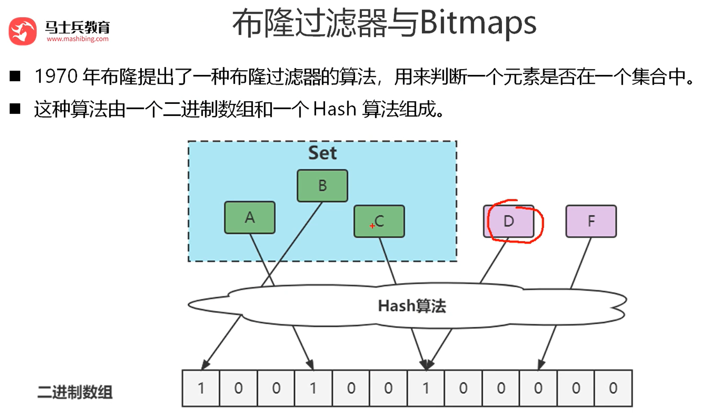
通过Hash计算 不在数组中的一定不在集合中； ---
通过Hash计算  在数组中的 不一定在集合中。

误判的本质是Hash冲突。

优化方案
- 增大数组
- 增大hash函数


可以用在 缓存穿透的问题解决。


### HyperLogLog  -- 高级数据结构(本质是一个字符串)

HyperLogLog基于概率论中 **伯努利试验** 并结合 **极大似然估算方法** 并做了**分桶优化**；
大型互联网网站 每个页面每天的UV数据
标准误差 0.81%

分桶优化：
字符串 --> 64位二进制比特串
低14位 决定放入哪个通 因此共有2^14个桶(16384)
高50位 由低到高第几位是1  就把这个序号的二进制写入桶
所以，桶内最大数 就是高位的最大值50 即 110010 一个6位的二进制


HyperLogLog的三个命令
- pfadd -- 添加数据
- pfcount -- 统计
- pfmerge -- 合并


### GEO 地图


命令
- geoadd key [nx|xx] lon lat member --- 保存
- geopos key [member...] --- 获取位置坐标 经纬度 
- geodist key member1 member2 [M|KM|MI|FT] 计算两地距离
- georadius key lon lat radius unit [withdist][withcoord]  --- 查找半径内的成员
- geosearch key frommember fromlon fromlat BYRADIUS radius [UNIT] WITHDIST
  - eg: geosearch cities FROMLONLAT 15 37 BYRADIUS 200 KM WITHDIST
  


## Redis高级特性与应用


### 慢查询
慢查询的阈值默认10ms  这个时间是指 **执行指令的时间** 不包含网络传输时间
两种方式设置阈值
- 动态设置 如同:redis.conf -> slowlog-log-slower-than 单位是微妙 1000 = 1ms
  - config set slowlog-log-slower-than 10000 -- 设置参数 0 记录所有， <0 则不记录
  - config set slowlog-max-len 128 --- 慢查询日志最大长度,当慢查询日志达到最大长度后，新的记录会覆盖最旧的记录
  - config rewrite -- 写入文件 立即生效
- 配置文件方式(redis.conf)


showlog-max-len --- 最多记录的慢查询的记录树

#### 查看慢查询日志
slowlog get [number] --- 查看最近的慢查询日志 条数； eg: slowlog get 3 -- 单位之间都是微妙
- 日志说明：
  - 第一行  为标识ID
  - 第二行 开启的时间戳
  - 第三行 耗时时间 单位微妙
  - 第四行 执行的指令
  - 第五行 客户端信息 host:port

#### 获取慢查询日志当前长度
slowlog len
#### 清空慢查询日志
slowlog reset


### 慢查询 + 推荐方案
- showlog-max-len 配置 1000以上


#### pipeline 命令

Java codes
```java
@Component
public class RedisPipe {
  private final JedisPool jedisPoolFactory;

  public RedisPipe(JedisPool jedisPoolFactory) {
    this.jedisPoolFactory = jedisPoolFactory;
  }

  public List<Object> pipeFetch(List<String> keys) {
    try (Pipeline pipelined = jedisPoolFactory.getResource().pipelined()) {
      for (String key : keys) {
        pipelined.get(key);
      }
      return pipelined.syncAndReturnAll();// 这里只会向Redis 发送一次请求
    }
  }

  public boolean pipePush(Map<String, String> data) {
    try (Pipeline pipelined = jedisPoolFactory.getResource().pipelined()) {
      for (Map.Entry<String, String> entry : data.entrySet()) {
        pipelined.set(entry.getKey(), entry.getValue());
      }
      pipelined.sync();
      return true;
    } catch (Exception e) {
      e.printStackTrace();
      return false;
    }
  }
}
```


#### Pipeline 与 事务
Redis中的事务是一种 弱事务 只会检查语法，错误的将不被提交， 但正确的将会被正常提交， 它是一种客户端行为，
multi --- 开启事务
exec --- 提交事务


**在 EXEC 执行前，命令是存储在 Redis 服务器的队列中，而不是保留在客户端。**
Redis 有一个专门的事务队列。

Pipeline
- 命令可以在客户端缓冲
- 只是一次发送多个命令，不保证原子性

区别：
- pipeline是客户端行为， 命令缓存在客户端；事务每条命令提交到服务器 放在缓存列表中
- pipeline不是原子性的；事务也不能保证 原子性的， 他是弱事务的


#### Redis 与 LUA
Lua 脚本是 Redis 提供的一种强大功能，允许用户在服务器端执行复杂的原子性操作。

基本特性
- 原子性执行：
  - 整个脚本作为一个整体执行，不会被其他命令打断
  - 执行期间整个服务器被阻塞（单线程模型）
- 高性能：
  - 脚本在 Redis 内部执行，减少网络往返
  - 脚本会被缓存，后续调用更高效
- 语言特性：
  - 使用 Lua 5.1 解释器
  - 内置了许多 Redis 特定功能

LUA好处
- 减少网络开销
- 原子操作
- 复用性

语法
eval script numkeys [key...] [arg...]

批量插入
eval "return redis.call('mset',KEYS[1],ARGV[1],KEYS[2],ARGV[2])" 2 key1 key2 value1 value2

批量删除
```lun
local keys = redis.call('KEYS', ARGV[1])
for i, key in ipairs(keys) do
  redis.call('DEL', key)
end
return #keys
```

Redis 会缓存脚本， 因此通过脚本获取签名sha
script load "return redis.call('mset',KEYS[1],ARGV[1],KEYS[2],ARGV[2])"

再次执行
evalsha "11a283ea447c6dde543b65438fa125b936aca4f0" 2 key3 key4 value3 value 4


### Redis 订阅发布
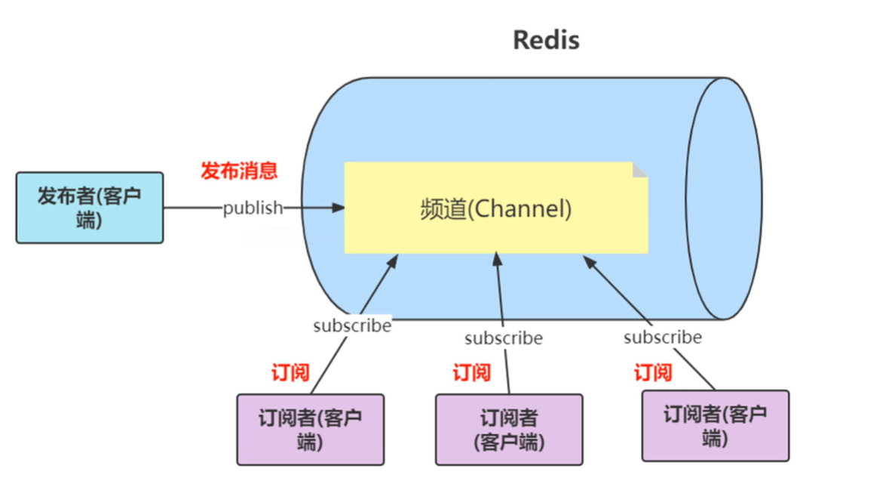

命令
- 发布者 
  - publish topic message
- 订阅者
  - subscribe topic
  
attention: 先订阅 再发布， 否则之前的消息会丢失

- 列出所有channel
  - pubsub channels
- 查看订阅者 数量
  - pubsub numsub topicName

!!!Attention 目前不推荐使用，因为会丢消息， 建议使用stream


### Redis Stream 5.0之后的最大特性
Redis Stream 是 Redis 5.0 引入的一种新的数据结构，专门为消息传递和事件日志场景设计，它结合了日志数据结构的持久性和消息队列的灵活性。
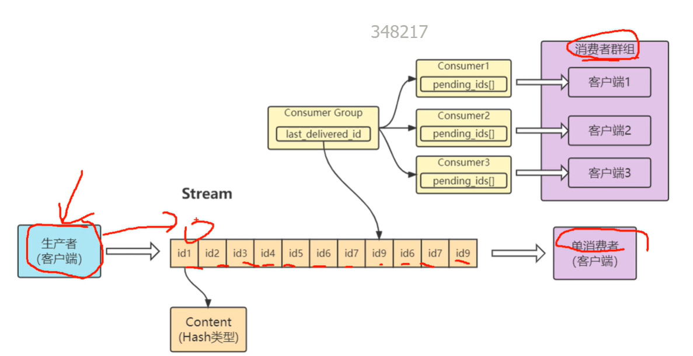


核心特性
- 持久化消息日志：
  - 所有消息都会被持久化存储
  - 支持消息历史追溯
- 消费者组模式：
  - 支持多消费者协同消费
  - 提供消息确认机制
- 高性能：
  - 基于内存的高吞吐量
  - 时间复杂度 O(1) 的追加操作

命令(生产者):
添加消息
> XADD stream [MAXLEN [~|=] count] *|ID field value [field value ...]
> eg: XADD mystream * sensor-id 1234 temperature 19.8

星号*表示，ID由redis生成

获取流长度
> XLEN stream

删除消息
> XDEL stream ID [ID ...]

查看概览信息
> xinfo stream streamName --- 查看stream 概览信息

命令(消费者):
读消息
> XREAD [COUNT count] [BLOCK milliseconds] STREAMS key [key ...] ID [ID ...]
> eg: XREAD COUNT 2 BLOCK 10000 STREAMS mystream 0 
> --- count 2 表示读取2条消息 
> --- block 10000 单位ms, 表示 阻塞等待10s; 0 表示一致阻塞等待
> --- mystream 表示读取具体哪个 stream
> --- 0 或者0-0 表示从头开始
> --- 最后一个参数也可以是ID 不包含这个ID的 之后的数据
> --- $ 从尾部读，一般需要阻塞等待 

xread count 1 block 1000 streams stream-wsf $


按范围查询
> XRANGE stream start end [COUNT count]
> eg: xrange stream-wsf 1750069418674-0 + --- 查看包含ID及其之后的数据
> xrange stream-wsf - 1750069418674-0 --- 查看包含ID及其之前的数据


MQ的特点
- 解耦
- 异步
- 削峰


Stream Group

创建消费者组
xgroup create streamName groupName 0-0
xinfo stream streamName --- 查看stream 概览信息
xinfo group streamName --- 查看群组信息

消费者组读取
xreadgroup group groupName consumerName count [count] streams streamName >

确认Group消息
xack streamName groupName ID

查看待处理消息
> xpending streamName groupName [start] [end] [count]
> eg: xpending stream-wsf cg1 0 + 10


#### ReHash
Rehash的I/O阻塞问题
采用两张全局哈斯表
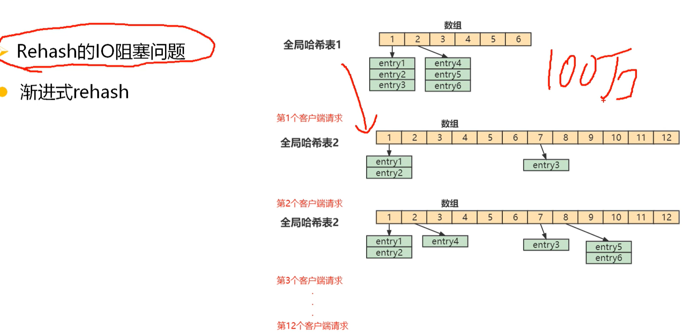


## Redis的持久化

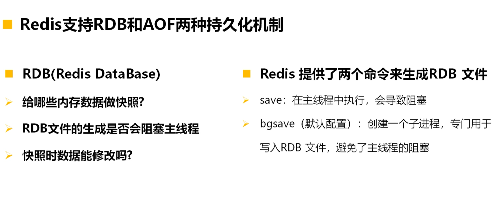


RDB (Redis Database)
- 二进制快照
- 紧凑的单一文件，适合备份和灾难恢复
- 默认持久化方式：在 redis.conf 中默认启用

命令
- 手动
> save --- 阻塞式保存 <br/>
> bgsave --- 非阻塞式 后台线程保存(专门写入RDB文件)<br/>

- 配置文件： save 相关配置
  - 自动机制： 1， shutdown
  - 从节点执行全量复制操作， 主节点自动执行bgsave生成一个RDB文件发给从节点


AOP (Append only file)


Redis启动之后的数据加载流程
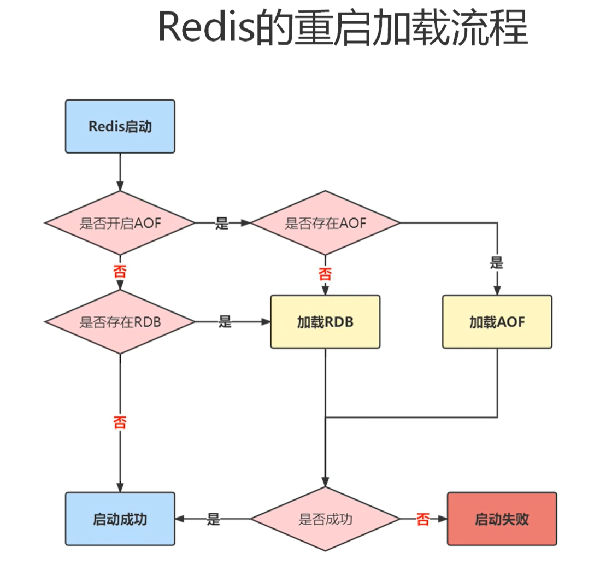


混合模式保存数据
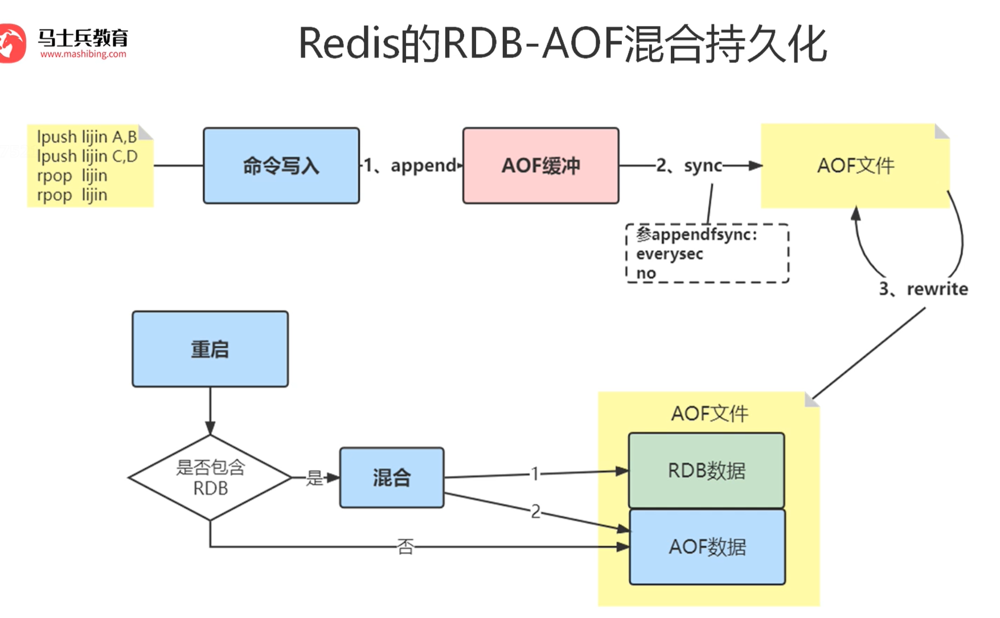


## Redis 分布式锁


setnx lock 1
set lock 1 ex 10 nx  --- 高级命令 更优做法， 保证了原子性

Lua脚本保证安全性 与 原子性
```lua
if redis.call("get", KEYS[1]) == ARGV[1] then
  return redis.cals("del", KEYS[1])
else
  return 0
end
```


### 分布式锁 + 看门狗


## Redis 主从集群

查看主从复制的相关信息
> info replication

设置从节点
- 命令行
  - slaveof [master's host]  port

从变主
> slave no one  --- 断开主从关系， 并晋升为主节点

config set/get slave-read-only


主从复制步骤
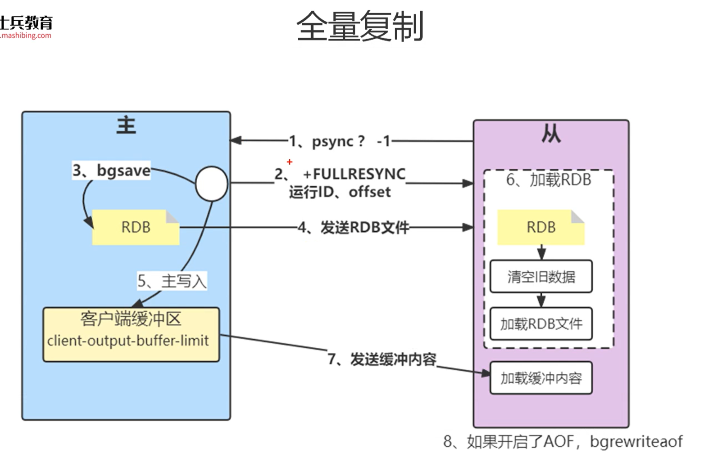


### 哨兵机制Sentinel

sentinel 配置
sentinel monitor mymaster host port 2 --- 数组2表示 判断故障树达到2个则判断为 下线
sentinel down-after-milliseconds mymaster 3000   --- 每秒1次ping 超过3s 无回复就判断为下线

三个哨兵， 谁先达到了 故障判断的数量， 谁成为sentinel领导者，负责 故障转移


### 各种分区方案
- 哈希分区
- 节点区域分区
- 一致性哈希分区
- 虚拟一致性哈希分区


## 缓存使用的问题

### 缓存穿透

- 布隆过滤器
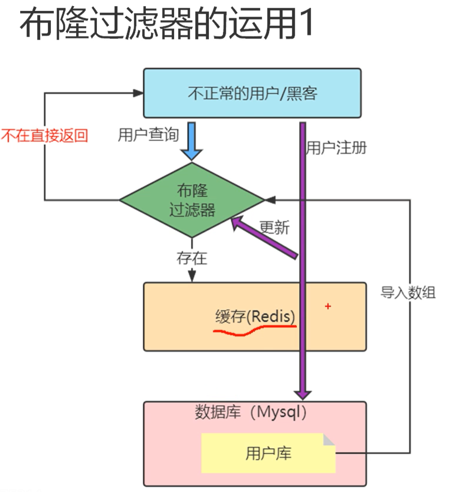

- 缓存击穿 --- 大量请求击中了某个key, 针对的是 某个key的失效
解决办法：
  - 热点的key 永久有效

```codes
public String get(key) {
  String value = redis.get(key);
  if (null == value) {
    if (redis.setnx(key, mutext, 1, 3000) == 1) {
      value = db.get(key);
      redis.set(key, value, expire_time);
      redis.del(key_mutext);
    } else {
      sleep(50);
      return get(key);// 重试
    }
  } else {
    return value;
  }
}
```

### 缓存雪崩
大量的key集中失效， 导致大量请求 达到数据库， 导致服务器宕机

解决办法：
- 集群 + 主从
- 服务降级/熔断
- 限流
- 多层缓存 memcache/ehcache 在本地再加一层缓存


### 热点Key
特点key 访问频繁，导致某个节点 处理大量请求， 压力过大 导致宕机可能
hotkeys 命令

配置
config set maxmemory-policy volatile-lfu

查看热点key -- 全局命令
redis-cli --hotkeys --askpass

抓TCP的包（Redis服务器）
- 成本高(ELK packetbeat插件)
- 机器网络波动
- 维护成本高


解决热点Key
- 二级缓存 （Guava-cache, hcache, JVM对象-内存）
- Key分散(子key)


### BigKey
本质上是 大value 的问题(10KB)

危害
- cluster 节点内存空间使用不均匀
- Big value耗时->阻塞->超时
- 网络拥塞， 


如何发现
redis-cli --bigkeys --- 查看big value, 性能差 不推荐
debug object bigkey
scan [start index] count [count]


解决
- 拆分


### 哨兵主从脑裂
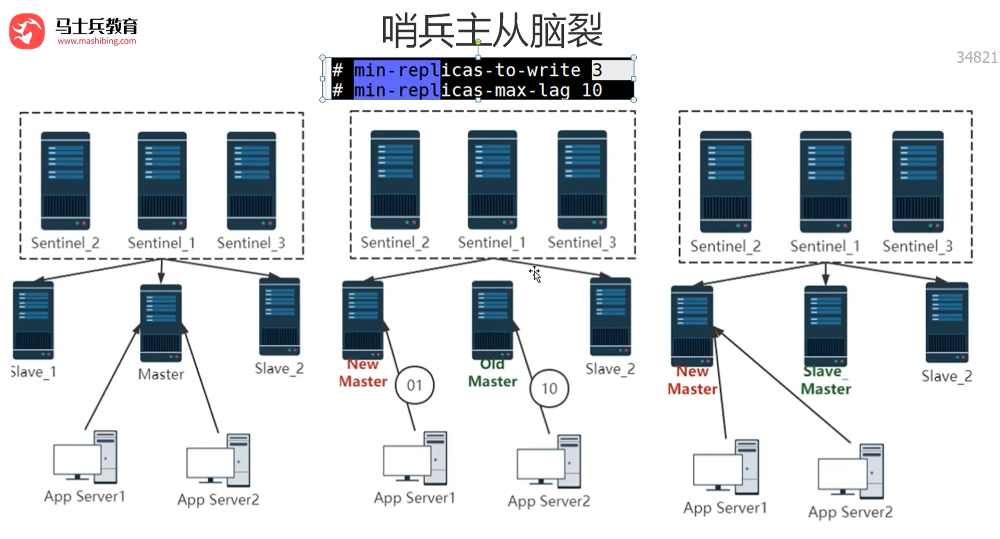

命令：
- min-replicas-to-write <number>
eg: min-replicas-to-write 3 --- 数字3表示写入多少个从节点 代表写入成功
设置：CONFIG set min-replicas-to -write 3
解释：
当设置为1时，表示至少要有1个从节点连接并同步，主节点才会接受写操作


- min-replicas-max-lag <seconds>
eg: min-replicas-max-log 10
设置： CONFIG SET min-replicas-max-lag 10
解释： 当设置为10时，从节点的复制延迟不能超过10秒

使用场景
- 数据安全性要求高的环境：确保数据至少写入一个从节点
- 金融交易系统：防止主节点故障导致数据丢失
- 关键业务系统：保证故障转移时有最新数据


### 多级缓存架构
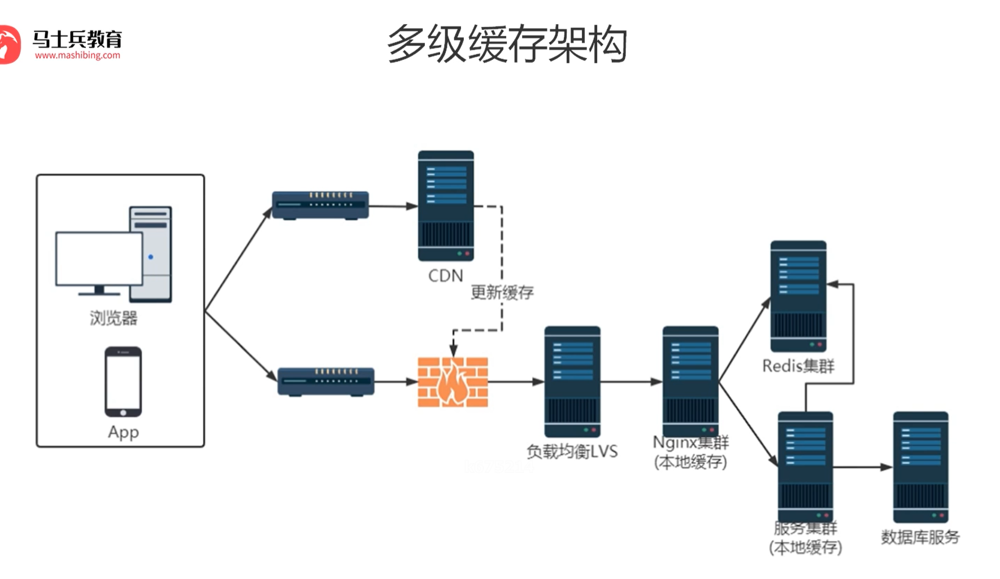


### 协程金融缓存方案
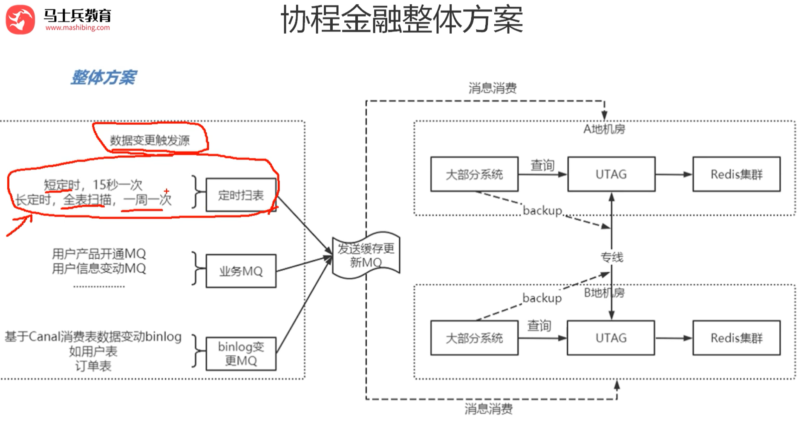


## 设计与实现
### 数据结构与内部编码实现

config get maxmemory --- 0 表示不限制

内存淘汰策略和算法

Redis 内存淘汰策略
config get maxmemory-policy
- noeviction --- 存储大小超过上面排至的maxmemory, set操作将会被禁， 只能get/del 操作， 确保已有的数据 不丢失
- volatile-lru --- 设置了ttl的 对最少使用的进行淘汰 least recent use
- volatile-ttl --- ttl越小，表示距离过期时间越近 的优先淘汰
- volatile-random --- 设置了ttl的， 进行随机淘汰
- allkeys-lru --- 对所有的key 最少使用的进行淘汰
- allkeys-random --- 对所有的key 随机进行淘汰

- volatile-lfu --- 根据热点数据值  访问次数
- allkey-lfu --- 

采样多少个进行淘汰
config get maxmemory-samples


淘汰算法
- LRU算法 --- 最近最少使用
- 近似LRU算法 ---  近似最近最少使用算法
- LFU算法 --- 热点值/访问频次


System.currentTimeMillis() --- 系统的时间戳
应用->内核 调用 （耗时 涉及上下文切换 切换一次需要10微妙）
Redis 执行一个命令大概用时 100 纳秒 (1000纳秒=1微妙， 1000微妙=1毫秒)


定时删除原理（贪心策略）
Redis 启动一个定时任务
1. 每秒扫描10次
2. 随机20个key, 删除其中过期的
3. 过期的key比率1/4 < 5个以上 --> 进行第二部操作

因此， 同一时期有大量的key到达过期时间， 则这个定时任务会一致进行第二部操作， 效率降低
同时： 主从架构的情况下， 从图的过期策略 不会执行， 只会同步主库的数据

惰性删除 LazyFree
1. 主线程标记key为delete=true
2. 后台线程(BIO)异步执行实际的内存释放操作
3. 主线程处理其他命令请求


## 分布式锁 实战

加锁
> set key value ex 10 nx  --- 高级命令 更优做法， 保证了原子性<br/>

释放锁(直接删除)
> del lockKey<br/>

防止别人释放锁
控制在业务端进行， value保存当前的线程信息或者其他可以标识的信息。
> get lockKey --- 通过命令拿到value后判断 是自己则可以删除-释放

Lua脚本保证安全性 与 原子性
```lua
if redis.call("get", KEYS[1]) == ARGV[1] then
  return redis.cals("del", KEYS[1])
else
  return 0
end
```

锁续期 + 守护线程执行需求操作

单点故障的问题 解决方案
- 主从+哨兵
- 集群 - 红锁ReadLock