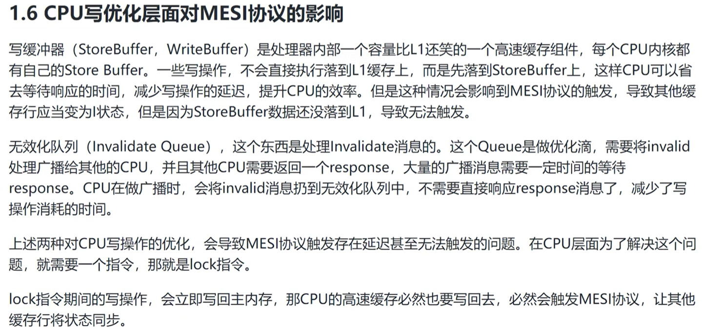
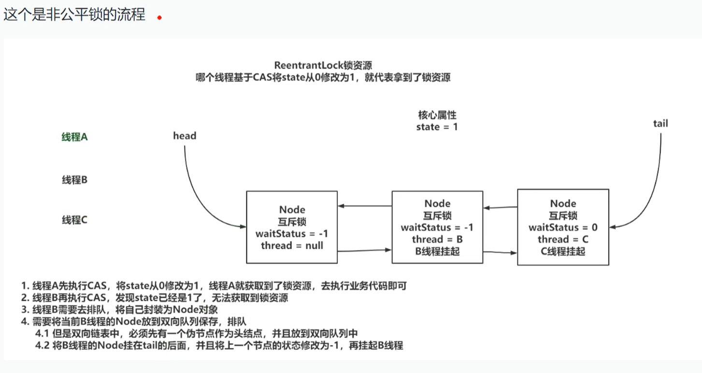
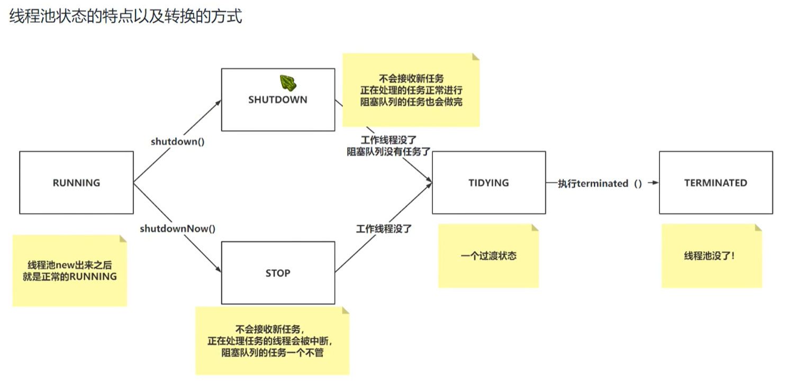

# MCA 多线程

## 多线程

### 线程的强占 - join
如果main线程中调用了t1.join(), 那么main线程会进入到等待状态，等待t1线程执行完毕，再恢复到就绪状态等待CPU调度。

通过t1.join(seconds), 等待时间还没到 t1就执行完毕了，那么main线程会立即进入就绪状态， 等待CPU调度


### 守护线程
**默认情况下 所有线程都是 非守护线程**

**JVM会在 程序中没有非守护线程时，结束掉当前JVM**

主线程默认是 非守护线程， 如果主线程执行结束， 需要查看当前JVM中是否还有非守护线程， 如果没有JVM直接停止。

守护线程随着 JVM的结束而结束， 当然 他跟普通线程一样 也可以自行结束

//设置为守护线程
thread.setDaemon(true)


当在一个守护线程中 创建的线程 默认是守护线程

守护线程不应该访问/写入持久化资源， 如文件，数据库等 因为他可能岁时被停止。这样就会导致资源未释放，数据库写入中断等问题。


### MESI 保证缓存一致性
M Modify
E Exclusive
S Shared
I Invalid

MESI协议对不同的状态郑家了不同的监听任务 针对 高速缓存行

- 一个处于M状态的缓存行，必须时刻监听所有试图读取当前缓存行对应的主内存数据地址的操作。
  如果监听到其他内核要读取这个数据时， 必须在读取操作之前先将该缓存行数据写回主内存。
- 一个处于S状态的缓存行，必须时刻监听该缓存行 无效 或者  独占 当前缓存行的请求，
  如果监听到 将当前缓存行的状态置为I.
- 一个处于E状态的缓存行，必须时刻监听试图读取 当前缓存行对应的内存地址的操作，如果监听到，当前缓存行状态修改为S.




### JMM-Java内存模型

Java Memory Model Java内存模型是一个语言级别的内存模型抽象，屏蔽了底层硬件实现内存一致性需求的差异， 提供了对上层统一的接口来保证内存一致性的编程能力。

Java 是一个跨平台语言， java内存模型就是一个中间层模式，他适配了不同的底层硬件系统，设计中间层模型来做屏蔽。

任何语言编写出来的程序，最终都会转换为机器执行的指令，按照一定的顺序来执行，所以语言层面，都是基于硬件层面提供的一致性模型的基础上，来实现自身语言的功能和特性。

经过前面对CPU的分析
- Java利用会汇编的CAS+lock前缀指令来实现原子性。(synchronized, ReentrantLock)
- Java利用lock前缀指令+MESI协议来实现可见性。(volatile)
- Java基于内存屏障转换为lock前缀指令来实现有序性。(volatile)


## 并发编程的三大特性
- 原子性
- 可见性
- 有序性


### 原子性
JMM(Java Memory Model)
Java为了解决相同代码在不同操作系统上出现的各种问题， 用JMM屏蔽掉各种硬件和操作系统带来的差异。

让Java的并发编程可以做得到跨平台。

JMM规定所有变量都会存储到就主内存中，在操作的时候，需要从主内存中复制到线程内存(CPU内存)，在线程内部做计算。
然后在写回到主内存中（不一定！！！）。


### 保证并发编程的原子性
#### synchronized 同步代码块的方式 保证原子性

#### CAS  性能比synchronized效率高

Compare and Swap 比较交换，CPU级别的并发原语。
他在替换内存中的某个位置的值时，首先查看内存中的值与预期值是否一致，如果一致，执行替换操作，这个操作是一个原子性操作。

Java中基于Unsafe的类提供了对CAS的操作的方法，JVM会帮助我们将方法实现CAS汇编指令。
但是要清楚 CAS只是比较和交换， 在获原值的这个操作上，需要你自己实现。
eg: AtomicInteger

```java
public class CASThreadTest {
    
    // 基于Java - Unsafe类 提供了对CAS的操作的方法， 来保证原子性
    static AtomicInteger number = new AtomicInteger(0);
    public static void main(String[] args) throws Exception {
        // 开启一个线程 循环100次 自增操作
        Thread thread1 = new Thread(() -> {
            for (int i = 0; i < 100; i++) {
                number.incrementAndGet();
            }
        });
        // 开启一个线程 循环100次 自增操作
        Thread thread2 = new Thread(() -> {
            for (int i = 0; i < 100; i++) {
                number.incrementAndGet();
            }
        });
        thread1.start();
        thread2.start();
        thread1.join();
        thread2.join();
        System.out.println(number.get()); // 输出 200
    }
}
```


CAS 的缺点：
- 只能保证对一个变量操作的原子性，无法实现对多行代码实现原子性

CAS 的问题
- ABA问题， 可以引入版本号的问题， 来解决ABA的问题， Java提供了一个类AtomicStampedReference<T>引入版本控制的方法
- 自旋时间过长， 可以指定CAS一共循环多少次，超过一定次数，直接失败即可。（自旋锁）


ABA 问题解决
```java
public class CASThreadTest2 {

    public static void main(String[] args) {
        // 基于Java -  提供了引入版本比较的操作的方法， 来保证原子性
        AtomicStampedReference<String> string = new AtomicStampedReference<>("AAA", 1);

        String oldValue = string.getReference();
        int oldVersion = string.getStamp();

        boolean resultA = string.compareAndSet(oldValue, "NewValue-A", oldVersion, oldVersion + 1);
        System.out.println("NewValue-A, 2, 写入结果=" + resultA);

        // 将对expectedReference, expectedStamp 都做校验，如果跟原有的不一致，则本次处理失败 resultB = false
        boolean resultB = string.compareAndSet("NewValue-A", "NewValue-B", oldVersion + 1, oldVersion + 2);
        System.out.println("NewValue-B, 2, 写入结果=" + resultB);

    }
}
```

#### Lock 并发较大的情况下 性能比synchronized更优

JDK1.5 性能比synchronized强很多多
JDK1.6 对synchronized优化后，性能差不多
涉及到并发比较大时，推荐 ReentrantLock锁会更好。


#### ThreadLocal
ThreadLocal保证原子性的方式，是不让多线程去操作临界资源，让每个线程去操作属于自己的数据。


### 可见性

#### volatile是一个关键字， 用来修饰成员变量。
如果属性被volatile修饰，相当于告诉CPU，对当前属性的操作，不允许使用CPU的缓存，必须去和主内存操作。

volatile 内存语义
- volatile属性被写：当写一个volatile变量，JMM会将当前线程对应的CPU缓存及时刷新到主内存中。
- volatile属性被读：当读一个volatile变量，JMM会将对应的CPU缓存中的内存设置为无效，必须去主内存中读取共享变量。

其实加了volatile就是告知CPU，对当前属性的读写操作，不允许使用CPU缓存，加了volatile修饰的属性，会再转为汇编之后，追加一个lock前缀，CPU执行这个指令时，如果带有lock前缀会做两个事情：
- 将当前处理器缓存行的数据写回到主内存
- 这个写回的数据，在其他CPU内核的缓存中，直接无效

#### synchronized 同时可以解决可见性问题（也解决原子性问题）

synchronized 内存语义：
如果涉及到synchronized的同步代码块或者同步方法，**获取锁资源之后**，将内部涉及到的变量从CPU缓存中移除，必须去主内存中重新拿数据，而且在释放锁之后，会立即从CPU缓存中的数据同步到主内存中。

```java
public class VisibilitySynchronizedTest {

    private static boolean flag = true;
    public static void main(String[] args) throws InterruptedException {

        new Thread(() -> {
            while (flag) {
                // synchronized同步代码，**获取锁资源之后**，将内部涉及到的变量从CPU缓存中移除，必须去主内存中重新拿数据，而且在释放锁之后，会立即从CPU缓存中的数据同步到主内存中。
                synchronized (VisibilitySynchronizedTest.class) {

                }
            }
            System.out.println(Thread.currentThread().getName() + "结束了");
        }).start();

        Thread.sleep(1000);
        flag = false;
        System.out.println("主线程 end");

    }
}
```

#### Lock锁 来保证可见性
与synchronized完全不同，

如果对volatile修饰的属性进行写操作，CPU会执行带有lock前缀的指令，CPU会将修改的数据，从CPU缓存立即同步到主内存，同时也会将其他的属性也立即同步到主内存中，
**同时也会将<font color=red>其他的属性</font>立即同步到主内存中**。还会将其他的CPU缓存行中的数据设置为无效，必须重新从主内存中拉取。


### 有序性

指令乱序执行的原因，是为了尽可能的发挥CPU的性能。

指令重排的两个层面
- CPU
- JVM

```java
public class FactoryWithVolatileTest {

    // 单例模式中 保证test实例过程的原子性 使用volatile即可
    private static volatile FactoryWithVolatileTest test = null;

    public static FactoryWithVolatileTest getInstance() {
        if (null == test) {
            synchronized (FactoryWithVolatileTest.class) {
                if (null == test) {
                    // 此时第一步现在 顿内存开辟一块内存空间 赋给test引用的指向 尚未完成对象的初始化，
                    // 以下三步 不是原子性的 因此存在指令重排的可能
                    // 1 堆内存开辟空间
                    // 2 test 指向
                    // 3 初始化test对象
                    test = new FactoryWithVolatileTest();
                }
            }
        }
        return test;
    }
}
```


#### as-if-serial CPU
as-if-serial 语义：
不论指令如何重排序，需要保证单线程的程序执行结果是不变的。

如果存在以来的关系，那么也不可能出现指令重排
eg:
int a = 0;
a++;

int x = 1;
x = x + 5;
x = x * 10;

#### happens-before JVM


#### volatile
如果需要让某个属性的操作不出现指令重排， 除了满足happens-before原则之外，还可以基于volatile修饰属性，
从而对这个属性的操作，就不会出现指令重排的问题了。

volatile如何实现的禁止指令重排？
内存屏障的概念。将内存屏障看成一条指令。
会在两个操作之间，添加上一道指令， 这个指令就可以避免上下执行的其他指令进行重排序。


## 锁

### 锁的分类

- 可重入/不可重入锁
- 乐观锁 悲观锁
- 公平锁 非公平锁
- 互斥锁 共享锁


#### 可重入锁/不可重入锁
Java中提供的 synchronized, ReentrantLock, ReentrantReadWriteLock 都是可重入锁。
重入： 当前线程获取到A锁， 在获取锁之后再次尝试获取A锁是可以直接拿到的。
不可重入：当前线程获取到A锁，在获取后尝试再次获取A锁，无法获取到，因此A锁被当前线程占用着，需要自己释放后，才能再次获取锁。

```java
class Test {
    Test test = null;
    public Test getInstance() {
        if (null == test) {
            synchronized (Test.class) {
                // 可以再次获取锁， 就叫 可重入锁
              synchronized (Test.class) {

              }
            }
        }
     }
}
```

#### 乐观锁/悲观锁

Java中提供的 synchronized, ReentrantLock, ReentrantReadWriteLock 都是可悲观锁。

Java中提供的CAS操作，就是乐观锁的一种实现。 Atomic原子性类中 就是基于CAS乐观锁的实现。        


悲观锁： 获取不到锁资源时，都会将当前线程挂起（进入BLOCKED,WAITING）


#### 公平锁/非公平锁
synchronized 只能是非公平锁

公平锁：就是先到先得， 排队也有顺序。
线程A拿到锁资源，线程B去排队，此时线程C来了，锁被A持有，同时线程B在排队，则C直接排到B后边，等待B拿到锁资源或者B取消后，才可以尝试去竞争锁资源。


非公平锁：新线程首相尝试竞争一下锁资源， 拿到了 则插队成功，否则依旧排队 顺序竞争锁资源(同公平锁竞争逻辑)。


#### 互斥锁/共享锁
synchronized/ReentrantLock是互斥锁
ReentrantReadWriteLock 有互斥锁也有共享锁。

互斥锁：同一时间点，只会有一个线程持有 当前互斥锁。
共享锁：同一时间点，当前共享锁可以被多个线程同时持有。


### 锁

#### 深入理解 synchronized
一般就是 同步方法 和 同步代码块， 基于对象实现的。

#### synchronized 特性（基于重量级锁）


#### synchronized的优化（JDK1.6）
 
- 锁消除：同步代码块中， 如果 不存在操作临界资源的情况，会触发锁消除。
- 锁膨胀：一个循环中 频繁的获取和释放锁资源，这样会消耗很大，锁膨胀就是将锁的范围扩大，避免频繁的竞争和锁资源带来不必要的消耗。
- **锁升级**：

无锁、逆向偏向
偏向锁
轻量级锁
重量级锁---就是传统的synchronized实现方式


#### 深入理解 ReentrantLock

区别
- ReentrantLock 是个类， synchronized是一个关键字，都是JVM层面实现互斥锁的方式。
- 竞争比较激烈的情况下， 推荐ReentrantLock， 不存在锁升级的过程。
- 实现方式不同： ReentrantLock基于AQS实现， synchronized基于ObjectMonitor

- ReentrantLock支持公平锁和非公平锁。
- ReentrantLock可以指定等待锁资源的时间。


#### AQS AbstractQueuedSynchronized
- state：ReentrantLock需要获取锁资源，需要将state基于CAS的方式，从0改为1，就代表获取锁资源成功了，state=0表示没有线程持有锁资源，大于0 表示有线程持有锁资源。
- 同步队列（双向链表）：获取ReentrantLock锁资源，当时当前锁资源被其他线程池有了，当前线程就需要排队等待，在同步队列中去排队。
- 单向链表：当持有ReentrantLock锁的线程，执行了await之后，会将持有锁的线程封装为Node，释放锁资源，扔到这个单向链表里，等待被signal唤醒，唤醒后就扔回到同步队列中。


### 非公平锁枷锁流程




## 线程池

### 什么是线程池？
开发中，为了提升效率的操作，我们将一些业务使用多线程的方式执行。


### newFixedThreadPool 线程个数是固定的线程池， 线程是懒加载

- 线程的创建是**懒加载**的方式 创建。
- 创建的任务 放到LinkedBlockingQueue无界队列中。
- LinkedBlockingQueue.take()任务，然后执行。

```java
public class FixedThreadPoolTest {
  public static void main(String[] args) {
    ExecutorService threadPool = Executors.newFixedThreadPool(1);

    threadPool.submit(()->{
      System.out.println(Thread.currentThread().getName()+"---task 1 ---running");
      try {
        Thread.sleep(2000);
      } catch (InterruptedException e) {
        throw new RuntimeException(e);
      }
    });
    threadPool.submit(()->{
      System.out.println(Thread.currentThread().getName()+"---task 3 ---running");
    });
    threadPool.shutdown();
  }
}

```


### newSingleThreadPool 单例线程池

- 内部依旧是 构建了ThreadPoolExecutor, 并设置线程个数为1
- 阻塞队列中的任务顺序就是 工作线程处理的顺序；
- 当前这种线程池， 可以用作顺序处理的一些业务中。


!!! Attention !!!
如果局部变量 仅限当前线程池使用的线程池，使用完之后一定记得shutdown(), 否则线程不能被销毁，
```java
public class FixedThreadPoolTest2 {
    public static void main(String[] args) {
       testThread();
    }

    private static void testThread() {
        // 局部变量线程
        ExecutorService threadPool = Executors.newFixedThreadPool(2);
        for (int i = 0; i < 200; i++) {
            threadPool.submit(() -> {
                System.out.println(Thread.currentThread().getName() + "---task 1 ---running");
            });
        }
        // 局部变量线程是 处理此案成任务，使用完后一定记得 shutdown, 否则线程不会被立即
        threadPool.shutdown();
    }
}
```

全局的线程池变量， 则不需要shutdown(),因为其他业务也要用到该线程池。


### newCachedThreadPool() --- 缓存线程池

- 每次提交一个任务 都会构建一个工作线程处理（有空闲线程这直接使用该 工作线程处理任务， 否则创建一个新线程）
- 空闲线程60s没有新任务，则被回收

最大的特点：任务只要提交到当前的newCachedThreadPool中，就必然有工作线程可以处理


### newScheduleThreadPool() --- 定时任务的线程池， 基于DelayQueue实现的延迟执行。

- execute() --- 普通执行方法
- scheduleAtFixedRate(Runnable, delay, period, TimeUnit) ---  延时 周期性循环执行任务(任务执行时间包含在 时间间隔 中)
  需要注意的是， 当线程执行的时间大于 period时，上一个线程任务结束后立即执行下一个任务。
  同时需要注意的时，并不是在一个线程执行循环任务， 也并不是永远新创建线程 执行任务。

- scheduleWithFixedDelay --- 周期执行， 等待任务结束后再计算时间 (任务执行时间不包含在 时间间隔 中，任务执行完再间隔等待时间执行下一个任务)


### newWorkStealingPool 与之前的线程池 有很大的区别。
以上 定长/单例/缓存/定时 线程池都是基于ThreadPool实现的；
该方法时基于 ForkJoinPool 构建的。

大任务，分割成多个小任务执行，执行结束后再 合并结果， 提高效率。


### ThreadPoolExecutor 属性介绍

- int corePoolSize --- 核心线程数，任务执行结束后，该线程并不会被销毁
- int maximumPoolSize --- 最大工作线程数, 当前线程池中， 最多可以有多少个 工作线程
- long keepAliveTime --- 非核心工作线程 在阻塞队列位置等待的时间， 超过时间，则直接被销毁
- TimeUnit --- 等待时间单位
- BlockingQueue<Runnable> --- 任务在没有核心工作线程处理时，任务先扔到阻塞队列中
- ThreadFactory --- 构建线程的线程工作
- RejectedExecutionHandler --- 当线程池无法处理投递过来的任务时，执行当前的拒绝策略。


### ThreadPoolExecutor 应用介绍


#### RejectedExecutionHandler 拒绝策略介绍
```java

public class CustomizedThreadPoolExecutor {
    public static void main(String[] args) {
        ThreadPoolExecutor threadPoolExecutor = new ThreadPoolExecutor(
                2, // 核心线程数
                5, // 最大线程数
                10, // 阻塞队 获取执行任务的列等待时间
                TimeUnit.SECONDS, // 时间单位
                new ArrayBlockingQueue<>(5), // 任务的阻塞队列
                new ThreadFactory() { // 创建线程的 工厂类
                    @Override
                    public Thread newThread(Runnable r) {
                        Thread thread = new Thread(r);
                        thread.setName("WSF-Name");
                        return thread;
                    }
                },
                /*
                 * AbortPolicy 拒绝策略，无法处理任务时，直接抛异常
                 * DiscardPolicy 线程池无法处理任务时，直接丢弃。
                 * DiscardOldestPolicy 线程池无法处理任务时，将队列中最早的任务丢掉，再次将当前任务交给线程处理。
                 * CallerRunsPolicy 线程池无法处理任务时，把任务交给调用者处理
                 * 也可以自定义。。。
                 */
                new RejectedExecutionHandler() {
                    @Override
                    public void rejectedExecution(Runnable r, ThreadPoolExecutor executor) {

                    }
                });
    }
}
```

#### 线程池状态



#### ThreadPoolExecutor.execute(Runnable) 方法介绍
线程池提交任务的核心方法


### 线程池的核心参数 设计规则


## JUC - java.util.concurrent 并发编程


### ConcurrentHashMap 线程安全的key-value集合

涉及到多线程操作key-value结构时， 使用ConcurrentHashMap
单线程操作key-value结构，使用HashMap

ConcurrentHashMap 存储结构是： 数组 + 链表 + 红黑树

链表大于8 并且 数组 > 64 时， 这个链表会变为 红黑树 结构


数组下标（即确定键值对存储在哪个桶）的计算 是通过 哈希值 和 数组长度 的位运算完成的：
len - 1 的与运算，保证了**所有低位信息，减少hash冲突**
```java
int hash = spread(key.hashCode());

// 二次Hash 减少hash冲突
// spread() 方法（JDK 实现示例）：
static final int spread(int h) {
    return (h ^ (h >>> 16)) & HASH_BITS; // 异或并掩码处理
}

// 计算桶的下标
int index = (table.length - 1) & hash;
```

关键字 transient 不会被序列化
```java
public class User implements Serializable {
    private String username;
    private transient String password;  // 不会被序列化
    
    // 其他代码...
}
```

### CHM 扩容与协助扩容

第一个来扩容的线程会优先修改sizeCtl的值， 将其修改为一个<-1的值
其他来协助扩容的线程 发现sizeCtl<-1, 直接对sizeCtl做 + 1操作，代表协助扩容. 
0 表示 数据还没初始化
-1 表示正在扩容， 
-2 表示有1个线程正在扩容， 
-3 表示有2个线程正在扩容.
修改sizeCtl的操作是基于CAS完成的。

扩容线程 来初始化新数组
协助扩容线程 是来帮助将老数组的数据迁移到新数组中。


void treeifyBin() 方法 第一步判断如果**链表长度大于8 并且 数组长度 小于64 ， 则首先触发 扩容操作**。

数组扩容transfer(), 首先计算步长， ((arr.len >>> 3) / NCPU) 如果大于 16 则使用该值， 否则 步长为16

### CHM查询数据流程
ConcurrentHashMap本来就是为了JVM缓存使用的。 对查询速度要求极高。所以查询操作永远不会阻塞。


### CHM 数据插入流程

sizeCtl

### 红黑树
红黑树是一种**自平衡二叉树**，
特点：
- 左子树和右子树的高度差不超过1， 超过了则基于左旋/右旋操作实现自平衡
- 每个节点 必须是 红色或者黑色
- 根节点必须是 黑色
- 如果当前节点时红色，子节点必须是黑色
- 所有叶子节点 都是黑色
- 从任意一个节点 到每个叶子节点的路径中， 黑色节点的数量 一致
- 左旋，即根节点向 左侧倒。

- 红黑树的迁移过程时基于 双向链表的


### CHM TreeBin的锁操作
- 如果读线程正在读取红黑树的数据， 写线程要阻塞
- 如果写线程正在操作红黑树（做平衡），读线程不会阻塞，会读取双向链表的数据
- 读读不会阻塞！
- 写写，不存在并发操作，因为操作桶这一步已经synchronized 了
- 


### TreeBin 红黑树--双向链表 转换


### CHM 基于相同key的oldValue 做一些操作
compute 
computeIfPresent
computeIfAbsent

### CHM - put/replace
put(key,value) 相同的key替换value --- 线程不安全
replace(key, value) --- 线程安全  推荐
要求： key必须存在， 替换时 会先比较 oldValue,只有oldValue一致，才会执行替换操作。


### CHM - merge(key, value, Function<oldValue, newValue>)

- key 不存在时 --- 直接存入value, 忽略function内容
- key 存在 && function返回值不为null --- 新value覆盖旧value
- key 存在 && function 返回值为null --- 该key-value直接被删除


## JUC - CopyOnWriteArrayList 并发集合

### CopyOnWriteArrayList 介绍
- 线程安全的 集合ArrayList
- 基于Lock锁(ReentrantLock)和数组副本的形式来保证线程安全的
- 写数据发生时，需要先获取lock锁，需要复制一个副本数据，将数据插入到副本数组中，将副本数组赋值给 CopyOnWriteArrayList中的array

因此，频繁写的动作 并且 数据量大， 尽量避免使用CopyOnWriteArrayList， 内存消耗大


### 核心属性 & 核心方法 介绍

- T get(index) --- 根据下标获取数据
- T get(arr, index) ---  

- boolean add(E e) --- 添加数据 创建副本
- remove(index) --- 删除指定位置的元素 with ReentrantLock
- remove(Object) --- 删除元素（最前面的一个） with ReentrantLock
- set(index, element) --- 覆盖数据 with ReentrantLock
- clear() --- 清空数据 with ReentrantLock


## JNC - 并发工具类

### CountDownLatch 
 CountDownLatch 就是一个计数器， 没什么特殊功能
内部类Sync 继承了AQS 
 CountDown count减为0后，不能再次使用

```java
public class CountDownTest {

    // CoundDown count减为0后，不能再次使用，
    private static CountDownLatch countDownLatch = new CountDownLatch(3);
    private static ThreadPoolExecutor threadPoolExecutor = (ThreadPoolExecutor) Executors.newFixedThreadPool(3);
    public static void main(String[] args) throws InterruptedException {
        System.out.println("主任务开始");
        sleep(1000);
        threadPoolExecutor.execute(CountDownTest::a);
        threadPoolExecutor.execute(CountDownTest::b);
        threadPoolExecutor.execute(CountDownTest::c);

        // 等待 三个任务处理完毕, 恢复主线程执行
//        countDownLatch.await();
        // 指定等待时间， 恢复当前线程执行
        countDownLatch.await(1, TimeUnit.SECONDS);
        System.out.println("主任务结束");
        System.out.println(countDownLatch.getCount());
//        sleep(10);
        threadPoolExecutor.shutdown();
    }


    private static void a() {
        System.out.println("A任务开始");
        sleep(1000);
        System.out.println("A任务结束");
        countDownLatch.countDown();
    }

    private static void b() {
        System.out.println("B任务开始");
        sleep(2000);
        System.out.println("B任务结束");
        countDownLatch.countDown();
    }

    private static void c() {
        System.out.println("C任务开始");
        sleep(1500);
        System.out.println("C任务结束");
        countDownLatch.countDown();
    }
    private static void sleep(long millis) {
        try {
            Thread.sleep(millis);
        } catch (InterruptedException e) {
            throw new RuntimeException(e);
        }
    }
}

```


### CyclicBarrier --- 循环屏障

Barrier 屏障：让一个或者多个线程达到一个屏障点，会被阻塞。屏障啊点会有一个数值，每当一个线程阻塞在屏障点是，就会对屏障点的数值进行-1操作，当屏障点数值为0时，屏障就会被打开，唤醒所有阻塞线程。
释放屏障点后，可以先执行一个任务，再让所有阻塞被唤醒的线程继续之后后续任务。

CyclicBarrier是一种同步机制，允许一组线程互相等待。 

CyclicBarrier每来一个线程执行await,都会对屏障数值进行-1操作，每次-1后，立即查看数值是否时0，如果是0， 直接唤醒所有的互相等待线程。

CyclicBarrier 可以重置计数器，复用。

CyclicBarrier 多个线程互相等待， 直到到达同一个同步点，再一次执行。

应用场景：
出国旅游。
 等待所有游客到达之后，统一发机票/文件，  再一起出发。


- 如果等待期间， 有线程被中断了， 则唤醒所有线程后， CyclicBarrier无法继续使用。
- CyclicBarrier。reset() 可以重置 计数器， 即便中断后， 也可以继续使用。
- **CyclicBarrier的屏障数值达到0之后， 会默认充值屏障数值，CyclicBarrier在没有线程中断时，可以继续重复使用**。

```java
/**
 * A 到位！
 * B 到位！
 * C 到位！
 * 等待各位大佬达到之后， 统一出发
 * C 出发！！！
 * A 出发！！！
 * B 出发！！！
 */
public class CyclicBarrierTest {
    public static void main(String[] args) {
        CyclicBarrier cyclicBarrier = new CyclicBarrier(3, ()->{
            // 达到指定屏障数值后， 回调的方法
            // 执行各个线程 cyclicBarrier.await() 之后的逻辑代码
            System.out.println("等待各位大佬达到之后， 统一出发");
        });

        new Thread(()->{
            System.out.println("A 到位！");
            try {
                sleep(1000);
                cyclicBarrier.await();
                sleep(1000);
            } catch (Exception e) {
                System.out.println("悲剧了 人没到齐~~~");
                throw new RuntimeException(e);
            }
            // 屏障点 达到后，  统一执行 await之后的代码逻辑
            System.out.println("A 出发！！！");
        }).start();

        new Thread(()->{
            System.out.println("B 到位！");
            try {
                sleep(4000);
                cyclicBarrier.await();
                sleep(2000);
            } catch (Exception e) {
                System.out.println("悲剧了 人没到齐~~~");
                throw new RuntimeException(e);
            }
            // 屏障点 达到后，  统一执行 await之后的代码逻辑
            System.out.println("B 出发！！！");
        }).start();

        new Thread(()->{
            System.out.println("C 到位！");
            try {
                sleep(1500);
                cyclicBarrier.await();
                sleep(500);
            } catch (Exception e) {
                System.out.println("悲剧了 人没到齐~~~");
                throw new RuntimeException(e);
            }
            // 屏障点 达到后，  统一执行 await之后的代码逻辑
            System.out.println("C 出发！！！");
        }).start();


    }


    private static void sleep(long millis) {
        try {
            Thread.sleep(millis);
        } catch (InterruptedException e) {
            throw new RuntimeException(e);
        }
    }
}
```


### Semaphore 信号量
sync, ReentrantLock是 互斥锁， 保证一个资源只能允许一个线程访问。
Semaphore(信号量) 保证一个或多个资源可以指定数量的线程同是访问。
底层实现 是 基于AQS实现的。

可以实现 公平和非公平 的锁竞争, 默认非公平
- semaphore.acquire() --- 获取资源， 没有资源就挂起等待， 如果中断，直接抛异常。
- semaphore.acquire(int) --- 获取指定数量的资源， 资源不够，或者没有资源就挂起等待， 如果中断，直接抛异常。
- semaphore.tryAcquire() --- 请求资源， 有资源返回true, 没有资源返回false
- semaphore.tryAcquire(int) --- 获取指定数量的资源， 有资源返回true, 没有返回false
- semaphore.tryAcquire(time,unit) --- 指定等待时间， 还没有就返回false
- semaphore.tryAcquire(int time,unit) --- 指定数量 等待获取资源，  有资源返回true, 没有资源等待time, 还没有返回false
- semaphore.acquireUnInterruptibly() --- 获取一个资源，没有资源就挂起等待，中断线程不结束，继续等。
- semaphore.acquireUnInterruptibly(int) --- 获取指定个数资源，没有资源就挂起等待，中断线程不结束，继续等。
- semaphore.release() --- 释放资源， 获取资源成功 使用后 一定要释放资源， 否则一直占用
- semaphore.release(int) --- 归还指定个数资源。

```java
/**
 * A 家庭3个人来排队
 * 1 来排队
 * 2 来排队
 * 0 来排队
 * 3 来排队
 * 4 来排队
 * 2进入迪士尼成功！！！
 * 1进入迪士尼成功！！！
 * 2 进入成功,归还资源
 * 1 进入成功,归还资源
 * 0进入迪士尼成功！！！
 * 4进入迪士尼成功！！！
 * 4 进入成功,归还资源
 * 0 进入成功,归还资源
 * 3进入迪士尼成功！！！
 * 3 进入成功,归还资源
 * A 家庭 3个人进入迪士尼成功！！！
 * A 家庭 进入成功,归还资源
 */
public class SemaphoreTest {
    public static void main(String[] args) throws InterruptedException {
        Semaphore semaphore = new Semaphore(5);

        new Thread(()->{
            try {
                System.out.println("A 家庭3个人来排队");
                // 获取资源
                semaphore.acquire(3);
                // 获取资源 等待4s 表示该线程 任务时间结束后 再归还 资源
                sleep(4000);
                System.out.println("A 家庭 3个人进入迪士尼成功！！！");
            } catch (InterruptedException e) {
                throw new RuntimeException(e);
            } finally {
                // 归还资源
                semaphore.release(3);
                System.out.println("A 家庭 进入成功,归还资源");
            }
        }).start();

        sleep(10);

        for (int i = 0; i < 5; i++) {
            int finalI = i;
            new Thread(()->{
                try {
                    System.out.println(finalI +" 来排队");
                    // 获取资源
                    semaphore.acquire();
                    sleep(1000);
                    System.out.println(finalI+ "进入迪士尼成功！！！");
                } catch (InterruptedException e) {
                    throw new RuntimeException(e);
                } finally {
                    // 归还资源
                    semaphore.release();
                    System.out.println(finalI+" 进入成功,归还资源");
                }
            }).start();
        }
//        sleep(10000);
//         主线程 使用资源
//        boolean b = semaphore.tryAcquire(4, 10, TimeUnit.SECONDS);
//        if (b) {
//            System.out.println("Main 线程获取资源成功");
//            semaphore.release();
//        } else {
//            System.out.println("Main 线程获取资源失败了  啦啦啦啦啦");
//        }

    }
    private static void sleep(long millis) {
        try {
            Thread.sleep(millis);
        } catch (InterruptedException e) {
            throw new RuntimeException(e);
        }
    }
}
```

## 异步编程 FutureTask
FutureTask 用来接收 实现Callable结构的线程的返回结果

FutureTask 是一个可以取消的异步任务类。
FutureTask对Future做的一个基本实现。
内部实现了RunnableFuture的接口，这个接口又继承了Runnable,Future, 因此可以交给线程池执行。


- futureTask.isDone() -- 任务是否结束
- futureTask.get() -- 获取任务返回结果 **阻塞等待获取**
- futureTask.get(time,unit) -- 超过时间 没结果，抛异常
- futureTask.run() --- 一般无需 手动调用run方法， 让线程池自己去执行
- futureTask.cancel(mayInterruptIfRunning) --- 取消任务， true将running的任务取消，false对running的任务不做处理， 执行完成的任务 cancel 返回false

任务状态流转
 NEW -> COMPLETING -> NORMAL
 NEW -> COMPLETING -> EXCEPTIONAL
 NEW -> CANCELLED
 NEW -> INTERRUPTING -> INTERRUPTED

```java

/**
 * 任务未结束~~~
 * 开始执行任务~~~
 * 阻塞等待结果=这是任务执行结果
 */
public class FutureTaskTest {
    public static void main(String[] args) throws ExecutionException, InterruptedException {

        ExecutorService threadPool = Executors.newFixedThreadPool(3);;
        FutureTask<String> futureTask = new FutureTask<>(()->{
            System.out.println("开始执行任务~~~");
            sleep(2000);
            return "这是任务执行结果";
        });
        threadPool.execute(futureTask);

        if (futureTask.isDone()) {
                String s = futureTask.get();
                System.out.println("执行结果是="+s);
        } else {
            System.out.println("任务未结束~~~");
            // 如果未结束  阻塞等待结果
            System.out.println("阻塞等待结果="+futureTask.get());
        }

        threadPool.shutdown();
    }

    private static void sleep(long millis) {
        try {
            Thread.sleep(millis);
        } catch (InterruptedException e) {
            throw new RuntimeException(e);
        }
    }
}
```


## 异步编程- CompletableFuture 任务编排

函数式编程的三个函数
- Supplier<U> // 生产者 没有入参， 有返回结果
- Consumer<T> // 消费者， 有入参， 没有返回结果
- Function<T,U> // 函数， 有入参， 有返回结果

CompletableFuture.runAsync(runnable)
CompletableFuture.runAsync(runnable, executor)

CompletableFuture 如果不提供线程池， 则默认使用ForkJoinPool 这是一个守护线程（Deman）会随着宿主线程的结束而结束。

future.get() --- 获取结果， 需要处理异常
future.join() --- 获取结果， 无需处理异常


future.thenApply(function) --- 依旧使用上一个任务处理的线程 来处理该任务
future.thenApplyAsync(function) --- 使用新线程来处理 该任务(也未必， 取决于线程池)
future.thenApplyAsync(function, executor) --- 新线程/新线程池 来处理 该任务(也未必， 取决于线程池)

future.thenAccept --- 只接受结果， 没有返回值
future.thenAccept() ---
future.thenAcceptAsync() --- 可能会使用新线程处理（未必，取决于线程池）

future.thenRun --- 前置任务没有返回结果， 后置任务不接受前置任务的结果， 后置任务也没有返回结果
future.thenRunAsycn()


future.thenCombine() --- 组合结果返回， A+B ----> C
任务A，B 并行执行， 然后执行任务C


```java
/**
 * pool-1-thread-1---start
 * pool-1-thread-1---end
 * pool-1-thread-1---thenApply---deal done
 * pool-1-thread-2---thenApplyAsync---deal done
 * result = 200
 */
public class CompletableFutureTest2 {
    public static void main(String[] args) {

        ExecutorService threadPool = Executors.newCachedThreadPool();

        CompletableFuture<Integer> future1 = CompletableFuture.supplyAsync(() ->{
            System.out.println(Thread.currentThread().getName()+"---start");
            sleep(1000);
            System.out.println(Thread.currentThread().getName()+"---end");
            return 99;

        }, threadPool).thenApply(t->{
            System.out.println(Thread.currentThread().getName()+"---thenApply---deal done");
            return t + 1;
        }).thenApplyAsync(t->{
            System.out.println(Thread.currentThread().getName()+"---thenApplyAsync---deal done");
            return t + 100;
        }, threadPool);
        System.out.println("result = "+future1.join());

        threadPool.shutdown();
    }

    private static void sleep(long millis) {
        try {
            Thread.sleep(millis);
        } catch (InterruptedException e) {
            throw new RuntimeException(e);
        }
    }
}
```

applyToEither --- 任务A,B 并行执行， 谁先执行完 先用谁的结果。 A or B ---> C。 接受结果 返回结果
acceptEither --- 同上， 接受结果， 没有返回结果
runAfterEither --- 同上， 不接受结果， 也没有返回返回结果


exceptionally --- 也是拼接任务的方式， 只有前面业务执行异常了， 才会执行当前的方法来处理， 没有异常则不会执行
whenComplete(result, exception)  接收数据和异常， 但不返回结果， **不会影响异常的抛出**
handle(result, exception) 接收数据和异常(没有异常也会回调该方法)，可以返回结果， 可以捕获到异常 --- **功能更强大。** 


allOf(CompletableFuture<Void>...).thenRun --- 等待所有任务完成, 任务没有返回结果
anyOf(CompletableFuture<U>...).thenRun --- 任何一个任务完成 ， 任务有返回结果


