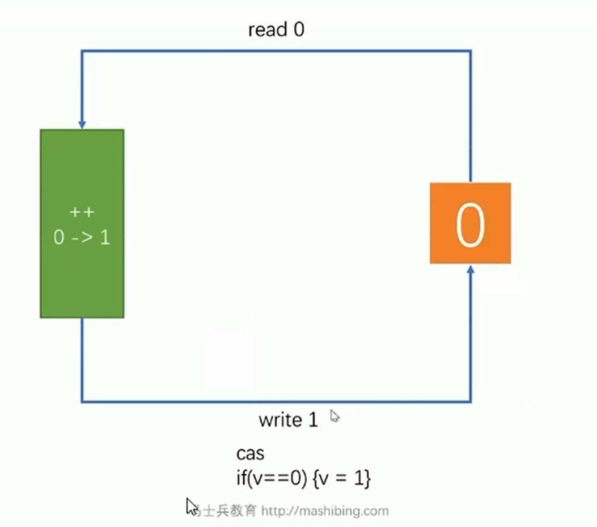

# MCA 系统架构

## 三高
高性能
高扩展
高可用

### 高性能
- 低延迟 --- 响应
- 高并发 --- 吞吐

### 悲观锁 Synchronized
汇编语句的头部添加 特定 标识， 来控制对象资源的 线性使用
把原来多线程 并行获取资源的方式 修改为 串行获取

### 乐观锁/自旋锁  CAS Compare And Swap/Set/Exchange

对比值 如果与原来的值相等 则覆盖原始数据， 否则获取原始数据再来一次

#### ABA问题
version + BOOLEAN 控制

#### CAS 原子性问题
AtomicInteger.incrementAndGet();

JDK1.5 之后Synchronized内部有锁升级的过程
偏向锁-自旋锁(轻量级CAS无锁)-重量级锁(悲观队列锁)

#### 偏向锁
JDK15已废弃

保证原子性的一些锁 类
AtomicXXX
- AtomicInteger
- AtomicLong
- AtomicReference
- AtomicStampedReference --- 解决CAS中的ABA问题 添加版本号
- AtomicMarkableReference --- 解决CAS中的ABA问题 添加修改标记BOOLEAN
- AtomicFieldUpdate

#### ReentrantLock 可重入锁
部分场景可以替换synchronized
- 可以是公平锁
- 可以打断上锁过程
- 所上面的队列可以指定任意数量 

