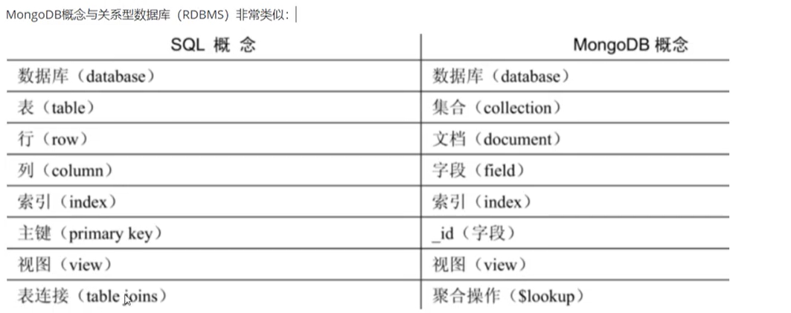
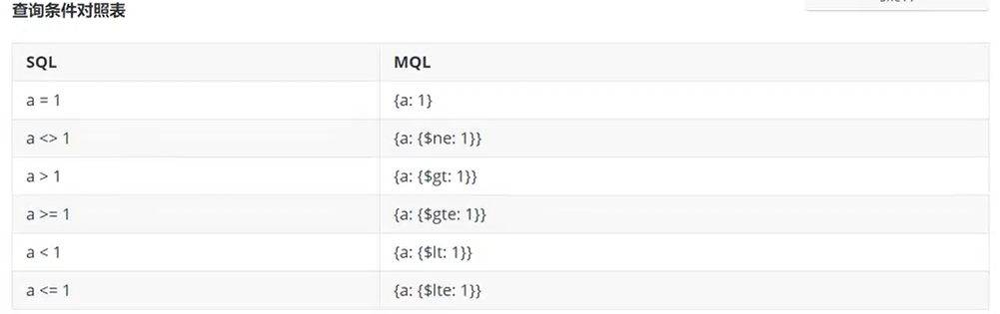
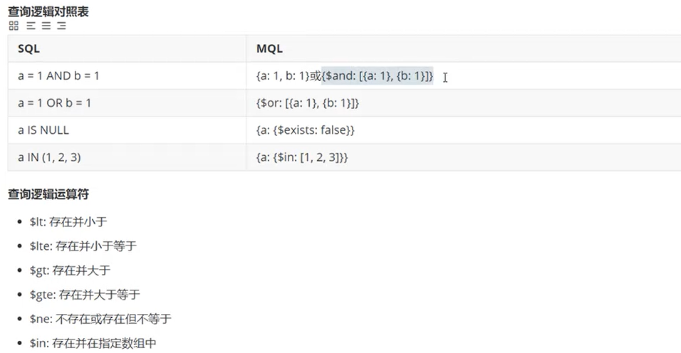
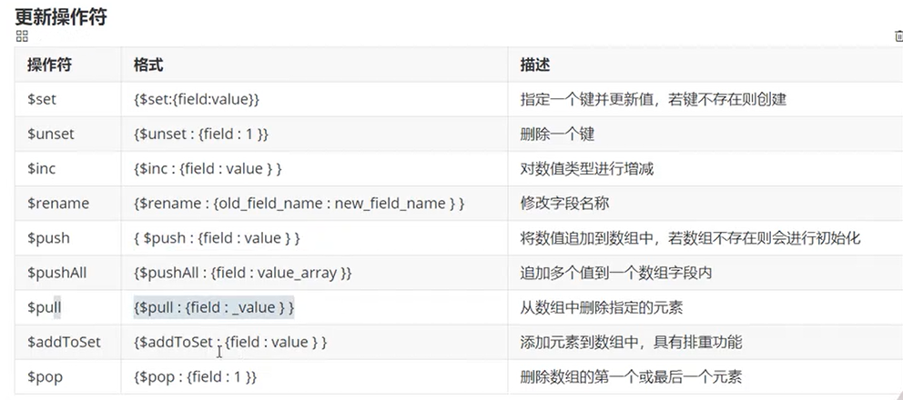
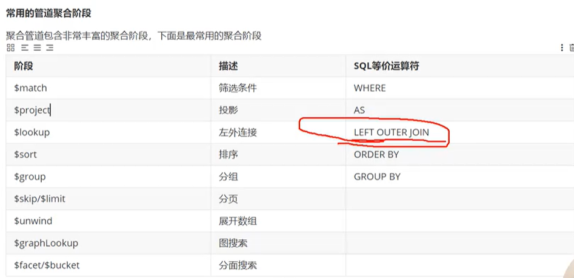
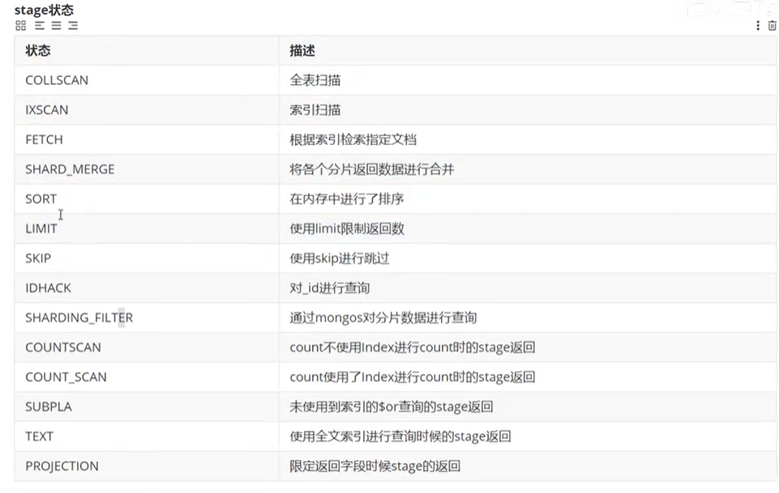

# MongoDB

## 1. MongoDB介绍
> 特别适合海量数据存储， 支持高并发的读写操作
> MongoDB 是一个<font color=red><b>文档数据库</b></font>（以json为数据模型）， C++语言编写， 高性能数据存储方案
> JSON Document, 而非我们 平时使用的文档word,pdf...
> - 介于 关系型数据库 和 非关系型数据库 之间的产品
> - 支持的数据结构 非常松散， 数据格式是BSON--二进制json存储格式 Binary JSON
> - 支持索引
    

差异

- 半结构化， 不需要对字段进行提前声明， 文档的字段 不需要相同
- 弱关系， 表之间 没有外键的约束

### MongoDB技术优势

- JSON文档模型， 适合快速开发
- 高可用，高水平扩展能力，处理海量数据，高并发 具有天然优势
- JSON结构和对象模型接近， 开发代码量低
- JSON的动态模型意味着更容易响应新的业务需求
- 复制集提供99.999%高可用
- 分片架构支持海量数据和无缝扩容

### MongoDB应用场景

- 游戏
- 物流场景
- 社交
- 物联网
- 视频直播
- 大数据应用
  

## 2. MongoDB快速启动

docker exec -it mongo mongo

- show dbs; 查看数据库
- use [db_name] -- 使用/创建 数据库
- show collections/tables; -- 显示所有集合(类似结构化数据库中的表)
- db.createCollection("student"); --- 创建集合
- db.createCollection(name, options)
- db.student.drop(); -- 删除集合

> Options参数
> - capped 布尔类型 optional true/false
> - size 数值 optional 为固定集合指定一个最大值(以字节计)
> - max 数值 optional 指定固定集合中包含文档的最大数量

### 安全认证

- use admin; --- 切换到admin库
- show users; --- 查看所有用户
- db.createUser({user:"test",pwd:"test",roles:["root"]}) --- 创建用户

> insert

- db.student.insertOne({"name":"Tom","age":18,"hobbies":["reading","running"]});

> query

- db.student.find();

## 3. MongoDB文档操作

### 插入

- db.collection.insertOne()
- db.collection.insertMany()

insertOne: 支持 writeConcern

- 0 发起写操作， 不关心是否成功
- 1 集群最大数据节点数：写操作需要被复制到 指定节点 才算成功
- majority: 复制到大多数节点上 才算成功

```mongodb-json-query
db.student.insertOne({
  "name": "Tom",
  "age": 18,
  "hobbies": [
    "reading",
    "running"
  ]
})
db.student.insertMany([
  {
    "name": "Edward"
  },
  {
    "name": "Lily",
    "age": 19
  }
])
```

### 查询

- db.collection.find(query, projection) -- 根据条件查询

> - query --- optional, 使用查询操作符 指定<font color=orage>b<查询条件</b></font>
> - projection --- optinal, 使用投影操作符 指定返回的键

- db.collection.findOne(query, projection) -- 根据条件查询集合中的第一个文档

```mongodb-json-query
db.student.find() //-- findAll

db.student.find(
{
  "name": "Tom"
},  //-- 指定了查询的条件 name = Tom
{"name": 1, "age": 1, "hobbies": 1
} //-- 指定了返回的 字段， '_id'是默认返回项
)

//
db.student.find({
_id: ObjectId("*****")
})
db.student.find({
age: {
$gte:18
}
}) // 查询年龄大于等于18岁的 文档
```

#### 查询条件操作符 对照表




#### 排序&分页

db.collection.find().sort({field:-1})

- -1 降序
- 0 升序

db.collection.find().skip(10).limit(4)

- skip --- 类似offset
- limit --- 类似page size

#### 正则表达式匹配查询

$regex 操作符来设置匹配字符串的正则表达式：
db.collection.find({name:{$regex:"tom"}}) --- 查询name字段包含tom的文档
or
db.collection.find({name:/tom/})

### 更新

db.collection.update(query,update,options)

- query --- 查询条件
- update --- 更新的内容
- options --- 更新的选项

> - upsert --- 不存在 则插入
> - multi --- default:false, 更新所有文档
> - writeConcern --- 决定一个写操作 落到多少个节点节点上 才算成功

更新操作符


- db.collection.updateOne()
- db.collection.updateMany()

#### 实现replace语义

db.collection.update({name:"tom"},{titleName:"this is name-Tom"})

#### findAndModify命令 -- 只能修改单个文档

- 修改并返回 文档 -- 旧值
  db.student.findAndModify({query:{"_id":ObjectId("67d02c165651297d5e4f52d3")},update:{$inc:{age:1}}})

- <font color=orage><b>修改并返回 文档 -- 新值</b></font>
  db.student.findAndModify({query:{"_id":ObjectId("67d02c165651297d5e4f52d3")},update:{$inc:{age:1}},new:true})

### 删除

- 删除所有文档
  db.collection.remove({}) --- 建议使用 db.collection.drop() 直接删除集合 效率更高
- 根据条件删除
  db.collection.remove({age:10})
  db.collection.remove({age:{$lte:18}})
- 根据条件删除 只删除一个
  db.collection.remove(query, justOne)
  eg: db.collection.remove({age:10}, true)

更推荐使用deleteOne/deleteMany来删除文档

- 删除所有文档
  db.collection.deleteMany({})
- 根据条件删除所有文档
  db.collection.deleteMany(query)
  eg: db.collection.deleteMany({age:{$lte:18}})
- 根据条件删除 只删除一个
  db.collection.deleteOne(query)

#### 返回被删除的记录

db.collection.findOneAndDelete(query)
按照默认顺序
可以实现队列的先进先出 FIFO 操作

## 4. MongoDB整个Springboot

```xml

<dependency>
    <groupId>org.springframework.boot</groupId>
    <artifactId>spring-boot-starter-data-mongodb</artifactId>
</dependency>
```

@Document --- 类
@Id --- 修饰变量/方法
@Field --- 成员变量/方法
@Transient --- 修饰在变量/方法 避免序列化

### 模糊匹配

```java
Query query=new Query(Criteria.where("name").regex("张"));
        List<Emp> result=mongoTemplate.find(query,Emp.class);
```

### 多条件查询

Criteria criteria = new Criteria();
criteria.orOperator(
Criteria.where("name").is("zhnagsan"),
Criteria.where("salary").gt2(10000)
)

### 删除

### 更新

## 5. 聚合操作

eg: avg(), sum()

聚合操作包含三类：

- 单一作用聚合 ---
- 聚合管道 ---
- MapReduce ---

### 单一作用聚合

db.collection.find().count()
db.collection.count(query)
db.collection.distinct("field_name")

### 聚合管道

> 聚合框架 Aggregation Framework<br>
> 上一步操作的结果 作为下一步操作 的输入<br>

整个聚合运算过程称为管道(Pipeline), 它是由多个阶段(Stage)组成.
每个管道：

- 接受一系列文档（原始数据集 ）
- 每个阶段对这些文档进行一系列运算
- 结果文档输出给下一个阶段



#### $project

#### $match

> 对文档进行筛选
> eg: db.collection.aggregate([{$match:{type:"technology"}}])
> // 筛选出 name=Tom AND age>=18 的文档：
> db.student.aggregate([{$match:{name:"Tom"}},{$match:{age:{$gte:18}}}]);

#### $count 计数并放回与查询匹配的结果数

db.collection.aggregate([{$match:{name:"Tom"}},{$count: "type_count"}])

#### $group

按照指定的表达式对文档进行分组， 将结果输出到下一个阶段。
> {$group: {_id:<expression>, <field1>: {<accumulatro>:<expression>},...}}

$group阶段，默认内存限制100M;
allowDiskUse 选项设置为true 以启动$group操作以写入临时文件

#### $unwind

将数组拆分成单个文档
> 文档中 某个字段为数组 将其拆分为多个文档的过程
> db.student.aggregate([{$unwind: "$hobbies"}])

preserveNullAndEmptyArrays=true --- 即使数组字段为空也会被输出

#### $limit

限制输入到下一个阶段的文档数量

#### $skip

跳过的文档数量

#### $sort

- 1 升序
- -1 降序

#### $lookup

相当于关系型数据库中的 <font color=yellow><b>多表关联查询</b></font>


eg:

```mongodb-json-query
db.customer.aggregate([
  {
    $lookup: {
      from: "order",
      localField: "customerId",
      foreignField: "customerCode",
      as: "customerInfo"
    }
  }
])


db.order.aggregate([
  {
    $lookup: {
      from: "customer",
      localField: "customerId",
      foreignField: "customer",
      as: "customerInfo"
    }
  }
])
```

### MapReduce

## 6. 视图

> MongoDB视图 是一个可查询的对象， 它的内容由其他的集合或视图上的聚合管道定义。
> 视图不会持久化到磁盘。
> 视图数据 只读

db.createView(
"viewName", -- 视图名称
"collection", --- 数据源
[
queries... --- 查询条件
]
)

eg:

```mongodb-json-query
db.createView(
"studentView",
"student",
[
{$match: {
age: {$gte: 18}
}
}
]
);
```

## 7. MongoDB 索引
索引是一种用来快速查询数据的数据结构。 MongoDB采用B+Tree 做索引

索引分类
- 单键索引/复合索引
- 主键索引/非主键索引
- 聚簇索引/非聚簇索引
- 唯一索引/稀疏索引/文本索引/地理空间索引

### 创建索引
db.collection.createIndex(keys,options)
- key 值为你要创建的索引字段 1升序创建按索引， -1为降序创建索引
- 可选参数列表如下
> - background boolean    default: false  --- 是否会阻塞数据库其他操作
> - unique     boolean    default: false  --- 是否是唯一索引
> - name       string                     --- 索引名称
> - dropDups   boolean    default: false
> - sparse     boolean    default: false  --- 

### 创建唯一索引
> 1升序创建按索引， -1为降序创建索引
db.student.createIndex(
{name: 1, age: 1}, 
{background: true}
)
### 查看索引
db.student.getIndexes(); --- 查看所有索引
db.student.totalIndexSize(); --- 查看索引占用的空间
### 删除索引
db.student.dropIndexes(["index_111"]) --- 删除多个索引
db.student.dropIndexe("index_111") --- 删除单个索引


### 复合索引
多个字段组成的索引
同MySQL

### 多键索引(Multi-Key Index)
在<b>数组字段</b>上 建 索引
针对这个数组的任意值的查询 都会定位到这个文档， 即多个索引入口或者键值引用同一个文档
db.collection.createIndex({field:1})  --- 1升序 -1 降序

也可以创建 复合多键索引， 也就是 复合索引和多键索引的组合
db.collection.createIndex({name:1, hobbies:1})
> 需要注意的是， 复合多键索引中只能有一个 多键索引</br>
> 嵌套对象的字段上也可以创建索引</br>
> db.collection.createIndex({customer.name:1, order.createdAt:-1})</br>
> 


### 地理空间索引(Geospatial Index)
> 基于地理空间的索引(LBS) 功能几乎是所有系统的标配。
> <font color=yellow><b>地理空间索引(2dsphere index) 是专门用于实现位置检索的一种特殊索引</b></font>
> 

#### 创建一个2dsphere索引
db.collection.createIndex({location:"2dsphere"})

- 创建集合
db.createCollection("restuarant");
- 插入数据
db.restuarant.insertMany([
{restaurantId:1, restaurantName: "New Shanghai Restaurant",
location: {
type: "Point",
coordinates: [52.23, 18.6]
}
},
{restaurantId:2, restaurantName: "Panda Restaurant",
location: {
type: "Point",
coordinates: [52.33, 18.7]
}
},
{restaurantId:2, restaurantName: "Dragon Restaurant",
location: {
type: "Point",
coordinates: [52.26, 18.4]
}
}
]);
- 创建索引
db.restuarant.createIndex({location: "2dsphere"})

- 地理空间查询
db.restuarant.find(
{ location: {
$near :{
$geometry:{
type: "Point",
coordinates: [52.3, 18.6]
},
$maxDistance: 20000
}
}
}
);


### 全文检索
> MongoDB 支持全文检索， 可以建立文本索引来实现建议的分词检索<br>
> $text 将会 使用**空格**和**标点符号**作为分隔符 对检索字符串进行分词， 并且对检索字符串中的所有分词结果进行一个逻辑OR操作。<br>
> <font color=yellow><b>MongoDB不支持中文分词</b></font>

#### 创建分词索引
db.collection.createIndex({field: "text"})

#### 查询包含指定字符串的结果
db.collection.find({$text:{$search:"java coffee"}})
eg: db.restuarant.find({$text:{$search: "Shanghai Dragon"}})

### Hash索引 (Hashed Indexes)
> 索引字段上 精确匹配
> 不支持范围查询
> 不支持多键hash
db.collection.createIndex({field: "hashed"})


### 通配符索引 Wildcard Indexes
嵌套属性
db.collection.createIndex({"order.$**":1})

注意事项
- 通配符索引 不兼容索引类型或属性
- 通配符索引是稀疏的， 不索引空字段， 因此不能查询 字段不存在的文档


### 索引属性

#### 唯一索引 Unique Indexes
支持 单键索引
支持 复合索引(数组字段)
支持 多键索引
db.collection.createIndex({field:1},{unique:true})
db.collection.createIndex({field:1, field2: 1},{unique:true})

注意： 唯一索引 对于文档字段缺失的情况 会使用null值代替，因此不支持 多个文档缺失 索引字段


#### 部分索引 Partial Indexes
db.collection.createIndex(
{name:1, description: 1},
{partialFilterExpression: {age:{$gte: 18}}}
)

- partialFilterExpression选项 接受指定的过滤条件
支持的表达式
- 等值表达式 or $eq
- $exists:true
- $gt,$lt,$gte,$lte
- $type
- $and

> 唯一约束 结合 部分索引 会导致唯一索引失效的问题


#### 稀疏索引 Spare Indexes


#### TTL索引 TTL Indexes
Time To Live

> MongoDB 会在周期性运行的后台线程中 对该集合collection进行检查和数据清理工作<br>
> 后台线程60s运行一次
> 只支持单个字段
> 无法保证及时老化数据
> 

创建TTL索引
db.collection.createIndex({dateFiles:1},{expireAfterSeconds:3600})

可变的过期时间 collMod
db.runCommand({collMod:[collection_name], index:{keyPattern:{[ttl_field]:1}, expireAfterSeconds: 600}})


#### 隐藏索引
对查询器不可见， 因此不能用于支持查询

db.collection.hideIndex({[index_field_name]: 1})


### 索引使用建议
- 为每一个查询建立合适的索引
- 创建合适的复合索引 ， 不要依赖于交叉索引
- 复合索引字段顺序： 匹配条件在前， 范围条件在后(Equality first, Range after)
- 尽可能使用覆盖索引(减少 回表)
- 及案例索引在后台运行


### explain执行计划

- 查询是否使用了索引
- 索引是否减少了扫描记录数
- 

#### stage状态解释


> <font color-red>***执行计划尽量不要返回下列stage***</font>
> - COLLSCAN --- 全表扫描
> - SORT --- 使用了sort但是没有用index
> - 不合理的skip
> - SUBPLA --- 未使用到index的$or
> - COUNTSCAN --- 不使用index进行count


