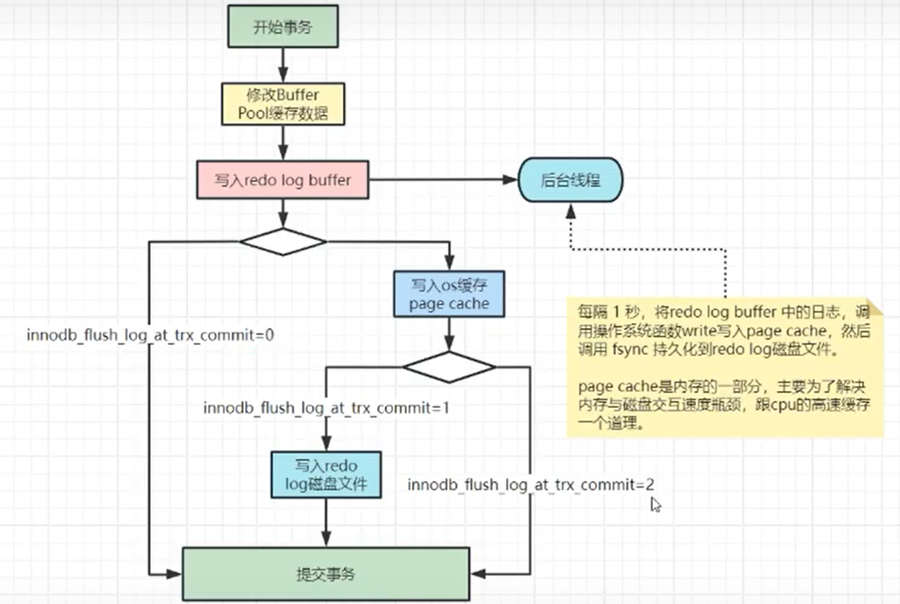
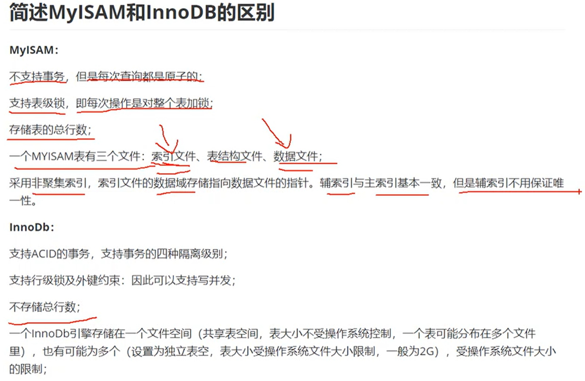

# MySQL
> 
> 
##

## SQL 优化

### 索引
> 索引 是 帮助MySQL高效获取数据的<font color=yellow><b>排好序</b></font>的<font color=gress><b>数据结构</b></font>
索引的数据结构：
- 二叉树
- 红黑树 ---- 也叫自动平衡 二叉树
- Hash表
- B-tree

### 索引的基本原理
> <font color=orange><b>把无序的数据 变成 有序的查询</b></font>
> - 把创建了索引的列的内容进行排序
> - 对排列结果生成 倒排表
> - 在倒排表内容上拼上数据地址链
> - 查询时， 先拿到倒排表内容， 再取出数据地址， 从而拿到具体数据。

### <font color=red><b>索引的设计原则</b></font><br>
> <font color=orange><b>查询更快， 占用空间更小</b></font><br>
- <font color=grass><b>出现在where语句中的column 或者 用于表连接的条件column
- 数据量小的表 没必要建索引
- 使用短索引， eg: user->name字段 只是用前5个字符作为索引， 搜索时
- 不要过度索引， 索引需要额外的磁盘空间， 降低写操作的性能
- 外键的column一定要建索引
- 更新频繁的列 不适合建索引
- 不能有效区分数据的列 不适合做索引， eg: gender, 区分度太低
- 尽量扩展索引， 而不是 新建索引， eg: index(a), --> index(a, b)
- text/image/bit 数据类型的列 不要建索引</b></font><br>


### InnoDB 索引实现(聚集)
- 表数据文件本身 就是按B+Tree 组织的一个索引结构文件
- 聚集索引- 叶子节点包含了完整的数据记录
- 建议InnoDB表建主键， 并且推荐使用<font color=yellow><b>整型的自增主键</b></font>

> PrimaryKey 默认是主键索引， B+Tree使用该索引值<br>
> 如果没有主键 则寻找 唯一索引列 union key column 作为B+Tree的索引值<br>
> 如果都没有， InnoDB则会 维护一个row_id的列作为 索引值 存储B+Tree数据<br>

### B+Tree
> B+Tree 是一个<b>自平衡</b>的多叉树， 
> - 节点排序
> - 一个节点可以存储多个元素， 多个元素也排序
> - 非叶子节点 不存储数据，只进行数据索引
> - 所有数据 都存储在 叶子节点
> - 叶子节点之间有指针， 指向相邻的叶子节点
> - 非叶子节点的元素在叶子节点 都 冗余了 也就是<font color=yellow><b>叶子节点存储了所有的元素，且是排好序的</b></font>

### 聚簇索引 和 非聚簇索引
> 聚簇索引是指 叶子节点上的data 就是数据本身 ---- InnoDB 使用的是聚簇索引<br>
> 非聚簇索引是指 叶子节点上的data 不是数据本身 而是数据存放的地址 ---- MyISAM 使用的是非聚簇索引<br>

> 聚簇索引 的<font color=yellow><b>数据物理存放和索引的顺序是一致的</b></font>， 所以一个表中 只能有一个聚簇索引， 而非聚簇索引可以有多个。<br>
> InnoDB 默认使用PrimarkKey作为聚簇索引， 没有PK则 找第一个非空unique列作为聚簇索引， 否则使用row_no.<br>

> 聚簇索引 适合在排序场合， 非聚簇索引 不适合 排序的场景

### MySQL的覆盖索引和回表
> 如果只需要在一棵索引数上就能够 获取SQL所需要的所有数据， 就不需要回表查询，这样查询速度快。
> 如何实现索引覆盖------- 将需要查询的字段 建立到<font color=yellow><b>联合索引</b></font>中

### Hash算法
- 对索引的key进行一次hash 散列计算
- 很多时候 Hash索引要比B+Tree索引 更高效 ---- 但是很少用
- 仅满足 ‘=’， ‘IN’, 不支持范围查询
- hash冲突问题


### 联合索引 即 复合索引
> 尽量用联合索引 而非 单值索引
- <font color=orange><b>最左前缀原则</b></font>
> eg: key 'idx_name_age_position' ('name', 'age', 'position') using btree<br>
> select * from user where name = 'zhangsan' and age = 31; -- 会使用索引<br>
> select * from user where age > 20 and position = 'teacher'; -- 不会使用索引<br>
> select * from user where position = 'musician'; -- 不会使用索引<br>


mysql 8.0之后， 支持跳跃式索引， 不是最左原则也能走索引。 Oracle 10年前就支持了。

like %xxx% 不走索引， like xxx% 才走索引。
但是 like的column 是索引列的话 会***索引全扫描***。
索引时顺序存储的索引 即使是全扫也非常快。


## 事务锁机制
> ACID
- 原子性(Atomicity): 当前事务的操作 要么全部成功， 要么全部失败，原子性由undo log日志来保证。
- 一致性(Consistency): 使用事务的最终目的，由业务代码正确逻辑保证。
- 隔离性(Isolation): 在事务并发执行时，他们内部的操作不能相互干扰。
- 持久性(Durability): 一旦提交了事务，他对数据库的改变就是永久性的，持久性由redo log日志来保证。

### MySQL 有哪些锁

- 行锁 ---- InnoDB 默认使用的锁类型
> 加锁粒度小， 但是枷锁资源开销比较大
> - 读锁=共享锁 多个事务可以共享一把锁。 select xxxxx lock in share mode
> - 写锁=排他锁 只有一个事务能够获得锁。InnoDB会对insert/update/delete语句自动加锁
> - 自增锁， 通常针对 自增字段， 对于事务回滚的情况， 数据会回滚 但是自增序列 不会回滚

- 表锁
>
- 也锁
- 记录锁
- 间隔锁  --- 遵循左开右闭原则
- 临建锁 --- 记录锁和间隔锁的组合
- 意向排他锁 ---- 加锁之前先检查是否有锁， 没有则加锁， 否则则不加锁
- 意向共享锁

- 全局锁 ---- Flush tables with read lock
> 加锁之后 整个数据库的实例都处于 只读状态。 所有的数据变更 都会被挂起， 一般用于 全库备份。

### InnoDB如何实现事务
> InnoDB通过Buffer Pool, LogBuffer, Redo Log, Undo Log来实现事务
> - Innodb 收到更新sql,会先根据条件找到数据所在的页， 并将该页缓存到Buffer Pool中
> - 执行sql语句----> 修改Buffer Pool中的数据， 也就是内存中的数据
> - 针对sql生成一个redolog对象， 并存到LogBuffer中
> - 生成undo log， 用于事务回滚
> - 如果 事务提交， 则 redolog 进行持久化
> - 如果 事务回滚， 则利用undolog日志进行回滚

### InnoDB隔离级别
- read uncommit(读未提交): <b>脏读</b> ---- 会读到事务尚未提交的数据
- read commit(读已提交): 不可重复读 ---- 只会读取到<font color=red>已经提交事务</font>的数据
- repeatable read(可重复读): 脏写  ---- 默认隔离级别, 读操作的开始事务时 该表的数据 可重复读， 即使其他事务committed的数据也不影响 该操作。对整个表有效。
- serializable(串行) ---- 事务开始后 其他的读写都被 暂停， 只能串行执行， 无法并行执行。 默认在读语句后边加锁 (lock in share mode;)

><b>对于传统 读取数据作为报表的 业务场景， 读操作 使用RR(repeatable read) 隔离界别，保证数据的同一时间性。</b><br>

```mysql
set transaction isolation level READ UNCOMMITTED;
set transaction isolation level READ COMMITTED ;
set transaction isolation level REPEATABLE READ ;
set transaction isolation level SERIALIZABLE ;
```


> 添加读锁<br>
> select * from user where id = 1 lock in share mode;<br>
>

### MVCC机制
> Multi-Version Concurrency Control 多版本并发控制， 可以避免读写不阻塞， 且避免类似脏读的问题。<br>
> 主要通过undo日志链来实现。<br>
> - read commit (读已提交), 语句级快照<br>
> - repeatable read (可重复读), 事务级快照<br>

> 对于每个表 数据库实际上还有其他隐藏字段eg: trx_id(事务id), roll_pointer(回滚指针----只想undo log)


### MySQL执行过程与BufferPool缓存机制

- 持久化过程：
Save/Update data--> 到达InnoDB存储引擎-->Buffer Pool缓存池-->写入Redo log日志
-->准备提交事务 redo日志写入磁盘
有个守护线程 随机将BuffPool中的缓存内容 写入idb文件

- 顺序写磁盘文件 效率非常高，类似内存的读写。
> redo 文件就一个， 所以能保证顺序写<br>
> 但各个表的持久化idb文件是多个，



### Redo Log写入策略
> innodb_flush_log_at_trx_commit: 控制redo log的写入策略<br>
- 0 表示每次事务提交时都只是把redo log留在redo log buffer中，数据库当即可能会丢失数据， 优点写效率高
- 1(默认值) 每次事务提交时都将 redo log直接持久化到磁盘，数据最安全，不会因为数据库宕机丢失数据， 线上系统推荐这个设置
- 2 事务提交会 先将redo log写到系统缓存的page cache(OS cache)里, 这种情况数据库宕机不会丢失数据， 但是操作系统宕机 就会丢失数据
> InnoDB有一个后台线程 每隔1秒， 就会把redo log buffer中的日志，调用操作系统函数write写到系统文件page cache,然后调用系统函数fsync持久化到磁盘文件。

## 事务的优化
大事务的影响
- 并发情况， 数据库连接池容易被撑爆
- 锁定太多的数据 容易造成大量的阻塞和锁超时
- 执行时间长， 容易造成主从延迟
- 回滚所需要的时间比较长
- undo log膨胀
- 容易导致死锁

> 一个事务中的多个操作 尽量把update放到最后， <br>
> 因为update会给该条记录加锁， 而insert也会加锁，但是因为他是新数据， 所以不会有锁冲突。<br>

### 长事务的优化
- 查询语句 放到 事务外
- 事务中 避免远程调用， 因为存在 超时
- 事务中避免一次处理太多数据， 可以拆分成多个事务 处理
- 更新 等涉及到加锁的操作 尽可能放到事务靠后的位置
- 能异步处理的尽量异步处理
- 应用侧(业务代码) 保证数据一致性， 非事务执行------少用。


### MySQL慢查询优化
> - 检查是否使用了索引
> - 检查所利用的索引 是否是最有索引
> - 检查所有字段是否都是必须的， 丢弃多余字段
> - 检查表数据是否过多， 是否应该进行分库分表
> - 检查数据库实例所在机器的性能配置


### MySQL有哪些引擎
> show engines; 查看支持的engine
> InnoDB, MyISAM 常用
> InnoDB 支持XA & SavePoint
> - SavePoint支持部分回滚

### MyISAM 与 InnoDB的区别



### MySQL执行计划
> explain select ****** from table;
> - type 索引类型
> - key 使用的 索引 名字
> - key_len 命中的索引 数量

### 脏读/幻读/不可重复读
这些问题都是MySQL进行事务并发控制 遇到的问题
- 脏读 -- 事务过程中， 读到其他事务未提交的数据
- 不可重复读 -- 在一个事务过程中， 多次查询的结果不一致
- 幻读 -- 一个事务中 使用同样的操作查询数据， 得到的记录数不同

> 处理方式： 加锁/事务隔离/MVCC

## 索引优化

### 索引失效
- != ----- select * from table where column != 'aaa';
- is null ----- select * from table where column is null;
- or ----- select * from table where column = 'aaa' or column = 'bbb';

> 优化方法： <font color=orange><b>强制使用索引 fore index(index_name)</b></font>
> eg: select * from table force index (idx_name_age_p) where column = 'aaa' or column = 'bbb';

### like 百分号写最右原则
> 左侧百分号 会全表扫描<br>
> 右侧 才会使用索引<br>
> 如果 必须要 左侧%模糊， 则尽量使用 索引覆盖 ， 如果不满足 则建议 ES<br>

### 查询范围优化
> 范围查询时 索引列取值范围较大 可能会 不用索引<br>
> 因此可以拆分执行在合并<br>
> eg: explain select * from table where age > 100 and age < 2000;<br>
> 拆分为:<br>
> - select * from table where age > 100 and age < 1000;
> - select * from table where age >= 1000 and age < 2000;

### 索引列 计算
> eg: select * from user where age + 10 > 100; ---- 索引将失效(age时索引列)

### 范围之后全失效
> 使用了范围 条件之后的 索引都将失效
### 尽量少用* 代替具体字段
> select * from table; --- 尽量不用这类查询， 防止回表
### 空值null or 少用
### varchar字段 where条件时 引号不能丢

### 小表 驱动 大表
### 为GroupBy字段添加索引 提高查询效率

### Union ALl 代替 Union
> Union ALl 获取所有数据但是数据 不去重
> union 去重
### Join表不宜过多， 但是join有奇效， 注意优化


### trace 分析sql
-- 开启trace
> set session optimizer_trace = "enabled=on", end_markers_in_json=on; // 开启trace
> select * from user where id = 2 or username = 'Edward';
> select * from account where user_id is not null and balance>100;
> select * from information_schema.OPTIMIZER_TRACE;// 查看 sql分析结果


## MySQL集群 主从同步， 读写分离
> 主节点binlog 同步到从节点，实现数据同步。
> show master status;查看主节点状态
> show slave status;查看从节点状态

- 写操作 只能在主节点上完成
- 读操作 可以在主节点或者 丛书节点完成

### 主从同步 方式
- 异步同步 --- 默认的同步方式，只负责发送 不接收返回结果， <font color=red><b>性能高</b></font>
- 全同步复制 --- 等待所有从数据库 的写入成功结果
- 半同步复制 --- 等待部分从数据库返回结果(数量可以设置)

### 主从同步
> 主从复制 主要有三个线程 
> - master(binlog dump thread) --- 当发现binlog有变动时 dump thread 读取其内容 分发给从节点
> - slave(I/O thread) --- I/O thread 读取主服务器发送过来binlog内容， 写入到relay log(中继日志)
> - slave(SQL thread) --- 读取中继日志(Relay Log)中的内容 应用到从数据库上

> binlog文件是 数据库将所有的变更记录  写到binlog文件中
> 

- undo log --- 事务 用于提交回滚
- redo log --- 事务提交 写入
- binlog --- 写操作日志
- relay log --- 从属数据库拉去的binlog
- error log --- 错误日志


### 分库分表
> 表中数据量 过大时， 整个查询效率就会降低 非常明显， 为了提高查询效率， 通常把一个表中的数据分散的存储到多个数据库的多个表中。
> - 垂直分片
> - 水平分片(常用方式) 将一个表的数据拆分到 不同的库和表中

> From 阿里手册 <font color=red>一个表的数据 超过500w或者 数据文件超过2G</font>,就要考虑分库分表。

### 分片策略
- 取模/取余
- 按照范围
- 按照时间
- 按枚举值

### 分库分表 最常用工具
- Mycat
- ShardingSphere (更优)


### 分布式事务中 对于开启一个事务后长时间未提交/未回滚 InnoDB如何处理锁
处理方式有很多种：
- 锁超时
- 超时回滚 innodb_rollback_on_timeout
- 连接超时

1. 连接超时
> - wait_timeout 非交互式连接的空闲超时时间（默认 28800 秒，8 小时）
> - interactive_timeout：交互式连接的空闲超时时间（默认同 wait_timeout）

2. 锁等待超时
> - innodb_lock_wait_timeout：事务等待锁的超时时间（默认 50 秒）


## 数据库 范式
- 第一范式1NF --- 所有的列都是原子性的， 即不能再拆分
- 第二范式2NF --- 1NF的基础上， 非码属性必须完全依赖于候选码， 即每条记录都能被唯一的区分(主键)
- 第三范式3NF --- 任何非主属性不依赖于其他非主属性