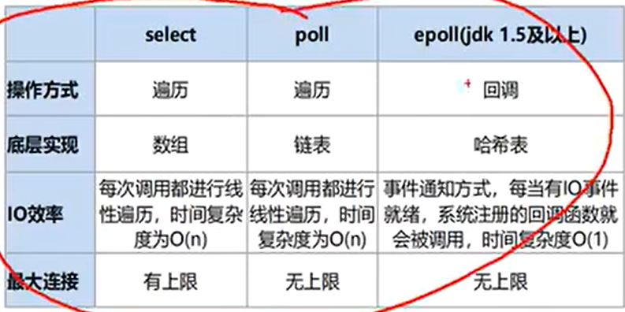

# Netty

## Basic knowledge

### BIO（Blocking I/O） ----  很少用
- 优点
> - 拦截和处理请求的过程中，线程会被阻塞，直至I/O操作完成。<br>
> - 设计简单，使用方便，适合小规模和简单的应用。<br>
- 缺点
> - 在高并发场景下，每个请求都需要一个线程，可能导致线程资源耗尽。<br>
> - 不适合处理大量并发请求<br>


### NIO（Non-blocking I/O） ---- 常用
> 事件驱动模型、单线程处理多任务、非阻塞 I/O，I/O 读写不再阻塞，而是返
回 0、基于 block 的传输比基于流的传输更高效、更高级的 IO 函数 zero-copy、IO 多路复用
大大提高了 Java 网络应用的可伸缩性和实用性。基于 Reactor 线程模型。<br>
> 提供了非阻塞的操作，使用选择器（Selector）和通道（Channel）来管理多个I/O操作。<br>
> 一个线程可以处理多个请求，避免了线程阻塞。<br>
- 优点
> - 可以支持大规模并发，适合高负载环境。
> - 更高的资源利用率，因为线程不会在I/O操作中被阻塞。
- 缺点
> - 编程模型复杂，使用不如BIO简单。
> - 需要关注多线程和同步问题，代码可读性较低。

```java
public class BIODemo {

    /**
     * 1. 打开Telnet控制台
     * 2. type 'o localhost 9000' 链接
     * 3. input 'x' 进入发送模式
     * 4. input 'sen xxxxx' 需要发送的内容
     */
    public static void main(String[] args) {
        try (ServerSocket serverSocket = new ServerSocket(9000)){
            while (true) {
                System.out.println("Waiting connection ...");
                // cmd telnet localhost 9000
                // input 'x'
                // then input 'sen xxxxxx'
                Socket socket = serverSocket.accept();
                socket.setKeepAlive(true);
                System.out.println("Connecting Success");
                System.out.println("Handling data ...");
                handle(socket);
            }
        } catch (IOException e) {
            throw new RuntimeException(e);
        }
    }

    /**
     * 处理读取 客户端发送来的数据
     * 可以放到子线程中处理。。。， 但是会遇到C10K,C10M的问题 OOM
     * 当然可以用线程池处理线程消耗问题， 但是也解决不了高并发的性能问题
     * 如果在处理的所有线程都在read阻塞，则直接全部阻塞， 造成 <b>资源枯竭</b> 
     */
    private static void handle(Socket socket) throws IOException {
        byte[] buff = new byte[1024];
        System.out.println("Ready to read ...");
        while (true) {
            int read = socket.getInputStream().read(buff);
//            System.out.println("Read done");
            if (-1 != read) {
                String data = new String(buff, 0, read, StandardCharsets.UTF_8);
//                System.out.printf("Received data is %s\n", data);
                System.out.println(data);
                if ("end".equalsIgnoreCase(data)) {
                    break;
                }
            }
        }
        socket.close();
        System.out.println("End");
    }
}
```

#### C10K (Connection = 10 * 1000)
线程被无限制的创建， 每个线程大概占用1MB的内存资源， 因此无限制创建线程 达到10 * 1000个时， 内存OOM的发生
线程池 来解决这个问题， 但并不是 完美方案
因此NIO诞生了
#### C10M (Connection = 10 * 1000 * 1000)

### AIO（Asynchronous I/O）
> 提供完全异步的操作，I/O操作通过回调形式处理。当I/O操作完成时，应用程序会收到通知（通常是通过实现一个回调接口）。<br>
开发人员不需要管理线程的生命周期，I/O操作由系统负责。<br>
- 优点
> - 更高的并发性，不会因为I/O而阻塞线程，适合处理大量I/O任务。
> - 编程模型相对更简洁，利用回调机制简化了
- 缺点
> - 实现复杂性较高，尤其是非阻塞I/O的错误处理和资源管理。
> - 可能会引入回调地狱的问题，导致代码难以维护。


### Selector 多路复用器
> 多路复用的核心是调用底层的epoll<b>事件轮询机制</b>，多个客户端的连接复用一个线程处理<br>
> epoll_create() 创建一个epoll实例
> epoll_wait() 监听事件列表，有事件过来， 开始处理， 没事件-就阻塞
> epoll_ctl() 调用操作系统 监听有事件的 channel

Linux I/O多路复用
- 一个监听线程 select(1983年发布) 轮询 阻塞监听 事件 支持1024个socket连接 --- 操作系统最早的支持  目前 性能不高
- poll 本质跟select 一样 轮询 阻塞监听， 支持更多的socket通信
- epoll(2002年发布) 当前主流方式， 事件驱动


// 设置为非阻塞
serverSocketChannel.configureBlocking(false);
// 打开 Selector处理channel, 即创建 epoll
Selector selector = Selector.open();
// 把 channel注册到多路复用器上(selector)
serverSocketChannel.register(selector, SelectionKey.OP_ACCEPT)

// 阻塞 等待 需要处理的事件的发生
// 调用native epoll_create 方法， linux 内核epoll_create 来创建epoll(struct 类似 object)实例
selector.select();

```java
public class NIOSelectorDemo {

    public static void main(String[] args) throws IOException {
        // 创建NIO channel
        ServerSocketChannel serverSocketChannel = ServerSocketChannel.open();
        serverSocketChannel.socket().bind(new InetSocketAddress(9001));

        // 设置非阻塞
        serverSocketChannel.configureBlocking(false);
        // 多路复用器
        // 打开Selector 处理 channel, 即创建epoll
        Selector selector = Selector.open();

        // 状态事件
        // OP_ACCEPT 连接接受事件
        // OP_CONNECT 连接状态事件
        // OP_WRITE 写入数据的事件
        // OP_READ 读取数据的事件
        serverSocketChannel.register(selector, SelectionKey.OP_ACCEPT);
        System.out.println("Server started success!!!");

        while (true) {

            /*
             * EPollArrayWrap
             * 调用native epoll_create 方法， linux 内核epoll_create 来创建epoll(struct 类似 object)实例
             *
             */
            // 阻塞 等待 需要处理的时间发生
            selector.select();

            Iterator<SelectionKey> iterator = selector.selectedKeys().iterator();

            while (iterator.hasNext()) {
                SelectionKey key = iterator.next();
                // OP_ACCEPT 连接获取和连接注册 事件
                if (key.isAcceptable()) {
                    ServerSocketChannel server = (ServerSocketChannel) key.channel();
                    SocketChannel channel = server.accept();
                    channel.configureBlocking(false);
                    // 这里只注册了读事件， 如果需要给客户端写数据 则添加注册 写事件
                    channel.register(selector, SelectionKey.OP_READ);
                    System.out.println("Client connecting success!!!");
                    // OP_READ 读取数据时间
                } else if (key.isReadable()) {
                    SocketChannel socketChannel = (SocketChannel) key.channel();
                    ByteBuffer buff = ByteBuffer.allocate(6);
                    var len = socketChannel.read(buff);
                    if (len > 0) {
                        System.out.printf("Received:%s\n", new String(buff.array()));
                    } else if (-1 == len) {
                        socketChannel.close();
                        System.out.println("Client Disconnected");
                    }
                    // OP_WRITE 写入数据事件
                } else if (key.isWritable()) {

                } else if (!key.isConnectable()) {

                }
                // 从时间集合中 删除 本次处理的key, 防止下次selector重复处理
                iterator.remove();
            }

        }
    }
}

```

### Redis 与 NIO
> Redis 6.0之后是多线程， 指的是 数据的收发是多线程， 但是核心的数据库操作依旧是单线程<br>
> 避免复杂的并发问题，确保数据一致性<br>
> 所以Redis的高性能 就是采用类似 <b>NIO的多路复用</b>的 epoll事件驱动的异步 I/O 模型
主要事件
> - select 最早的事件处理机制，适用于小型应用
> - poll 不再有文件描述符的数量限制，但处理效率仍然可能下降，因为在每次调用时必须重新扫描所有套接字
> - epoll Linux 系统下更先进的事件通知模型，适用于大规模并发连接<br>



## Netty
> 一个高性能的异步事件驱动的网络应用框架。

### Netty 的主要特点
- 异步和非阻塞 事件驱动, 适合高并发和高吞吐量。
- 支持多种协议：支持 TCP/UDP/ HTTP/WebSocket/FTP。
- 简化网络编程：轻松实现复杂的网络应用，封装了底层的细节和复杂性。
- 高性能： 高压力条件下仍能保持低延迟和高吞吐量。
- 可扩展性和灵活性： 管道（Pipeline）机制，可以通过添加处理器（Handler）来自定义数据的处理方式。非常灵活地处理多种类型的数据和事件。
- 生态支持： 丰富的社区支持和文档。


### 核心概念

#### Channel 管道
> 是对socket的封装

#### EventLoopGroup 是一个Eventloop池
> Netty为每一个Channel分配一个EventLoop, 用于处理用户连接请求/用户请求所有事件处理<br>
> EventLoop 本身只是一个<b><font color=yellow>线程驱动</font></b>， 其生命周期中只会绑定一个线程，让该线程处理一个Channel所有IO事件<br>
> 一个Channel 只能绑定一个 EventLoop, Channel生命周期中不能改变绑定关系。
> 一个EventLoop 能绑定多个Channel， 1:n<br>
> EventLoop:Thread = 1:1
> 
> 


### 拆包与粘包
> 发送方发送的ByteBuf 较大， TCP底层开分为多个Frame进行发送， 这个过程成为 发送拆包<br>
> 接收方需要对 多个frame进行合并， 这个过程成为粘包<br>
> 同样的 发送方也会把多个ByteBuf 合并成一个 Frame 进行发送， 这个过程称为发送方的 粘包<br>
> 接下来 接收方需要拆包<br>

- 数据结束位置放 特定 分隔符
- 将内容长度信息放在首位

### 拆包与粘包-解决方案
> Netty 提供了多种处理粘包和拆包的解决方案，通过使用 ByteToMessageDecoder 和 MessageToByteEncoder 类，可以轻松实现上面的协议。<br>
> Netty 还内置了几种解码器以处理常见的情况，如：<br>

- LineBasedFrameDecoder：用于<b>行分隔符</b>协议。
- DelimitedFrameDecoder：用于分隔符协议。
- LengthFieldBasedFrameDecoder：用于长度字段协议。


