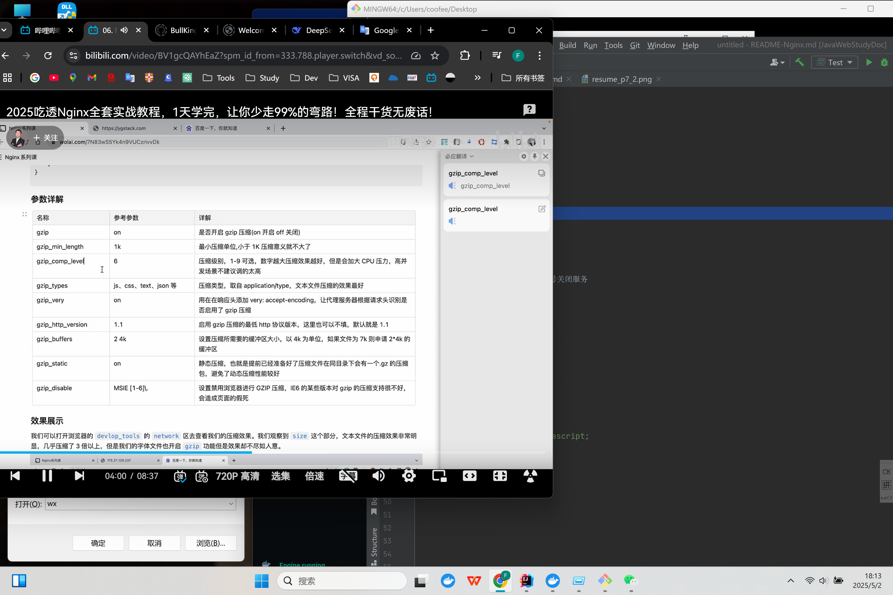

# Nginx


## 介绍
### Nginx 应用场景
- HTTP 服务器 --- 静态资源服务器
- FTP 服务器 --- 上传功能
- 反向代理服务器 --- 将请求转发给内部网络上的服务器，将从服务器获得的结果返回给客户端
- 负载均衡 --- 

### 优点
- 高并发支持 --- 单机10w+并发连接， 得益于Linux epoll IO多路复用模型
- 内存消耗低 --- 10k非活跃HTTP keep-alive连接再nginx中仅仅消耗2.5MB内存
- 高扩展
- 高可靠 --- nginx架构由master/worker进程组成


## 常用命令
apt install nginx
status nginx
systemctl status nginx
enable nginx
### 查看版本信息/原有编译参数configure arguments
nginx -v
nginx -version
### 查看配置/检查配置
nginx -t
### 重载配置信息
nginx -s reload
### 停止/关闭nginx
nginx -s stop
nginx -s quit --- 优雅的方式 
kill -quit [pid] --- 根据进程号关闭服务
kill -term [pid] --- 快速关闭
kill -9 [pid] --- 强制关闭
### 启动nginx
start nginx

配置文件位置
/home/nginx/conf/gninx.conf

### gzip 压缩提速
```nginx
Server {
  gzip on; // 开启gzip压缩
  gzip_types application/javascript;
}
```



### Brotli压缩
- 相比较于 gzip压缩效率更高 提高18%
- 仅支持https协议

```nginx
Server {
  brotli on; // 开启brotli压缩
  brotli_static on; // 配置静态编译网页
  brotli_types application/atom_xml application/javascript application*****;
  brotli_comp_level 6; 压缩机别0-11， 默认6
  brotli_window 1k; 窗口设置， 小于这个数就不进行压缩了
  brotli_min_length 20; 设置压缩的最小单位， 低于此值则 忽略压缩 比较值取自 Content-Length
  gzip on; // 开启gzip压缩
  gzip_types application/javascript;
}
```


## 反向代理
```nginx
server {
  listen 80;
  server_name coocpu.wiki;
  location / {
    proxy_pass http://172.86.32.110/;
  }
}
```

## Https 配置证书
### 第一步 注册证书 下载放置到指定位置
.pem .key 文件 放置在 /home/nginx/ssl/

### 第二部 配置nginx
```nginx
server {
  listen 443 ssl;
  server_name coocpu.wiki;
  ssl_certificate /home/nginx/ssl/yg.pem;
  ssl_certificate_key /home/nginx/ssl/yg.key;
  ssl_session_cache shared:SSL:1m;
  ssl_session_timeout 5m;
  ssl_ciphers HIGH:!aNULL:!MD5; // 选择的加密算法 
  ssl_prefer_server ciphers on;
  
  location / {
    proxy_pass http://172.86.32.110/;
  }
}


server {
  listen 80;
  server_name coocpu.wiki;
  rewrite .* https://$server_name$1 redirect; // http请求 重定向到https
}
```

./configure --prefix=/home/nginx/ --with-http_ssl_module //加载http_ssl_module模块


## Nginx 开启限流

- 漏桶算法 --- 请求放入队列 顺序处理
- 令牌桶算法 --- 桶容量固定 超过容量 直接丢弃

### 请求限流
1. limit_req_zone $binary_remote_addr zone=ip_limit:10m rate=1r/s;

参数介绍
- $binary_remote_addr --- 表示通过remote_addr这个标识来做限流
- zone=ip_limit:10m --- 表示生成一个10M大小的名字为ip_limit的内存区域，主要用来存储访问的频次信息
- rate=1r/s --- 表示允许相同标识客户端的一个访问频次， 1r表示一次


2. limit_req zone=ip_limit burst=5 nodelay;

参数介绍
- zone --- 表示使用哪个区域做限流
- burst --- 爆发的意思 超过限制的请求放到缓冲区内
- nodelay --- 超过访问频次， 同时缓冲区也放满了的时候就直接放回503， 如果没有设置则请求会等待排队

### 连接限流
1. limit_conn_zone $binary_remote_addr zone=addr:10m

参数介绍
- $binary_remote_addr --- 表示通过remote_addr这个标识来做限流，限制的是同一个客户端IP地址
- zone=ip_limit:10m --- 表示生成一个10M大小的名字为ip_limit的内存区域，主要用来存储访问的频次信息

2. limit_conn addr 1;

参数介绍
- zone --- 同上
- 数字1， 表示允许相同标识客户端的访问频次， 1表示 只允许每个IP地址一个链接

```nginx
http {
    limit_req_zone $binary_remote_addr zone=ip_limit:10m rate=1r/s;
    limit_conn_zone $binary_remote_addr zone=conn_limit:10m;
}
```


## 和并请求

```nginx
server {
    concat on; # 合并开关
    concat_max_files 20; # 最大的和并请求文件数量
    concat_unique off; # on 将返回400， off 将合并两个文件。
    concat_types application/javascript text/javascript; # 合并的文件类型
    concat_delimiter '*'; # 文件分割符
    concat_ignore_file_error on; # 忽略文件不存在或者没有权限。
}
```

