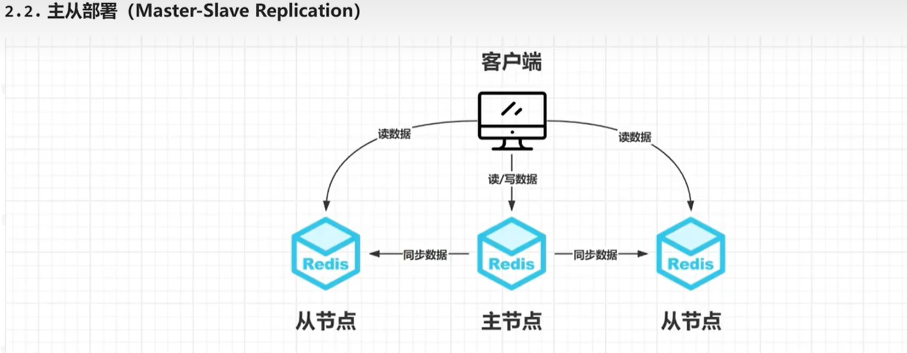
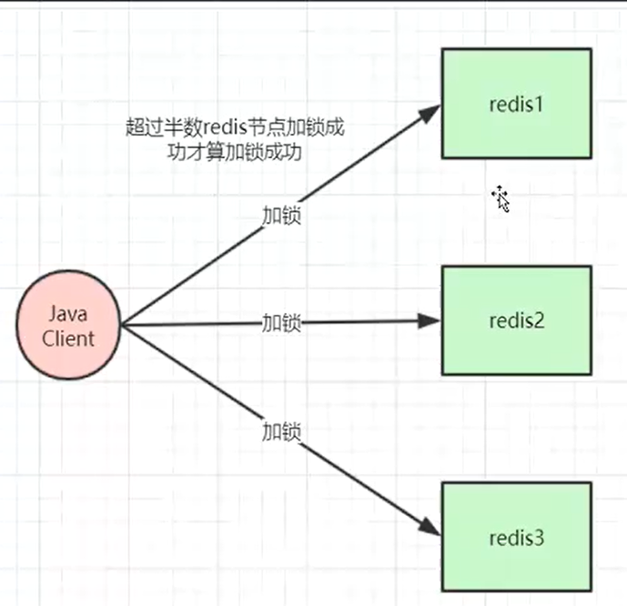
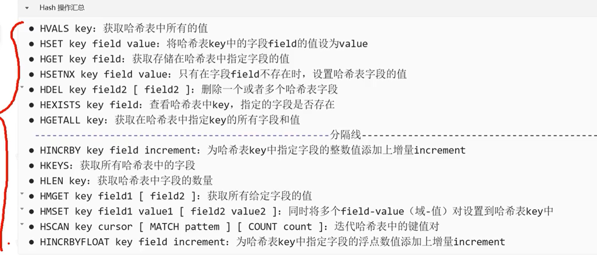
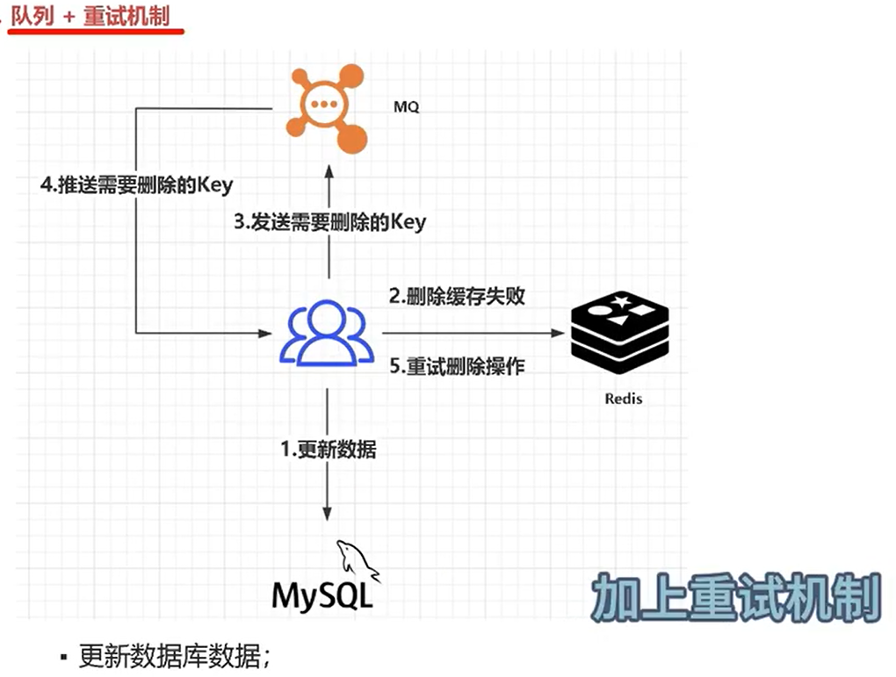
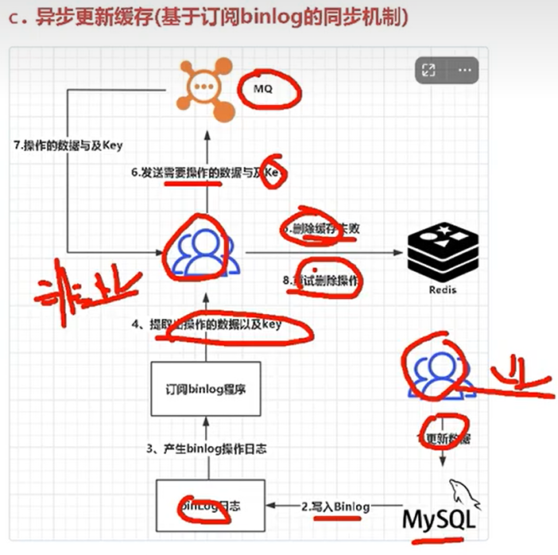

# Redis
> Redis 是一个基于内存的key-value键值 存储的，可持久化的数据库<br>
> 提供了非常丰富的数据结构<br>
> 数据以二进制形式存储，避免编码转换损耗。
>

## <font color=orange>***存储原理***</font>
- Redis的Key存储在一个 ***全局的哈希表Dict*** 中，每个Key对应一个哈希表条目，条目中存储了指向Value的指针.
- Hash冲突：当多个Key哈希到同一个位置时，会将这些Key以链表的形式存储。
- 查询Key时，通过哈希函数定位到哈希桶，再在链表中查找具体的Key，找到后返回对应的Value。

ps: 存储方式 跟HashMap 类似， 只是JDK1.8之后 HashMap 采用 ***Hash + 链表 + 红黑树***的 方式存储。

因此 没有Hash冲突时 查询Key算法复杂度时O(1)

- docker exec -it redis_master bash
- redis-cli
- info replication -- 查看订阅情况

## 基本介绍
### Redis数据结构
- 字符串 Strings --- 存储字符串类型的值
- 哈希表 Hashes --- 存储字段和对应值 的映射
- 列表 Lists --- 存储有序的字符串列表
- 集合 Sets --- 存储不重复的字符串集合
- 有序集合 Sorted Sets --- 类似集合， 但每个元素都关联一个分数， 可以按照分数排序

### Redis 功能特性
- 安全性 --- 密码保护/ACL 用户访问控制
- 多种数据结构 --- 十种 数据结构
- 事务 --- 支持多个命令打包执行， 保持原子性 (不同于InnoDB的事务， 可以看作是伪事务)
- 支持持久化 --- 数据持久化到磁盘 保证数据安全
- <b>复制</b> --- 支持主从复制
- <b>哨兵系统</b> --- 监控主服务器状态，自动进行故障转移
- <b>集群</b> --- 通过Redis Cluster实现数据分片和高可用
- Lua脚本
- 慢查询日志 --- 记录执行时间超过指定阈值的查询


## 基本命令
> redis-cli --- 进入命令行模式
> keys * --- 列出所有的key
> set key value --- 保存数据

### Docker 进入容器
> docker exec -it \[container_name] bash
> 默认配置文件地址 /etc/redis/redis.conf

### 主从部署 Master-Slave




## 哨兵模式
> 烧饼模式 是通过 在独立的哨兵节点上运行特定的哨兵进程来实现的。
> 这些哨兵进程 监控各个主从节点状态， 并在发生故障 完成故障转移， 并通知应用方，实现高可用。


## 
### 查看工具
- Redis Insight
- Tiny RDM


### SpringBoot 添加 Redis 依赖
```xml
<!-- Redis 依赖 -->
<dependency>
    <groupId>org.springframework.boot</groupId>
    <artifactId>spring-boot-starter-data-redis</artifactId>
    <version>3.1.0</version>
</dependency>
```

## 数据结构 与 操作
### String 类型， 最常用
#### 应用场景
- 存储常规数据的场景， set/get 命令
- 计数场景， set/get/incr/decr 命令
- 分布式锁 SETNX key value命令可以实现最简单的分布式锁， 存在缺陷， 通常不建议这么做
java setIfAbsent(k,v,l,u);
- [Set if Not eXists] 如果不存在则 SET


#### <font color=orange>***分布式锁 SETNX***</font>
解决方案 redisson, Redisson 通过lua脚本实现 锁续命/锁延期 从而保证分布式高并发情况下 锁的原子性， 不复杂的业务场景 可以采用这种方式。

#### RedLock --- Redis 实现分布式锁 的另一个方案


#### 基本操作
- SET key value --- 设置内容
- GET key --- 获取内容
- EXISTS key --- 判断key是否存在
- DEL key --- delete

- GETSET key value --- 返回 old value, 并设置new value
- INCR key --- 将key存储的数字值增1
- DECR key --- 将key存储的数字值减1
- STRLEN key --- 返回key所存储的value字符串长度
- APPEND key value --- 给value追加内容 在 结尾
- MSET key value [key value ...] --- 同时设置多个键值对 eg: mset key101 101 key102 102 key103 103
- MGET key  [key ...] --- 同时获取多个key 的值 eg: mget key101 key102 key103

#### redisTemplate.opsForValue() --- 表示所有value都是字符串存储的

### 列表 List
> Redis列表是简单的字符串列表， 按照插入顺序排列
> 可以添加一个元素到列表的头部(L) 或者 尾部(R)
> - LPUSH --- 左插入 eg: lpush news 111
> - RPUSH --- 右插入 eg: rpush new 222
> - LPOP --- 左出(移出并获取列表中第一个元素)
> - RPOP --- 右出(移出并获取列表最后一个元素)
> - LPUSH - LPOP --- 先进后出 (栈)
> - RPUSH - LPOP --- 先进先出 (队列)
> - LRANGE key --- 列出列表所有元素

#### SpringBoot 使用方法
- redisTemplate.opsForList().leftPush(key, value);
- redisTemplate.opsForList().rightPush(key, value);
- redisTemplate.opsForList().range(key); -- get values
- redisTemplate.opsForList().leftPop(key) -- 从头部获取数据
- redisTemplate.opsForList().rightPop(key) -- 从尾部获取数据

### Hash 哈希 ---- 缓存对象 性能更高
- hset user:001 name tom age 18 --- name/age 是key, tom/18是value
- hmset user:002 name lily age 20
- hgetall user:001 --- 获取整个对象的值 包含四个
- hgetall user:001 name --- 获取name
- hlen --- 获取长度 元素长度 eg: hlen cart:001
- ldel --- 删除元素  eg: hdel cart:001 10086

#### SpringBoot 使用方法
- redisTemplate.opsForHash().put(key, hashKey, value) --- hset key hashkey value
- redisTemplate.opsForHash().increment(key, hashkey, delta) --- hincrby key hashkey value
- redisTemplate.opsForHash().size(key) --- hlen key
- redisTemplate.opsForHash().delete(key, hashkeys) --- hdel key hashkey
- redisTemplate.opsForHash().entries(key) --- hgetall key



### Set 集合
> Redis 中Set类型是 一种无序集合， 元素唯一，不重复
> sadd key value... --- 添加元素 或多个元素
> srem key value ... --- 移除一个 或多个元素
> smembers key --- 获取集合中所有元素
> spop luck --- 随机移除并输出
> srandmember key --- 随机输出一个元素  但 并不移除该元素
> sismember key value --- 判断元素是否在集合中
> scard key --- 统计 元素数量
> sinter key... --- 返回所有给定集合的 交集
> sunion key... --- 返回给定所有集合的 并集 
> sdiff key... --- 返回给定所有集合的差集
> 


#### SpringBoot 使用方法
- redisTemplate.opsForSet().add(key, value...)
- redisTemplate.opsForSet().remove(key, value...)
- redisTemplate.opsForSet().isMember(key, value)
- redisTemplate.opsForSet().pop(key) -- 随机输出 并移除 一个元素
- redisTemplate.opsForSet().randomMember(key) --- 随机 输出
- 

### Sorted Set 有序集合 (类似Set)
> zadd key score value

- zunionstore unionSort 2 key1 key2 --- 合并


#### SpringBoot 使用方法
- redisTemplate.opsForZSet().add(key, value, score) -- add key score value
- redisTemplate.opsForZSet().incrementScore(key, value, delta) --- 
- redisTemplate.opsForZSet().reverseRange(key, start, end)
- redisTemplate.opsForZSet()


### Bitmaps 位图
> Bitmap 存储时连续的二进制数字(0/1),

- setbit key offset value --- 给指定的key的值 的 第 offset赋值value
- getbit key offset --- 获取指定key的第offset位
- bitcount key start end --- 返回指定key中[start, end]中为1的数量
- bitpos key bit start end --- 查询字符串中 第一个设置为1或0的位的位置
- 


### Geospatial 地理空间 基于Sorted Set实现
- geoadd key lon lat name --- 存储
- geopos key name --- 查看位置信息 lon lat
- geodist key name1 name2 --- 计算距离
- geodist key name1 name2 km --- 指定单位
- georadius key lon lat radius km(unit) -- 查询指定范围的结果


### Pub/Sub 发布/订阅
subscribe name --- 订阅channel
publish channel_name value --- 发送消息


## Redis 缓存击穿/雪崩/穿透

### 缓存击穿
> redis key 失效， 导致大量请求来到数据库层(mysql), 导致服务宕机
解决方法
> - 延期过期时间 或 永不过期
> - 使用互斥锁， 等待第一个请求 构建完缓存后再释放

### 缓存雪崩
> redis 中多个key 同时失效， 
处理方式
> - 事前 redis高可用， 主从+哨兵
> - 事中 本地缓存 + hystrix限流降级， 同时设置合理的过期时间
> - 事后 redis持久化， 重启后 自动恢复数据

### 缓存穿透
> 不存在的key 发生大量请求
处理方式
> - 缓存空对象 --- 并设置合理的过期时间
> - 参数校验 --- 判断请求参数是否合法
> - 布隆过滤器 --- 判断请求的参数是否存在于缓存和数据库中， 没有则直接返回


## 数据库和缓存一致性问题
> 数据更新 无论是先更新redis 还是先更新mysql 都存在数据一致性问题<br>

解决办法
- 延时双删 --- 先删除redis, 再更新mysql, 延时几百毫秒在删除redis
- 队列+重试机制

- 异步更新缓存(基于订阅binlog的同步机制)

实际应用：
> 阿里的开源框架canal, 该框架可以对MySQL的binlog进行订阅<br>
> canal 正是模仿了MySQL的slave数据的备份请求，使得redis的数据更新达到了相同的效果<br>


## Redis 事务
> Redis是支持事务的， 但是它与传统的关系型数据库中的事务有所不同<br>

### 概念
> 可以一次执行多个命令， 本质上是一组命令的集合。<br>
> 一个事务中的所有命令都会序列化， 按顺序的串行化执行，而不会被其他命令 加塞<br>
> 执行失败 后会整体回滚
> 常用命令：
> - multi --- 开启一个事务， 随后可以放入多次命令， 不会被立即执行， 而是放到一个列表中。
> - exec --- 执行<b>队列中</b>的所有命令.
> - discard --- 中断当前事务， 清空队列 并放弃执行事务 有点像回滚， 但本质不是回滚， 就是单纯的取消 清空队列
> - watch key1 key2 ... --- 监视多个key

### 支持部分事务
- 语法错误 会全部回滚
- 逻辑错误 胡主动忽略报错语句， 继续执行


### WATCH


### Redis 持久化的几种方式
- RDB 持久化
> 指定的时间间隔内， 将内存中的数据集(二进制序列化方式)快照的方式写入磁盘
> 每次都是 全量备份
> fork子进程进行备份， 写入临时RDB文件，写入完成后， 替换原有的RDB文件

优点：
- 性能高
- 文件紧凑
- 可能会丢失数据

- AOF 
> 对每条<b>写入命令</b>作为日志, 以 append-only的模式写入日志文件，
> 可以通过回放AOF日志中的写入指令来重新构建整个数据集。

优缺点：
- 数据可靠
- 文件较大
- 恢复速度慢


### 大Key问题
本质上是Value 大
DDR5 内存的传输速度 40GB/s-80GB/s, 所以在都内存级别 是没问题的
主要问题出在网络传输上， 带宽
第二个 处在服务器网卡上， 但是基本都是千兆网卡， 这个问题时硬件提供商 可以忽略


