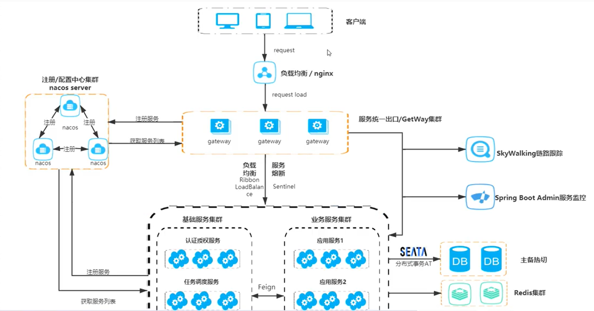

# Seata
[Seata Document](https://seata.apache.org/zh-cn/docs/overview/what-is-seata/)
> Seata 是一款开源的分布式事务解决方案，致力于提供高性能和简单易用的分布式事务服务。
> Seata 将为用户提供了 AT、TCC、SAGA 和 XA 事务模式，为用户打造一站式的分布式解决方案。

本地会用多种锁机制 实现保证 强一致性， 这就会导致性能没那么高，
在设计 金融的逻辑中推荐使用 该分布式解决方案

其他场景 更推荐 最终一致性解决方案


## 分布式事务 解决方案
> CAP
> - C --- Consist 一致性
> - A --- Available --- 可用性
> - P --- Partition --- 分区容错性
> 常见组合
> - AP 组合 --- 常用于 互联网业务
> - CP 组合 --- 常用于 金融业务
> base理论是AP组合的延申， 保证<b>最终一致性</b>
> - Basically Available --- 基本可用
> - Soft state --- 软状态/中间状态
> - Eventually Consistent --- 最终一直

- 强事务型 CP
2PC - Seeta 解决方案
- 柔性事务型 AP


2PC -> 3PC -> TCC

- 2PC - 两阶段 即 两个步骤完成
- 3PC - 三阶段
- TCC (Try/Confirm/Cancel)
- Saga


### 分布式事务 
全局事务(分布式事务) TM/TC
Map<groupId, [tx1,tx2]>
- 每个分支服务 事务发起后 向TM/TC注册分支事务
- HTTP/RPC 通知下一级 分支服务， 下一级分支事务 向TM/TC注册分支事务
- 任何一个分支服务出现异常 需要回滚， 则向TM/TC 发送rollback事件，
- 否则发送commit事件， 进行分布提交

### Seata
微服务架构：


#### Seata介绍
> Seata 是一款开源的 分布式事务解决方案，致力于提供高性能和简单易用的分布式事务服务。<br>
> 事务模式：
> - AT --- 阿里首推模式 (Auto Transaction)
> - TCC
> - SAGA
> - XA


> Seata 的三大角色
> - TC(Transaction Coordinator)-事务协调者 --- 维护事务状态，驱动全局事务的提交与回滚
> - TM(Transaction Manager)-事务管理者 --- 开启全局事务的提交/回滚
> - RM(Resource Manager)-资源管理者


AT模式是一种对业务无侵入 两阶段提交协议
第一阶段：
- 将更新之前用到的元数据解析出 保存为 before image(undo log)
- 将更新后的数据 查询出来 保存为 after image(redo log)
- 提交业务SQL, undo/redo log, 行锁 到数据库

第二阶段(提交)：
> 因为一阶段 已经提交到数据库， 所以二阶段只需要删除 快照数据，行级锁 即可。<br>

第二阶段(回滚)：
- 校验脏写 after image vs 数据库数据
- 还原数据 before image --> 逆向SQL --> 数据还原
- 删除中间数据 删除before image, 删除after image, 删除 行锁


#### Seata 部署
> Seata 分为三个角色： TC TM RM
> - TC(Server端) 为<font color=orange>**单独服务端部署**</font>
> - TM,RM(Client端) 由业务系统集成


##### TC Server
配置信息存储支持三种格式 --- store.mode
- file
- db --- 推荐
- redis
> config/file.conf
> store.mode = 'db'

[DB 建表语句](https://github.com/apache/incubator-seata/tree/2.x/script/server/db)<br>


DB+Nacos 部署高可用的集群模式

##### 注册方式
> registry.conf
type：file,nacos,eureka,redis,zk,consul,etcd3,sofa
- file 单机模式
- nacos 集群高可用模式

##### 配置中心 修改为nacos
> registry.conf

##### 事务分组： 为了解决 异地机房 停电 容错机制
my_test_tx_group

将配置 同步到nacos 配置中心
/script/config-center/nacos/nacos-config.sh -h localhost -p 8848 -g SEATA_GROUP -t [id]

对应的客户端也要设置


```yaml
seata:
  registry: # 配置 注册中心
#    注册nacos 注册中心
    type: nacos
    nacos:
      server-addr: localhost:18848
      application: seata-server
      username: nacos
      password: nacos
      group: SEATA_GROUP # 没有修改也可以使用默认值 ， 不进行配置、
  config: #    配置 配置中心
    type: nacos
    nacos:
      server-addr: localhost:18848
      username: nacos
      password: nacos
      group: SEATA_GROUP
```


