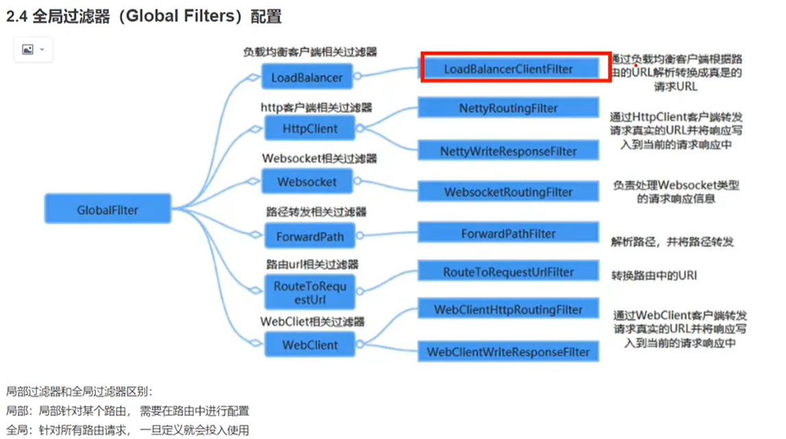

# SpringBoot

## Spring Boot
> Spring Boot 基于Spring4.0设计， 由 Pivotal(2013年合资成立)公司提供

### Spring history
Creator: Rod Johnson
Release at 2003 interface Spring, 2004 开源《Spring Source》
- 2013年 合资成立Pivotal公司
- 2014年 SpringBoot 1.0 (Spring 4.0)
- 2015年 SpringCloud
- 2018年 成功IPO
- 2018.03 SpringBoot 2.0 (Spring 5.0)

约定大于配置

> 简化Spring应用开发的一个框架<br>
> 对整个企业级的开发技术栈 的一个大的整合 build anything<br>
> J2EE开发的一站式解决方案<br>

优点
- 快速构建
- 内嵌Tomcat/Jetty/Undertow 无需部署war包
- 提供start poms 简化Maven 配置， 减少版本冲突
- 对spring和第三方库提供默认配置
- 无需配置xml, 开箱即用


## Spring Boot 项目配置

### 
- spring.main.lazy-initialization=true --- # 设置 所有的bean 懒加载
- app.setBannerMode(Banner.Mode.OFF); --- 关闭启动横幅


###  全局配置文件 application.properties
- application.properties
- application.yml --- 树状结构(推荐)
> server:
>   port: 8088 --- <font color=red><b>一定要有空格</b></font>

外部配置 加载优先级 由低到高
- classpath root  ----- 低
- classpath/config
- 项目当前目录
- 项目跟目录/config
- 子项目跟目录/config ----- 高
- 命令行的参数 优先级最高 --- 顶级高 eg: java -jar xxxx.jar --server.port=8889  -- 最终使用8889端口

### 指定配置文件
- 命令行启动时 指定配置文件
- java -jar xxx.jar --spring.config.location=d:\config/

### packaging
如果包含子项目， 跟项目 pom.xml
<packaging>pom</packaging> 

### @ConfigurationProperties(prefix = "user")
> 常用于bean属性和yml配置文件配置 绑定<br>
> prefix 前缀<br>
> 配置文件中的属性 支持松散绑定<br>
> USERNAME, user-name, user_name, userName 都可以绑定成功User.username<br>
> Relaxed binding

### 指定装配路径
@PropertySource("classpath:data/user.properties")
> 只能是properties文件后缀

### Meta info 自动提示
```xml
<dependency>
    <groupId>org.springframework.boot</groupId>
    <artifactId>spring-boot-configuration-processor</artifactId>
<!--    依赖不会传播到 其他项目-->
    <optional>true</optional>
</dependency>
```


## SpringBoot 自动配置原理
- @EnableAutoConfiguration --- 告诉Spring开启自动配置，自动扫描所有自动配置类


## SpringBoot 热部署与日志
```xml
<!--        热部署-->
<dependency>
    <groupId>org.springframework.boot</groupId>
    <artifactId>spring-boot-devtools</artifactId>
    <optional>true</optional>
</dependency>
```
### 热部署设置
- File -> Settings-> Build, Execution, Deployment -> Compiler -> 勾选 Build project automatically 选项。
- Settings -> Advanced Settings -> 勾选Allow auto-make to start even if developed application is currently running

### 日志

slf4j 是日志门面， 不是先日志功能， 整合日志用的。 适配器/桥接器
log4j/logback 是具体的日志工具


### 开发标准
记录日志不能直接使用日志实现框架， 必须通过日志门面来实现

门面清单对应关系


```yaml
logging:
  level:
#    root: trace # 设置全局的 trace 打印级别
    com:
      coocpu: trace # 指定包名 日志打印级别
  pattern:
    console: '' # 设置日志输出格式(控制台)
```
- %clr   {faint} 指定颜色 eg: %clr...{red}
- 


## 分布式事务 解决方案
> CAP
> - C --- Consist 一致性
> - A --- Available --- 可用性
> - P --- Partition --- 分区容错性
> 常见组合
> - AP 组合 --- 常用于 互联网业务
> - CP 组合 --- 常用于 金融业务
> base理论是AP组合的延申， 保证<b>最终一致性</b>
> - Basically Available --- 基本可用
> - Soft state --- 软状态/中间状态
> - Eventually Consistent --- 最终一直

- 强事务型 CP
2PC - Seeta 解决方案
- 柔性事务型 AP


2PC -> 3PC -> TCC

- 2PC - 两阶段 即 两个步骤完成
- 3PC - 三阶段
- TCC (Try/Confirm/Cancel)
- Saga


### 分布式事务 
全局事务(分布式事务) TM/TC
Map<groupId, [tx1,tx2]>
- 每个分支服务 事务发起后 向TM/TC注册分支事务
- HTTP/RPC 通知下一级 分支服务， 下一级分支事务 向TM/TC注册分支事务
- 任何一个分支服务出现异常 需要回滚， 则向TM/TC 发送rollback事件，
- 否则发送commit事件， 进行分布提交

### Seata
微服务架构：


#### Seata介绍
> Seata 是一款开源的 分布式事务解决方案，致力于提供高性能和简单易用的分布式事务服务。<br>
> 事务模式：
> - AT --- 阿里首推模式 (Auto Transaction)
> - TCC
> - SAGA
> - XA


> Seata 的三大角色
> - TC(Transaction Coordinator)-事务协调者 --- 维护事务状态，驱动全局事务的提交与回滚
> - TM(Transaction Manager)-事务管理者 --- 开启全局事务的提交/回滚
> - RM(Resource Manager)-资源管理者


AT模式是一种对业务无侵入 两阶段提交协议
第一阶段：
- 将更新之前用到的元数据解析出 保存为 before image(undo log)
- 将更新后的数据 查询出来 保存为 after image(redo log)
- 提交业务SQL, undo/redo log, 行锁 到数据库

第二阶段(提交)：
> 因为一阶段 已经提交到数据库， 所以二阶段只需要删除 快照数据，行级锁 即可。<br>

第二阶段(回滚)：
- 校验脏写 after image vs 数据库数据
- 还原数据 before image --> 逆向SQL --> 数据还原
- 删除中间数据 删除before image, 删除after image, 删除 行锁


#### Seata 部署
> Seata 分为三个角色： TC TM RM
> - TC(Server端) 为<font color=orange>**单独服务端部署**</font>
> - TM,RM(Client端) 由业务系统集成


##### TC Server
配置信息存储支持三种格式 --- store.mode
- file
- db --- 推荐
- redis
> config/file.conf
> store.mode = 'db'

[DB 建表语句](https://github.com/apache/incubator-seata/tree/2.x/script/server/db)<br>


DB+Nacos 部署高可用的集群模式

##### 注册方式
> registry.conf
type：file,nacos,eureka,redis,zk,consul,etcd3,sofa
- file 单机模式
- nacos 集群高可用模式

##### 配置中心 修改为nacos
> registry.conf

##### 事务分组： 为了解决 异地机房 停电 容错机制
my_test_tx_group

将配置 同步到nacos 配置中心
/script/config-center/nacos/nacos-config.sh -h localhost -p 8848 -g SEATA_GROUP -t [id]

对应的客户端也要设置


```yaml
seata:
  registry: # 配置 注册中心
#    注册nacos 注册中心
    type: nacos
    nacos:
      server-addr: localhost:18848
      application: seata-server
      username: nacos
      password: nacos
      group: SEATA_GROUP # 没有修改也可以使用默认值 ， 不进行配置、
  config: #    配置 配置中心
    type: nacos
    nacos:
      server-addr: localhost:18848
      username: nacos
      password: nacos
      group: SEATA_GROUP
```

### 设计模式

#### 策略模式 + 依赖注入
```java
// 接口层
public interface IPayStrategy {

    void pay(float amount);
    PayEnum getPayStrategy();

}
// 定义类型枚举
public enum PayEnum {
    ALIPAY(1), WEIPAY(2), BANK(3);
}

// Factory
@Service
public class PaymentStrategyFactory {

    public final ConcurrentHashMap<Integer, IPayStrategy> handlerStrategyMap = new ConcurrentHashMap<>();

    // 依赖注入
    @Autowired
    public PaymentStrategyFactory(List<IPayStrategy> payStrategyList) {
        payStrategyList.forEach(e -> handlerStrategyMap.put(e.getPayStrategy().getIndex(), e));
    }

    public IPayStrategy getPayStrategy(int code) {
        return handlerStrategyMap.get(code);
    }
}

@RestController
@RequestMapping("/")
public class PaymentController {

    @Autowired
    PaymentStrategyFactory paymentStrategyFactory;

    @GetMapping(path = "/pay")
    public String pay(@RequestParam int code, @RequestParam float amount) {
        IPayStrategy payStrategy = paymentStrategyFactory.getPayStrategy(code);
        payStrategy.pay(amount);
        return "pay success" + payStrategy.getPayStrategy();
    }


}
```
#### 防腐层 + 适配器模式 Adapter

#### 责任链设计模式 + 依赖注入
AOP 依次调用 就是责任链模式
@Service
@Order(1) 用来指定注入的顺序 保证责任链的处理顺序 正确
```java
public abstract class IProductChain {

    private IProductChain nextHandler;

    public void setNextHandler(IProductChain nextHandler) {
        this.nextHandler = nextHandler;
    }

    public boolean executeHandle(Product product) {
        if (hasNextHandle()) {
           return nextHandler.executeHandle(product);
        }
        return true;
    }

     public abstract boolean hasNextHandle();
}
```
#### 模板模式 


### 银行系统是如何实现强一致性的
金融 领域 还是坚持 强一致性 分布式事务

Seata AT模式即可


### Bean的生命周期
- 第一步 创建一个普通对象
- 第二步 依赖注入 --> 实例@Autowired的属性
- 初始化属性 (afterPropertiesSet)
- AOP
- 代理对象
- bean 依赖查找 (先by Type, 再 by Name)
- 放入Map<beanName, Bean Object>


单例bean是单例模式 针对名称的
跟对象的单例模式 是完全两个 概念

// 手动添加 实例的对象 到spring 的 bean对象
applicationContext.getBeanFactory().registerSingleton("key", object);

// 可以根据类型 或者 名称
@Bean(autowire = Autowire.BY_TYPE)
public UserService getService(){
    return new UserService();
}

### AOP切面式编程
@EnableAspect
是一种编程范式，旨在通过将关注点（如日志、安全、事务等）从业务逻辑中分离出来，提高代码的模块性和可重用性。

- @Before("execution(* com.example.service.*.*(..))")
- @Around("execution(* com.example.service.*.*(..))")

性能监控
```java
@Around("execution(* com.example.service.*.*(..))")
public Object monitorExecutionTime(ProceedingJoinPoint joinPoint) throws Throwable {
    long startTime = System.currentTimeMillis();
    Object returnValue = joinPoint.proceed();
    long duration = System.currentTimeMillis() - startTime;
    System.out.println("Execution time: " + duration + " ms");
    return returnValue;
}
```

异常处理
```java
@Around("execution(* com.example.service.*.*(..))")
public Object handleExceptions(ProceedingJoinPoint joinPoint) {
    try {
        return joinPoint.proceed();
    } catch (Exception e) {
        // 记录异常
        System.err.println("Exception in method: " + joinPoint.getSignature().getName());
        throw e; // 或返回自定义错误信息
    }
}
```

### GateWay
API网关， 就是指系统的统一入口，它封装了应用程序的内容结构，为客户端提供统一的服务，一些与业务本身功能无关的逻辑可以在这里实现，
诸如：认证/鉴权/监控/路由转发等等

#### Spring Cloud GateWay
> WebFlux + Netty + Reactor 实现的响应式API网关。<br>
> 不能在传统的servlet容器中工作， 也不能构建为war包 <br>

#### 功能特性
- 动态路由 能够匹配任何请求的属性
- 支持路径重写
- 集成Spring Cloud 服务发现功能(Nacos, Eruka)
- 可以集成 限流/降级 功能(Sentinel, Hystrix)
- 可以对路由指定易于编写的Predicate(断言)和Filter(过滤器)

#### 核心概念
- 路由 route --- 
- 断言 predicates
- 过滤器 filter 

#### 基于时间的断言工厂
```yaml
          predicates:
            - After=2020-01-01T17:10:00.777-09:00[Asia/Dubai] # 基于时间的断言工厂
            - Before=***
            - Between=2020-01-01T17:10:00.777-09:00[Asia/Dubai],2020-02-01T17:10:00.777-09:00[Asia/Dubai]
```
#### 基于Cookie的断言工厂
```yaml
          predicates:
            - Cookie=chocolate, ch.p # 基于Cookie 
```

#### 基于Header的断言工厂

```yaml
          predicates:
            - Header=X-Request, \d+ # 基于Header 支持正则表达式
```
#### 基于Host的断言工厂

```yaml
          predicates:
            - Host=**.somehost.org, **.host.com
```
#### 基于Method的断言工厂

```yaml
          predicates:
            - Method=GET,POST
```
#### 基于Query参数的断言工厂

```yaml
          predicates:
            - Query=green # 查询参数， 必须携带的参数 green,aaa|bbb 表示参数green的值再aaa,bbb之间
```

#### 基于IP地址的断言工厂

```yaml
          predicates:
            - RemoteAddr=192.168.3.2 # 根据ip匹配
```

#### 基于Weight的断言工厂

```yaml
          predicates:
            - Weight=group1,2 # 根据权重匹配
```
#### 自定义 路由断言工厂
> 必须是一个bean, 
> 类名必须以 ‘RouterPredicateFactory’作为结尾
> 必须继承AbstractRoutePredicate 抽象路由断言工厂
> 必须实现一个静态内部类 声明属性来接受配置文件中对应的断言信息
> 结合shortcutFieldOrder

#### 过滤器工厂

```yaml
          filters:
            - StripPrefix=1
            - AddRequestHeader=X-Request-Color, red # 添加请求头
            - AddRequestParameter=color, blue # 添加请求参数
            - RediectTo=3.2, http://aaa.com # 重定向
            - SetStatus=404 # 统一设置状态码
```

#### 全局过滤器
> 创建好即可 不需要配置/声明
> 针对所有路由
> 自定义 实现 GlobalFilter 接口

内置的全局过滤器


#### Gateway 跨域配置 CORS Configuration
```yaml
spring:
  cloud:
    gateway:
      globalcors: # 配置全局跨域
        cors-configurations:
          '[/**]': # 允许跨域访问的资源
            allowed-origins: "*" # 跨域允许的来源
            allowed-methods:
              - GET
              - POST
              - PUT
              - DELETE
              - OPTION
```


### Gateway 整合 Sentinel -流量控制，服务降级，服务熔断
> [Sentinel Document](https://sentinelguard.io/zh-cn/docs/basic-api-resource-rule.html)


#### 流量控制 
下载jar包，打开dashboard手动设置
- 添加依赖
<groupId>com.alibaba.cloud</groupId>
<artifactId>spring-cloud-starter-alibaba-sentinel</artifactId>

#### 服务降级
> 本质是在原方法 上加一个try catch, 超过重试次数后依旧调用失败， 则回调该方法
> OpenFeign + Sentinel 结合实现

- feign 添加支持sentinel的配置
```yaml
feign:
  sentinel:
    enabled: true
```

#### 服务熔断
Sentinel dashboard配置


### Resilience4j + OpenFeign 熔断/降级/重试
```java
@FeignClient(name = "third-party-service", fallback = ThirdPartyServiceFallback.class)
public interface ThirdPartyService {
    
    @GetMapping("/api/resource")
    Resource getResource();
}

@Component
public class ThirdPartyServiceFallback implements ThirdPartyService {
    
    @Override
    public Resource getResource() {
        // 返回降级数据
        return new Resource("default data");
    }
}
```
```yaml
feign:
  hystrix:
    enabled: true

# Resilience4j 配置重试和熔断
resilience4j:
  retry:
    instances:
      thirdPartyService:
        maxAttempts: 3
        waitDuration: 1000
  circuitbreaker:
    instances:
      thirdPartyService:
        slidingWindowSize: 10
        minimumNumberOfCalls: 5
        failureRateThreshold: 50
```


## 常见面试题

### 常见注解有哪些
- @SpringBootApplication --- 每个SpringBoot项目中的启动类都应添加该注解， 被注解的，同样也是配置类
- @EnableAutoConfiguration --- 启用自动配置， 加载默认配置 和 自定义配置
- @Configuration --- 标记为测试类
- @AliasFor --- 等价于
- @SpringBootTest --- 测试类， 会自动加载 SpringBoot的自动配置，自定义配置， webEnvironment 用于自动测试
- 


### @Autowired @Resource的区别
> 作用： 自动装配bean对象
相同点
- 都可以实现 ***自动装配***
- 都可以用于 属性或者setter方法 以实现装配

不同点
- @Autowired 是Spring框架的注解， @Resource 是 javax的注解
- @Autowired 可以添加在 构造方法的声明之前， @Resource 不可用在构造方法
- @Autowired ***现根据类型*** 再根据名称进行装配
- @Resource ***现根据 名称***， 再根据 类型进行装配

引申
- 建议使用构造方法实现 自动装配属性
- @Resource 指定名称 --- @Resource(name = "")
- @Autowired 指定名称 需结合 @Qualifier一起使用

```java
import org.springframework.beans.factory.annotation.Autowired;
import org.springframework.beans.factory.annotation.Qualifier;

@Autowired
@Qualifier("userJDBCRepository") // 真正来配置名称
private IUserRepository userJDBCRepository;
```

@Autowired
选取原则： 构造方法注入 > Setter注入 > 属性注入
类型，名称如果找不到， reqiured=true 则直接抛错；如果是flase则属性值为null, 不抛错

### Indexed 
> Spring5.0 提供
> 解决的问题： 随着项目越来越负责， @ComponentScan 扫描加载的class会越来越多， 增加了性能损耗， 
> Indexed 的作用是 提升系统启动的性能

工作原理：
编译时 会收集所有被@Indexed注解的Java类， 记录在spring.components
这样 系统启动的时候就只需要读取 这个文件 进行IoC， 而不需要遍历素有的目录
默认Component 也被 Indexed标记


### Component 
> 将Java类标记为Bean对象。 他是任何Spring管理组件的通用构造器。
### Service  一般业务层组件
> 
### Repository 持久层 组件
> DAO 导入IoC容器。
### Controller SpringMVC层
> 标记为Spring MVC控制器， 标记它的Bean会自动导入到IoC容器中。
### RestController Controller和ResponseBody 的整合
### Configuration
### Bean
### RequestMapping
### GetMapping PostMapping


### 依赖注入的几种方式
1. 属性注入
2. Setter注入
3. 构造方法注入 --- 推荐做法， 安全性最高

- 属性注入 @Autowired注解 --- 该类必须是Spring管理的对象，  使用简单/便捷/直观
- Setterf方法注入 也是@Autowired --- 
> - 直观， 相比属性注入， 安全性略有提高
> - 可以手动条用， 及时没有加载Spring环境 也可以使用
> - 相对麻烦  没有彻底解决安全性问题
- 构造方法注入 只有一个构造方法 则无需@Autowired注解
> - 保障安全性 NPE,


### 配置文件中的 密码信息 加密处理
- 实现 EnvironmentPostProcessor 接口
- 重写 public void postProcessEnvironment(ConfigurableEnvironment, SpringApplication)方法
- 解析处理 解密 密文
- 覆盖配置 environment.getPropertySources().addFirst(new MapPropertySource(name, map))
- META-INFO/spring.factories文件中注册 
> org.springframework.boot.env.EnvironmentPostProcessor=com.xxx.xxx.SafetyEncryptProcessor


### bootstrap.yml 的作用
> 单体springboot项目其实使用不到bootstrap.yml文件的
> bootstrap.yml需要springcloud的支持
> springboot启动时 创建一个父容器来通过 bootstrap.yml中的配置来加载配置中心的内容


### 事务的传播行为/传播属性
事务的传播 只发生在 事务嵌套中
eg:
```java
class ServiceA{
    private ServiceB serviceB;
    @Transactional(propagation=Propagation.REQUIRED)
    void methodA(){
        serviceB.methodB();
    }
}
class ServiceB{
    @Transactional
    void methodB(){
        //do something
    }
}
```
- REQUIRED(0),
- SUPPORTS(1),
- MANDATORY(2),
- REQUIRES_NEW(3),
- NOT_SUPPORTED(4),
- NEVER(5),
- NESTED(6);


### 循环依赖 问题
- 普通对象的 循环依赖， 是不支持的， 运行时直接异常
- 代理对象的 循环依赖， spring 容器时通过三级缓存来解决的。 问题不大

